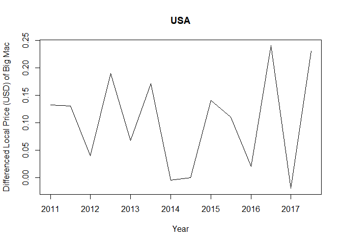
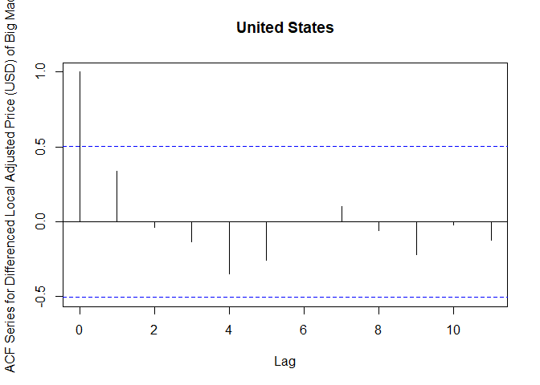
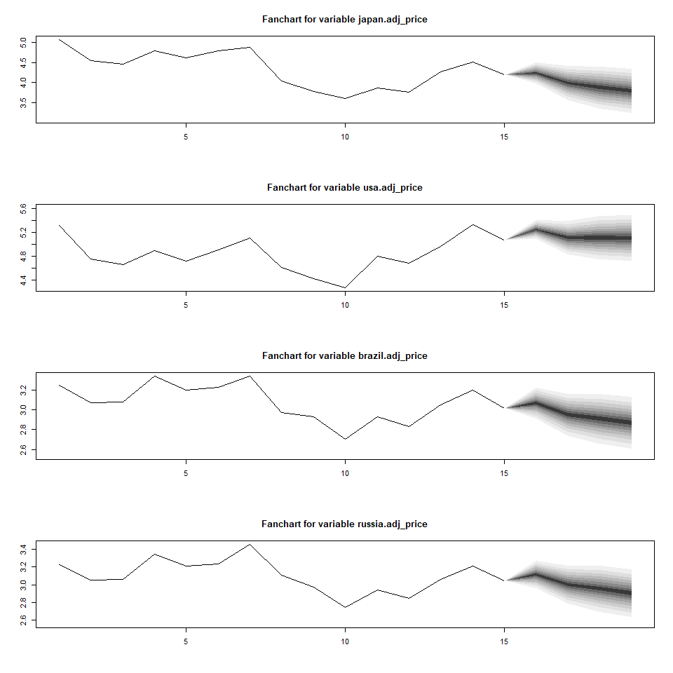

Prices of Big Mac
================
Anthony Chau
November 25, 2018

-   [**Abstract**](#abstract)
-   [**Introduction**](#introduction)
-   [**Statistical Methods**](#statistical-methods)
    -   [**Exploratory Data Analysis**](#exploratory-data-analysis)
        -   [Non-GDP Adjusted](#non-gdp-adjusted)
        -   [GDP-Adjusted](#gdp-adjusted)
    -   [**Model Building**](#model-building)
        -   [Non-GDP Adjusted](#non-gdp-adjusted-1)
        -   [GDP-Adjusted](#gdp-adjusted-1)
    -   [**Model Forecasting**](#model-forecasting)
        -   [Non-GDP Adjusted](#non-gdp-adjusted-2)
        -   [GDP-Adjusted](#gdp-adjusted-2)
    -   [**Model Diagonstics**](#model-diagonstics)
        -   [Non-GDP Adjusted](#non-gdp-adjusted-3)
        -   [GDP-Adjusted](#gdp-adjusted-3)
-   [**Results**](#results)
    -   [Non-GDP Adjusted](#non-gdp-adjusted-4)
    -   [GDP Adjusted](#gdp-adjusted-4)
-   [**Discussion**](#discussion)

**Abstract**
============

A vector ARMA model is fit to a multivariate time series of the price (in dollars) of a Big Mac for 4 countries: United States, Japan, Brazil, and Russia. The fitted model implies that the price of a Big Mac in the United States is negatively influenced by the lagged price of a Big Mac in the United States and Brazil and positively influencd by the lagged price of a Big Mac in Japan and Russia. Similar interpretations for the price of a Big Mac in Japan, Brazil, and Russia dependent on the lagged prices in other countries can also be determined. The fitted model indicates that most estimated coefficients are insignificant. However, this result may be because of the sparsity of each time series. Lastly, residual diagnostics indicate that each individual time series are not white noise.

**Introduction**
================

The Big Mac Index is a term popularized by *The Economist* as a means of measuring the purchasing power parity. The idea is that the exchange rates between two countries can be determined by the ratio of the value of goods that can be bought with local currency in each country. *The Economist* has used the index to determine if a currency is overvalued or undervalued compared to the United States Dollar.

The dataset provided by *The Economist* contains biyearly data on 37 countries from 2011-2018. Each observation in the dataset contains the country, local price of a Big Mac, the dollar price of a Big Mac, various adjusted prices, and computed exchange rates with common currencies. *The Economist* also provides a "full" version of this dataset, which contains older data but the time measurements are inconsistent. For this reason, we use the "adjusted" version of the data.

We will investigate the relationship between local prices (in Dollars) of a Big Mac in 4 countries: United States, Japan, Brazil, and Russia. Because we are focusing on 4 countries, we will use a multivariate vector ARMA model to model 4 seperate time series at once. After running the model, we interpret the cross-correlation coefficients between different countries computed by R. The cross-corrleation coefficients measure the influence of the local price (in Dollars) of a Big Mac in one country on the local price (in Dollars) of a Big Mac in a different country.

**Statistical Methods**
=======================

**Exploratory Data Analysis**
-----------------------------

### Non-GDP Adjusted

First, we plot the local price (in Dollars) of a Big Mac for each country. We observe that across our chosen countries, the local price of a Big Mac has been increasing steadily only in the United States. So we remove this upward trend by taking the first difference for the United States series. For the other countries, we assume stationarity since the ACF of the prices exhibit exponential decay.

We extract the local price (in Dollars) from the 4 chosen countries and plot the ACF and PACF of the time series for each country. We notice that the ACF tails off and the PACF cuts off after the first lag for each country. This observation suggests that we should include a autoregressive term of order 1 in our final model.

``` r
# load data
bigmac <- read.csv('big-mac-adjusted-index.csv')

# convert date column to Date variable
bigmac$date <- as.Date(bigmac$date)


singleCountry <- function(country){
  subset(bigmac, name == country, 
         select = c("date", "dollar_price", "adj_price"))
}

## Japanese Yen 
japan <- singleCountry("Japan")
japan$dollar_price <- ts(japan$dollar_price)

# plot of local price (in Dollars) of Big Mac
plot(japan$dollar_price, xlab = "Year", ylab = "Local Price (in Dollars) of Big Mac", 
     main = "Japan", xaxt = "n")
axis(1, at = seq(from = 0, to = 16, by = 2), labels = 2010:2018)
```


``` r
# acf/pacf
acf(japan$dollar_price, ylab = "ACF Series for Local Price (in Dollars) of Big Mac", main = "Japan")
```


``` r
pacf(japan$dollar_price, ylab = "PACF Series for Local Price (in Dollars) of Big Mac", main = "Japan")
```


``` r
## US Dollar
usa <- singleCountry("United States")
usa$dollar_price <- ts(usa$dollar_price)

# plot of US price of Big Mac
plot(usa$dollar_price, xlab = "Year", ylab = "Local Price (USD) of Big Mac", 
     main = "USA", xaxt = "n")
axis(1, at = seq(from = 0, to = 16, by = 2), labels = 2010:2018)
```


``` r
# plot of first difference of US price of Big Mac
diffUSA <- diff(usa$dollar_price)
plot(diffUSA, xlab = "Year", ylab = "Differenced Local Price (USD) of Big Mac", 
     main = "USA", xaxt = "n")
axis(1, at = seq(from = 0, to = 16, by = 2), labels = 2010:2018)
```



``` r
# acf/pacf
acf(diffUSA, ylab = "ACF Series for Differenced Local Price (USD) of Big Mac", 
main = "United States")
```


``` r
pacf(diffUSA, ylab = "PACF Series for Differenced Local Price (USD) of Big Mac", main = "United States")
```


``` r
## Brazil real

brazil <- singleCountry("Brazil")
brazil$dollar_price <- ts(brazil$dollar_price)

# plot of Brazilian price (in Dollars) of Big Mac
plot(brazil$dollar_price, xlab = "Year", ylab = "Local Price (in Dollars) of Big Mac", 
     main = "Brazil", xaxt = "n")
axis(1, at = seq(from = 0, to = 16, by = 2), labels = 2010:2018)
```


``` r
# acf/pacf
acf(brazil$dollar_price, ylab = "ACF Series for Local Price (in Dollars) of Big Mac", 
main = "Brazil")
```


``` r
pacf(brazil$dollar_price, ylab = "PACF Series for Local Price (in Dollars) of Big Mac", 
main = "Brazil")
```


``` r
## Russian ruble

russia <- singleCountry("Russia")
russia$dollar_price <- ts(russia$dollar_price)

# plot of Russian price (in Dollars) of Big Mac
plot(russia$dollar_price, xlab = "Year", ylab = "Local Price (in Dollars) of Big Mac", 
     main = "Russia", xaxt = "n")
axis(1, at = seq(from = 0, to = 16, by = 2), labels = 2010:2018)
```


``` r
# acf/pacf
acf(russia$dollar_price, ylab = "ACF Series for Local Price (in Dollars) of Big Mac", 
main = "Russia")
```


``` r
pacf(brazil$dollar_price, ylab = "PACF Series for Local Price (in Dollars) of Big Mac", 
main = "Russia")
```


``` r
# add observation to beginning of differenced US time series
diffUSA <- c(0, diffUSA)
```

### GDP-Adjusted

We will now consider the GDP adjusted dollar price of a Big Mac in Japan, USA, Russia, and Brazil.

``` r
## Japanese Yen 
japan <- singleCountry("Japan")
japan$adj_price <- ts(japan$adj_price)

# plot of local price (in Dollars) of Big Mac
plot(japan$adj_price, xlab = "Year", ylab = "Local Adjusted Price (in Dollars) of Big Mac", 
     main = "Japan", xaxt = "n")
axis(1, at = seq(from = 0, to = 16, by = 2), labels = 2010:2018)
```


``` r
# acf/pacf
acf(japan$adj_price, ylab = "ACF Series for Local Adjusted Price (in Dollars) of Big Mac", main = "Japan")
```


``` r
pacf(japan$adj_price, ylab = "PACF Series for Local  AdjustedPrice (in Dollars) of Big Mac", main = "Japan")
```


``` r
## US Dollar
usa <- singleCountry("United States")
usa$adj_price <- ts(usa$adj_price)

# plot of US price of Big Mac
plot(usa$adj_price, xlab = "Year", ylab = "Local Price (USD) of Big Mac", 
     main = "USA", xaxt = "n")
axis(1, at = seq(from = 0, to = 16, by = 2), labels = 2010:2018)
```


``` r
# acf/pacf
acf(usa$adj_price, ylab = "ACF Series for Differenced Local Adjusted Price (USD) of Big Mac", 
main = "United States")
```



``` r
pacf(usa$adj_price, ylab = "PACF Series for Differenced Local Adjusted Price (USD) of Big Mac", main = "United States")
```


``` r
## Brazil real

brazil <- singleCountry("Brazil")
brazil$adj_price <- ts(brazil$adj_price)

# plot of Brazilian price (in Dollars) of Big Mac
plot(brazil$adj_price, xlab = "Year", ylab = "Local Adjusted Price (in Dollars) of Big Mac", 
     main = "Brazil", xaxt = "n")
axis(1, at = seq(from = 0, to = 16, by = 2), labels = 2010:2018)
```


``` r
# acf/pacf
acf(brazil$adj_price, ylab = "ACF Series for Local Adjusted Price (in Dollars) of Big Mac", 
main = "Brazil")
```


``` r
pacf(brazil$adj_price, ylab = "PACF Series for Local Adjusted Price (in Dollars) of Big Mac", 
main = "Brazil")
```


``` r
## Russian ruble

russia <- singleCountry("Russia")
russia$adj_price <- ts(russia$adj_price)

# plot of Russian price (in Dollars) of Big Mac
plot(russia$adj_price, xlab = "Year", ylab = "Local Adjusted Price (in Dollars) of Big Mac", 
     main = "Russia", xaxt = "n")
axis(1, at = seq(from = 0, to = 16, by = 2), labels = 2010:2018)
```


``` r
# acf/pacf
acf(russia$adj_price, ylab = "ACF Series for Local Adjusted Price (in Dollars) of Big Mac", 
main = "Russia")
```


``` r
pacf(brazil$adj_price, ylab = "PACF Series for Local Adjusted Price (in Dollars) of Big Mac", 
main = "Russia")
```


**Model Building**
------------------

### Non-GDP Adjusted

We fit a vector ARMA model because we want to model multiple time series together to determine if there are any relationships between pairs of time series. Looking at an individual time series is less interesting for this dataset because we would not be able to answer questions about the relationships between the prices of Big Macs between countries. We only consider the VAR model of order 1 because we do not have many observations for each time series.

``` r
set.seed(1234)
library(vars)
```

    ## Warning: package 'vars' was built under R version 3.4.4

    ## Warning: package 'strucchange' was built under R version 3.4.4

    ## Warning: package 'zoo' was built under R version 3.4.4

    ## Warning: package 'sandwich' was built under R version 3.4.2

    ## Warning: package 'urca' was built under R version 3.4.4

    ## Warning: package 'lmtest' was built under R version 3.4.4

``` r
# combine prices of all countries
allCountries <- cbind(japan$dollar_price, ts(diffUSA), brazil$dollar_price, russia$dollar_price)

# fit vector ARMA of order 1
vectorFit <- VAR(allCountries, p = 1, type = "both")
summary(vectorFit)
```

    ## 
    ## VAR Estimation Results:
    ## ========================= 
    ## Endogenous variables: japan.dollar_price, ts.diffUSA., brazil.dollar_price, russia.dollar_price 
    ## Deterministic variables: both 
    ## Sample size: 14 
    ## Log Likelihood: 16.658 
    ## Roots of the characteristic polynomial:
    ## 0.6968 0.5914 0.3083 0.3083
    ## Call:
    ## VAR(y = allCountries, p = 1, type = "both")
    ## 
    ## 
    ## Estimation results for equation japan.dollar_price: 
    ## =================================================== 
    ## japan.dollar_price = japan.dollar_price.l1 + ts.diffUSA..l1 + brazil.dollar_price.l1 + russia.dollar_price.l1 + const + trend 
    ## 
    ##                          Estimate Std. Error t value Pr(>|t|)  
    ## japan.dollar_price.l1   0.6198021  0.2880338   2.152   0.0636 .
    ## ts.diffUSA..l1         -1.3939477  1.1561721  -1.206   0.2624  
    ## brazil.dollar_price.l1 -0.2448830  0.2040141  -1.200   0.2643  
    ## russia.dollar_price.l1  0.4496231  0.3321998   1.353   0.2129  
    ## const                   1.6412199  1.1799616   1.391   0.2017  
    ## trend                   0.0003147  0.0268957   0.012   0.9909  
    ## ---
    ## Signif. codes:  0 '***' 0.001 '**' 0.01 '*' 0.05 '.' 0.1 ' ' 1
    ## 
    ## 
    ## Residual standard error: 0.3109 on 8 degrees of freedom
    ## Multiple R-Squared: 0.546,   Adjusted R-squared: 0.2622 
    ## F-statistic: 1.924 on 5 and 8 DF,  p-value: 0.1958 
    ## 
    ## 
    ## Estimation results for equation ts.diffUSA.: 
    ## ============================================ 
    ## ts.diffUSA. = japan.dollar_price.l1 + ts.diffUSA..l1 + brazil.dollar_price.l1 + russia.dollar_price.l1 + const + trend 
    ## 
    ##                          Estimate Std. Error t value Pr(>|t|)   
    ## japan.dollar_price.l1   0.0003337  0.0533118   0.006  0.99516   
    ## ts.diffUSA..l1         -0.9322096  0.2139945  -4.356  0.00242 **
    ## brazil.dollar_price.l1 -0.0843874  0.0377607  -2.235  0.05588 . 
    ## russia.dollar_price.l1  0.1977810  0.0614864   3.217  0.01230 * 
    ## const                   0.1505580  0.2183976   0.689  0.51008   
    ## trend                   0.0026319  0.0049781   0.529  0.61137   
    ## ---
    ## Signif. codes:  0 '***' 0.001 '**' 0.01 '*' 0.05 '.' 0.1 ' ' 1
    ## 
    ## 
    ## Residual standard error: 0.05754 on 8 degrees of freedom
    ## Multiple R-Squared: 0.7338,  Adjusted R-squared: 0.5674 
    ## F-statistic:  4.41 on 5 and 8 DF,  p-value: 0.03169 
    ## 
    ## 
    ## Estimation results for equation brazil.dollar_price: 
    ## ==================================================== 
    ## brazil.dollar_price = japan.dollar_price.l1 + ts.diffUSA..l1 + brazil.dollar_price.l1 + russia.dollar_price.l1 + const + trend 
    ## 
    ##                        Estimate Std. Error t value Pr(>|t|)
    ## japan.dollar_price.l1   0.07904    0.54863   0.144    0.889
    ## ts.diffUSA..l1          2.02826    2.20220   0.921    0.384
    ## brazil.dollar_price.l1  0.06398    0.38859   0.165    0.873
    ## russia.dollar_price.l1  0.64719    0.63275   1.023    0.336
    ## const                   3.01524    2.24752   1.342    0.217
    ## trend                  -0.02831    0.05123  -0.553    0.596
    ## 
    ## 
    ## Residual standard error: 0.5922 on 8 degrees of freedom
    ## Multiple R-Squared: 0.4862,  Adjusted R-squared: 0.1651 
    ## F-statistic: 1.514 on 5 and 8 DF,  p-value: 0.2863 
    ## 
    ## 
    ## Estimation results for equation russia.dollar_price: 
    ## ==================================================== 
    ## russia.dollar_price = japan.dollar_price.l1 + ts.diffUSA..l1 + brazil.dollar_price.l1 + russia.dollar_price.l1 + const + trend 
    ## 
    ##                        Estimate Std. Error t value Pr(>|t|)
    ## japan.dollar_price.l1  -0.05633    0.39448  -0.143    0.890
    ## ts.diffUSA..l1         -0.34485    1.58344  -0.218    0.833
    ## brazil.dollar_price.l1 -0.12811    0.27941  -0.458    0.659
    ## russia.dollar_price.l1  0.50062    0.45497   1.100    0.303
    ## const                   2.17684    1.61602   1.347    0.215
    ## trend                  -0.02605    0.03684  -0.707    0.499
    ## 
    ## 
    ## Residual standard error: 0.4258 on 8 degrees of freedom
    ## Multiple R-Squared: 0.2682,  Adjusted R-squared: -0.1892 
    ## F-statistic: 0.5863 on 5 and 8 DF,  p-value: 0.7115 
    ## 
    ## 
    ## 
    ## Covariance matrix of residuals:
    ##                     japan.dollar_price ts.diffUSA. brazil.dollar_price
    ## japan.dollar_price             0.09665    0.004060             0.04350
    ## ts.diffUSA.                    0.00406    0.003311             0.00314
    ## brazil.dollar_price            0.04350    0.003140             0.35064
    ## russia.dollar_price            0.03118    0.008659             0.14859
    ##                     russia.dollar_price
    ## japan.dollar_price             0.031182
    ## ts.diffUSA.                    0.008659
    ## brazil.dollar_price            0.148590
    ## russia.dollar_price            0.181282
    ## 
    ## Correlation matrix of residuals:
    ##                     japan.dollar_price ts.diffUSA. brazil.dollar_price
    ## japan.dollar_price              1.0000     0.22698             0.23629
    ## ts.diffUSA.                     0.2270     1.00000             0.09216
    ## brazil.dollar_price             0.2363     0.09216             1.00000
    ## russia.dollar_price             0.2356     0.35344             0.58936
    ##                     russia.dollar_price
    ## japan.dollar_price               0.2356
    ## ts.diffUSA.                      0.3534
    ## brazil.dollar_price              0.5894
    ## russia.dollar_price              1.0000

The estimated coefficient matrix is obtained, with the first column as Japan, the second column as the United States, the third column as Brazil and the last column as Russia. The rows represents the price of a Big Mac in Japan, United States, Brazil, and Russia dependent on the lagged price in every other country, according to the column specification.

We focus on the second row, representing the price of a Big Mac in the United States, dependent on the lagged price of a Big Mac in Japan, US, Brazil and Russia. We observe that a unit increase in the lagged price of a Big Mac in Brazil and the United States leads to a decrease in the price of a Big Mac in the United States. Whereas, a unit increase in the lagged price of a Big Mac in Japan and Russia leads to an increase in the price of a Big Mac in the United States.

$$
\\left(\\begin{array}{cccc} 
-0.6198021 & -1.3939477 & -0.2448830 & 0.4496231\\\\
0.0003337 & -0.9322096 & -0.0843874 & 0.1977810\\\\
0.07904 & 2.02826 & 0.06398 & 0.64719\\\\
-0.05633 & -0.34485 & -0.12811 & -0.50062
\\end{array}\\right)
$$

### GDP-Adjusted

``` r
# combine GDP-adjustedprices of all countries
allCountries2 <- cbind(japan$adj_price, usa$adj_price, brazil$adj_price, russia$adj_price)

# fit vector ARMA of order 1
vectorFit2<- VAR(allCountries2, p = 1, type = "both")
summary(vectorFit2)
```

    ## 
    ## VAR Estimation Results:
    ## ========================= 
    ## Endogenous variables: japan.adj_price, usa.adj_price, brazil.adj_price, russia.adj_price 
    ## Deterministic variables: both 
    ## Sample size: 14 
    ## Log Likelihood: 94.079 
    ## Roots of the characteristic polynomial:
    ## 0.7499 0.7499 0.5288 0.4911
    ## Call:
    ## VAR(y = allCountries2, p = 1, type = "both")
    ## 
    ## 
    ## Estimation results for equation japan.adj_price: 
    ## ================================================ 
    ## japan.adj_price = japan.adj_price.l1 + usa.adj_price.l1 + brazil.adj_price.l1 + russia.adj_price.l1 + const + trend 
    ## 
    ##                     Estimate Std. Error t value Pr(>|t|)  
    ## japan.adj_price.l1   2.15348    0.72884   2.955   0.0183 *
    ## usa.adj_price.l1    -1.40110    0.49289  -2.843   0.0217 *
    ## brazil.adj_price.l1  3.45655    2.19175   1.577   0.1534  
    ## russia.adj_price.l1 -4.90366    1.48185  -3.309   0.0107 *
    ## const                5.59229    1.77640   3.148   0.0136 *
    ## trend                0.07632    0.03339   2.286   0.0516 .
    ## ---
    ## Signif. codes:  0 '***' 0.001 '**' 0.01 '*' 0.05 '.' 0.1 ' ' 1
    ## 
    ## 
    ## Residual standard error: 0.2137 on 8 degrees of freedom
    ## Multiple R-Squared: 0.8441,  Adjusted R-squared: 0.7467 
    ## F-statistic: 8.664 on 5 and 8 DF,  p-value: 0.004365 
    ## 
    ## 
    ## Estimation results for equation usa.adj_price: 
    ## ============================================== 
    ## usa.adj_price = japan.adj_price.l1 + usa.adj_price.l1 + brazil.adj_price.l1 + russia.adj_price.l1 + const + trend 
    ## 
    ##                     Estimate Std. Error t value Pr(>|t|)    
    ## japan.adj_price.l1   1.98124    0.43349   4.570 0.001825 ** 
    ## usa.adj_price.l1    -0.86297    0.29316  -2.944 0.018604 *  
    ## brazil.adj_price.l1  0.79240    1.30357   0.608 0.560132    
    ## russia.adj_price.l1 -3.09407    0.88135  -3.511 0.007955 ** 
    ## const                6.52416    1.05653   6.175 0.000267 ***
    ## trend                0.11327    0.01986   5.704 0.000452 ***
    ## ---
    ## Signif. codes:  0 '***' 0.001 '**' 0.01 '*' 0.05 '.' 0.1 ' ' 1
    ## 
    ## 
    ## Residual standard error: 0.1271 on 8 degrees of freedom
    ## Multiple R-Squared: 0.8727,  Adjusted R-squared: 0.7931 
    ## F-statistic: 10.96 on 5 and 8 DF,  p-value: 0.00202 
    ## 
    ## 
    ## Estimation results for equation brazil.adj_price: 
    ## ================================================= 
    ## brazil.adj_price = japan.adj_price.l1 + usa.adj_price.l1 + brazil.adj_price.l1 + russia.adj_price.l1 + const + trend 
    ## 
    ##                     Estimate Std. Error t value Pr(>|t|)   
    ## japan.adj_price.l1   1.13428    0.42551   2.666  0.02855 * 
    ## usa.adj_price.l1    -0.76132    0.28776  -2.646  0.02945 * 
    ## brazil.adj_price.l1  0.79525    1.27958   0.621  0.55157   
    ## russia.adj_price.l1 -1.64602    0.86513  -1.903  0.09359 . 
    ## const                4.06972    1.03709   3.924  0.00439 **
    ## trend                0.04437    0.01949   2.276  0.05240 . 
    ## ---
    ## Signif. codes:  0 '***' 0.001 '**' 0.01 '*' 0.05 '.' 0.1 ' ' 1
    ## 
    ## 
    ## Residual standard error: 0.1248 on 8 degrees of freedom
    ## Multiple R-Squared: 0.7205,  Adjusted R-squared: 0.5459 
    ## F-statistic: 4.125 on 5 and 8 DF,  p-value: 0.0377 
    ## 
    ## 
    ## Estimation results for equation russia.adj_price: 
    ## ================================================= 
    ## russia.adj_price = japan.adj_price.l1 + usa.adj_price.l1 + brazil.adj_price.l1 + russia.adj_price.l1 + const + trend 
    ## 
    ##                     Estimate Std. Error t value Pr(>|t|)   
    ## japan.adj_price.l1   1.27923    0.42358   3.020   0.0166 * 
    ## usa.adj_price.l1    -0.87096    0.28645  -3.040   0.0161 * 
    ## brazil.adj_price.l1  0.20710    1.27377   0.163   0.8749   
    ## russia.adj_price.l1 -1.09380    0.86121  -1.270   0.2397   
    ## const                4.01782    1.03238   3.892   0.0046 **
    ## trend                0.05309    0.01940   2.736   0.0256 * 
    ## ---
    ## Signif. codes:  0 '***' 0.001 '**' 0.01 '*' 0.05 '.' 0.1 ' ' 1
    ## 
    ## 
    ## Residual standard error: 0.1242 on 8 degrees of freedom
    ## Multiple R-Squared: 0.7347,  Adjusted R-squared: 0.5689 
    ## F-statistic:  4.43 on 5 and 8 DF,  p-value: 0.0313 
    ## 
    ## 
    ## 
    ## Covariance matrix of residuals:
    ##                  japan.adj_price usa.adj_price brazil.adj_price
    ## japan.adj_price          0.04567       0.02426          0.02504
    ## usa.adj_price            0.02426       0.01615          0.01491
    ## brazil.adj_price         0.02504       0.01491          0.01557
    ## russia.adj_price         0.02366       0.01388          0.01492
    ##                  russia.adj_price
    ## japan.adj_price           0.02366
    ## usa.adj_price             0.01388
    ## brazil.adj_price          0.01492
    ## russia.adj_price          0.01542
    ## 
    ## Correlation matrix of residuals:
    ##                  japan.adj_price usa.adj_price brazil.adj_price
    ## japan.adj_price           1.0000        0.8930           0.9391
    ## usa.adj_price             0.8930        1.0000           0.9403
    ## brazil.adj_price          0.9391        0.9403           1.0000
    ## russia.adj_price          0.8916        0.8791           0.9626
    ##                  russia.adj_price
    ## japan.adj_price            0.8916
    ## usa.adj_price              0.8791
    ## brazil.adj_price           0.9626
    ## russia.adj_price           1.0000

**Model Forecasting**
---------------------

### Non-GDP Adjusted

``` r
fit_pred = predict(vectorFit, n.ahead = 4, ci = 0.95) # 2 years ahead
fanchart(fit_pred)
```


### GDP-Adjusted

``` r
fit_pred2 = predict(vectorFit2, n.ahead = 4, ci = 0.95) # 2 years ahead
fanchart(fit_pred2)
```



**Model Diagonstics**
---------------------

### Non-GDP Adjusted

We plot the acf for the residuals of each indvidual series and for the pairs of series. In most of the plots, the correlation of the residuals is negligible. However, our visual inspection disagrees with the result of the multivariate Ljung-box test. We reject with significance level 0.05 and therfore conclude that the residuals are not white noise. This result undermines the correctness of our model since we assumed that the residuals are white noise before fitting the model.

``` r
library(forecast)
```

    ## Warning: package 'forecast' was built under R version 3.4.4

``` r
# auto-correlation (diagonals) and cross-correlation (off-diagonal) plots
acf(resid(vectorFit), 12)
```


``` r
# multivariate Ljung-Box test
serial.test(vectorFit, lags.pt = 10, type = "PT.adjusted")
```

    ## 
    ##  Portmanteau Test (adjusted)
    ## 
    ## data:  Residuals of VAR object vectorFit
    ## Chi-squared = 180.38, df = 144, p-value = 0.02148

### GDP-Adjusted

**Results**
===========

### Non-GDP Adjusted

The vector ARMA model gives 4 different models for each country. However, not every model performed well in terms of coefficient signifiance and overall model significance. The US model performed the best a R-squared value of 0.74, outperforming all other models. The Japan model performed the next best according to the R-squared value, followed by the Brazil and Russian model. In addition, two of the coefficients of the US model are significant. These coefficients included the lagged US price and the lagged Russian price. Every other coefficient was independently insignificant.

Further analysis of the data is necessary to build a model which can more closely estimate the relationship of local prices of Big Macs between different countries. The inclusion of other datasets containing other variables which could influence the price of a Big Mac should be considered.

From a practical perspective, these results suggest that it is difficult to isolate a relationship between the price of a good (Big Macs in this context) in one country, and the price of the same good in other countries. There are undoubtedly many other factors which would impact the local price of a good, which are not included in this model. Hence, the idea proposed by *The Economist* that the ratio of the value of goods that can be bought with local currency can estimate the exchange rates between countries is not perfect.

### GDP Adjusted

**Discussion**
==============

First, we discuss some limitations of the data analysis.

The model choice for our objective is quite complex, considering we are jointly analyzing the time series for 4 countries. This data set is unique as the number of observations in a time series is quite low (15). This constraint limits our model choice to simple models because we want to avoid estimating more parameters than the number of observations. On that same note, we also want to avoid overfitting the data

Another limitation of the data is the frequency in which the data was collected. The data is biyearly and only spans about 7 years. It is plausible to believe the price of a Big Mac is demand inelastic - the price does not change dramatically given a unit change in demand and this is the reason for the infrequent collection of data. But, the sparsity of data makes model estimation and estimation difficult.

Furthermore, if the idea is to approximate the exchange rate between countries by the ratio of the value of goods that can be bought with local currency, then the frequency of change should match on both sides of the equation. Exchange rates change frequently and constantly. But, the velocity of change for exchange rates do not match the frequency which the data for the prices of Big Macs was gathered. If data for the prices of Big Macs was gathered more frequently, then perhaps the model would perform better. Or we could find a different good whose price is demand elastic which would result in a better approximation to the exchange rate.

Also, the model is assuming that only the prices of a Big Mac in other countries affect the local price of a Big Mac. This is an oversimplistic assumption which does not reflect reality. There are many other factors which could influence the local price of a Big Mac. These other factors are not controlled for in our analysis and represent an opportunity for future analysis.

Also, forecasting is difficult for this data set. The data is collected every 6 months which implies forecasted estimates for Big Mac prices will occur every 6 months. This is an unreasonable assumption of this model, assuming we can precisely forecast 6 months out in advance given the sparsity of our data. This is an issue of casaulity. We are uncertain how strong the correlation is between the prices of Big Mac in different countries. There are many other factors within a 6 month period which can obscure a strong casual relationship that we seek.

Lastly, we wrap up the analysis with final thoughts on the data analysis.

Overall, the results indicate that the estimated models did not perform well in estimating the prices of a Big Mac dependent on the prices of a Big Mac in other countries. If it is difficult to determine the relationship between prices of Big Macs in different countries, then the use of the ratio of the value of goods a local currency can buy to approximate exchange rates is unreliable. Hence, we should consider other potential variables and their relationships to better approximate the exchange rates between countries.
