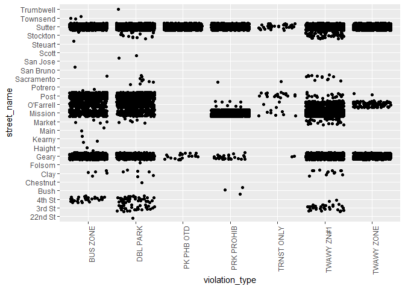
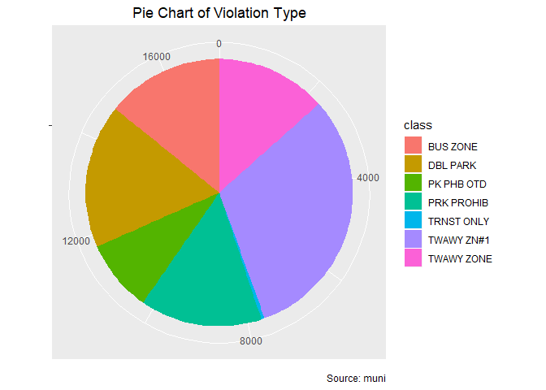

Analysis of Transit Only Lane Violations for SFMTA
================
Anthony Chau
07-10-2018

``` r
library(dplyr)
```

    ## Warning: package 'dplyr' was built under R version 3.4.4

``` r
library(ggplot2)
```

    ## Warning: package 'ggplot2' was built under R version 3.4.4

``` r
library(stringr)
```

    ## Warning: package 'stringr' was built under R version 3.4.4

``` r
library(magrittr)
library(tidyverse)
```

    ## Warning: package 'tidyverse' was built under R version 3.4.4

    ## Warning: package 'tibble' was built under R version 3.4.4

    ## Warning: package 'tidyr' was built under R version 3.4.4

    ## Warning: package 'readr' was built under R version 3.4.4

    ## Warning: package 'purrr' was built under R version 3.4.4

    ## Warning: package 'forcats' was built under R version 3.4.4

``` r
library(leaflet)
```

    ## Warning: package 'leaflet' was built under R version 3.4.4

``` r
library(plotly)
```

    ## Warning: package 'plotly' was built under R version 3.4.4

``` r
library(lubridate)
```

    ## Warning: package 'lubridate' was built under R version 3.4.4

Read in data
============

``` r
# Use read_csv from readr package (Faster, more reproducible, tibbles)
muni <- read_csv('muni_transitLanes.csv', trim_ws = TRUE, na = c("", "NA"))
```

    ## Parsed with column specification:
    ## cols(
    ##   `Object ID` = col_integer(),
    ##   `Ticket Number` = col_integer(),
    ##   `Citation Issue Date` = col_character(),
    ##   `Citaton Issue Month` = col_character(),
    ##   `Citation Issue Time` = col_time(format = ""),
    ##   Location = col_character(),
    ##   `Violation Code` = col_character(),
    ##   Violation = col_character(),
    ##   `Fine Amount` = col_integer(),
    ##   `Citation Status` = col_character(),
    ##   `Amount Paid` = col_character(),
    ##   `Amount Due` = col_integer(),
    ##   `Suspend Code` = col_character(),
    ##   `Suspend Process Date` = col_character(),
    ##   `Suspend Until Date` = col_character(),
    ##   `Disposition Code` = col_character(),
    ##   `Last Edited Date` = col_character(),
    ##   Geom = col_character()
    ## )

    ## Warning in rbind(names(probs), probs_f): number of columns of result is not
    ## a multiple of vector length (arg 2)

    ## Warning: 1 parsing failure.
    ## row # A tibble: 1 x 5 col     row col        expected               actual file                    expected   <int> <chr>      <chr>                  <chr>  <chr>                   actual 1  2379 Amount Due no trailing characters .95    'muni_transitLanes.csv' file # A tibble: 1 x 5

``` r
muni <- as.data.frame(muni)

# Check variables in muni
# str(muni)
# summary(muni)
```

Cleaning the Data
=================

First, we remove the Citation.Issue.Month column from the data frame since the month is already included in the Citation.Issue.Date column. And, we remove the Last.Edited.Date and Ticket Number column because the columns are not relevant for our analysis.

``` r
muni <- muni %>% 
  select(-`Citaton Issue Month`, -`Last Edited Date`, -`Ticket Number`)
```

Missing Values
--------------

We have many missing values scattered across the columns in the muni data frame. More specifcally, there are missing values in the 'Amount Due', 'Suspend Code', 'Suspend Process Date', 'Suspend Until Date', 'Disposition Code', and 'Geom' columns.

we have many missing values in the Disposition Code column but few missing values for the 'Amount Due' and Geom' column. Also, there are about an equal amount of missing values for the 'Suspend Code', 'Suspend Process Date, and 'Suspend Until Date'. This makes sense intuitively because the columns are related to each other. In fact the 'Suspend Process Date' and 'Suspend Until Date' have the same number of missing values.

``` r
# Check for NA values for each column

apply(muni, 2, function(x) any(is.na(x)))
```

    ##            Object ID  Citation Issue Date  Citation Issue Time 
    ##                FALSE                FALSE                FALSE 
    ##             Location       Violation Code            Violation 
    ##                FALSE                FALSE                FALSE 
    ##          Fine Amount      Citation Status          Amount Paid 
    ##                FALSE                FALSE                FALSE 
    ##           Amount Due         Suspend Code Suspend Process Date 
    ##                 TRUE                 TRUE                 TRUE 
    ##   Suspend Until Date     Disposition Code                 Geom 
    ##                 TRUE                 TRUE                 TRUE

``` r
# find total number of missing values for columns with missing values
totalMissing <-  function(missing_column){
  cat("Total missing values:", sum(is.na(missing_column)), "\n")
}

totalMissing(muni$`Amount Due`)
```

    ## Total missing values: 1

``` r
totalMissing(muni$`Suspend Code`)
```

    ## Total missing values: 1876

``` r
totalMissing(muni$`Suspend Process Date`)
```

    ## Total missing values: 1879

``` r
totalMissing(muni$`Suspend Until Date`)
```

    ## Total missing values: 1879

``` r
totalMissing(muni$`Disposition Code`)
```

    ## Total missing values: 15382

``` r
totalMissing(muni$Geom)
```

    ## Total missing values: 21

Impute Missing Valuess
----------------------

Date and Time
-------------

Now, let's focus our attention on the date and time data within this dataset.

Initially, the citation issue date and time were stored as factor variables. We collapse date and time into a single column and convert it to a datetime object. This will make the data easier to work with in our analysis.

``` r
# Convert all values in the original citation column into a Date object
muni$citation_date <- as.Date(muni$`Citation Issue Date`, format ="%m/%d/%Y")


# Combine date and time columns into a citation_dateTime column
muni <-  muni %>% 
  unite(citation_dateTime, `Citation Issue Date`, `Citation Issue Time`, sep = " ")

# Convert citation_dateTime to a POSIXct object
muni$citation_dateTime <- mdy_hms(muni$citation_dateTime)
```

Separate date column
--------------------

We also want to analyze citation counts in a smaller time frame, so we separate the citation\_date column into three columns for the month, date, and year

``` r
muni <- muni %>% 
  separate(citation_date, into = c("year", "month", "day"), sep = "-")
```

Convert month, day, and year columns into the integer type
----------------------------------------------------------

``` r
muni$month <- as.integer(muni$month)

muni$day <- as.integer(muni$day)

muni$year <- as.integer(muni$year)
```

Spatial Location
----------------

``` r
# Split Geom column into Longitude and Latitude column
muni <-  muni %>% 
  separate(Geom, into = c("latitude", "longitude"), sep = ",")

# Clean up longitude and latitude column (remove parenthesis)
muni$latitude <- muni$latitude %>% 
  str_replace("^\\(", "")

muni$longitude <-  muni$longitude %>% 
  str_replace("\\)$", "")
```

Extract unique street names from location column
------------------------------------------------

We create a new column which consists of only the street name where the violation occured. In the original datset, the location column provided both the street number and street name. As a result, we have an extremely high amount of factor levels for the location column. Hence, we will condense down the number of factor levels to the total number of unique street names.

``` r
# Good functional programming practice:
# Not advisable to change global variables in functions
# Instead, we write a function with a more explicit return value and reassign the result
# outside the function (global environment)

# In this case, we create a new column in data frame called y, which contains only the
# street names of all the location. We use the get_streetName function to return this
# column and then assign that column to a new column in the muni data frame.


# instead of do.call() use dplyr:: bind_rows()

get_streetName <-  function(location_column){
  location_column <- as.character(location_column) 
  splitLocation <- strsplit(location_column, "(?<=\\d)\\b", perl=T)
  y <- do.call(rbind, splitLocation)
  y <- as.data.frame(y)
  colnames(y) <- c("street_number", "street_name")
  return(y$street_name)
}

muni$street_name <- get_streetName(muni$Location)

# Check street names
unique(muni$street_name)
```

    ##  [1]  O'FARRELL         GEARY             OFARRELL        
    ##  [4]  MISSION           POST ST           GEARY ST        
    ##  [7]  3RD ST            SUTTER            O'FARRELL ST.   
    ## [10]  SACRAMENTO        MISSION ST.       MAIN            
    ## [13]  - 3RD ST.         CLAY              STOCKTON        
    ## [16]  MISSION ST        POST              4TH ST.         
    ## [19]  MARKET            O'FARRELL STREET  GEARY ST.       
    ## [22]  OFALLELL          4TH ST            OFARRELL ST     
    ## [25]  SUTTER ST         04TH ST           STOCKTON ST     
    ## [28]  O'FARRELL ST      04TH  ST          - O'FARRELL ST  
    ## [31]  SACRAMENTO ST     03RD ST           - 4TH ST        
    ## [34]  -4TH ST           - GEARY ST        O4TH STREET     
    ## [37] -MARKET ST         POTRERO AVE       MISSION STREET  
    ## [40]  MARKET ST         GEARY BLVD        SAN BRUNO AVE   
    ## [43]  22ND ST           CLAY ST           HAIGHT ST       
    ## [46]  TOWNSEND ST       SAN JOSE AVE      STEUART ST      
    ## [49]  SCOTT ST          CHESTNUT ST       KEARNY ST       
    ## [52]  STOCKTON TUNL     FOLSOM            BUSH ST         
    ## [55]  TRUMBWELL         WILDE             3RD ST.         
    ## [58]  KEARNY            SUTTER ST.      
    ## 59 Levels: -MARKET ST  - 3RD ST.  - 4TH ST  - GEARY ST ...  WILDE

``` r
### Explanation of Function

# Split location into street number and street name
# Logic: If a word boundary is proceeded by a digit, split the word
# Create new matrix with street name column and street name column
# Change column names
# Make new column in muni df
```

Clean up street names
---------------------

In the newly created street\_name column, we remove unnecessary puncation or white space within the different factor levels and remove the street type from each factor level. Lastly, we convert each street name to title style capitalization.

``` r
# To extend practicality and to simplify our string data, any street type will be converted to empty string

# Vector of street types for use with str_replace_all function
street_types <- c("ST$" = "", "BLVD$" = "", "TUNL$" = "", "Street" = "", "AVE" = "",
                  "STREET$" = "")


clean_streetName <- function(streetName_column){
  streetName_column <- streetName_column %>% 
  as.character() %>% 
  str_replace_all("[:punct:]", "") %>% 
  str_replace_all(street_types) %>% 
  str_to_title() %>% 
  trimws(which = "both")
  return(streetName_column)
}

muni$street_name <- clean_streetName(muni$street_name)

# Take in original location column, which was previously cleaned up by the 

# Check
unique(muni$street_name)
```

    ##  [1] "Ofarrell"   "Geary"      "Mission"    "Post"       "3Rd"       
    ##  [6] "Sutter"     "Sacramento" "Main"       "Clay"       "Stockton"  
    ## [11] "Po"         "4Th"        "Market"     "Ofallell"   "04Th"      
    ## [16] "03Rd"       "O4th"       "Potrero"    "San Bruno"  "22Nd"      
    ## [21] "Haight"     "Townsend"   "San Jose"   "Steuart"    "Scott"     
    ## [26] "Chestnut"   "Kearny"     "Folsom"     "Bush"       "Trumbwell" 
    ## [31] "Wilde"

Clean up minor spelling mistakes
--------------------------------

Some of the street names in the dataset are misspelled. We manually correct these mistakes by reassigning observations with misspelling to the correct spelling.

For this analysis, I have decided to remove the street type indicator from non-duplicate street names. Beacuse of this, only numerical street names, such as 4th or 22nd, have street type indicators.

``` r
# Clean up spelling and duplicates of street names
# Find more efficient way of doing this
# Only keep indicator of the street for the 'numerical streets' because San Francisco
# has both 2nd St and 2nd Ave
# Remove for the rest to keep it more clean
# We will determine the exact geographical location with longitude and latitude
# coordinates
muni$street_name[muni$street_name %in% c("Ofarrell", "Ofallell")] <- "O'Farrell"
muni$street_name[muni$street_name %in% c("4Th", "04Th", "O4th")] <- "4th St"
muni$street_name[muni$street_name %in% c("3Rd", "03Rd")] <- "3rd St"
muni$street_name[muni$street_name %in% c("22Nd")] <- "22nd St"
muni$street_name[muni$street_name %in% c("Po")] <- "Post"

# Change street_name to factor variable
muni$street_name <- factor(muni$street_name)

# Check
unique(muni$street_name)
```

    ##  [1] O'Farrell  Geary      Mission    Post       3rd St     Sutter    
    ##  [7] Sacramento Main       Clay       Stockton   4th St     Market    
    ## [13] Potrero    San Bruno  22nd St    Haight     Townsend   San Jose  
    ## [19] Steuart    Scott      Chestnut   Kearny     Folsom     Bush      
    ## [25] Trumbwell  Wilde     
    ## 26 Levels: 22nd St 3rd St 4th St Bush Chestnut Clay Folsom ... Wilde

Rename columns
--------------

``` r
muni <- muni %>% 
  rename(ID = "Object ID", violation_type = "Violation", location = "Location",
         fine_amount = "Fine Amount")

names(muni)
```

    ##  [1] "ID"                   "citation_dateTime"    "location"            
    ##  [4] "Violation Code"       "violation_type"       "fine_amount"         
    ##  [7] "Citation Status"      "Amount Paid"          "Amount Due"          
    ## [10] "Suspend Code"         "Suspend Process Date" "Suspend Until Date"  
    ## [13] "Disposition Code"     "latitude"             "longitude"           
    ## [16] "year"                 "month"                "day"                 
    ## [19] "street_name"

Rearrange columns
-----------------

``` r
muni <- muni %>% 
  select(ID, month, day, year, street_name, 
         violation_type, latitude, longitude, 
         fine_amount, citation_dateTime, everything())
```

Data Visualization
==================

First, we summarize the number of citations per day by grouping the observations by each day. Then, we make a frequency plot with ggplot2 to display the distribution of citationc counts over time

``` r
citations_dt <- muni %>% 
  select(street_name, citation_dateTime)

# Citation count by day from 2008 to 2014
citations_dt %>% 
  ggplot(aes(citation_dateTime)) +
  geom_freqpoly(binwidth = 86400) # 86400 secs = 1 day
```


The above plot is too nosy. Let's plot out violation counts by every 3 months.

``` r
p <- citations_dt %>% 
  ggplot(aes(citation_dateTime)) +
  # take average days in a month to be 30 and multiple by the number of seconds in a day
  geom_freqpoly(binwidth = 84600*30, color = "firebrick") +
  labs(x = "Date", y = "Citation Count", 
       title = "Transit Lane Violation Counts in San Francisco") +
  scale_x_datetime(date_breaks = "4 months") +
  theme_minimal() + 
  theme(axis.text.x = element_text(angle = 45, hjust = 1, 
                                   margin = margin(0, 0, 15, 0)),
        plot.title = element_text(size = 15, face = "bold", 
                                  margin = margin(0, 0, 10, 0)))

p <- ggplotly(p)
p
```

<!--html_preserve-->

<script type="application/json" data-for="htmlwidget-bc5ef348413c98f731c8">{"x":{"data":[{"x":[1203012000,1205550000,1208088000,1210626000,1213164000,1215702000,1218240000,1220778000,1223316000,1225854000,1228392000,1230930000,1233468000,1236006000,1238544000,1241082000,1243620000,1246158000,1248696000,1251234000,1253772000,1256310000,1258848000,1261386000,1263924000,1266462000,1269000000,1271538000,1274076000,1276614000,1279152000,1281690000,1284228000,1286766000,1289304000,1291842000,1294380000,1296918000,1299456000,1301994000,1304532000,1307070000,1309608000,1312146000,1314684000,1317222000,1319760000,1322298000,1324836000,1327374000,1329912000,1332450000,1334988000,1337526000,1340064000,1342602000,1345140000,1347678000,1350216000,1352754000,1355292000,1357830000,1360368000,1362906000,1365444000,1367982000,1370520000,1373058000,1375596000,1378134000,1380672000,1383210000,1385748000,1388286000,1390824000,1393362000,1395900000,1398438000,1400976000,1403514000,1406052000,1408590000,1411128000,1413666000,1416204000,1418742000,1421280000,1423818000,1426356000],"y":[0,25,6,6,7,39,36,15,15,4,7,7,5,97,98,113,114,106,140,92,135,179,111,141,79,137,217,149,132,72,293,214,123,284,204,143,114,259,369,316,261,226,199,311,310,272,168,144,195,207,268,339,336,236,344,317,394,499,307,238,196,150,148,263,385,318,147,306,265,294,279,310,219,138,212,325,380,261,202,336,427,387,418,257,187,157,0,37,0],"text":["count:   0<br />citation_dateTime: 1203012000","count:  25<br />citation_dateTime: 1205550000","count:   6<br />citation_dateTime: 1208088000","count:   6<br />citation_dateTime: 1210626000","count:   7<br />citation_dateTime: 1213164000","count:  39<br />citation_dateTime: 1215702000","count:  36<br />citation_dateTime: 1218240000","count:  15<br />citation_dateTime: 1220778000","count:  15<br />citation_dateTime: 1223316000","count:   4<br />citation_dateTime: 1225854000","count:   7<br />citation_dateTime: 1228392000","count:   7<br />citation_dateTime: 1230930000","count:   5<br />citation_dateTime: 1233468000","count:  97<br />citation_dateTime: 1236006000","count:  98<br />citation_dateTime: 1238544000","count: 113<br />citation_dateTime: 1241082000","count: 114<br />citation_dateTime: 1243620000","count: 106<br />citation_dateTime: 1246158000","count: 140<br />citation_dateTime: 1248696000","count:  92<br />citation_dateTime: 1251234000","count: 135<br />citation_dateTime: 1253772000","count: 179<br />citation_dateTime: 1256310000","count: 111<br />citation_dateTime: 1258848000","count: 141<br />citation_dateTime: 1261386000","count:  79<br />citation_dateTime: 1263924000","count: 137<br />citation_dateTime: 1266462000","count: 217<br />citation_dateTime: 1269000000","count: 149<br />citation_dateTime: 1271538000","count: 132<br />citation_dateTime: 1274076000","count:  72<br />citation_dateTime: 1276614000","count: 293<br />citation_dateTime: 1279152000","count: 214<br />citation_dateTime: 1281690000","count: 123<br />citation_dateTime: 1284228000","count: 284<br />citation_dateTime: 1286766000","count: 204<br />citation_dateTime: 1289304000","count: 143<br />citation_dateTime: 1291842000","count: 114<br />citation_dateTime: 1294380000","count: 259<br />citation_dateTime: 1296918000","count: 369<br />citation_dateTime: 1299456000","count: 316<br />citation_dateTime: 1301994000","count: 261<br />citation_dateTime: 1304532000","count: 226<br />citation_dateTime: 1307070000","count: 199<br />citation_dateTime: 1309608000","count: 311<br />citation_dateTime: 1312146000","count: 310<br />citation_dateTime: 1314684000","count: 272<br />citation_dateTime: 1317222000","count: 168<br />citation_dateTime: 1319760000","count: 144<br />citation_dateTime: 1322298000","count: 195<br />citation_dateTime: 1324836000","count: 207<br />citation_dateTime: 1327374000","count: 268<br />citation_dateTime: 1329912000","count: 339<br />citation_dateTime: 1332450000","count: 336<br />citation_dateTime: 1334988000","count: 236<br />citation_dateTime: 1337526000","count: 344<br />citation_dateTime: 1340064000","count: 317<br />citation_dateTime: 1342602000","count: 394<br />citation_dateTime: 1345140000","count: 499<br />citation_dateTime: 1347678000","count: 307<br />citation_dateTime: 1350216000","count: 238<br />citation_dateTime: 1352754000","count: 196<br />citation_dateTime: 1355292000","count: 150<br />citation_dateTime: 1357830000","count: 148<br />citation_dateTime: 1360368000","count: 263<br />citation_dateTime: 1362906000","count: 385<br />citation_dateTime: 1365444000","count: 318<br />citation_dateTime: 1367982000","count: 147<br />citation_dateTime: 1370520000","count: 306<br />citation_dateTime: 1373058000","count: 265<br />citation_dateTime: 1375596000","count: 294<br />citation_dateTime: 1378134000","count: 279<br />citation_dateTime: 1380672000","count: 310<br />citation_dateTime: 1383210000","count: 219<br />citation_dateTime: 1385748000","count: 138<br />citation_dateTime: 1388286000","count: 212<br />citation_dateTime: 1390824000","count: 325<br />citation_dateTime: 1393362000","count: 380<br />citation_dateTime: 1395900000","count: 261<br />citation_dateTime: 1398438000","count: 202<br />citation_dateTime: 1400976000","count: 336<br />citation_dateTime: 1403514000","count: 427<br />citation_dateTime: 1406052000","count: 387<br />citation_dateTime: 1408590000","count: 418<br />citation_dateTime: 1411128000","count: 257<br />citation_dateTime: 1413666000","count: 187<br />citation_dateTime: 1416204000","count: 157<br />citation_dateTime: 1418742000","count:   0<br />citation_dateTime: 1421280000","count:  37<br />citation_dateTime: 1423818000","count:   0<br />citation_dateTime: 1426356000"],"type":"scatter","mode":"lines","line":{"width":1.88976377952756,"color":"rgba(178,34,34,1)","dash":"solid"},"hoveron":"points","showlegend":false,"xaxis":"x","yaxis":"y","hoverinfo":"text","frame":null}],"layout":{"margin":{"t":46.1535907015359,"r":7.30593607305936,"b":59.804955726331,"l":43.1050228310502},"font":{"color":"rgba(0,0,0,1)","family":"","size":14.6118721461187},"title":"<b> Transit Lane Violation Counts in San Francisco <\/b>","titlefont":{"color":"rgba(0,0,0,1)","family":"","size":19.9252801992528},"xaxis":{"domain":[0,1],"automargin":true,"type":"linear","autorange":false,"range":[1190448900,1438919100],"tickmode":"array","ticktext":["2008-01-01","2008-05-01","2008-09-01","2009-01-01","2009-05-01","2009-09-01","2010-01-01","2010-05-01","2010-09-01","2011-01-01","2011-05-01","2011-09-01","2012-01-01","2012-05-01","2012-09-01","2013-01-01","2013-05-01","2013-09-01","2014-01-01","2014-05-01","2014-09-01","2015-01-01","2015-05-01"],"tickvals":[1199145600,1209600000,1220227200,1230768000,1241136000,1251763200,1262304000,1272672000,1283299200,1293840000,1304208000,1314835200,1325376000,1335830400,1346457600,1356998400,1367366400,1377993600,1388534400,1398902400,1409529600,1420070400,1430438400],"categoryorder":"array","categoryarray":["2008-01-01","2008-05-01","2008-09-01","2009-01-01","2009-05-01","2009-09-01","2010-01-01","2010-05-01","2010-09-01","2011-01-01","2011-05-01","2011-09-01","2012-01-01","2012-05-01","2012-09-01","2013-01-01","2013-05-01","2013-09-01","2014-01-01","2014-05-01","2014-09-01","2015-01-01","2015-05-01"],"nticks":null,"ticks":"","tickcolor":null,"ticklen":3.65296803652968,"tickwidth":0,"showticklabels":true,"tickfont":{"color":"rgba(77,77,77,1)","family":"","size":11.689497716895},"tickangle":-45,"showline":false,"linecolor":null,"linewidth":0,"showgrid":true,"gridcolor":"rgba(235,235,235,1)","gridwidth":0.66417600664176,"zeroline":false,"anchor":"y","title":"Date","titlefont":{"color":"rgba(0,0,0,1)","family":"","size":14.6118721461187},"hoverformat":".2f"},"yaxis":{"domain":[0,1],"automargin":true,"type":"linear","autorange":false,"range":[-24.95,523.95],"tickmode":"array","ticktext":["0","100","200","300","400","500"],"tickvals":[-3.5527136788005e-015,100,200,300,400,500],"categoryorder":"array","categoryarray":["0","100","200","300","400","500"],"nticks":null,"ticks":"","tickcolor":null,"ticklen":3.65296803652968,"tickwidth":0,"showticklabels":true,"tickfont":{"color":"rgba(77,77,77,1)","family":"","size":11.689497716895},"tickangle":-0,"showline":false,"linecolor":null,"linewidth":0,"showgrid":true,"gridcolor":"rgba(235,235,235,1)","gridwidth":0.66417600664176,"zeroline":false,"anchor":"x","title":"Citation Count","titlefont":{"color":"rgba(0,0,0,1)","family":"","size":14.6118721461187},"hoverformat":".2f"},"shapes":[{"type":"rect","fillcolor":null,"line":{"color":null,"width":0,"linetype":[]},"yref":"paper","xref":"paper","x0":0,"x1":1,"y0":0,"y1":1}],"showlegend":false,"legend":{"bgcolor":null,"bordercolor":null,"borderwidth":0,"font":{"color":"rgba(0,0,0,1)","family":"","size":11.689497716895}},"hovermode":"closest","barmode":"relative"},"config":{"doubleClick":"reset","modeBarButtonsToAdd":[{"name":"Collaborate","icon":{"width":1000,"ascent":500,"descent":-50,"path":"M487 375c7-10 9-23 5-36l-79-259c-3-12-11-23-22-31-11-8-22-12-35-12l-263 0c-15 0-29 5-43 15-13 10-23 23-28 37-5 13-5 25-1 37 0 0 0 3 1 7 1 5 1 8 1 11 0 2 0 4-1 6 0 3-1 5-1 6 1 2 2 4 3 6 1 2 2 4 4 6 2 3 4 5 5 7 5 7 9 16 13 26 4 10 7 19 9 26 0 2 0 5 0 9-1 4-1 6 0 8 0 2 2 5 4 8 3 3 5 5 5 7 4 6 8 15 12 26 4 11 7 19 7 26 1 1 0 4 0 9-1 4-1 7 0 8 1 2 3 5 6 8 4 4 6 6 6 7 4 5 8 13 13 24 4 11 7 20 7 28 1 1 0 4 0 7-1 3-1 6-1 7 0 2 1 4 3 6 1 1 3 4 5 6 2 3 3 5 5 6 1 2 3 5 4 9 2 3 3 7 5 10 1 3 2 6 4 10 2 4 4 7 6 9 2 3 4 5 7 7 3 2 7 3 11 3 3 0 8 0 13-1l0-1c7 2 12 2 14 2l218 0c14 0 25-5 32-16 8-10 10-23 6-37l-79-259c-7-22-13-37-20-43-7-7-19-10-37-10l-248 0c-5 0-9-2-11-5-2-3-2-7 0-12 4-13 18-20 41-20l264 0c5 0 10 2 16 5 5 3 8 6 10 11l85 282c2 5 2 10 2 17 7-3 13-7 17-13z m-304 0c-1-3-1-5 0-7 1-1 3-2 6-2l174 0c2 0 4 1 7 2 2 2 4 4 5 7l6 18c0 3 0 5-1 7-1 1-3 2-6 2l-173 0c-3 0-5-1-8-2-2-2-4-4-4-7z m-24-73c-1-3-1-5 0-7 2-2 3-2 6-2l174 0c2 0 5 0 7 2 3 2 4 4 5 7l6 18c1 2 0 5-1 6-1 2-3 3-5 3l-174 0c-3 0-5-1-7-3-3-1-4-4-5-6z"},"click":"function(gd) { \n        // is this being viewed in RStudio?\n        if (location.search == '?viewer_pane=1') {\n          alert('To learn about plotly for collaboration, visit:\\n https://cpsievert.github.io/plotly_book/plot-ly-for-collaboration.html');\n        } else {\n          window.open('https://cpsievert.github.io/plotly_book/plot-ly-for-collaboration.html', '_blank');\n        }\n      }"}],"cloud":false},"source":"A","attrs":{"196c14ee26ae":{"x":{},"type":"scatter"}},"cur_data":"196c14ee26ae","visdat":{"196c14ee26ae":["function (y) ","x"]},"highlight":{"on":"plotly_click","persistent":false,"dynamic":false,"selectize":false,"opacityDim":0.2,"selected":{"opacity":1},"debounce":0},"base_url":"https://plot.ly"},"evals":["config.modeBarButtonsToAdd.0.click"],"jsHooks":[]}</script>
<!--/html_preserve-->
Citations by Month Visualization

``` r
citations_byMonth <- muni %>% 
  group_by(year, month) %>% 
  summarise(n())
```

Exploring Transit Lane Violation Types
--------------------------------------

``` r
# Counts of violation type
table(muni$violation_type)
```

    ## 
    ##   BUS ZONE   DBL PARK    NO VIOL ON SIDEWLK OVR 18 " C   PK FR LN 
    ##       2433       2995          1          1          5          1 
    ## PK PHB OTD PRK PROHIB TRNST ONLY TWAWY ZN#1 TWAWY ZONE 
    ##       1498       2535         70       5334       2305

``` r
unique(muni$violation_type)
```

    ##  [1] "DBL PARK"    "BUS ZONE"    "TWAWY ZN#1"  "PK FR LN"    "TWAWY ZONE" 
    ##  [6] "NO VIOL"     "OVR 18 \" C" "PK PHB OTD"  "PRK PROHIB"  "TRNST ONLY" 
    ## [11] "ON SIDEWLK"

Delete violation type categories from data frame
================================================

We have low observations counts for the following categories of violations: 'NO VIOL', 'ON SIDEWLK', 'OVR 18" C', and 'PK FR LB'. So, we remove these categories and the unique observations to make out analysis cleaner.

``` r
# Find the 8 observations with the 4 violation categories and delete them from data frame

muni <- muni[!muni$violation_type %in% c('NO VIOL', 'ON SIDEWLK', 'OVR 18 " C', 'PK FR LN'),]

# Check violation categories
table(muni$violation_type)
```

    ## 
    ##   BUS ZONE   DBL PARK PK PHB OTD PRK PROHIB TRNST ONLY TWAWY ZN#1 
    ##       2433       2995       1498       2535         70       5334 
    ## TWAWY ZONE 
    ##       2305

``` r
# Check total number of observations - we orignially had 17,178 observations
dim(muni)
```

    ## [1] 17170    19

Combine small violation counts on different street names
========================================================

Work on this

``` r
# Group together factor level with low counts

# Visualize number of violations by street name with barplot
streetBarPlot <- ggplot(data=muni, aes(x=street_name)) + 
  geom_bar(aes(fill=violation_type), color='black', position = "dodge") +
  theme(axis.text.x = element_text(angle = 90, hjust = 1))

streetBarPlot
```


We find that most transit lane violations are concentrated on a few streets: Geary, Market, Mission, Folsom, Stockton, and Sutter. Almost all of these pass through downtown San Francisco, which is plausible since many bus services aggregate in downtown.

Many questions can be asked from this visualization. Is the high number of citations of these streets because of high bus and therefore high transit lane density in downtown San Francisco?

Are drivers more likely to violate regulations in the downtown area because of how crowded and hectic streets can get during peak hours, which makes driver more short-tempered and willing to make shortcuts through transit lanes?

Or, are high incidence of transit lane violations on a few streets because muni drivers are more short-tempered and willing to report violations in crowded downton SF?

Also, we have to take into account when each transit lane was implemented.

Visualize number of violations with barplot
===========================================

``` r
# Visualize number of violations by street name with barplot
violations <- ggplot(data=muni, aes(x=violation_type)) + 
  geom_bar() +
  theme_minimal() +
  theme(axis.text.x = element_text(angle = 90, hjust = 1))

violations
```


Most violation types are towaway zone and towaway zone \#1. There are few observations of the on sidewalk, OVR 18\*C violations, and no violation type. Need more information on how specific violation types are defined.

Violations - Count Plot

``` r
violationsCountPlot <- ggplot(data=muni)+ 
  geom_count(mapping = aes(x = violation_type, y = street_name)) +
  theme(axis.text.x = element_text(angle = 90, hjust = 1))


violationsCountPlot
```



Violations by Street Name - Tile Plot (possibly do a heat map with d3heatmap or heatmaply)

Most violation types were 'BUS ZONE', 'DBL PARK', and 'TWAWAY ZN\#1'.

``` r
muni %>% 
  count(violation_type, street_name) %>% 
  ggplot(mapping = aes(x = reorder(violation_type, n), y = street_name)) +
    geom_tile(aes(fill = n), color = 'white', size = 0.25) +
    scale_fill_continuous(type = "viridis", na.value = "grey90") +
    scale_x_discrete(limits = c('TWAWY ZN#1', 'DBL PARK', 'PRK PROHIB',
                                'BUS ZONE', 'TWAWY ZONE', 
                                'PK PHB OTD', 'TRNST ONLY')) +
    theme_grey() +
    theme(axis.text.x = element_text(angle = 90, hjust = 1, face = "bold"),
          plot.background = element_blank(),
          panel.border = element_blank())
```



Heatmap - Plotly

``` r
# Create matrix of observation counts by street name and violation type
# Bug with matrix code
m <- table(muni$street_name, muni$violation_type)

p <- plot_ly(z = m,
  x = levels(muni$street_name), y = levels(muni$violation_type),
  type = "heatmap"
)

p
```

<!--html_preserve-->

<script type="application/json" data-for="htmlwidget-a0971b700300542f3a19">{"x":{"visdat":{"196c1b7850bc":["function () ","plotlyVisDat"]},"cur_data":"196c1b7850bc","attrs":{"196c1b7850bc":{"z":[[0,1,0,0,0,0,0],[0,30,0,0,0,35,0],[34,42,0,0,0,2,0],[0,0,0,3,0,0,0],[0,1,0,0,0,0,0],[5,6,0,0,0,13,0],[0,1,0,0,0,0,0],[598,488,20,30,2,1054,498],[2,0,0,0,0,0,0],[3,0,0,0,0,0,0],[2,0,0,0,0,0,0],[4,6,0,0,0,34,0],[228,213,0,1599,8,2513,0],[180,290,0,8,3,225,110],[541,573,0,0,19,20,2],[2,2,0,0,0,0,0],[1,7,0,1,1,13,0],[1,0,0,0,0,0,0],[0,1,0,0,0,0,0],[0,1,0,0,0,0,0],[1,0,0,0,0,0,0],[1,15,0,0,0,58,0],[827,1317,1478,894,37,1367,1695],[3,0,0,0,0,0,0],[0,1,0,0,0,0,0],[0,0,0,0,0,0,0]],"x":["22nd St","3rd St","4th St","Bush","Chestnut","Clay","Folsom","Geary","Haight","Kearny","Main","Market","Mission","O'Farrell","Post","Potrero","Sacramento","San Bruno","San Jose","Scott","Steuart","Stockton","Sutter","Townsend","Trumbwell","Wilde"],"y":null,"alpha_stroke":1,"sizes":[10,100],"spans":[1,20],"type":"heatmap"}},"layout":{"margin":{"b":40,"l":60,"t":25,"r":10},"xaxis":{"domain":[0,1],"automargin":true,"title":[]},"yaxis":{"domain":[0,1],"automargin":true,"title":[]},"scene":{"zaxis":{"title":[]}},"hovermode":"closest","showlegend":false,"legend":{"yanchor":"top","y":0.5}},"source":"A","config":{"modeBarButtonsToAdd":[{"name":"Collaborate","icon":{"width":1000,"ascent":500,"descent":-50,"path":"M487 375c7-10 9-23 5-36l-79-259c-3-12-11-23-22-31-11-8-22-12-35-12l-263 0c-15 0-29 5-43 15-13 10-23 23-28 37-5 13-5 25-1 37 0 0 0 3 1 7 1 5 1 8 1 11 0 2 0 4-1 6 0 3-1 5-1 6 1 2 2 4 3 6 1 2 2 4 4 6 2 3 4 5 5 7 5 7 9 16 13 26 4 10 7 19 9 26 0 2 0 5 0 9-1 4-1 6 0 8 0 2 2 5 4 8 3 3 5 5 5 7 4 6 8 15 12 26 4 11 7 19 7 26 1 1 0 4 0 9-1 4-1 7 0 8 1 2 3 5 6 8 4 4 6 6 6 7 4 5 8 13 13 24 4 11 7 20 7 28 1 1 0 4 0 7-1 3-1 6-1 7 0 2 1 4 3 6 1 1 3 4 5 6 2 3 3 5 5 6 1 2 3 5 4 9 2 3 3 7 5 10 1 3 2 6 4 10 2 4 4 7 6 9 2 3 4 5 7 7 3 2 7 3 11 3 3 0 8 0 13-1l0-1c7 2 12 2 14 2l218 0c14 0 25-5 32-16 8-10 10-23 6-37l-79-259c-7-22-13-37-20-43-7-7-19-10-37-10l-248 0c-5 0-9-2-11-5-2-3-2-7 0-12 4-13 18-20 41-20l264 0c5 0 10 2 16 5 5 3 8 6 10 11l85 282c2 5 2 10 2 17 7-3 13-7 17-13z m-304 0c-1-3-1-5 0-7 1-1 3-2 6-2l174 0c2 0 4 1 7 2 2 2 4 4 5 7l6 18c0 3 0 5-1 7-1 1-3 2-6 2l-173 0c-3 0-5-1-8-2-2-2-4-4-4-7z m-24-73c-1-3-1-5 0-7 2-2 3-2 6-2l174 0c2 0 5 0 7 2 3 2 4 4 5 7l6 18c1 2 0 5-1 6-1 2-3 3-5 3l-174 0c-3 0-5-1-7-3-3-1-4-4-5-6z"},"click":"function(gd) { \n        // is this being viewed in RStudio?\n        if (location.search == '?viewer_pane=1') {\n          alert('To learn about plotly for collaboration, visit:\\n https://cpsievert.github.io/plotly_book/plot-ly-for-collaboration.html');\n        } else {\n          window.open('https://cpsievert.github.io/plotly_book/plot-ly-for-collaboration.html', '_blank');\n        }\n      }"}],"cloud":false},"data":[{"colorbar":{"title":"","ticklen":2,"len":0.5,"lenmode":"fraction","y":1,"yanchor":"top"},"colorscale":[["0","rgba(68,1,84,1)"],["0","rgba(68,1,84,1)"],["0","rgba(68,1,84,1)"],["0","rgba(68,1,84,1)"],["0","rgba(68,1,84,1)"],["0","rgba(68,1,84,1)"],["0","rgba(68,1,84,1)"],["0","rgba(68,1,84,1)"],["0","rgba(68,1,84,1)"],["0","rgba(68,1,84,1)"],["0","rgba(68,1,84,1)"],["0","rgba(68,1,84,1)"],["0","rgba(68,1,84,1)"],["0","rgba(68,1,84,1)"],["0","rgba(68,1,84,1)"],["0","rgba(68,1,84,1)"],["0.000397930760047752","rgba(68,1,84,1)"],["0.000397930760047752","rgba(68,1,84,1)"],["0.000795861520095503","rgba(68,1,84,1)"],["0.00238758456028651","rgba(68,2,85,1)"],["0.00729539726754208","rgba(68,4,86,1)"],["0.0142260246717071","rgba(69,7,88,1)"],["0.0906287306008754","rgba(72,34,113,1)"],["0.341308528982623","rgba(49,106,142,1)"],["1","rgba(253,231,37,1)"]],"showscale":true,"z":[[0,1,0,0,0,0,0],[0,30,0,0,0,35,0],[34,42,0,0,0,2,0],[0,0,0,3,0,0,0],[0,1,0,0,0,0,0],[5,6,0,0,0,13,0],[0,1,0,0,0,0,0],[598,488,20,30,2,1054,498],[2,0,0,0,0,0,0],[3,0,0,0,0,0,0],[2,0,0,0,0,0,0],[4,6,0,0,0,34,0],[228,213,0,1599,8,2513,0],[180,290,0,8,3,225,110],[541,573,0,0,19,20,2],[2,2,0,0,0,0,0],[1,7,0,1,1,13,0],[1,0,0,0,0,0,0],[0,1,0,0,0,0,0],[0,1,0,0,0,0,0],[1,0,0,0,0,0,0],[1,15,0,0,0,58,0],[827,1317,1478,894,37,1367,1695],[3,0,0,0,0,0,0],[0,1,0,0,0,0,0],[0,0,0,0,0,0,0]],"x":["22nd St","3rd St","4th St","Bush","Chestnut","Clay","Folsom","Geary","Haight","Kearny","Main","Market","Mission","O'Farrell","Post","Potrero","Sacramento","San Bruno","San Jose","Scott","Steuart","Stockton","Sutter","Townsend","Trumbwell","Wilde"],"type":"heatmap","xaxis":"x","yaxis":"y","frame":null}],"highlight":{"on":"plotly_click","persistent":false,"dynamic":false,"selectize":false,"opacityDim":0.2,"selected":{"opacity":1},"debounce":0},"base_url":"https://plot.ly"},"evals":["config.modeBarButtonsToAdd.0.click"],"jsHooks":[]}</script>
<!--/html_preserve-->
Violations - Pie Chart

``` r
# Visualize number of violations with pie chart
pie <- ggplot(muni, aes(x = "", fill = factor(violation_type))) + 
  geom_bar(width = 1) +
  theme(axis.line = element_blank(), 
        plot.title = element_text(hjust=0.5)) + 
  labs(fill="class", 
       x=NULL, 
       y=NULL, 
       title="Pie Chart of Violation Type", 
       caption="Source: muni")
  
pie + coord_polar(theta = "y", start=0)
```


Mapping Transit Lane Violations
===============================

``` r
m <- leaflet() %>%
  addTiles() %>%  # Add default OpenStreetMap map tiles
  addMarkers(lng= c(-122.415269816, -121.34, -120.57), lat = c(37.7854374715, 37.85, 38.12), popup="Transit Violation", label= "Broke the law!")
m 
```

<!--html_preserve-->

<script type="application/json" data-for="htmlwidget-16e5df1e1c3351f9eb57">{"x":{"options":{"crs":{"crsClass":"L.CRS.EPSG3857","code":null,"proj4def":null,"projectedBounds":null,"options":{}}},"calls":[{"method":"addTiles","args":["//{s}.tile.openstreetmap.org/{z}/{x}/{y}.png",null,null,{"minZoom":0,"maxZoom":18,"tileSize":256,"subdomains":"abc","errorTileUrl":"","tms":false,"noWrap":false,"zoomOffset":0,"zoomReverse":false,"opacity":1,"zIndex":1,"detectRetina":false,"attribution":"&copy; <a href=\"http://openstreetmap.org\">OpenStreetMap<\/a> contributors, <a href=\"http://creativecommons.org/licenses/by-sa/2.0/\">CC-BY-SA<\/a>"}]},{"method":"addMarkers","args":[[37.7854374715,37.85,38.12],[-122.415269816,-121.34,-120.57],null,null,null,{"interactive":true,"draggable":false,"keyboard":true,"title":"","alt":"","zIndexOffset":0,"opacity":1,"riseOnHover":false,"riseOffset":250},"Transit Violation",null,null,null,"Broke the law!",{"interactive":false,"permanent":false,"direction":"auto","opacity":1,"offset":[0,0],"textsize":"10px","textOnly":false,"className":"","sticky":true},null]}],"limits":{"lat":[37.7854374715,38.12],"lng":[-122.415269816,-120.57]}},"evals":[],"jsHooks":[]}</script>
<!--/html_preserve-->
Time Series visualization test
==============================

Account for dates with no citation Make dates with sequence function between earliest date and latest date try missing\_values &lt;- date\[!date in% sequence\]

``` r
library(dplyr)

# Create new column which stores how many citations were issued that day and build 
# time series object from that column

# Convert citation date to date object to work in dplyr
muni$citation_date <- as.Date(muni$citation_date, format ='%m/%d/%Y')
muni$citation_dateTime <- as.Date(muni$citation_dateTime, format ='%m/%d/%Y  %H:%M') 


# Group and count observations by date 
muni <- 
  muni %>%
  arrange(citation_date) %>%
  group_by(citation_date) %>%
  mutate(citation_count = n())
```

    ## Warning: package 'bindrcpp' was built under R version 3.4.4

``` r
# Try n = n()
# Count missing values: (sum(is.na(x))) or set na.rm=TRUE

# Pull out citation_count vector
citation_count <- 
  muni %>%
  pull(citation_count)

# Time series
# More research on dealing with regular data (almost daily) and spanning across
# many years
citation_ts <- ts(citation_count, frequency = 7, start= c(2008,2))

plot.ts(citation_ts)
```


