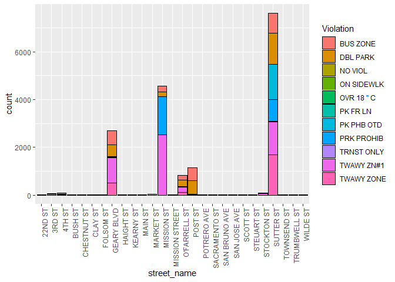
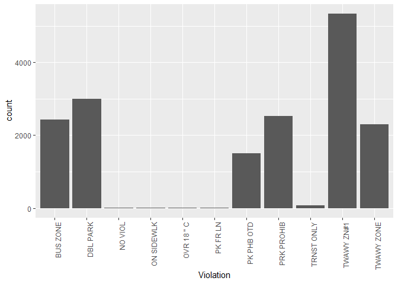
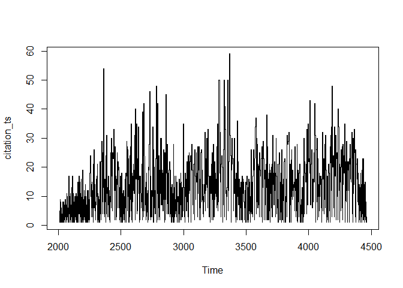

Analysis of Transit Only Lane Violations for SFMTA
================
Anthony Chau
07-10-2018

``` r
muni <- read.csv('muni_transitLanes.csv', strip.white = TRUE)
muni <- as.data.frame(muni)

# Check variables in muni
# str(muni)
# summary(muni)
```

Cleaning the Data
=================

First, we remove the Citation.Issue.Month column from the data frame since the month is already included in the Citation.Issue.Date column. And, we remove the Last.Edited.Date column because this is not relevant for our analysis.

``` r
muni$Citaton.Issue.Month <- NULL
muni$Last.Edited.Date <- NULL
```

Now, let's focus our attention on the date and time data within this dataset.

Initially, the citation issue date and time were stored as factor variables. We collapse date and time into a single column and convert it to a datetime object. This will make the data easier to work with in our analysis.

``` r
# Convert citation dates and times to a Datetime object

muni$citation_date <- strptime(muni$Citation.Issue.Date, format ='%m/%d/%Y')


muni$citation_dateTime <- strptime(paste(muni$Citation.Issue.Date, 
                                            muni$Citation.Issue.Time), 
                                      format ='%m/%d/%Y %H:%M')

# Drop original citation issue date and time

muni$Citation.Issue.Date <- NULL
muni$Citation.Issue.Time <- NULL
```

We want to collaspe observations in the location column to only record a unique factor level for a street name.

``` r
library(stringr)
```

    ## Warning: package 'stringr' was built under R version 3.4.4

``` r
muni$location <- as.character(muni$Location)

muni$location <- str_replace_all(muni$Location, "[:punct:]", "")

### Testing code

# Split location into street number and street name
# Logic: If a word boundary is proceeded by a digit, split the word

splitAddress <- strsplit(muni$location, "(?<=\\d)\\b ", perl=T)

# Create new matrix with street name column and street name column
y <- do.call(rbind, splitAddress)
y <- as.data.frame(y)


# Change column names
colnames(y) <- c('Street.Number', 'Street.Name')

# Make new column in muni df
muni$street_name <- y$Street.Name

# Check df
str(muni)
```

    ## 'data.frame':    17178 obs. of  18 variables:
    ##  $ Object.ID           : int  1 2 3 4 5 6 7 8 9 10 ...
    ##  $ Ticket.Number       : int  100029164 100029166 100029167 100000050 100029169 100029170 100029171 100029172 100029173 100029174 ...
    ##  $ Location            : Factor w/ 3287 levels "04 04TH  ST",..: 2289 1401 1401 3110 1728 1684 29 3056 42 2148 ...
    ##  $ Violation.Code      : Factor w/ 11 levels "NO VIOL","T32A.1",..: 9 9 9 10 9 9 9 10 2 10 ...
    ##  $ Violation           : Factor w/ 11 levels "BUS ZONE","DBL PARK",..: 2 2 2 1 2 2 2 1 10 1 ...
    ##  $ Fine.Amount         : int  65 65 65 250 65 65 65 250 60 250 ...
    ##  $ Citation.Status     : Factor w/ 3 levels "Closed","Open",..: 1 2 1 1 1 1 1 1 2 2 ...
    ##  $ Amount.Paid         : Factor w/ 168 levels "$                  -",..: 6 151 151 6 151 151 6 89 159 6 ...
    ##  $ Amount.Due          : num  0 85 0 0 0 0 0 0 60 275 ...
    ##  $ Suspend.Code        : Factor w/ 74 levels "","10 10 2HR XCD",..: 57 56 56 57 56 56 67 71 56 1 ...
    ##  $ Suspend.Process.Date: Factor w/ 2035 levels "","01/01/2010 12:00:00 AM +0000",..: 1096 1079 1079 1103 1079 1079 1616 1178 1079 1 ...
    ##  $ Suspend.Until.Date  : Factor w/ 1949 levels "","01/01/2010 12:00:00 AM +0000",..: 1936 1168 1168 1936 1168 1168 560 1751 1168 1 ...
    ##  $ Disposition.Code    : Factor w/ 24 levels "","1 RU RV UPHD",..: 1 1 1 1 1 1 7 1 1 1 ...
    ##  $ Geom                : Factor w/ 3020 levels "","(37.710799135, -122.447754977)",..: 761 1065 1065 1060 1468 1482 969 1091 964 1409 ...
    ##  $ citation_date       : POSIXlt, format: "2008-07-10" "2008-07-10" ...
    ##  $ citation_dateTime   : POSIXlt, format: "2008-07-10 17:33:00" "2008-07-10 15:27:00" ...
    ##  $ location            : chr  "643 OFARRELL" "372 OFARRELL" "372 OFARRELL" "924 GEARY" ...
    ##  $ street_name         : Factor w/ 50 levels " 3RD ST"," 4TH ST",..: 31 31 31 17 17 17 17 17 17 17 ...

``` r
# Check unique street names
unique(muni$street_name)
```

    ##  [1] OFARRELL        GEARY           MISSION         POST ST        
    ##  [5] GEARY ST        3RD ST          SUTTER          OFARRELL ST    
    ##  [9] SACRAMENTO      MISSION ST      MAIN             3RD ST        
    ## [13] CLAY            STOCKTON        POST            4TH ST         
    ## [17] MARKET          OFARRELL STREET OFALLELL        SUTTER ST      
    ## [21] 04TH ST         STOCKTON ST     04TH  ST         OFARRELL ST   
    ## [25] SACRAMENTO ST   03RD ST          4TH ST          GEARY ST      
    ## [29] O4TH STREET     566MARKET ST    POTRERO AVE     MISSION STREET 
    ## [33] MARKET ST       GEARY BLVD      SAN BRUNO AVE   22ND ST        
    ## [37] CLAY ST         HAIGHT ST       TOWNSEND ST     SAN JOSE AVE   
    ## [41] STEUART ST      SCOTT ST        CHESTNUT ST     KEARNY ST      
    ## [45] STOCKTON TUNL   FOLSOM          BUSH ST         TRUMBWELL      
    ## [49] WILDE           KEARNY         
    ## 50 Levels:  3RD ST  4TH ST  GEARY ST  OFARRELL ST 03RD ST ... WILDE

``` r
# Trim leading white space
trim.leading <- function (x)  sub("^\\s+", "", x)
muni$street_name <- trim.leading(muni$street_name)

# Refactor duplicate/misspelled streets
# Find more efficient way of doing this
muni$street_name[muni$street_name %in% c("GEARY", "GEARY ST")] <- "GEARY BLVD"
muni$street_name[muni$street_name %in% c("OFARRELL", "OFALLELL", 
                                       "OFARRELL ST", 
                                       "OFARRELL STREET")] <- "O'FARRELL ST"
muni$street_name[muni$street_name %in% c("04TH ST", "04TH  ST", 
                                         "O4TH STREET")] <- "4TH ST"
muni$street_name[muni$street_name %in% c("03RD ST")] <- "3RD ST"
muni$street_name[muni$street_name %in% c("MISSION")] <- "MISSION ST"
muni$street_name[muni$street_name %in% c("MARKET", "566MARKET ST")] <- "MARKET ST"
muni$street_name[muni$street_name %in% c("STOCKTON", 
                                       "STOCKTON TUNL")] <- "STOCKTON ST"
muni$street_name[muni$street_name %in% c("SACRAMENTO")] <- "SACRAMENTO ST"
muni$street_name[muni$street_name %in% c("POST")] <- "POST ST"
muni$street_name[muni$street_name %in% c("KEARNY")] <- "KEARNY ST"
muni$street_name[muni$street_name %in% c("SUTTER")] <- "SUTTER ST"
muni$street_name[muni$street_name %in% c("CLAY")] <- "CLAY ST"
muni$street_name[muni$street_name %in% c("MAIN")] <- "MAIN ST"
muni$street_name[muni$street_name %in% c("FOLSOM")] <- "FOLSOM ST"
muni$street_name[muni$street_name %in% c("TRUMBWELL")] <- "TRUMBWELL ST"
muni$street_name[muni$street_name %in% c("WILDE")] <- "WILDE ST"


# Function to clean up location column
# Work on making code cleaner and less repititive
# Maybe use with/within?
locationName_clean <- function(location){
  location <- as.character(location)
  location <- str_replace_all(location, "[:punct:]", "")
  location <- str_replace_all(location, street_types, "")
  location <- str_to_title(location)
  location <- trimws(location, which="both")
  if(str_detect("ST$", location)){
    return(location[0])
  }else{
    return(location[1])
  }
}

street_types <- c("ST$", "BLVD$")

unique(muni$street_name)
```

    ##  [1] "O'FARRELL ST"   "GEARY BLVD"     "MISSION ST"     "POST ST"       
    ##  [5] "3RD ST"         "SUTTER ST"      "SACRAMENTO ST"  "MAIN ST"       
    ##  [9] "CLAY ST"        "STOCKTON ST"    "4TH ST"         "MARKET ST"     
    ## [13] "POTRERO AVE"    "MISSION STREET" "SAN BRUNO AVE"  "22ND ST"       
    ## [17] "HAIGHT ST"      "TOWNSEND ST"    "SAN JOSE AVE"   "STEUART ST"    
    ## [21] "SCOTT ST"       "CHESTNUT ST"    "KEARNY ST"      "FOLSOM ST"     
    ## [25] "BUSH ST"        "TRUMBWELL ST"   "WILDE ST"

WOrk on this

``` r
library(ggplot2)
```

    ## Warning: package 'ggplot2' was built under R version 3.4.4

``` r
# Group together factor level with low counts

# Visualize number of violations by street name with barplot
streetBarPlot <- ggplot(data=muni, aes(x=street_name)) + 
  geom_bar(aes(fill=Violation), color='black') +
  theme(axis.text.x = element_text(angle = 90, hjust = 1))

streetBarPlot
```



``` r
# Visualize number of violations by street name with barplot
violations <- ggplot(data=muni, aes(x=Violation)) + 
  geom_bar() +
  theme(axis.text.x = element_text(angle = 90, hjust = 1))

violations
```


``` r
# Visualize number of violations with pie chart
pie <- ggplot(muni, aes(x = "", fill = factor(Violation))) + 
  geom_bar(width = 1) +
  theme(axis.line = element_blank(), 
        plot.title = element_text(hjust=0.5)) + 
  labs(fill="class", 
       x=NULL, 
       y=NULL, 
       title="Pie Chart of Violation Type", 
       caption="Source: muni")
  
pie + coord_polar(theta = "y", start=0)
```


``` r
violations
```



Time Series visualization test Account for dates with no citation Make dates with sequence function between earliest date and latest date \# try missing\_values &lt;- date\[!date in% sequence\]

``` r
library(dplyr)
```

    ## Warning: package 'dplyr' was built under R version 3.4.4

    ## 
    ## Attaching package: 'dplyr'

    ## The following objects are masked from 'package:stats':
    ## 
    ##     filter, lag

    ## The following objects are masked from 'package:base':
    ## 
    ##     intersect, setdiff, setequal, union

``` r
# Create new column which stores how many citations were issued that day and build 
# time series object from that column

# Convert citation date to date object to work in dplyr
muni$citation_date <- as.Date(muni$citation_date, format ='%m/%d/%Y')
muni$citation_dateTime <- as.Date(muni$citation_dateTime, format ='%m/%d/%Y  %H:%M') 


# Group and count observations by date 
muni <- 
  muni %>%
  arrange(citation_date) %>%
  group_by(citation_date) %>%
  mutate(citation_count = n())
```

    ## Warning: package 'bindrcpp' was built under R version 3.4.4

``` r
# Try n = n()
# Count missing values: (sum(is.na(x))) or set na.rm=TRUE

# Pull out citation_count vector
citation_count <- 
  muni %>%
  pull(citation_count)

# Time series
# More research on dealing with regular data (almost daily) and spanning across
# many years
citation_ts <- ts(citation_count, frequency = 7, start= c(2008,2))

plot.ts(citation_ts)
```


