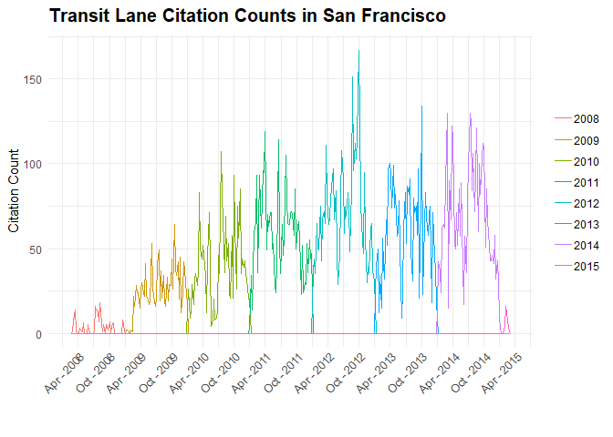

Analysis of Transit Only Lane Violations for SFMTA
================
Anthony Chau
07-10-2018

``` r
muni <- read.csv('muni_transitLanes.csv', strip.white = TRUE)
muni <- as.data.frame(muni)

# Check variables in muni
# str(muni)
# summary(muni)
```

Cleaning the Data
=================

First, we remove the Citation.Issue.Month column from the data frame since the month is already included in the Citation.Issue.Date column. And, we remove the Last.Edited.Date column because this is not relevant for our analysis. Lastly, we remove the Ticket.Number column.

``` r
muni$Citaton.Issue.Month <- NULL
muni$Last.Edited.Date <- NULL
muni$Ticket.Number <-  NULL
```

Check for NA values

``` r
# Check for NA values for each column
apply(muni, 2, function(x) any(is.na(x)))
```

    ##            Object.ID  Citation.Issue.Date  Citation.Issue.Time 
    ##                FALSE                FALSE                FALSE 
    ##             Location       Violation.Code            Violation 
    ##                FALSE                FALSE                FALSE 
    ##          Fine.Amount      Citation.Status          Amount.Paid 
    ##                FALSE                FALSE                FALSE 
    ##           Amount.Due         Suspend.Code Suspend.Process.Date 
    ##                FALSE                FALSE                FALSE 
    ##   Suspend.Until.Date     Disposition.Code                 Geom 
    ##                FALSE                FALSE                FALSE

Now, let's focus our attention on the date and time data within this dataset.

Initially, the citation issue date and time were stored as factor variables. We collapse date and time into a single column and convert it to a datetime object. This will make the data easier to work with in our analysis.

``` r
# Convert citation dates and times to a Datetime object

muni$citation_date <- strptime(muni$Citation.Issue.Date, format ='%m/%d/%Y')


muni$citation_dateTime <- strptime(paste(muni$Citation.Issue.Date, 
                                            muni$Citation.Issue.Time), 
                                      format ='%m/%d/%Y %H:%M')

# Drop original citation issue date and time

muni$Citation.Issue.Date <- NULL
muni$Citation.Issue.Time <- NULL
```

We want to collaspe observations in the location column to only record a unique factor level for a street name.

``` r
library(stringr)
```

    ## Warning: package 'stringr' was built under R version 3.4.4

``` r
muni$Location <- as.character(muni$Location)

### Testing code

# Split location into street number and street name
# Logic: If a word boundary is proceeded by a digit, split the word

splitAddress <- strsplit(muni$Location, "(?<=\\d)\\b", perl=T)

# Create new matrix with street name column and street name column
y <- do.call(rbind, splitAddress)
y <- as.data.frame(y)


# Change column names
colnames(y) <- c('Street.Number', 'Street.Name')

# Make new column in muni df
muni$street_name <- y$Street.Name

# Check df
str(muni)
```

    ## 'data.frame':    17178 obs. of  16 variables:
    ##  $ Object.ID           : int  1 2 3 4 5 6 7 8 9 10 ...
    ##  $ Location            : chr  "643 O'FARRELL" "372 O'FARRELL" "372 O'FARRELL" "924 GEARY" ...
    ##  $ Violation.Code      : Factor w/ 11 levels "NO VIOL","T32A.1",..: 9 9 9 10 9 9 9 10 2 10 ...
    ##  $ Violation           : Factor w/ 11 levels "BUS ZONE","DBL PARK",..: 2 2 2 1 2 2 2 1 10 1 ...
    ##  $ Fine.Amount         : int  65 65 65 250 65 65 65 250 60 250 ...
    ##  $ Citation.Status     : Factor w/ 3 levels "Closed","Open",..: 1 2 1 1 1 1 1 1 2 2 ...
    ##  $ Amount.Paid         : Factor w/ 168 levels "$                  -",..: 6 151 151 6 151 151 6 89 159 6 ...
    ##  $ Amount.Due          : num  0 85 0 0 0 0 0 0 60 275 ...
    ##  $ Suspend.Code        : Factor w/ 74 levels "","10 10 2HR XCD",..: 57 56 56 57 56 56 67 71 56 1 ...
    ##  $ Suspend.Process.Date: Factor w/ 2035 levels "","01/01/2010 12:00:00 AM +0000",..: 1096 1079 1079 1103 1079 1079 1616 1178 1079 1 ...
    ##  $ Suspend.Until.Date  : Factor w/ 1949 levels "","01/01/2010 12:00:00 AM +0000",..: 1936 1168 1168 1936 1168 1168 560 1751 1168 1 ...
    ##  $ Disposition.Code    : Factor w/ 24 levels "","1 RU RV UPHD",..: 1 1 1 1 1 1 7 1 1 1 ...
    ##  $ Geom                : Factor w/ 3020 levels "","(37.710799135, -122.447754977)",..: 761 1065 1065 1060 1468 1482 969 1091 964 1409 ...
    ##  $ citation_date       : POSIXlt, format: "2008-07-10" "2008-07-10" ...
    ##  $ citation_dateTime   : POSIXlt, format: "2008-07-10 17:33:00" "2008-07-10 15:27:00" ...
    ##  $ street_name         : Factor w/ 59 levels "-MARKET ST"," - 3RD ST.",..: 34 34 34 20 20 20 20 20 20 20 ...

``` r
# Check unique street names
unique(muni$street_name)
```

    ##  [1]  O'FARRELL         GEARY             OFARRELL        
    ##  [4]  MISSION           POST ST           GEARY ST        
    ##  [7]  3RD ST            SUTTER            O'FARRELL ST.   
    ## [10]  SACRAMENTO        MISSION ST.       MAIN            
    ## [13]  - 3RD ST.         CLAY              STOCKTON        
    ## [16]  MISSION ST        POST              4TH ST.         
    ## [19]  MARKET            O'FARRELL STREET  GEARY ST.       
    ## [22]  OFALLELL          4TH ST            OFARRELL ST     
    ## [25]  SUTTER ST         04TH ST           STOCKTON ST     
    ## [28]  O'FARRELL ST      04TH  ST          - O'FARRELL ST  
    ## [31]  SACRAMENTO ST     03RD ST           - 4TH ST        
    ## [34]  -4TH ST           - GEARY ST        O4TH STREET     
    ## [37] -MARKET ST         POTRERO AVE       MISSION STREET  
    ## [40]  MARKET ST         GEARY BLVD        SAN BRUNO AVE   
    ## [43]  22ND ST           CLAY ST           HAIGHT ST       
    ## [46]  TOWNSEND ST       SAN JOSE AVE      STEUART ST      
    ## [49]  SCOTT ST          CHESTNUT ST       KEARNY ST       
    ## [52]  STOCKTON TUNL     FOLSOM            BUSH ST         
    ## [55]  TRUMBWELL         WILDE             3RD ST.         
    ## [58]  KEARNY            SUTTER ST.      
    ## 59 Levels: -MARKET ST  - 3RD ST.  - 4TH ST  - GEARY ST ...  WILDE

Clean up street names
=====================

``` r
# To extend functionality, can make it so that any street type will be converted to 
# empty string

# Vector of street types for use with str_replace_all function
street_types <- c("ST$" = "", "BLVD$" = "", "TUNL$" = "", "Street" = "", "Ave" = "")

# implement function with magarittr
library(magrittr)

locationName_clean <- function(location){
  location %>% 
  as.character() %>% 
  str_replace_all("[:punct:]", "") %>% 
  str_replace_all(street_types) %>% 
  str_to_title() %>% 
  trimws(which="both")
}

muni$street_name <- locationName_clean(muni$street_name)

# Check
unique(muni$street_name)
```

    ##  [1] "Ofarrell"        "Geary"           "Mission"        
    ##  [4] "Post"            "3Rd"             "Sutter"         
    ##  [7] "Sacramento"      "Main"            "Clay"           
    ## [10] "Stockton"        "Po"              "4Th"            
    ## [13] "Market"          "Ofarrell Street" "Ofallell"       
    ## [16] "04Th"            "03Rd"            "O4th Street"    
    ## [19] "Potrero Ave"     "Mission Street"  "San Bruno Ave"  
    ## [22] "22Nd"            "Haight"          "Townsend"       
    ## [25] "San Jose Ave"    "Steuart"         "Scott"          
    ## [28] "Chestnut"        "Kearny"          "Folsom"         
    ## [31] "Bush"            "Trumbwell"       "Wilde"

Clean up minor spelling mistakes

``` r
# Clean up spelling and duplicates of street names
# Find more efficient way of doing this
# Only keep indicator of the street for the 'numerical streets' because San Francisco
# has both 2nd St and 2nd Ave
# Remove for the rest to keep it more clean
# We will determine the exact geographical location with longitude and latitude
# coordinates
muni$street_name[muni$street_name %in% c("Ofarrell", "ofallell")] <- "O'Farrell"
muni$street_name[muni$street_name %in% c("4Th", "04Th", "04th")] <- "4th St"
muni$street_name[muni$street_name %in% c("3Rd", "03Rd")] <- "3rd St"
muni$street_name[muni$street_name %in% c("22Nd")] <- "22nd St"
muni$street_name[muni$street_name %in% c("Po")] <- "Post"


# Check
unique(muni$street_name)
```

    ##  [1] "O'Farrell"       "Geary"           "Mission"        
    ##  [4] "Post"            "3rd St"          "Sutter"         
    ##  [7] "Sacramento"      "Main"            "Clay"           
    ## [10] "Stockton"        "4th St"          "Market"         
    ## [13] "Ofarrell Street" "Ofallell"        "O4th Street"    
    ## [16] "Potrero Ave"     "Mission Street"  "San Bruno Ave"  
    ## [19] "22nd St"         "Haight"          "Townsend"       
    ## [22] "San Jose Ave"    "Steuart"         "Scott"          
    ## [25] "Chestnut"        "Kearny"          "Folsom"         
    ## [28] "Bush"            "Trumbwell"       "Wilde"

Work on this

``` r
library(ggplot2)
```

    ## Warning: package 'ggplot2' was built under R version 3.4.4

``` r
# Group together factor level with low counts

# Visualize number of violations by street name with barplot
streetBarPlot <- ggplot(data=muni, aes(x=street_name)) + 
  geom_bar(aes(fill=Violation), color='black') +
  theme(axis.text.x = element_text(angle = 90, hjust = 1))

streetBarPlot
```


``` r
# Visualize number of violations by street name with barplot
violations <- ggplot(data=muni, aes(x=Violation)) + 
  geom_bar() +
  theme(axis.text.x = element_text(angle = 90, hjust = 1))

violations
```


``` r
# Visualize number of violations with pie chart
pie <- ggplot(muni, aes(x = "", fill = factor(Violation))) + 
  geom_bar(width = 1) +
  theme(axis.line = element_blank(), 
        plot.title = element_text(hjust=0.5)) + 
  labs(fill="class", 
       x=NULL, 
       y=NULL, 
       title="Pie Chart of Violation Type", 
       caption="Source: muni")
  
pie + coord_polar(theta = "y", start=0)
```


``` r
violations
```


Time Series visualization test Account for dates with no citation Make dates with sequence function between earliest date and latest date \# try missing\_values &lt;- date\[!date in% sequence\]

``` r
library(dplyr)
```

    ## Warning: package 'dplyr' was built under R version 3.4.4

    ## 
    ## Attaching package: 'dplyr'

    ## The following objects are masked from 'package:stats':
    ## 
    ##     filter, lag

    ## The following objects are masked from 'package:base':
    ## 
    ##     intersect, setdiff, setequal, union

``` r
# Create new column which stores how many citations were issued that day and build 
# time series object from that column

# Convert citation date to date object to work in dplyr
muni$citation_date <- as.Date(muni$citation_date, format ='%m/%d/%Y')
muni$citation_dateTime <- as.Date(muni$citation_dateTime, format ='%m/%d/%Y  %H:%M') 


# Group and count observations by date 
muni <- 
  muni %>%
  arrange(citation_date) %>%
  group_by(citation_date) %>%
  mutate(citation_count = n())
```

    ## Warning: package 'bindrcpp' was built under R version 3.4.4

``` r
# Try n = n()
# Count missing values: (sum(is.na(x))) or set na.rm=TRUE

# Pull out citation_count vector
citation_count <- 
  muni %>%
  pull(citation_count)

# Time series
# More research on dealing with regular data (almost daily) and spanning across
# many years
citation_ts <- ts(citation_count, frequency = 7, start= c(2008,2))

plot.ts(citation_ts)
```


