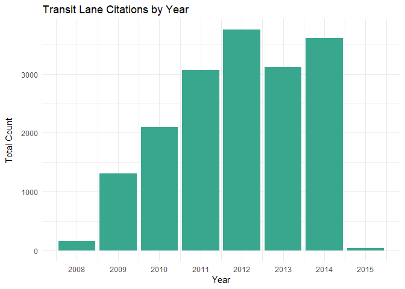
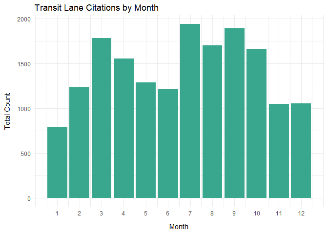

Analysis of Transit Only Lane Violations for SFMTA
================
Anthony Chau
07-10-2018

``` r
muni <- read.csv('muni_transitLanes.csv', strip.white = TRUE)
muni <- as.data.frame(muni)

# Check variables in muni
# str(muni)
# summary(muni)
```

Cleaning the Data
=================

First, we remove the Citation.Issue.Month column from the data frame since the month is already included in the Citation.Issue.Date column. And, we remove the Last.Edited.Date column because this is not relevant for our analysis. Lastly, we remove the Ticket.Number column.

``` r
muni$Citaton.Issue.Month <- NULL
muni$Last.Edited.Date <- NULL
muni$Ticket.Number <-  NULL
```

Check for Missing Values
========================

``` r
# Check for NA values for each column
apply(muni, 2, function(x) any(is.na(x)))
```

    ##            Object.ID  Citation.Issue.Date  Citation.Issue.Time 
    ##                FALSE                FALSE                FALSE 
    ##             Location       Violation.Code            Violation 
    ##                FALSE                FALSE                FALSE 
    ##          Fine.Amount      Citation.Status          Amount.Paid 
    ##                FALSE                FALSE                FALSE 
    ##           Amount.Due         Suspend.Code Suspend.Process.Date 
    ##                FALSE                FALSE                FALSE 
    ##   Suspend.Until.Date     Disposition.Code                 Geom 
    ##                FALSE                FALSE                FALSE

Now, let's focus our attention on the date and time data within this dataset.

Initially, the citation issue date and time were stored as factor variables. We collapse date and time into a single column and convert it to a datetime object. This will make the data easier to work with in our analysis.

``` r
# Convert citation dates and times to a Datetime object

muni$citation_date <- strptime(muni$Citation.Issue.Date, format ='%m/%d/%Y')


muni$citation_dateTime <- strptime(paste(muni$Citation.Issue.Date, 
                                            muni$Citation.Issue.Time), 
                                      format ='%m/%d/%Y %H:%M')

# Drop original citation issue date and time

muni$Citation.Issue.Date <- NULL
muni$Citation.Issue.Time <- NULL
```

We want to collaspe observations in the location column to only record a unique factor level for a street name.

``` r
library(stringr)
```

    ## Warning: package 'stringr' was built under R version 3.4.4

``` r
muni$Location <- as.character(muni$Location)

### Testing code

# Split location into street number and street name
# Logic: If a word boundary is proceeded by a digit, split the word

splitAddress <- strsplit(muni$Location, "(?<=\\d)\\b", perl=T)

# Create new matrix with street name column and street name column
y <- do.call(rbind, splitAddress)
y <- as.data.frame(y)


# Change column names
colnames(y) <- c('Street.Number', 'Street.Name')

# Make new column in muni df
muni$street_name <- y$Street.Name

# Check df
str(muni)
```

    ## 'data.frame':    17178 obs. of  16 variables:
    ##  $ Object.ID           : int  1 2 3 4 5 6 7 8 9 10 ...
    ##  $ Location            : chr  "643 O'FARRELL" "372 O'FARRELL" "372 O'FARRELL" "924 GEARY" ...
    ##  $ Violation.Code      : Factor w/ 11 levels "NO VIOL","T32A.1",..: 9 9 9 10 9 9 9 10 2 10 ...
    ##  $ Violation           : Factor w/ 11 levels "BUS ZONE","DBL PARK",..: 2 2 2 1 2 2 2 1 10 1 ...
    ##  $ Fine.Amount         : int  65 65 65 250 65 65 65 250 60 250 ...
    ##  $ Citation.Status     : Factor w/ 3 levels "Closed","Open",..: 1 2 1 1 1 1 1 1 2 2 ...
    ##  $ Amount.Paid         : Factor w/ 168 levels "$                  -",..: 6 151 151 6 151 151 6 89 159 6 ...
    ##  $ Amount.Due          : num  0 85 0 0 0 0 0 0 60 275 ...
    ##  $ Suspend.Code        : Factor w/ 74 levels "","10 10 2HR XCD",..: 57 56 56 57 56 56 67 71 56 1 ...
    ##  $ Suspend.Process.Date: Factor w/ 2035 levels "","01/01/2010 12:00:00 AM +0000",..: 1096 1079 1079 1103 1079 1079 1616 1178 1079 1 ...
    ##  $ Suspend.Until.Date  : Factor w/ 1949 levels "","01/01/2010 12:00:00 AM +0000",..: 1936 1168 1168 1936 1168 1168 560 1751 1168 1 ...
    ##  $ Disposition.Code    : Factor w/ 24 levels "","1 RU RV UPHD",..: 1 1 1 1 1 1 7 1 1 1 ...
    ##  $ Geom                : Factor w/ 3020 levels "","(37.710799135, -122.447754977)",..: 761 1065 1065 1060 1468 1482 969 1091 964 1409 ...
    ##  $ citation_date       : POSIXlt, format: "2008-07-10" "2008-07-10" ...
    ##  $ citation_dateTime   : POSIXlt, format: "2008-07-10 17:33:00" "2008-07-10 15:27:00" ...
    ##  $ street_name         : Factor w/ 59 levels "-MARKET ST"," - 3RD ST.",..: 34 34 34 20 20 20 20 20 20 20 ...

``` r
# Check unique street names
unique(muni$street_name)
```

    ##  [1]  O'FARRELL         GEARY             OFARRELL        
    ##  [4]  MISSION           POST ST           GEARY ST        
    ##  [7]  3RD ST            SUTTER            O'FARRELL ST.   
    ## [10]  SACRAMENTO        MISSION ST.       MAIN            
    ## [13]  - 3RD ST.         CLAY              STOCKTON        
    ## [16]  MISSION ST        POST              4TH ST.         
    ## [19]  MARKET            O'FARRELL STREET  GEARY ST.       
    ## [22]  OFALLELL          4TH ST            OFARRELL ST     
    ## [25]  SUTTER ST         04TH ST           STOCKTON ST     
    ## [28]  O'FARRELL ST      04TH  ST          - O'FARRELL ST  
    ## [31]  SACRAMENTO ST     03RD ST           - 4TH ST        
    ## [34]  -4TH ST           - GEARY ST        O4TH STREET     
    ## [37] -MARKET ST         POTRERO AVE       MISSION STREET  
    ## [40]  MARKET ST         GEARY BLVD        SAN BRUNO AVE   
    ## [43]  22ND ST           CLAY ST           HAIGHT ST       
    ## [46]  TOWNSEND ST       SAN JOSE AVE      STEUART ST      
    ## [49]  SCOTT ST          CHESTNUT ST       KEARNY ST       
    ## [52]  STOCKTON TUNL     FOLSOM            BUSH ST         
    ## [55]  TRUMBWELL         WILDE             3RD ST.         
    ## [58]  KEARNY            SUTTER ST.      
    ## 59 Levels: -MARKET ST  - 3RD ST.  - 4TH ST  - GEARY ST ...  WILDE

Clean up street names
=====================

``` r
# To extend functionality, can make it so that any street type will be converted to 
# empty string

# Vector of street types for use with str_replace_all function
street_types <- c("ST$" = "", "BLVD$" = "", "TUNL$" = "", "Street" = "", "AVE" = "",
                  "STREET$" = "")

# implement function with magarittr
library(magrittr)

locationName_clean <- function(location){
  location %>% 
  as.character() %>% 
  str_replace_all("[:punct:]", "") %>% 
  trimws(which = "both") %>% 
  str_replace_all(street_types) %>% 
  str_to_title() %>% 
  trimws(which = "both")
}

muni$street_name <- locationName_clean(muni$street_name)

# bug -> need to apply function twice to acheive desired result

# Check
unique(muni$street_name)
```

    ##  [1] "Ofarrell"   "Geary"      "Mission"    "Post"       "3Rd"       
    ##  [6] "Sutter"     "Sacramento" "Main"       "Clay"       "Stockton"  
    ## [11] "Po"         "4Th"        "Market"     "Ofallell"   "04Th"      
    ## [16] "03Rd"       "O4th"       "Potrero"    "San Bruno"  "22Nd"      
    ## [21] "Haight"     "Townsend"   "San Jose"   "Steuart"    "Scott"     
    ## [26] "Chestnut"   "Kearny"     "Folsom"     "Bush"       "Trumbwell" 
    ## [31] "Wilde"

Clean up minor spelling mistakes

``` r
# Clean up spelling and duplicates of street names
# Find more efficient way of doing this
# Only keep indicator of the street for the 'numerical streets' because San Francisco
# has both 2nd St and 2nd Ave
# Remove for the rest to keep it more clean
# We will determine the exact geographical location with longitude and latitude
# coordinates
muni$street_name[muni$street_name %in% c("Ofarrell", "Ofallell")] <- "O'Farrell"
muni$street_name[muni$street_name %in% c("4Th", "04Th", "O4th")] <- "4th St"
muni$street_name[muni$street_name %in% c("3Rd", "03Rd")] <- "3rd St"
muni$street_name[muni$street_name %in% c("22Nd")] <- "22nd St"
muni$street_name[muni$street_name %in% c("Po")] <- "Post"

# Change street_name to factor variable
muni$street_name <- factor(muni$street_name)


# Check
unique(muni$street_name)
```

    ##  [1] O'Farrell  Geary      Mission    Post       3rd St     Sutter    
    ##  [7] Sacramento Main       Clay       Stockton   4th St     Market    
    ## [13] Potrero    San Bruno  22nd St    Haight     Townsend   San Jose  
    ## [19] Steuart    Scott      Chestnut   Kearny     Folsom     Bush      
    ## [25] Trumbwell  Wilde     
    ## 26 Levels: 22nd St 3rd St 4th St Bush Chestnut Clay Folsom ... Wilde

Exploring Transit Lane Violation Types

``` r
library(dplyr)
```

    ## Warning: package 'dplyr' was built under R version 3.4.4

    ## 
    ## Attaching package: 'dplyr'

    ## The following objects are masked from 'package:stats':
    ## 
    ##     filter, lag

    ## The following objects are masked from 'package:base':
    ## 
    ##     intersect, setdiff, setequal, union

``` r
library(ggplot2)
```

    ## Warning: package 'ggplot2' was built under R version 3.4.4

``` r
library(plotly)
```

    ## Warning: package 'plotly' was built under R version 3.4.4

    ## 
    ## Attaching package: 'plotly'

    ## The following object is masked from 'package:ggplot2':
    ## 
    ##     last_plot

    ## The following object is masked from 'package:stats':
    ## 
    ##     filter

    ## The following object is masked from 'package:graphics':
    ## 
    ##     layout

Exploring Transit Lane Violation Types

``` r
# Rename violations
muni <- muni %>% 
  rename(violation_type = Violation)


# Counts of violation type
table(muni$violation_type)
```

    ## 
    ##   BUS ZONE   DBL PARK    NO VIOL ON SIDEWLK OVR 18 " C   PK FR LN 
    ##       2433       2995          1          1          5          1 
    ## PK PHB OTD PRK PROHIB TRNST ONLY TWAWY ZN#1 TWAWY ZONE 
    ##       1498       2535         70       5334       2305

``` r
unique(muni$violation_type)
```

    ##  [1] DBL PARK   BUS ZONE   TWAWY ZN#1 PK FR LN   TWAWY ZONE NO VIOL   
    ##  [7] OVR 18 " C PK PHB OTD PRK PROHIB TRNST ONLY ON SIDEWLK
    ## 11 Levels: BUS ZONE DBL PARK NO VIOL ON SIDEWLK OVR 18 " C ... TWAWY ZONE

Delete violation type categories from data frame
================================================

We have low observations counts for the following categories of violations: 'NO VIOL', 'ON SIDEWLK', 'OVR 18" C', and 'PK FR LB'. So, we remove these categories and the unique observations to make out analysis cleaner.

``` r
# Find the 8 observations with the 4 violation categories and delete them from data frame

muni <- muni[!muni$violation_type %in% c('NO VIOL', 'ON SIDEWLK', 'OVR 18 " C', 'PK FR LN'),]

# Check violation categories
table(muni$violation_type)
```

    ## 
    ##   BUS ZONE   DBL PARK    NO VIOL ON SIDEWLK OVR 18 " C   PK FR LN 
    ##       2433       2995          0          0          0          0 
    ## PK PHB OTD PRK PROHIB TRNST ONLY TWAWY ZN#1 TWAWY ZONE 
    ##       1498       2535         70       5334       2305

``` r
# Check total number of observations - we orignially had 17,178 observations
dim(muni)
```

    ## [1] 17170    16

Combine small violation counts on different street names
========================================================

Convert date and time columns to Date objects

``` r
# Convert citation date to date object to work in dplyr
muni$citation_date <- as.Date(muni$citation_date, format ='%m/%d/%Y')
muni$citation_dateTime <- as.Date(muni$citation_dateTime, format ='%m/%d/%Y  %H:%M') 
```

Work on this

``` r
# Group together factor level with low counts

# Visualize number of violations by street name with barplot
streetBarPlot <- ggplot(data=muni, aes(x=street_name)) + 
  geom_bar(aes(fill=violation_type), color='black', position = "dodge") +
  theme(axis.text.x = element_text(angle = 90, hjust = 1))

streetBarPlot
```



We find that most transit lane violations are concentrated on a few streets: Geary, Market, Mission, Folsom, Stockton, and Sutter. Almost all of these pass through downtown San Francisco, which is plausible since many bus services aggregate in downtown.

Many questions can be asked from this visualization. Is the high number of citations of these streets because of high bus and therefore high transit lane density in downtown San Francisco?

Are drivers more likely to violate regulations in the downtown area because of how crowded and hectic streets can get during peak hours, which makes driver more short-tempered and willing to make shortcuts through transit lanes?

Or, are high incidence of transit lane violations on a few streets because muni drivers are more short-tempered and willing to report violations in crowded downton SF?

Also, we have to take into account when each transit lane was implemented.

Visualize number of violations with barplot
===========================================

``` r
# Visualize number of violations by street name with barplot
violations <- ggplot(data=muni, aes(x=violation_type)) + 
  geom_bar() +
  theme_minimal() +
  theme(axis.text.x = element_text(angle = 90, hjust = 1))

violations
```



Most violation types are towaway zone and towaway zone \#1. There are few on sidewalk and OVR 18\*C violations. As there are few no violations. Need more information on how specific violation types are defined.

Violations - Count Plot

``` r
violationsCountPlot <- ggplot(data=muni)+ 
  geom_count(mapping = aes(x = violation_type, y = street_name)) +
  theme(axis.text.x = element_text(angle = 90, hjust = 1))


violationsCountPlot
```


Violations by Street Name - Tile Plot (possibly do a heat map with d3heatmap or heatmaply)

Most violation types were 'BUS ZONE', 'DBL PARK', and 'TWAWAY ZN\#1'.

``` r
muni %>% 
  count(violation_type, street_name) %>% 
  ggplot(mapping = aes(x = reorder(violation_type, n), y = street_name)) +
    geom_tile(aes(fill = n), color = 'white', size = 0.25) +
    scale_fill_continuous(type = "viridis", na.value = "grey90") +
    scale_x_discrete(limits = c('TWAWY ZN#1', 'DBL PARK', 'PRK PROHIB',
                                'BUS ZONE', 'TWAWY ZONE', 
                                'PK PHB OTD', 'TRNST ONLY')) +
    theme_grey() +
    theme(axis.text.x = element_text(angle = 90, hjust = 1, face = "bold"),
          plot.background = element_blank(),
          panel.border = element_blank())
```


Heatmap - Plotly

``` r
# Create matrix of observation counts by street name and violation type
# Bug with matrix code
m <- table(muni$street_name, muni$violation_type)

p <- plot_ly(z = m,
  x = levels(muni$street_name), y = levels(muni$violation_type),
  type = "heatmap"
)

p
```

<!--html_preserve-->

<script type="application/json" data-for="htmlwidget-c725baf449171f9e59bf">{"x":{"visdat":{"4b8c11663b50":["function () ","plotlyVisDat"]},"cur_data":"4b8c11663b50","attrs":{"4b8c11663b50":{"z":[[0,1,0,0,0,0,0,0,0,0,0],[0,30,0,0,0,0,0,0,0,35,0],[34,42,0,0,0,0,0,0,0,2,0],[0,0,0,0,0,0,0,3,0,0,0],[0,1,0,0,0,0,0,0,0,0,0],[5,6,0,0,0,0,0,0,0,13,0],[0,1,0,0,0,0,0,0,0,0,0],[598,488,0,0,0,0,20,30,2,1054,498],[2,0,0,0,0,0,0,0,0,0,0],[3,0,0,0,0,0,0,0,0,0,0],[2,0,0,0,0,0,0,0,0,0,0],[4,6,0,0,0,0,0,0,0,34,0],[228,213,0,0,0,0,0,1599,8,2513,0],[180,290,0,0,0,0,0,8,3,225,110],[541,573,0,0,0,0,0,0,19,20,2],[2,2,0,0,0,0,0,0,0,0,0],[1,7,0,0,0,0,0,1,1,13,0],[1,0,0,0,0,0,0,0,0,0,0],[0,1,0,0,0,0,0,0,0,0,0],[0,1,0,0,0,0,0,0,0,0,0],[1,0,0,0,0,0,0,0,0,0,0],[1,15,0,0,0,0,0,0,0,58,0],[827,1317,0,0,0,0,1478,894,37,1367,1695],[3,0,0,0,0,0,0,0,0,0,0],[0,1,0,0,0,0,0,0,0,0,0],[0,0,0,0,0,0,0,0,0,0,0]],"x":["22nd St","3rd St","4th St","Bush","Chestnut","Clay","Folsom","Geary","Haight","Kearny","Main","Market","Mission","O'Farrell","Post","Potrero","Sacramento","San Bruno","San Jose","Scott","Steuart","Stockton","Sutter","Townsend","Trumbwell","Wilde"],"y":["BUS ZONE","DBL PARK","NO VIOL","ON SIDEWLK","OVR 18 \" C","PK FR LN","PK PHB OTD","PRK PROHIB","TRNST ONLY","TWAWY ZN#1","TWAWY ZONE"],"alpha_stroke":1,"sizes":[10,100],"spans":[1,20],"type":"heatmap"}},"layout":{"margin":{"b":40,"l":60,"t":25,"r":10},"xaxis":{"domain":[0,1],"automargin":true,"title":[]},"yaxis":{"domain":[0,1],"automargin":true,"title":[]},"scene":{"zaxis":{"title":[]}},"hovermode":"closest","showlegend":false,"legend":{"yanchor":"top","y":0.5}},"source":"A","config":{"modeBarButtonsToAdd":[{"name":"Collaborate","icon":{"width":1000,"ascent":500,"descent":-50,"path":"M487 375c7-10 9-23 5-36l-79-259c-3-12-11-23-22-31-11-8-22-12-35-12l-263 0c-15 0-29 5-43 15-13 10-23 23-28 37-5 13-5 25-1 37 0 0 0 3 1 7 1 5 1 8 1 11 0 2 0 4-1 6 0 3-1 5-1 6 1 2 2 4 3 6 1 2 2 4 4 6 2 3 4 5 5 7 5 7 9 16 13 26 4 10 7 19 9 26 0 2 0 5 0 9-1 4-1 6 0 8 0 2 2 5 4 8 3 3 5 5 5 7 4 6 8 15 12 26 4 11 7 19 7 26 1 1 0 4 0 9-1 4-1 7 0 8 1 2 3 5 6 8 4 4 6 6 6 7 4 5 8 13 13 24 4 11 7 20 7 28 1 1 0 4 0 7-1 3-1 6-1 7 0 2 1 4 3 6 1 1 3 4 5 6 2 3 3 5 5 6 1 2 3 5 4 9 2 3 3 7 5 10 1 3 2 6 4 10 2 4 4 7 6 9 2 3 4 5 7 7 3 2 7 3 11 3 3 0 8 0 13-1l0-1c7 2 12 2 14 2l218 0c14 0 25-5 32-16 8-10 10-23 6-37l-79-259c-7-22-13-37-20-43-7-7-19-10-37-10l-248 0c-5 0-9-2-11-5-2-3-2-7 0-12 4-13 18-20 41-20l264 0c5 0 10 2 16 5 5 3 8 6 10 11l85 282c2 5 2 10 2 17 7-3 13-7 17-13z m-304 0c-1-3-1-5 0-7 1-1 3-2 6-2l174 0c2 0 4 1 7 2 2 2 4 4 5 7l6 18c0 3 0 5-1 7-1 1-3 2-6 2l-173 0c-3 0-5-1-8-2-2-2-4-4-4-7z m-24-73c-1-3-1-5 0-7 2-2 3-2 6-2l174 0c2 0 5 0 7 2 3 2 4 4 5 7l6 18c1 2 0 5-1 6-1 2-3 3-5 3l-174 0c-3 0-5-1-7-3-3-1-4-4-5-6z"},"click":"function(gd) { \n        // is this being viewed in RStudio?\n        if (location.search == '?viewer_pane=1') {\n          alert('To learn about plotly for collaboration, visit:\\n https://cpsievert.github.io/plotly_book/plot-ly-for-collaboration.html');\n        } else {\n          window.open('https://cpsievert.github.io/plotly_book/plot-ly-for-collaboration.html', '_blank');\n        }\n      }"}],"cloud":false},"data":[{"colorbar":{"title":"","ticklen":2,"len":0.5,"lenmode":"fraction","y":1,"yanchor":"top"},"colorscale":[["0","rgba(68,1,84,1)"],["0","rgba(68,1,84,1)"],["0","rgba(68,1,84,1)"],["0","rgba(68,1,84,1)"],["0","rgba(68,1,84,1)"],["0","rgba(68,1,84,1)"],["0","rgba(68,1,84,1)"],["0","rgba(68,1,84,1)"],["0","rgba(68,1,84,1)"],["0","rgba(68,1,84,1)"],["0","rgba(68,1,84,1)"],["0","rgba(68,1,84,1)"],["0","rgba(68,1,84,1)"],["0","rgba(68,1,84,1)"],["0","rgba(68,1,84,1)"],["0","rgba(68,1,84,1)"],["0","rgba(68,1,84,1)"],["0","rgba(68,1,84,1)"],["0","rgba(68,1,84,1)"],["0.000397930760047752","rgba(68,1,84,1)"],["0.000795861520095503","rgba(68,1,84,1)"],["0.00293473935535217","rgba(68,2,85,1)"],["0.0136291285316355","rgba(69,7,88,1)"],["0.200308396339037","rgba(65,68,134,1)"],["1","rgba(253,231,37,1)"]],"showscale":true,"z":[[0,1,0,0,0,0,0,0,0,0,0],[0,30,0,0,0,0,0,0,0,35,0],[34,42,0,0,0,0,0,0,0,2,0],[0,0,0,0,0,0,0,3,0,0,0],[0,1,0,0,0,0,0,0,0,0,0],[5,6,0,0,0,0,0,0,0,13,0],[0,1,0,0,0,0,0,0,0,0,0],[598,488,0,0,0,0,20,30,2,1054,498],[2,0,0,0,0,0,0,0,0,0,0],[3,0,0,0,0,0,0,0,0,0,0],[2,0,0,0,0,0,0,0,0,0,0],[4,6,0,0,0,0,0,0,0,34,0],[228,213,0,0,0,0,0,1599,8,2513,0],[180,290,0,0,0,0,0,8,3,225,110],[541,573,0,0,0,0,0,0,19,20,2],[2,2,0,0,0,0,0,0,0,0,0],[1,7,0,0,0,0,0,1,1,13,0],[1,0,0,0,0,0,0,0,0,0,0],[0,1,0,0,0,0,0,0,0,0,0],[0,1,0,0,0,0,0,0,0,0,0],[1,0,0,0,0,0,0,0,0,0,0],[1,15,0,0,0,0,0,0,0,58,0],[827,1317,0,0,0,0,1478,894,37,1367,1695],[3,0,0,0,0,0,0,0,0,0,0],[0,1,0,0,0,0,0,0,0,0,0],[0,0,0,0,0,0,0,0,0,0,0]],"x":["22nd St","3rd St","4th St","Bush","Chestnut","Clay","Folsom","Geary","Haight","Kearny","Main","Market","Mission","O'Farrell","Post","Potrero","Sacramento","San Bruno","San Jose","Scott","Steuart","Stockton","Sutter","Townsend","Trumbwell","Wilde"],"y":["BUS ZONE","DBL PARK","NO VIOL","ON SIDEWLK","OVR 18 \" C","PK FR LN","PK PHB OTD","PRK PROHIB","TRNST ONLY","TWAWY ZN#1","TWAWY ZONE"],"type":"heatmap","xaxis":"x","yaxis":"y","frame":null}],"highlight":{"on":"plotly_click","persistent":false,"dynamic":false,"selectize":false,"opacityDim":0.2,"selected":{"opacity":1},"debounce":0},"base_url":"https://plot.ly"},"evals":["config.modeBarButtonsToAdd.0.click"],"jsHooks":[]}</script>
<!--/html_preserve-->
Violations by Street Name - Jitter plot

``` r
violations_jitter <- ggplot(data = muni) +
  geom_jitter(mapping = aes(x = violation_type, y = street_name)) +
  theme(axis.text.x = element_text(angle = 90, hjust = 1))

violations_jitter
```


Violations - Pie Chart

``` r
# Visualize number of violations with pie chart
pie <- ggplot(muni, aes(x = "", fill = factor(violation_type))) + 
  geom_bar(width = 1) +
  theme(axis.line = element_blank(), 
        plot.title = element_text(hjust=0.5)) + 
  labs(fill="class", 
       x=NULL, 
       y=NULL, 
       title="Pie Chart of Violation Type", 
       caption="Source: muni")
  
pie + coord_polar(theta = "y", start=0)
```


Time Series visualization test Account for dates with no citation Make dates with sequence function between earliest date and latest date \# try missing\_values &lt;- date\[!date in% sequence\]

``` r
library(dplyr)

# Create new column which stores how many citations were issued that day and build 
# time series object from that column

# Convert citation date to date object to work in dplyr
muni$citation_date <- as.Date(muni$citation_date, format ='%m/%d/%Y')
muni$citation_dateTime <- as.Date(muni$citation_dateTime, format ='%m/%d/%Y  %H:%M') 


# Group and count observations by date 
muni <- 
  muni %>%
  arrange(citation_date) %>%
  group_by(citation_date) %>%
  mutate(citation_count = n())
```

    ## Warning: package 'bindrcpp' was built under R version 3.4.4

``` r
# Try n = n()
# Count missing values: (sum(is.na(x))) or set na.rm=TRUE

# Pull out citation_count vector
citation_count <- 
  muni %>%
  pull(citation_count)

# Time series
# More research on dealing with regular data (almost daily) and spanning across
# many years
citation_ts <- ts(citation_count, frequency = 7, start= c(2008,2))

plot.ts(citation_ts)
```


