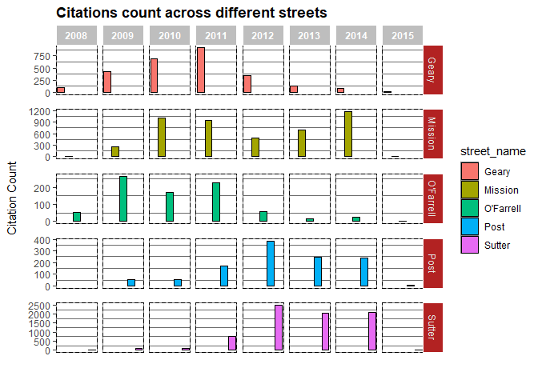

Analysis of Transit Only Lane Violations for SFMTA
================
Anthony Chau
07-10-2018

``` r
library(dplyr)
library(ggplot2)
library(stringr)
library(magrittr)
library(tidyverse)
library(leaflet)
library(plotly)
library(lubridate)
```

Read in data
============

``` r
# Use read_csv from readr package (Faster, more reproducible, tibbles)
muni <- read_csv('muni_transitLanes.csv', trim_ws = TRUE, na = c("", "NA"))
```

    ## Warning in rbind(names(probs), probs_f): number of columns of result is not
    ## a multiple of vector length (arg 2)

    ## Warning: 1 parsing failure.
    ## row # A tibble: 1 x 5 col     row col        expected               actual file                    expected   <int> <chr>      <chr>                  <chr>  <chr>                   actual 1  2379 Amount Due no trailing characters .95    'muni_transitLanes.csv' file # A tibble: 1 x 5

``` r
muni <- as.data.frame(muni)

# Check variables in muni
str(muni)
```

Cleaning the Data
=================

First, we remove the Citation.Issue.Month column from the data frame since the month is already included in the Citation.Issue.Date column. And, we remove the Last.Edited.Date and Ticket Number column because the columns are not relevant for our analysis.

``` r
muni <- muni %>% 
  select(-`Citaton Issue Month`, -`Last Edited Date`, -`Ticket Number`)
```

Missing Values
--------------

We have many missing values scattered across the columns in the muni data frame. More specifcally, there are missing values in the 'Amount Due', 'Suspend Code', 'Suspend Process Date', 'Suspend Until Date', 'Disposition Code', and 'Geom' columns.

we have many missing values in the Disposition Code column but few missing values for the 'Amount Due' and Geom' column. Also, there are about an equal amount of missing values for the 'Suspend Code', 'Suspend Process Date, and 'Suspend Until Date'. This makes sense intuitively because the columns are related to each other. In fact the 'Suspend Process Date' and 'Suspend Until Date' have the same number of missing values.

``` r
# Check for NA values for each column

apply(muni, 2, function(x) any(is.na(x)))
```

    ##            Object ID  Citation Issue Date  Citation Issue Time 
    ##                FALSE                FALSE                FALSE 
    ##             Location       Violation Code            Violation 
    ##                FALSE                FALSE                FALSE 
    ##          Fine Amount      Citation Status          Amount Paid 
    ##                FALSE                FALSE                FALSE 
    ##           Amount Due         Suspend Code Suspend Process Date 
    ##                 TRUE                 TRUE                 TRUE 
    ##   Suspend Until Date     Disposition Code                 Geom 
    ##                 TRUE                 TRUE                 TRUE

``` r
# find total number of missing values for columns with missing values
totalMissing <-  function(missing_column){
  cat("Total missing values:", sum(is.na(missing_column)), "\n")
}

totalMissing(muni$`Amount Due`)
```

    ## Total missing values: 1

``` r
totalMissing(muni$`Suspend Code`)
```

    ## Total missing values: 1876

``` r
totalMissing(muni$`Suspend Process Date`)
```

    ## Total missing values: 1879

``` r
totalMissing(muni$`Suspend Until Date`)
```

    ## Total missing values: 1879

``` r
totalMissing(muni$`Disposition Code`)
```

    ## Total missing values: 15382

``` r
totalMissing(muni$Geom)
```

    ## Total missing values: 21

Impute Missing Valuess
----------------------

Date and Time
-------------

Now, let's focus our attention on the date and time data within this dataset.

Initially, the citation issue date and time were stored as factor variables. We collapse date and time into a single column and convert it to a datetime object. This will make the data easier to work with in our analysis.

``` r
# Convert all values in the original citation column into a Date object
muni$citation_date <- as.Date(muni$`Citation Issue Date`, format ="%m/%d/%Y")


# Combine date and time columns into a citation_dateTime column
muni <-  muni %>% 
  unite(citation_dateTime, `Citation Issue Date`, `Citation Issue Time`, sep = " ")

# Convert citation_dateTime to a POSIXct object
muni$citation_dateTime <- mdy_hms(muni$citation_dateTime)
```

Separate date column
--------------------

We also want to analyze citation counts in a smaller time frame, so we separate the citation\_date column into three columns for the month, date, and year

``` r
muni <- muni %>% 
  separate(citation_date, into = c("year", "month", "day"), sep = "-", remove = FALSE)
```

Convert month, day, and year columns into the integer type
----------------------------------------------------------

``` r
muni$month <- as.integer(muni$month)

muni$day <- as.integer(muni$day)

muni$year <- as.integer(muni$year)
```

Spatial Location
----------------

``` r
# Split Geom column into Longitude and Latitude column
muni <-  muni %>% 
  separate(Geom, into = c("latitude", "longitude"), sep = ",")

# Clean up longitude and latitude column (remove parenthesis)
muni$latitude <- muni$latitude %>% 
  str_replace("^\\(", "")

muni$longitude <-  muni$longitude %>% 
  str_replace("\\)$", "")
```

Extract unique street names from location column
------------------------------------------------

We create a new column which consists of only the street name where the violation occured. In the original datset, the location column provided both the street number and street name. As a result, we have an extremely high amount of factor levels for the location column. Hence, we will condense down the number of factor levels to the total number of unique street names.

``` r
# Good functional programming practice:
# Not advisable to change global variables in functions
# Instead, we write a function with a more explicit return value and reassign the result
# outside the function (global environment)

# In this case, we create a new column in data frame called y, which contains only the
# street names of all the location. We use the get_streetName function to return this
# column and then assign that column to a new column in the muni data frame.


# instead of do.call() use dplyr:: bind_rows()

get_streetName <-  function(location_column){
  location_column <- as.character(location_column) 
  splitLocation <- strsplit(location_column, "(?<=\\d)\\b", perl=T)
  y <- do.call(rbind, splitLocation)
  y <- as.data.frame(y)
  colnames(y) <- c("street_number", "street_name")
  return(y$street_name)
}

muni$street_name <- get_streetName(muni$Location)

# Check street names
unique(muni$street_name)
```

    ##  [1]  O'FARRELL         GEARY             OFARRELL        
    ##  [4]  MISSION           POST ST           GEARY ST        
    ##  [7]  3RD ST            SUTTER            O'FARRELL ST.   
    ## [10]  SACRAMENTO        MISSION ST.       MAIN            
    ## [13]  - 3RD ST.         CLAY              STOCKTON        
    ## [16]  MISSION ST        POST              4TH ST.         
    ## [19]  MARKET            O'FARRELL STREET  GEARY ST.       
    ## [22]  OFALLELL          4TH ST            OFARRELL ST     
    ## [25]  SUTTER ST         04TH ST           STOCKTON ST     
    ## [28]  O'FARRELL ST      04TH  ST          - O'FARRELL ST  
    ## [31]  SACRAMENTO ST     03RD ST           - 4TH ST        
    ## [34]  -4TH ST           - GEARY ST        O4TH STREET     
    ## [37] -MARKET ST         POTRERO AVE       MISSION STREET  
    ## [40]  MARKET ST         GEARY BLVD        SAN BRUNO AVE   
    ## [43]  22ND ST           CLAY ST           HAIGHT ST       
    ## [46]  TOWNSEND ST       SAN JOSE AVE      STEUART ST      
    ## [49]  SCOTT ST          CHESTNUT ST       KEARNY ST       
    ## [52]  STOCKTON TUNL     FOLSOM            BUSH ST         
    ## [55]  TRUMBWELL         WILDE             3RD ST.         
    ## [58]  KEARNY            SUTTER ST.      
    ## 59 Levels: -MARKET ST  - 3RD ST.  - 4TH ST  - GEARY ST ...  WILDE

``` r
### Explanation of Function

# Split location into street number and street name
# Logic: If a word boundary is proceeded by a digit, split the word
# Create new matrix with street name column and street name column
# Change column names
# Make new column in muni df
```

Clean up street names
---------------------

In the newly created street\_name column, we remove unnecessary puncation or white space within the different factor levels and remove the street type from each factor level. Lastly, we convert each street name to title style capitalization.

``` r
# To extend practicality and to simplify our string data, any street type will be converted to empty string

# Vector of street types for use with str_replace_all function
street_types <- c("ST$" = "", "BLVD$" = "", "TUNL$" = "", "Street" = "", "AVE" = "",
                  "STREET$" = "")


clean_streetName <- function(streetName_column){
  streetName_column <- streetName_column %>% 
  as.character() %>% 
  str_replace_all("[:punct:]", "") %>% 
  str_replace_all(street_types) %>% 
  str_to_title() %>% 
  trimws(which = "both")
  return(streetName_column)
}

muni$street_name <- clean_streetName(muni$street_name)

# Take in original location column, which was previously cleaned up by the 

# Check
unique(muni$street_name)
```

    ##  [1] "Ofarrell"   "Geary"      "Mission"    "Post"       "3Rd"       
    ##  [6] "Sutter"     "Sacramento" "Main"       "Clay"       "Stockton"  
    ## [11] "Po"         "4Th"        "Market"     "Ofallell"   "04Th"      
    ## [16] "03Rd"       "O4th"       "Potrero"    "San Bruno"  "22Nd"      
    ## [21] "Haight"     "Townsend"   "San Jose"   "Steuart"    "Scott"     
    ## [26] "Chestnut"   "Kearny"     "Folsom"     "Bush"       "Trumbwell" 
    ## [31] "Wilde"

Clean up minor spelling mistakes
--------------------------------

Some of the street names in the dataset are misspelled. We manually correct these mistakes by reassigning observations with misspelling to the correct spelling.

For this analysis, I have decided to remove the street type indicator from non-duplicate street names. Beacuse of this, only numerical street names, such as 4th or 22nd, have street type indicators.

``` r
# Clean up spelling and duplicates of street names
# Find more efficient way of doing this
# Only keep indicator of the street for the 'numerical streets' because San Francisco
# has both 2nd St and 2nd Ave
# Remove for the rest to keep it more clean
# We will determine the exact geographical location with longitude and latitude
# coordinates
muni$street_name[muni$street_name %in% c("Ofarrell", "Ofallell")] <- "O'Farrell"
muni$street_name[muni$street_name %in% c("4Th", "04Th", "O4th")] <- "4th St"
muni$street_name[muni$street_name %in% c("3Rd", "03Rd")] <- "3rd St"
muni$street_name[muni$street_name %in% c("22Nd")] <- "22nd St"
muni$street_name[muni$street_name %in% c("Po")] <- "Post"

# Change street_name to factor variable
muni$street_name <- factor(muni$street_name)

# Check
unique(muni$street_name)
```

    ##  [1] O'Farrell  Geary      Mission    Post       3rd St     Sutter    
    ##  [7] Sacramento Main       Clay       Stockton   4th St     Market    
    ## [13] Potrero    San Bruno  22nd St    Haight     Townsend   San Jose  
    ## [19] Steuart    Scott      Chestnut   Kearny     Folsom     Bush      
    ## [25] Trumbwell  Wilde     
    ## 26 Levels: 22nd St 3rd St 4th St Bush Chestnut Clay Folsom ... Wilde

Rename columns
--------------

``` r
muni <- muni %>% 
  rename(ID = "Object ID", violation_type = "Violation", location = "Location",
         fine_amount = "Fine Amount")

names(muni)
```

    ##  [1] "ID"                   "citation_dateTime"    "location"            
    ##  [4] "Violation Code"       "violation_type"       "fine_amount"         
    ##  [7] "Citation Status"      "Amount Paid"          "Amount Due"          
    ## [10] "Suspend Code"         "Suspend Process Date" "Suspend Until Date"  
    ## [13] "Disposition Code"     "latitude"             "longitude"           
    ## [16] "citation_date"        "year"                 "month"               
    ## [19] "day"                  "street_name"

Rearrange columns
-----------------

``` r
muni <- muni %>% 
  select(ID, month, day, year, street_name, 
         violation_type, latitude, longitude, 
         fine_amount, citation_dateTime, everything())
```

Data Visualization
==================

Transit lane citations count from 2008-2015
-------------------------------------------

First, we condense down the muni data frame by selecting only the street\_name and citation\_dateTime column. We will pass in this condensed data frame to ggplot2 to create visualizations.

Then, we make a frequency plot with ggplot2 to display the distribution of citationc counts over time. However, this plot is difficult to interpret when our binwidth is set equal to 1 day because of the great volume of observations every day. We will choose a bigger binwidth for more useful visualizaion

``` r
citations_dt <- muni %>% 
  select(street_name, citation_dateTime)

# Citation count by day from 2008 to 2014
citations_dt %>% 
  ggplot(aes(citation_dateTime)) +
  geom_freqpoly(binwidth = 86400) # 86400 secs = 1 day
```


Transit lane citations count from 2008-2015 with increased binwidth
-------------------------------------------------------------------

We increase the bindwidth to be approximately a month and put breaks in the dates every 6 months. This allows us to see a clearer general trend without the unnecessary noise.

From the graph, transit lane citations were increasing in general, with peak levels around September 2012. There is a cylical pattern in the data, with peaks and troughs scattered throughout the curve.

``` r
p <- citations_dt %>% 
  ggplot(aes(citation_dateTime)) +
  # take average days in a month to be 30 and multiple by the number of seconds in a day
  geom_freqpoly(binwidth = 86400*30, color = "firebrick") +
  labs(x = "Date", y = "Citation Count", 
       title = "Transit Lane Violation Counts in San Francisco") +
  scale_x_datetime(date_breaks = "6 months", date_labels = "%b - %Y") +
  theme_minimal() + 
  theme(axis.text.x = element_text(angle = 45, hjust = 1, 
                                   margin = margin(0, 0, 15, 0)),
        plot.title = element_text(size = 15, face = "bold", 
                                  margin = margin(0, 0, 10, 0)))

p
```



``` r
p <- ggplotly(p, tooltip = c("y"))
p
```

<!--html_preserve-->

<script type="application/json" data-for="htmlwidget-f03f4939a75c7cb1ccc5">{"x":{"data":[{"x":[1202688000,1205280000,1207872000,1210464000,1213056000,1215648000,1218240000,1220832000,1223424000,1226016000,1228608000,1231200000,1233792000,1236384000,1238976000,1241568000,1244160000,1246752000,1249344000,1251936000,1254528000,1257120000,1259712000,1262304000,1264896000,1267488000,1270080000,1272672000,1275264000,1277856000,1280448000,1283040000,1285632000,1288224000,1290816000,1293408000,1296000000,1298592000,1301184000,1303776000,1306368000,1308960000,1311552000,1314144000,1316736000,1319328000,1321920000,1324512000,1327104000,1329696000,1332288000,1334880000,1337472000,1340064000,1342656000,1345248000,1347840000,1350432000,1353024000,1355616000,1358208000,1360800000,1363392000,1365984000,1368576000,1371168000,1373760000,1376352000,1378944000,1381536000,1384128000,1386720000,1389312000,1391904000,1394496000,1397088000,1399680000,1402272000,1404864000,1407456000,1410048000,1412640000,1415232000,1417824000,1420416000,1423008000,1425600000,1428192000],"y":[0,25,6,6,7,39,36,16,18,0,9,6,21,94,100,113,124,130,115,105,160,143,137,112,93,206,198,171,47,177,279,154,243,256,162,107,238,298,360,312,149,272,301,314,268,204,152,184,205,273,343,349,238,344,333,380,548,324,175,214,154,145,325,373,292,173,344,271,250,320,284,185,130,304,358,332,283,178,469,409,360,387,205,177,40,34,3,0],"text":["count:   0","count:  25","count:   6","count:   6","count:   7","count:  39","count:  36","count:  16","count:  18","count:   0","count:   9","count:   6","count:  21","count:  94","count: 100","count: 113","count: 124","count: 130","count: 115","count: 105","count: 160","count: 143","count: 137","count: 112","count:  93","count: 206","count: 198","count: 171","count:  47","count: 177","count: 279","count: 154","count: 243","count: 256","count: 162","count: 107","count: 238","count: 298","count: 360","count: 312","count: 149","count: 272","count: 301","count: 314","count: 268","count: 204","count: 152","count: 184","count: 205","count: 273","count: 343","count: 349","count: 238","count: 344","count: 333","count: 380","count: 548","count: 324","count: 175","count: 214","count: 154","count: 145","count: 325","count: 373","count: 292","count: 173","count: 344","count: 271","count: 250","count: 320","count: 284","count: 185","count: 130","count: 304","count: 358","count: 332","count: 283","count: 178","count: 469","count: 409","count: 360","count: 387","count: 205","count: 177","count:  40","count:  34","count:   3","count:   0"],"type":"scatter","mode":"lines","line":{"width":1.88976377952756,"color":"rgba(178,34,34,1)","dash":"solid"},"hoveron":"points","showlegend":false,"xaxis":"x","yaxis":"y","hoverinfo":"text","frame":null}],"layout":{"margin":{"t":46.1535907015359,"r":7.30593607305936,"b":59.804955726331,"l":43.1050228310502},"font":{"color":"rgba(0,0,0,1)","family":"","size":14.6118721461187},"title":"<b> Transit Lane Violation Counts in San Francisco <\/b>","titlefont":{"color":"rgba(0,0,0,1)","family":"","size":19.9252801992528},"xaxis":{"domain":[0,1],"automargin":true,"type":"linear","autorange":false,"range":[1189987200,1440892800],"tickmode":"array","ticktext":["Mar - 2008","Sep - 2008","Mar - 2009","Sep - 2009","Mar - 2010","Sep - 2010","Mar - 2011","Sep - 2011","Mar - 2012","Sep - 2012","Mar - 2013","Sep - 2013","Mar - 2014","Sep - 2014","Mar - 2015"],"tickvals":[1204329600,1220227200,1235865600,1251763200,1267401600,1283299200,1298937600,1314835200,1330560000,1346457600,1362096000,1377993600,1393632000,1409529600,1425168000],"categoryorder":"array","categoryarray":["Mar - 2008","Sep - 2008","Mar - 2009","Sep - 2009","Mar - 2010","Sep - 2010","Mar - 2011","Sep - 2011","Mar - 2012","Sep - 2012","Mar - 2013","Sep - 2013","Mar - 2014","Sep - 2014","Mar - 2015"],"nticks":null,"ticks":"","tickcolor":null,"ticklen":3.65296803652968,"tickwidth":0,"showticklabels":true,"tickfont":{"color":"rgba(77,77,77,1)","family":"","size":11.689497716895},"tickangle":-45,"showline":false,"linecolor":null,"linewidth":0,"showgrid":true,"gridcolor":"rgba(235,235,235,1)","gridwidth":0.66417600664176,"zeroline":false,"anchor":"y","title":"Date","titlefont":{"color":"rgba(0,0,0,1)","family":"","size":14.6118721461187},"hoverformat":".2f"},"yaxis":{"domain":[0,1],"automargin":true,"type":"linear","autorange":false,"range":[-27.4,575.4],"tickmode":"array","ticktext":["0","200","400"],"tickvals":[0,200,400],"categoryorder":"array","categoryarray":["0","200","400"],"nticks":null,"ticks":"","tickcolor":null,"ticklen":3.65296803652968,"tickwidth":0,"showticklabels":true,"tickfont":{"color":"rgba(77,77,77,1)","family":"","size":11.689497716895},"tickangle":-0,"showline":false,"linecolor":null,"linewidth":0,"showgrid":true,"gridcolor":"rgba(235,235,235,1)","gridwidth":0.66417600664176,"zeroline":false,"anchor":"x","title":"Citation Count","titlefont":{"color":"rgba(0,0,0,1)","family":"","size":14.6118721461187},"hoverformat":".2f"},"shapes":[{"type":"rect","fillcolor":null,"line":{"color":null,"width":0,"linetype":[]},"yref":"paper","xref":"paper","x0":0,"x1":1,"y0":0,"y1":1}],"showlegend":false,"legend":{"bgcolor":null,"bordercolor":null,"borderwidth":0,"font":{"color":"rgba(0,0,0,1)","family":"","size":11.689497716895}},"hovermode":"closest","barmode":"relative"},"config":{"doubleClick":"reset","modeBarButtonsToAdd":[{"name":"Collaborate","icon":{"width":1000,"ascent":500,"descent":-50,"path":"M487 375c7-10 9-23 5-36l-79-259c-3-12-11-23-22-31-11-8-22-12-35-12l-263 0c-15 0-29 5-43 15-13 10-23 23-28 37-5 13-5 25-1 37 0 0 0 3 1 7 1 5 1 8 1 11 0 2 0 4-1 6 0 3-1 5-1 6 1 2 2 4 3 6 1 2 2 4 4 6 2 3 4 5 5 7 5 7 9 16 13 26 4 10 7 19 9 26 0 2 0 5 0 9-1 4-1 6 0 8 0 2 2 5 4 8 3 3 5 5 5 7 4 6 8 15 12 26 4 11 7 19 7 26 1 1 0 4 0 9-1 4-1 7 0 8 1 2 3 5 6 8 4 4 6 6 6 7 4 5 8 13 13 24 4 11 7 20 7 28 1 1 0 4 0 7-1 3-1 6-1 7 0 2 1 4 3 6 1 1 3 4 5 6 2 3 3 5 5 6 1 2 3 5 4 9 2 3 3 7 5 10 1 3 2 6 4 10 2 4 4 7 6 9 2 3 4 5 7 7 3 2 7 3 11 3 3 0 8 0 13-1l0-1c7 2 12 2 14 2l218 0c14 0 25-5 32-16 8-10 10-23 6-37l-79-259c-7-22-13-37-20-43-7-7-19-10-37-10l-248 0c-5 0-9-2-11-5-2-3-2-7 0-12 4-13 18-20 41-20l264 0c5 0 10 2 16 5 5 3 8 6 10 11l85 282c2 5 2 10 2 17 7-3 13-7 17-13z m-304 0c-1-3-1-5 0-7 1-1 3-2 6-2l174 0c2 0 4 1 7 2 2 2 4 4 5 7l6 18c0 3 0 5-1 7-1 1-3 2-6 2l-173 0c-3 0-5-1-8-2-2-2-4-4-4-7z m-24-73c-1-3-1-5 0-7 2-2 3-2 6-2l174 0c2 0 5 0 7 2 3 2 4 4 5 7l6 18c1 2 0 5-1 6-1 2-3 3-5 3l-174 0c-3 0-5-1-7-3-3-1-4-4-5-6z"},"click":"function(gd) { \n        // is this being viewed in RStudio?\n        if (location.search == '?viewer_pane=1') {\n          alert('To learn about plotly for collaboration, visit:\\n https://cpsievert.github.io/plotly_book/plot-ly-for-collaboration.html');\n        } else {\n          window.open('https://cpsievert.github.io/plotly_book/plot-ly-for-collaboration.html', '_blank');\n        }\n      }"}],"cloud":false},"source":"A","attrs":{"48fc16b25369":{"x":{},"type":"scatter"}},"cur_data":"48fc16b25369","visdat":{"48fc16b25369":["function (y) ","x"]},"highlight":{"on":"plotly_click","persistent":false,"dynamic":false,"selectize":false,"opacityDim":0.2,"selected":{"opacity":1},"debounce":0},"base_url":"https://plot.ly"},"evals":["config.modeBarButtonsToAdd.0.click"],"jsHooks":[]}</script>
<!--/html_preserve-->
Visualzing Transit lane citations by street name.
-------------------------------------------------

We will focus on the streets with relatively high amounts of citations. Namely, we will show distributions for Geary, Mission, O'Farrell, Post, and Sutter.

``` r
muni %>% 
  group_by(street_name) %>% 
  summarise(n())
```

    ## # A tibble: 26 x 2
    ##    street_name `n()`
    ##    <fct>       <int>
    ##  1 22nd St         1
    ##  2 3rd St         65
    ##  3 4th St         80
    ##  4 Bush            3
    ##  5 Chestnut        1
    ##  6 Clay           24
    ##  7 Folsom          1
    ##  8 Geary        2693
    ##  9 Haight          2
    ## 10 Kearny          3
    ## # ... with 16 more rows

Citations by Street Name from 2008-2015 Visualization
=====================================================

``` r
citations_streetName <- muni %>% 
  group_by(street_name, year) %>% 
  mutate(count = n())

p2 <- citations_streetName %>% 
  filter(street_name %in% c("Geary", "Mission", "O'Farrell", "Post", "Sutter")) %>% 
  ggplot(aes(street_name)) +
  geom_bar(color = "black", mapping = aes(fill = street_name)) +
  labs(x ="", y = "Citation Count", 
       title = "Citations count across different streets") + 
  facet_grid(cols = vars(year), rows = vars(street_name), 
             scales = "free_y") +
  theme_dark() + 
  theme(axis.text.x = element_blank(), 
        axis.ticks.x = element_blank(),
        axis.title.x = element_text(margin = margin(10, 0, 0, 0)), 
        axis.title.y = element_text(margin = margin(0, 10, 0, 0)),
        plot.title = element_text(face = "bold"),
        panel.spacing.y = unit(.5, "cm"),
        panel.grid.major = element_blank(),
        panel.border = element_rect(linetype = "dashed", fill = NA),
        strip.background.x = element_rect(colour = "white", fill = "gray"),
        strip.background.y = element_rect(colour = "white", fill = "firebrick"),
        strip.text.x = element_text(colour = "white", face = "bold"),
        panel.background = element_rect(fill = "white", color = "gray50"))
```

    ## Warning: package 'bindrcpp' was built under R version 3.4.4

``` r
p2
```


``` r
# glitchy
ggplotly(p2, tooltip = "count")
```

<!--html_preserve-->

<script type="application/json" data-for="htmlwidget-1791312c44acd3945fa0">{"x":{"data":[{"orientation":"v","width":0.9,"base":0,"x":[1],"y":[88],"text":"count:   88","type":"bar","marker":{"autocolorscale":false,"color":"rgba(248,118,109,1)","line":{"width":1.88976377952756,"color":"rgba(0,0,0,1)"}},"name":"Geary","legendgroup":"Geary","showlegend":true,"xaxis":"x","yaxis":"y","hoverinfo":"text","frame":null},{"orientation":"v","width":0.9,"base":0,"x":[1],"y":[422],"text":"count:  422","type":"bar","marker":{"autocolorscale":false,"color":"rgba(248,118,109,1)","line":{"width":1.88976377952756,"color":"rgba(0,0,0,1)"}},"name":"Geary","legendgroup":"Geary","showlegend":false,"xaxis":"x2","yaxis":"y","hoverinfo":"text","frame":null},{"orientation":"v","width":0.9,"base":0,"x":[1],"y":[686],"text":"count:  686","type":"bar","marker":{"autocolorscale":false,"color":"rgba(248,118,109,1)","line":{"width":1.88976377952756,"color":"rgba(0,0,0,1)"}},"name":"Geary","legendgroup":"Geary","showlegend":false,"xaxis":"x3","yaxis":"y","hoverinfo":"text","frame":null},{"orientation":"v","width":0.9,"base":0,"x":[1],"y":[928],"text":"count:  928","type":"bar","marker":{"autocolorscale":false,"color":"rgba(248,118,109,1)","line":{"width":1.88976377952756,"color":"rgba(0,0,0,1)"}},"name":"Geary","legendgroup":"Geary","showlegend":false,"xaxis":"x4","yaxis":"y","hoverinfo":"text","frame":null},{"orientation":"v","width":0.9,"base":0,"x":[1],"y":[350],"text":"count:  350","type":"bar","marker":{"autocolorscale":false,"color":"rgba(248,118,109,1)","line":{"width":1.88976377952756,"color":"rgba(0,0,0,1)"}},"name":"Geary","legendgroup":"Geary","showlegend":false,"xaxis":"x5","yaxis":"y","hoverinfo":"text","frame":null},{"orientation":"v","width":0.9,"base":0,"x":[1],"y":[136],"text":"count:  136","type":"bar","marker":{"autocolorscale":false,"color":"rgba(248,118,109,1)","line":{"width":1.88976377952756,"color":"rgba(0,0,0,1)"}},"name":"Geary","legendgroup":"Geary","showlegend":false,"xaxis":"x6","yaxis":"y","hoverinfo":"text","frame":null},{"orientation":"v","width":0.9,"base":0,"x":[1],"y":[78],"text":"count:   78","type":"bar","marker":{"autocolorscale":false,"color":"rgba(248,118,109,1)","line":{"width":1.88976377952756,"color":"rgba(0,0,0,1)"}},"name":"Geary","legendgroup":"Geary","showlegend":false,"xaxis":"x7","yaxis":"y","hoverinfo":"text","frame":null},{"orientation":"v","width":0.9,"base":0,"x":[1],"y":[5],"text":"count:    5","type":"bar","marker":{"autocolorscale":false,"color":"rgba(248,118,109,1)","line":{"width":1.88976377952756,"color":"rgba(0,0,0,1)"}},"name":"Geary","legendgroup":"Geary","showlegend":false,"xaxis":"x8","yaxis":"y","hoverinfo":"text","frame":null},{"orientation":"v","width":0.9,"base":0,"x":[2],"y":[14],"text":"count:   14","type":"bar","marker":{"autocolorscale":false,"color":"rgba(163,165,0,1)","line":{"width":1.88976377952756,"color":"rgba(0,0,0,1)"}},"name":"Mission","legendgroup":"Mission","showlegend":true,"xaxis":"x","yaxis":"y2","hoverinfo":"text","frame":null},{"orientation":"v","width":0.9,"base":0,"x":[2],"y":[259],"text":"count:  259","type":"bar","marker":{"autocolorscale":false,"color":"rgba(163,165,0,1)","line":{"width":1.88976377952756,"color":"rgba(0,0,0,1)"}},"name":"Mission","legendgroup":"Mission","showlegend":false,"xaxis":"x2","yaxis":"y2","hoverinfo":"text","frame":null},{"orientation":"v","width":0.9,"base":0,"x":[2],"y":[1014],"text":"count: 1014","type":"bar","marker":{"autocolorscale":false,"color":"rgba(163,165,0,1)","line":{"width":1.88976377952756,"color":"rgba(0,0,0,1)"}},"name":"Mission","legendgroup":"Mission","showlegend":false,"xaxis":"x3","yaxis":"y2","hoverinfo":"text","frame":null},{"orientation":"v","width":0.9,"base":0,"x":[2],"y":[944],"text":"count:  944","type":"bar","marker":{"autocolorscale":false,"color":"rgba(163,165,0,1)","line":{"width":1.88976377952756,"color":"rgba(0,0,0,1)"}},"name":"Mission","legendgroup":"Mission","showlegend":false,"xaxis":"x4","yaxis":"y2","hoverinfo":"text","frame":null},{"orientation":"v","width":0.9,"base":0,"x":[2],"y":[478],"text":"count:  478","type":"bar","marker":{"autocolorscale":false,"color":"rgba(163,165,0,1)","line":{"width":1.88976377952756,"color":"rgba(0,0,0,1)"}},"name":"Mission","legendgroup":"Mission","showlegend":false,"xaxis":"x5","yaxis":"y2","hoverinfo":"text","frame":null},{"orientation":"v","width":0.9,"base":0,"x":[2],"y":[686],"text":"count:  686","type":"bar","marker":{"autocolorscale":false,"color":"rgba(163,165,0,1)","line":{"width":1.88976377952756,"color":"rgba(0,0,0,1)"}},"name":"Mission","legendgroup":"Mission","showlegend":false,"xaxis":"x6","yaxis":"y2","hoverinfo":"text","frame":null},{"orientation":"v","width":0.9,"base":0,"x":[2],"y":[1166],"text":"count: 1166","type":"bar","marker":{"autocolorscale":false,"color":"rgba(163,165,0,1)","line":{"width":1.88976377952756,"color":"rgba(0,0,0,1)"}},"name":"Mission","legendgroup":"Mission","showlegend":false,"xaxis":"x7","yaxis":"y2","hoverinfo":"text","frame":null},{"orientation":"v","width":0.9,"base":0,"x":[2],"y":[1],"text":"count:    1","type":"bar","marker":{"autocolorscale":false,"color":"rgba(163,165,0,1)","line":{"width":1.88976377952756,"color":"rgba(0,0,0,1)"}},"name":"Mission","legendgroup":"Mission","showlegend":false,"xaxis":"x8","yaxis":"y2","hoverinfo":"text","frame":null},{"orientation":"v","width":0.9,"base":0,"x":[3],"y":[53],"text":"count:   53","type":"bar","marker":{"autocolorscale":false,"color":"rgba(0,191,125,1)","line":{"width":1.88976377952756,"color":"rgba(0,0,0,1)"}},"name":"O'Farrell","legendgroup":"O'Farrell","showlegend":true,"xaxis":"x","yaxis":"y3","hoverinfo":"text","frame":null},{"orientation":"v","width":0.9,"base":0,"x":[3],"y":[265],"text":"count:  265","type":"bar","marker":{"autocolorscale":false,"color":"rgba(0,191,125,1)","line":{"width":1.88976377952756,"color":"rgba(0,0,0,1)"}},"name":"O'Farrell","legendgroup":"O'Farrell","showlegend":false,"xaxis":"x2","yaxis":"y3","hoverinfo":"text","frame":null},{"orientation":"v","width":0.9,"base":0,"x":[3],"y":[170],"text":"count:  170","type":"bar","marker":{"autocolorscale":false,"color":"rgba(0,191,125,1)","line":{"width":1.88976377952756,"color":"rgba(0,0,0,1)"}},"name":"O'Farrell","legendgroup":"O'Farrell","showlegend":false,"xaxis":"x3","yaxis":"y3","hoverinfo":"text","frame":null},{"orientation":"v","width":0.9,"base":0,"x":[3],"y":[229],"text":"count:  229","type":"bar","marker":{"autocolorscale":false,"color":"rgba(0,191,125,1)","line":{"width":1.88976377952756,"color":"rgba(0,0,0,1)"}},"name":"O'Farrell","legendgroup":"O'Farrell","showlegend":false,"xaxis":"x4","yaxis":"y3","hoverinfo":"text","frame":null},{"orientation":"v","width":0.9,"base":0,"x":[3],"y":[57],"text":"count:   57","type":"bar","marker":{"autocolorscale":false,"color":"rgba(0,191,125,1)","line":{"width":1.88976377952756,"color":"rgba(0,0,0,1)"}},"name":"O'Farrell","legendgroup":"O'Farrell","showlegend":false,"xaxis":"x5","yaxis":"y3","hoverinfo":"text","frame":null},{"orientation":"v","width":0.9,"base":0,"x":[3],"y":[16],"text":"count:   16","type":"bar","marker":{"autocolorscale":false,"color":"rgba(0,191,125,1)","line":{"width":1.88976377952756,"color":"rgba(0,0,0,1)"}},"name":"O'Farrell","legendgroup":"O'Farrell","showlegend":false,"xaxis":"x6","yaxis":"y3","hoverinfo":"text","frame":null},{"orientation":"v","width":0.9,"base":0,"x":[3],"y":[25],"text":"count:   25","type":"bar","marker":{"autocolorscale":false,"color":"rgba(0,191,125,1)","line":{"width":1.88976377952756,"color":"rgba(0,0,0,1)"}},"name":"O'Farrell","legendgroup":"O'Farrell","showlegend":false,"xaxis":"x7","yaxis":"y3","hoverinfo":"text","frame":null},{"orientation":"v","width":0.9,"base":0,"x":[3],"y":[1],"text":"count:    1","type":"bar","marker":{"autocolorscale":false,"color":"rgba(0,191,125,1)","line":{"width":1.88976377952756,"color":"rgba(0,0,0,1)"}},"name":"O'Farrell","legendgroup":"O'Farrell","showlegend":false,"xaxis":"x8","yaxis":"y3","hoverinfo":"text","frame":null},{"orientation":"v","width":0.9,"base":0,"x":[4],"y":[53],"text":"count:   53","type":"bar","marker":{"autocolorscale":false,"color":"rgba(0,176,246,1)","line":{"width":1.88976377952756,"color":"rgba(0,0,0,1)"}},"name":"Post","legendgroup":"Post","showlegend":true,"xaxis":"x2","yaxis":"y4","hoverinfo":"text","frame":null},{"orientation":"v","width":0.9,"base":0,"x":[4],"y":[53],"text":"count:   53","type":"bar","marker":{"autocolorscale":false,"color":"rgba(0,176,246,1)","line":{"width":1.88976377952756,"color":"rgba(0,0,0,1)"}},"name":"Post","legendgroup":"Post","showlegend":false,"xaxis":"x3","yaxis":"y4","hoverinfo":"text","frame":null},{"orientation":"v","width":0.9,"base":0,"x":[4],"y":[172],"text":"count:  172","type":"bar","marker":{"autocolorscale":false,"color":"rgba(0,176,246,1)","line":{"width":1.88976377952756,"color":"rgba(0,0,0,1)"}},"name":"Post","legendgroup":"Post","showlegend":false,"xaxis":"x4","yaxis":"y4","hoverinfo":"text","frame":null},{"orientation":"v","width":0.9,"base":0,"x":[4],"y":[386],"text":"count:  386","type":"bar","marker":{"autocolorscale":false,"color":"rgba(0,176,246,1)","line":{"width":1.88976377952756,"color":"rgba(0,0,0,1)"}},"name":"Post","legendgroup":"Post","showlegend":false,"xaxis":"x5","yaxis":"y4","hoverinfo":"text","frame":null},{"orientation":"v","width":0.9,"base":0,"x":[4],"y":[248],"text":"count:  248","type":"bar","marker":{"autocolorscale":false,"color":"rgba(0,176,246,1)","line":{"width":1.88976377952756,"color":"rgba(0,0,0,1)"}},"name":"Post","legendgroup":"Post","showlegend":false,"xaxis":"x6","yaxis":"y4","hoverinfo":"text","frame":null},{"orientation":"v","width":0.9,"base":0,"x":[4],"y":[239],"text":"count:  239","type":"bar","marker":{"autocolorscale":false,"color":"rgba(0,176,246,1)","line":{"width":1.88976377952756,"color":"rgba(0,0,0,1)"}},"name":"Post","legendgroup":"Post","showlegend":false,"xaxis":"x7","yaxis":"y4","hoverinfo":"text","frame":null},{"orientation":"v","width":0.9,"base":0,"x":[4],"y":[4],"text":"count:    4","type":"bar","marker":{"autocolorscale":false,"color":"rgba(0,176,246,1)","line":{"width":1.88976377952756,"color":"rgba(0,0,0,1)"}},"name":"Post","legendgroup":"Post","showlegend":false,"xaxis":"x8","yaxis":"y4","hoverinfo":"text","frame":null},{"orientation":"v","width":0.9,"base":0,"x":[5],"y":[1],"text":"count:    1","type":"bar","marker":{"autocolorscale":false,"color":"rgba(231,107,243,1)","line":{"width":1.88976377952756,"color":"rgba(0,0,0,1)"}},"name":"Sutter","legendgroup":"Sutter","showlegend":true,"xaxis":"x","yaxis":"y5","hoverinfo":"text","frame":null},{"orientation":"v","width":0.9,"base":0,"x":[5],"y":[90],"text":"count:   90","type":"bar","marker":{"autocolorscale":false,"color":"rgba(231,107,243,1)","line":{"width":1.88976377952756,"color":"rgba(0,0,0,1)"}},"name":"Sutter","legendgroup":"Sutter","showlegend":false,"xaxis":"x2","yaxis":"y5","hoverinfo":"text","frame":null},{"orientation":"v","width":0.9,"base":0,"x":[5],"y":[94],"text":"count:   94","type":"bar","marker":{"autocolorscale":false,"color":"rgba(231,107,243,1)","line":{"width":1.88976377952756,"color":"rgba(0,0,0,1)"}},"name":"Sutter","legendgroup":"Sutter","showlegend":false,"xaxis":"x3","yaxis":"y5","hoverinfo":"text","frame":null},{"orientation":"v","width":0.9,"base":0,"x":[5],"y":[783],"text":"count:  783","type":"bar","marker":{"autocolorscale":false,"color":"rgba(231,107,243,1)","line":{"width":1.88976377952756,"color":"rgba(0,0,0,1)"}},"name":"Sutter","legendgroup":"Sutter","showlegend":false,"xaxis":"x4","yaxis":"y5","hoverinfo":"text","frame":null},{"orientation":"v","width":0.9,"base":0,"x":[5],"y":[2481],"text":"count: 2481","type":"bar","marker":{"autocolorscale":false,"color":"rgba(231,107,243,1)","line":{"width":1.88976377952756,"color":"rgba(0,0,0,1)"}},"name":"Sutter","legendgroup":"Sutter","showlegend":false,"xaxis":"x5","yaxis":"y5","hoverinfo":"text","frame":null},{"orientation":"v","width":0.9,"base":0,"x":[5],"y":[2039],"text":"count: 2039","type":"bar","marker":{"autocolorscale":false,"color":"rgba(231,107,243,1)","line":{"width":1.88976377952756,"color":"rgba(0,0,0,1)"}},"name":"Sutter","legendgroup":"Sutter","showlegend":false,"xaxis":"x6","yaxis":"y5","hoverinfo":"text","frame":null},{"orientation":"v","width":0.9,"base":0,"x":[5],"y":[2102],"text":"count: 2102","type":"bar","marker":{"autocolorscale":false,"color":"rgba(231,107,243,1)","line":{"width":1.88976377952756,"color":"rgba(0,0,0,1)"}},"name":"Sutter","legendgroup":"Sutter","showlegend":false,"xaxis":"x7","yaxis":"y5","hoverinfo":"text","frame":null},{"orientation":"v","width":0.9,"base":0,"x":[5],"y":[26],"text":"count:   26","type":"bar","marker":{"autocolorscale":false,"color":"rgba(231,107,243,1)","line":{"width":1.88976377952756,"color":"rgba(0,0,0,1)"}},"name":"Sutter","legendgroup":"Sutter","showlegend":false,"xaxis":"x8","yaxis":"y5","hoverinfo":"text","frame":null}],"layout":{"margin":{"t":55.4520547945205,"r":18.9954337899543,"b":13.8812785388128,"l":43.1050228310502},"plot_bgcolor":"rgba(255,255,255,1)","paper_bgcolor":"rgba(255,255,255,1)","font":{"color":"rgba(0,0,0,1)","family":"","size":14.6118721461187},"title":"<b> Citations count across different streets <\/b>","titlefont":{"color":"rgba(0,0,0,1)","family":"","size":17.5342465753425},"xaxis":{"domain":[0,0.116846053489889],"automargin":true,"type":"linear","autorange":false,"range":[0.4,5.6],"tickmode":"array","ticktext":["Geary","Mission","O'Farrell","Post","Sutter"],"tickvals":[1,2,3,4,5],"categoryorder":"array","categoryarray":["Geary","Mission","O'Farrell","Post","Sutter"],"nticks":null,"ticks":"","tickcolor":null,"ticklen":3.65296803652968,"tickwidth":0,"showticklabels":false,"tickfont":{"color":null,"family":null,"size":0},"tickangle":-0,"showline":false,"linecolor":null,"linewidth":0,"showgrid":false,"gridcolor":null,"gridwidth":0,"zeroline":false,"anchor":"y5","title":"","titlefont":{"color":"rgba(0,0,0,1)","family":"","size":14.6118721461187},"hoverformat":".2f"},"yaxis":{"domain":[0.829527559055118,1],"automargin":true,"type":"linear","autorange":false,"range":[-46.4,974.4],"tickmode":"array","ticktext":["0","250","500","750"],"tickvals":[0,250,500,750],"categoryorder":"array","categoryarray":["0","250","500","750"],"nticks":null,"ticks":"outside","tickcolor":"rgba(51,51,51,1)","ticklen":3.65296803652968,"tickwidth":0.33208800332088,"showticklabels":true,"tickfont":{"color":"rgba(77,77,77,1)","family":"","size":11.689497716895},"tickangle":-0,"showline":false,"linecolor":null,"linewidth":0,"showgrid":false,"gridcolor":null,"gridwidth":0,"zeroline":false,"anchor":"x","title":"","titlefont":{"color":"rgba(0,0,0,1)","family":"","size":14.6118721461187},"hoverformat":".2f"},"annotations":[{"text":"Citation Count","x":-0.0318003913894325,"y":0.5,"showarrow":false,"ax":0,"ay":0,"font":{"color":"rgba(0,0,0,1)","family":"","size":14.6118721461187},"xref":"paper","yref":"paper","textangle":-90,"xanchor":"right","yanchor":"center","annotationType":"axis"},{"text":"2008","x":0.0584230267449446,"y":1,"showarrow":false,"ax":0,"ay":0,"font":{"color":"rgba(255,255,255,1)","family":"","size":11.689497716895},"xref":"paper","yref":"paper","textangle":-0,"xanchor":"center","yanchor":"bottom"},{"text":"2009","x":0.1875,"y":1,"showarrow":false,"ax":0,"ay":0,"font":{"color":"rgba(255,255,255,1)","family":"","size":11.689497716895},"xref":"paper","yref":"paper","textangle":-0,"xanchor":"center","yanchor":"bottom"},{"text":"2010","x":0.3125,"y":1,"showarrow":false,"ax":0,"ay":0,"font":{"color":"rgba(255,255,255,1)","family":"","size":11.689497716895},"xref":"paper","yref":"paper","textangle":-0,"xanchor":"center","yanchor":"bottom"},{"text":"2011","x":0.4375,"y":1,"showarrow":false,"ax":0,"ay":0,"font":{"color":"rgba(255,255,255,1)","family":"","size":11.689497716895},"xref":"paper","yref":"paper","textangle":-0,"xanchor":"center","yanchor":"bottom"},{"text":"2012","x":0.5625,"y":1,"showarrow":false,"ax":0,"ay":0,"font":{"color":"rgba(255,255,255,1)","family":"","size":11.689497716895},"xref":"paper","yref":"paper","textangle":-0,"xanchor":"center","yanchor":"bottom"},{"text":"2013","x":0.6875,"y":1,"showarrow":false,"ax":0,"ay":0,"font":{"color":"rgba(255,255,255,1)","family":"","size":11.689497716895},"xref":"paper","yref":"paper","textangle":-0,"xanchor":"center","yanchor":"bottom"},{"text":"2014","x":0.8125,"y":1,"showarrow":false,"ax":0,"ay":0,"font":{"color":"rgba(255,255,255,1)","family":"","size":11.689497716895},"xref":"paper","yref":"paper","textangle":-0,"xanchor":"center","yanchor":"bottom"},{"text":"2015","x":0.941576973255055,"y":1,"showarrow":false,"ax":0,"ay":0,"font":{"color":"rgba(255,255,255,1)","family":"","size":11.689497716895},"xref":"paper","yref":"paper","textangle":-0,"xanchor":"center","yanchor":"bottom"},{"text":"Geary","x":1,"y":0.914763779527559,"showarrow":false,"ax":0,"ay":0,"font":{"color":"rgba(229,229,229,1)","family":"","size":11.689497716895},"xref":"paper","yref":"paper","textangle":90,"xanchor":"left","yanchor":"middle"},{"text":"Mission","x":1,"y":0.7,"showarrow":false,"ax":0,"ay":0,"font":{"color":"rgba(229,229,229,1)","family":"","size":11.689497716895},"xref":"paper","yref":"paper","textangle":90,"xanchor":"left","yanchor":"middle"},{"text":"O'Farrell","x":1,"y":0.5,"showarrow":false,"ax":0,"ay":0,"font":{"color":"rgba(229,229,229,1)","family":"","size":11.689497716895},"xref":"paper","yref":"paper","textangle":90,"xanchor":"left","yanchor":"middle"},{"text":"Post","x":1,"y":0.3,"showarrow":false,"ax":0,"ay":0,"font":{"color":"rgba(229,229,229,1)","family":"","size":11.689497716895},"xref":"paper","yref":"paper","textangle":90,"xanchor":"left","yanchor":"middle"},{"text":"Sutter","x":1,"y":0.0852362204724409,"showarrow":false,"ax":0,"ay":0,"font":{"color":"rgba(229,229,229,1)","family":"","size":11.689497716895},"xref":"paper","yref":"paper","textangle":90,"xanchor":"left","yanchor":"middle"},{"text":"street_name","x":1.02,"y":1,"showarrow":false,"ax":0,"ay":0,"font":{"color":"rgba(0,0,0,1)","family":"","size":14.6118721461187},"xref":"paper","yref":"paper","textangle":-0,"xanchor":"left","yanchor":"bottom","legendTitle":true}],"shapes":[{"type":"rect","fillcolor":"transparent","line":{"color":"rgba(0,0,0,1)","width":0.66417600664176,"linetype":"dash"},"yref":"paper","xref":"paper","x0":0,"x1":0.116846053489889,"y0":0.829527559055118,"y1":1},{"type":"rect","fillcolor":"rgba(38,38,38,1)","line":{"color":"transparent","width":0.66417600664176,"linetype":"solid"},"yref":"paper","xref":"paper","x0":0,"x1":0.116846053489889,"y0":0,"y1":23.37899543379,"yanchor":1,"ysizemode":"pixel"},{"type":"rect","fillcolor":"transparent","line":{"color":"rgba(0,0,0,1)","width":0.66417600664176,"linetype":"dash"},"yref":"paper","xref":"paper","x0":0.133153946510111,"x1":0.241846053489889,"y0":0.829527559055118,"y1":1},{"type":"rect","fillcolor":"rgba(38,38,38,1)","line":{"color":"transparent","width":0.66417600664176,"linetype":"solid"},"yref":"paper","xref":"paper","x0":0.133153946510111,"x1":0.241846053489889,"y0":0,"y1":23.37899543379,"yanchor":1,"ysizemode":"pixel"},{"type":"rect","fillcolor":"transparent","line":{"color":"rgba(0,0,0,1)","width":0.66417600664176,"linetype":"dash"},"yref":"paper","xref":"paper","x0":0.258153946510111,"x1":0.366846053489889,"y0":0.829527559055118,"y1":1},{"type":"rect","fillcolor":"rgba(38,38,38,1)","line":{"color":"transparent","width":0.66417600664176,"linetype":"solid"},"yref":"paper","xref":"paper","x0":0.258153946510111,"x1":0.366846053489889,"y0":0,"y1":23.37899543379,"yanchor":1,"ysizemode":"pixel"},{"type":"rect","fillcolor":"transparent","line":{"color":"rgba(0,0,0,1)","width":0.66417600664176,"linetype":"dash"},"yref":"paper","xref":"paper","x0":0.383153946510111,"x1":0.491846053489889,"y0":0.829527559055118,"y1":1},{"type":"rect","fillcolor":"rgba(38,38,38,1)","line":{"color":"transparent","width":0.66417600664176,"linetype":"solid"},"yref":"paper","xref":"paper","x0":0.383153946510111,"x1":0.491846053489889,"y0":0,"y1":23.37899543379,"yanchor":1,"ysizemode":"pixel"},{"type":"rect","fillcolor":"transparent","line":{"color":"rgba(0,0,0,1)","width":0.66417600664176,"linetype":"dash"},"yref":"paper","xref":"paper","x0":0.508153946510111,"x1":0.616846053489889,"y0":0.829527559055118,"y1":1},{"type":"rect","fillcolor":"rgba(38,38,38,1)","line":{"color":"transparent","width":0.66417600664176,"linetype":"solid"},"yref":"paper","xref":"paper","x0":0.508153946510111,"x1":0.616846053489889,"y0":0,"y1":23.37899543379,"yanchor":1,"ysizemode":"pixel"},{"type":"rect","fillcolor":"transparent","line":{"color":"rgba(0,0,0,1)","width":0.66417600664176,"linetype":"dash"},"yref":"paper","xref":"paper","x0":0.633153946510111,"x1":0.741846053489889,"y0":0.829527559055118,"y1":1},{"type":"rect","fillcolor":"rgba(38,38,38,1)","line":{"color":"transparent","width":0.66417600664176,"linetype":"solid"},"yref":"paper","xref":"paper","x0":0.633153946510111,"x1":0.741846053489889,"y0":0,"y1":23.37899543379,"yanchor":1,"ysizemode":"pixel"},{"type":"rect","fillcolor":"transparent","line":{"color":"rgba(0,0,0,1)","width":0.66417600664176,"linetype":"dash"},"yref":"paper","xref":"paper","x0":0.758153946510111,"x1":0.866846053489889,"y0":0.829527559055118,"y1":1},{"type":"rect","fillcolor":"rgba(38,38,38,1)","line":{"color":"transparent","width":0.66417600664176,"linetype":"solid"},"yref":"paper","xref":"paper","x0":0.758153946510111,"x1":0.866846053489889,"y0":0,"y1":23.37899543379,"yanchor":1,"ysizemode":"pixel"},{"type":"rect","fillcolor":"transparent","line":{"color":"rgba(0,0,0,1)","width":0.66417600664176,"linetype":"dash"},"yref":"paper","xref":"paper","x0":0.883153946510111,"x1":1,"y0":0.829527559055118,"y1":1},{"type":"rect","fillcolor":"rgba(38,38,38,1)","line":{"color":"transparent","width":0.66417600664176,"linetype":"solid"},"yref":"paper","xref":"paper","x0":0.883153946510111,"x1":1,"y0":0,"y1":23.37899543379,"yanchor":1,"ysizemode":"pixel"},{"type":"rect","fillcolor":"rgba(38,38,38,1)","line":{"color":"transparent","width":0.66417600664176,"linetype":"solid"},"yref":"paper","xref":"paper","y0":0.829527559055118,"y1":1,"x0":0,"x1":23.37899543379,"xanchor":1,"xsizemode":"pixel"},{"type":"rect","fillcolor":"transparent","line":{"color":"rgba(0,0,0,1)","width":0.66417600664176,"linetype":"dash"},"yref":"paper","xref":"paper","x0":0,"x1":0.116846053489889,"y0":0.629527559055118,"y1":0.770472440944882},{"type":"rect","fillcolor":"transparent","line":{"color":"rgba(0,0,0,1)","width":0.66417600664176,"linetype":"dash"},"yref":"paper","xref":"paper","x0":0.133153946510111,"x1":0.241846053489889,"y0":0.629527559055118,"y1":0.770472440944882},{"type":"rect","fillcolor":"transparent","line":{"color":"rgba(0,0,0,1)","width":0.66417600664176,"linetype":"dash"},"yref":"paper","xref":"paper","x0":0.258153946510111,"x1":0.366846053489889,"y0":0.629527559055118,"y1":0.770472440944882},{"type":"rect","fillcolor":"transparent","line":{"color":"rgba(0,0,0,1)","width":0.66417600664176,"linetype":"dash"},"yref":"paper","xref":"paper","x0":0.383153946510111,"x1":0.491846053489889,"y0":0.629527559055118,"y1":0.770472440944882},{"type":"rect","fillcolor":"transparent","line":{"color":"rgba(0,0,0,1)","width":0.66417600664176,"linetype":"dash"},"yref":"paper","xref":"paper","x0":0.508153946510111,"x1":0.616846053489889,"y0":0.629527559055118,"y1":0.770472440944882},{"type":"rect","fillcolor":"transparent","line":{"color":"rgba(0,0,0,1)","width":0.66417600664176,"linetype":"dash"},"yref":"paper","xref":"paper","x0":0.633153946510111,"x1":0.741846053489889,"y0":0.629527559055118,"y1":0.770472440944882},{"type":"rect","fillcolor":"transparent","line":{"color":"rgba(0,0,0,1)","width":0.66417600664176,"linetype":"dash"},"yref":"paper","xref":"paper","x0":0.758153946510111,"x1":0.866846053489889,"y0":0.629527559055118,"y1":0.770472440944882},{"type":"rect","fillcolor":"transparent","line":{"color":"rgba(0,0,0,1)","width":0.66417600664176,"linetype":"dash"},"yref":"paper","xref":"paper","x0":0.883153946510111,"x1":1,"y0":0.629527559055118,"y1":0.770472440944882},{"type":"rect","fillcolor":"rgba(38,38,38,1)","line":{"color":"transparent","width":0.66417600664176,"linetype":"solid"},"yref":"paper","xref":"paper","y0":0.629527559055118,"y1":0.770472440944882,"x0":0,"x1":23.37899543379,"xanchor":1,"xsizemode":"pixel"},{"type":"rect","fillcolor":"transparent","line":{"color":"rgba(0,0,0,1)","width":0.66417600664176,"linetype":"dash"},"yref":"paper","xref":"paper","x0":0,"x1":0.116846053489889,"y0":0.429527559055118,"y1":0.570472440944882},{"type":"rect","fillcolor":"transparent","line":{"color":"rgba(0,0,0,1)","width":0.66417600664176,"linetype":"dash"},"yref":"paper","xref":"paper","x0":0.133153946510111,"x1":0.241846053489889,"y0":0.429527559055118,"y1":0.570472440944882},{"type":"rect","fillcolor":"transparent","line":{"color":"rgba(0,0,0,1)","width":0.66417600664176,"linetype":"dash"},"yref":"paper","xref":"paper","x0":0.258153946510111,"x1":0.366846053489889,"y0":0.429527559055118,"y1":0.570472440944882},{"type":"rect","fillcolor":"transparent","line":{"color":"rgba(0,0,0,1)","width":0.66417600664176,"linetype":"dash"},"yref":"paper","xref":"paper","x0":0.383153946510111,"x1":0.491846053489889,"y0":0.429527559055118,"y1":0.570472440944882},{"type":"rect","fillcolor":"transparent","line":{"color":"rgba(0,0,0,1)","width":0.66417600664176,"linetype":"dash"},"yref":"paper","xref":"paper","x0":0.508153946510111,"x1":0.616846053489889,"y0":0.429527559055118,"y1":0.570472440944882},{"type":"rect","fillcolor":"transparent","line":{"color":"rgba(0,0,0,1)","width":0.66417600664176,"linetype":"dash"},"yref":"paper","xref":"paper","x0":0.633153946510111,"x1":0.741846053489889,"y0":0.429527559055118,"y1":0.570472440944882},{"type":"rect","fillcolor":"transparent","line":{"color":"rgba(0,0,0,1)","width":0.66417600664176,"linetype":"dash"},"yref":"paper","xref":"paper","x0":0.758153946510111,"x1":0.866846053489889,"y0":0.429527559055118,"y1":0.570472440944882},{"type":"rect","fillcolor":"transparent","line":{"color":"rgba(0,0,0,1)","width":0.66417600664176,"linetype":"dash"},"yref":"paper","xref":"paper","x0":0.883153946510111,"x1":1,"y0":0.429527559055118,"y1":0.570472440944882},{"type":"rect","fillcolor":"rgba(38,38,38,1)","line":{"color":"transparent","width":0.66417600664176,"linetype":"solid"},"yref":"paper","xref":"paper","y0":0.429527559055118,"y1":0.570472440944882,"x0":0,"x1":23.37899543379,"xanchor":1,"xsizemode":"pixel"},{"type":"rect","fillcolor":"transparent","line":{"color":"rgba(0,0,0,1)","width":0.66417600664176,"linetype":"dash"},"yref":"paper","xref":"paper","x0":0,"x1":0.116846053489889,"y0":0.229527559055118,"y1":0.370472440944882},{"type":"rect","fillcolor":"transparent","line":{"color":"rgba(0,0,0,1)","width":0.66417600664176,"linetype":"dash"},"yref":"paper","xref":"paper","x0":0.133153946510111,"x1":0.241846053489889,"y0":0.229527559055118,"y1":0.370472440944882},{"type":"rect","fillcolor":"transparent","line":{"color":"rgba(0,0,0,1)","width":0.66417600664176,"linetype":"dash"},"yref":"paper","xref":"paper","x0":0.258153946510111,"x1":0.366846053489889,"y0":0.229527559055118,"y1":0.370472440944882},{"type":"rect","fillcolor":"transparent","line":{"color":"rgba(0,0,0,1)","width":0.66417600664176,"linetype":"dash"},"yref":"paper","xref":"paper","x0":0.383153946510111,"x1":0.491846053489889,"y0":0.229527559055118,"y1":0.370472440944882},{"type":"rect","fillcolor":"transparent","line":{"color":"rgba(0,0,0,1)","width":0.66417600664176,"linetype":"dash"},"yref":"paper","xref":"paper","x0":0.508153946510111,"x1":0.616846053489889,"y0":0.229527559055118,"y1":0.370472440944882},{"type":"rect","fillcolor":"transparent","line":{"color":"rgba(0,0,0,1)","width":0.66417600664176,"linetype":"dash"},"yref":"paper","xref":"paper","x0":0.633153946510111,"x1":0.741846053489889,"y0":0.229527559055118,"y1":0.370472440944882},{"type":"rect","fillcolor":"transparent","line":{"color":"rgba(0,0,0,1)","width":0.66417600664176,"linetype":"dash"},"yref":"paper","xref":"paper","x0":0.758153946510111,"x1":0.866846053489889,"y0":0.229527559055118,"y1":0.370472440944882},{"type":"rect","fillcolor":"transparent","line":{"color":"rgba(0,0,0,1)","width":0.66417600664176,"linetype":"dash"},"yref":"paper","xref":"paper","x0":0.883153946510111,"x1":1,"y0":0.229527559055118,"y1":0.370472440944882},{"type":"rect","fillcolor":"rgba(38,38,38,1)","line":{"color":"transparent","width":0.66417600664176,"linetype":"solid"},"yref":"paper","xref":"paper","y0":0.229527559055118,"y1":0.370472440944882,"x0":0,"x1":23.37899543379,"xanchor":1,"xsizemode":"pixel"},{"type":"rect","fillcolor":"transparent","line":{"color":"rgba(0,0,0,1)","width":0.66417600664176,"linetype":"dash"},"yref":"paper","xref":"paper","x0":0,"x1":0.116846053489889,"y0":0,"y1":0.170472440944882},{"type":"rect","fillcolor":"transparent","line":{"color":"rgba(0,0,0,1)","width":0.66417600664176,"linetype":"dash"},"yref":"paper","xref":"paper","x0":0.133153946510111,"x1":0.241846053489889,"y0":0,"y1":0.170472440944882},{"type":"rect","fillcolor":"transparent","line":{"color":"rgba(0,0,0,1)","width":0.66417600664176,"linetype":"dash"},"yref":"paper","xref":"paper","x0":0.258153946510111,"x1":0.366846053489889,"y0":0,"y1":0.170472440944882},{"type":"rect","fillcolor":"transparent","line":{"color":"rgba(0,0,0,1)","width":0.66417600664176,"linetype":"dash"},"yref":"paper","xref":"paper","x0":0.383153946510111,"x1":0.491846053489889,"y0":0,"y1":0.170472440944882},{"type":"rect","fillcolor":"transparent","line":{"color":"rgba(0,0,0,1)","width":0.66417600664176,"linetype":"dash"},"yref":"paper","xref":"paper","x0":0.508153946510111,"x1":0.616846053489889,"y0":0,"y1":0.170472440944882},{"type":"rect","fillcolor":"transparent","line":{"color":"rgba(0,0,0,1)","width":0.66417600664176,"linetype":"dash"},"yref":"paper","xref":"paper","x0":0.633153946510111,"x1":0.741846053489889,"y0":0,"y1":0.170472440944882},{"type":"rect","fillcolor":"transparent","line":{"color":"rgba(0,0,0,1)","width":0.66417600664176,"linetype":"dash"},"yref":"paper","xref":"paper","x0":0.758153946510111,"x1":0.866846053489889,"y0":0,"y1":0.170472440944882},{"type":"rect","fillcolor":"transparent","line":{"color":"rgba(0,0,0,1)","width":0.66417600664176,"linetype":"dash"},"yref":"paper","xref":"paper","x0":0.883153946510111,"x1":1,"y0":0,"y1":0.170472440944882},{"type":"rect","fillcolor":"rgba(38,38,38,1)","line":{"color":"transparent","width":0.66417600664176,"linetype":"solid"},"yref":"paper","xref":"paper","y0":0,"y1":0.170472440944882,"x0":0,"x1":23.37899543379,"xanchor":1,"xsizemode":"pixel"}],"xaxis2":{"type":"linear","autorange":false,"range":[0.4,5.6],"tickmode":"array","ticktext":["Geary","Mission","O'Farrell","Post","Sutter"],"tickvals":[1,2,3,4,5],"categoryorder":"array","categoryarray":["Geary","Mission","O'Farrell","Post","Sutter"],"nticks":null,"ticks":"","tickcolor":null,"ticklen":3.65296803652968,"tickwidth":0,"showticklabels":false,"tickfont":{"color":null,"family":null,"size":0},"tickangle":-0,"showline":false,"linecolor":null,"linewidth":0,"showgrid":false,"domain":[0.133153946510111,0.241846053489889],"gridcolor":null,"gridwidth":0,"zeroline":false,"anchor":"y5","title":"","titlefont":{"color":"rgba(0,0,0,1)","family":"","size":14.6118721461187},"hoverformat":".2f"},"xaxis3":{"type":"linear","autorange":false,"range":[0.4,5.6],"tickmode":"array","ticktext":["Geary","Mission","O'Farrell","Post","Sutter"],"tickvals":[1,2,3,4,5],"categoryorder":"array","categoryarray":["Geary","Mission","O'Farrell","Post","Sutter"],"nticks":null,"ticks":"","tickcolor":null,"ticklen":3.65296803652968,"tickwidth":0,"showticklabels":false,"tickfont":{"color":null,"family":null,"size":0},"tickangle":-0,"showline":false,"linecolor":null,"linewidth":0,"showgrid":false,"domain":[0.258153946510111,0.366846053489889],"gridcolor":null,"gridwidth":0,"zeroline":false,"anchor":"y5","title":"","titlefont":{"color":"rgba(0,0,0,1)","family":"","size":14.6118721461187},"hoverformat":".2f"},"xaxis4":{"type":"linear","autorange":false,"range":[0.4,5.6],"tickmode":"array","ticktext":["Geary","Mission","O'Farrell","Post","Sutter"],"tickvals":[1,2,3,4,5],"categoryorder":"array","categoryarray":["Geary","Mission","O'Farrell","Post","Sutter"],"nticks":null,"ticks":"","tickcolor":null,"ticklen":3.65296803652968,"tickwidth":0,"showticklabels":false,"tickfont":{"color":null,"family":null,"size":0},"tickangle":-0,"showline":false,"linecolor":null,"linewidth":0,"showgrid":false,"domain":[0.383153946510111,0.491846053489889],"gridcolor":null,"gridwidth":0,"zeroline":false,"anchor":"y5","title":"","titlefont":{"color":"rgba(0,0,0,1)","family":"","size":14.6118721461187},"hoverformat":".2f"},"xaxis5":{"type":"linear","autorange":false,"range":[0.4,5.6],"tickmode":"array","ticktext":["Geary","Mission","O'Farrell","Post","Sutter"],"tickvals":[1,2,3,4,5],"categoryorder":"array","categoryarray":["Geary","Mission","O'Farrell","Post","Sutter"],"nticks":null,"ticks":"","tickcolor":null,"ticklen":3.65296803652968,"tickwidth":0,"showticklabels":false,"tickfont":{"color":null,"family":null,"size":0},"tickangle":-0,"showline":false,"linecolor":null,"linewidth":0,"showgrid":false,"domain":[0.508153946510111,0.616846053489889],"gridcolor":null,"gridwidth":0,"zeroline":false,"anchor":"y5","title":"","titlefont":{"color":"rgba(0,0,0,1)","family":"","size":14.6118721461187},"hoverformat":".2f"},"xaxis6":{"type":"linear","autorange":false,"range":[0.4,5.6],"tickmode":"array","ticktext":["Geary","Mission","O'Farrell","Post","Sutter"],"tickvals":[1,2,3,4,5],"categoryorder":"array","categoryarray":["Geary","Mission","O'Farrell","Post","Sutter"],"nticks":null,"ticks":"","tickcolor":null,"ticklen":3.65296803652968,"tickwidth":0,"showticklabels":false,"tickfont":{"color":null,"family":null,"size":0},"tickangle":-0,"showline":false,"linecolor":null,"linewidth":0,"showgrid":false,"domain":[0.633153946510111,0.741846053489889],"gridcolor":null,"gridwidth":0,"zeroline":false,"anchor":"y5","title":"","titlefont":{"color":"rgba(0,0,0,1)","family":"","size":14.6118721461187},"hoverformat":".2f"},"xaxis7":{"type":"linear","autorange":false,"range":[0.4,5.6],"tickmode":"array","ticktext":["Geary","Mission","O'Farrell","Post","Sutter"],"tickvals":[1,2,3,4,5],"categoryorder":"array","categoryarray":["Geary","Mission","O'Farrell","Post","Sutter"],"nticks":null,"ticks":"","tickcolor":null,"ticklen":3.65296803652968,"tickwidth":0,"showticklabels":false,"tickfont":{"color":null,"family":null,"size":0},"tickangle":-0,"showline":false,"linecolor":null,"linewidth":0,"showgrid":false,"domain":[0.758153946510111,0.866846053489889],"gridcolor":null,"gridwidth":0,"zeroline":false,"anchor":"y5","title":"","titlefont":{"color":"rgba(0,0,0,1)","family":"","size":14.6118721461187},"hoverformat":".2f"},"xaxis8":{"type":"linear","autorange":false,"range":[0.4,5.6],"tickmode":"array","ticktext":["Geary","Mission","O'Farrell","Post","Sutter"],"tickvals":[1,2,3,4,5],"categoryorder":"array","categoryarray":["Geary","Mission","O'Farrell","Post","Sutter"],"nticks":null,"ticks":"","tickcolor":null,"ticklen":3.65296803652968,"tickwidth":0,"showticklabels":false,"tickfont":{"color":null,"family":null,"size":0},"tickangle":-0,"showline":false,"linecolor":null,"linewidth":0,"showgrid":false,"domain":[0.883153946510111,1],"gridcolor":null,"gridwidth":0,"zeroline":false,"anchor":"y5","title":"","titlefont":{"color":"rgba(0,0,0,1)","family":"","size":14.6118721461187},"hoverformat":".2f"},"yaxis2":{"type":"linear","autorange":false,"range":[-58.3,1224.3],"tickmode":"array","ticktext":["0","300","600","900","1200"],"tickvals":[0,300,600,900,1200],"categoryorder":"array","categoryarray":["0","300","600","900","1200"],"nticks":null,"ticks":"outside","tickcolor":"rgba(51,51,51,1)","ticklen":3.65296803652968,"tickwidth":0.33208800332088,"showticklabels":true,"tickfont":{"color":"rgba(77,77,77,1)","family":"","size":11.689497716895},"tickangle":-0,"showline":false,"linecolor":null,"linewidth":0,"showgrid":false,"domain":[0.629527559055118,0.770472440944882],"gridcolor":null,"gridwidth":0,"zeroline":false,"anchor":"x","title":"","titlefont":{"color":"rgba(0,0,0,1)","family":"","size":14.6118721461187},"hoverformat":".2f"},"yaxis3":{"type":"linear","autorange":false,"range":[-13.25,278.25],"tickmode":"array","ticktext":["0","100","200"],"tickvals":[0,100,200],"categoryorder":"array","categoryarray":["0","100","200"],"nticks":null,"ticks":"outside","tickcolor":"rgba(51,51,51,1)","ticklen":3.65296803652968,"tickwidth":0.33208800332088,"showticklabels":true,"tickfont":{"color":"rgba(77,77,77,1)","family":"","size":11.689497716895},"tickangle":-0,"showline":false,"linecolor":null,"linewidth":0,"showgrid":false,"domain":[0.429527559055118,0.570472440944882],"gridcolor":null,"gridwidth":0,"zeroline":false,"anchor":"x","title":"","titlefont":{"color":"rgba(0,0,0,1)","family":"","size":14.6118721461187},"hoverformat":".2f"},"yaxis4":{"type":"linear","autorange":false,"range":[-19.3,405.3],"tickmode":"array","ticktext":["0","100","200","300","400"],"tickvals":[0,100,200,300,400],"categoryorder":"array","categoryarray":["0","100","200","300","400"],"nticks":null,"ticks":"outside","tickcolor":"rgba(51,51,51,1)","ticklen":3.65296803652968,"tickwidth":0.33208800332088,"showticklabels":true,"tickfont":{"color":"rgba(77,77,77,1)","family":"","size":11.689497716895},"tickangle":-0,"showline":false,"linecolor":null,"linewidth":0,"showgrid":false,"domain":[0.229527559055118,0.370472440944882],"gridcolor":null,"gridwidth":0,"zeroline":false,"anchor":"x","title":"","titlefont":{"color":"rgba(0,0,0,1)","family":"","size":14.6118721461187},"hoverformat":".2f"},"yaxis5":{"type":"linear","autorange":false,"range":[-124.05,2605.05],"tickmode":"array","ticktext":["0","500","1000","1500","2000","2500"],"tickvals":[1.4210854715202e-014,500,1000,1500,2000,2500],"categoryorder":"array","categoryarray":["0","500","1000","1500","2000","2500"],"nticks":null,"ticks":"outside","tickcolor":"rgba(51,51,51,1)","ticklen":3.65296803652968,"tickwidth":0.33208800332088,"showticklabels":true,"tickfont":{"color":"rgba(77,77,77,1)","family":"","size":11.689497716895},"tickangle":-0,"showline":false,"linecolor":null,"linewidth":0,"showgrid":false,"domain":[0,0.170472440944882],"gridcolor":null,"gridwidth":0,"zeroline":false,"anchor":"x","title":"","titlefont":{"color":"rgba(0,0,0,1)","family":"","size":14.6118721461187},"hoverformat":".2f"},"showlegend":true,"legend":{"bgcolor":"rgba(255,255,255,1)","bordercolor":"transparent","borderwidth":1.88976377952756,"font":{"color":"rgba(0,0,0,1)","family":"","size":11.689497716895},"y":0.93503937007874},"hovermode":"closest","barmode":"relative"},"config":{"doubleClick":"reset","modeBarButtonsToAdd":[{"name":"Collaborate","icon":{"width":1000,"ascent":500,"descent":-50,"path":"M487 375c7-10 9-23 5-36l-79-259c-3-12-11-23-22-31-11-8-22-12-35-12l-263 0c-15 0-29 5-43 15-13 10-23 23-28 37-5 13-5 25-1 37 0 0 0 3 1 7 1 5 1 8 1 11 0 2 0 4-1 6 0 3-1 5-1 6 1 2 2 4 3 6 1 2 2 4 4 6 2 3 4 5 5 7 5 7 9 16 13 26 4 10 7 19 9 26 0 2 0 5 0 9-1 4-1 6 0 8 0 2 2 5 4 8 3 3 5 5 5 7 4 6 8 15 12 26 4 11 7 19 7 26 1 1 0 4 0 9-1 4-1 7 0 8 1 2 3 5 6 8 4 4 6 6 6 7 4 5 8 13 13 24 4 11 7 20 7 28 1 1 0 4 0 7-1 3-1 6-1 7 0 2 1 4 3 6 1 1 3 4 5 6 2 3 3 5 5 6 1 2 3 5 4 9 2 3 3 7 5 10 1 3 2 6 4 10 2 4 4 7 6 9 2 3 4 5 7 7 3 2 7 3 11 3 3 0 8 0 13-1l0-1c7 2 12 2 14 2l218 0c14 0 25-5 32-16 8-10 10-23 6-37l-79-259c-7-22-13-37-20-43-7-7-19-10-37-10l-248 0c-5 0-9-2-11-5-2-3-2-7 0-12 4-13 18-20 41-20l264 0c5 0 10 2 16 5 5 3 8 6 10 11l85 282c2 5 2 10 2 17 7-3 13-7 17-13z m-304 0c-1-3-1-5 0-7 1-1 3-2 6-2l174 0c2 0 4 1 7 2 2 2 4 4 5 7l6 18c0 3 0 5-1 7-1 1-3 2-6 2l-173 0c-3 0-5-1-8-2-2-2-4-4-4-7z m-24-73c-1-3-1-5 0-7 2-2 3-2 6-2l174 0c2 0 5 0 7 2 3 2 4 4 5 7l6 18c1 2 0 5-1 6-1 2-3 3-5 3l-174 0c-3 0-5-1-7-3-3-1-4-4-5-6z"},"click":"function(gd) { \n        // is this being viewed in RStudio?\n        if (location.search == '?viewer_pane=1') {\n          alert('To learn about plotly for collaboration, visit:\\n https://cpsievert.github.io/plotly_book/plot-ly-for-collaboration.html');\n        } else {\n          window.open('https://cpsievert.github.io/plotly_book/plot-ly-for-collaboration.html', '_blank');\n        }\n      }"}],"cloud":false},"source":"A","attrs":{"48fc68685f3a":{"fill":{},"x":{},"type":"bar"}},"cur_data":"48fc68685f3a","visdat":{"48fc68685f3a":["function (y) ","x"]},"highlight":{"on":"plotly_click","persistent":false,"dynamic":false,"selectize":false,"opacityDim":0.2,"selected":{"opacity":1},"debounce":0},"base_url":"https://plot.ly"},"evals":["config.modeBarButtonsToAdd.0.click"],"jsHooks":[]}</script>
<!--/html_preserve-->
Violations on Geary dramatically increased from 2008 onwards, peaking in the year 2011 and then declining in the number of reported violations. The upward trend in violation count may be because of stricter enforcement when San Francisco was first rolling out transit only lanes as a way to increase public awareness and knowledge. And after the intial roll-out, strict enforcement decreased.

Transit Lane Citations by hour
------------------------------

Transit lane citations occur most frequently during afternoon rush hour, with a peak count between 4-5PM. There is no increasing citation count leading up to the afternoon hour. Instead, citation count stays fairly flat.

``` r
citationsByHour <- muni %>% 
  ggplot(aes(hour(citation_dateTime))) +
  geom_bar(stat = "count", fill = "#39a78e") +
  theme_minimal() +
  labs(x = "Hour", y = "Total Count", title = "Transit Lane Citations by Hour") + 
  theme(axis.title.y = element_text(margin = margin(0, 10, 0, 0))) + 
  scale_x_continuous(breaks = seq(0, max(hour(muni$citation_dateTime)), by = 1))

citationsByHour
```


Transit Lane Citations by year
------------------------------

``` r
citationsByYear <- muni %>% 
  ggplot(aes(year(citation_dateTime))) +
  geom_bar(stat = "count", fill = "#39a78e") +
  theme_minimal() +
  labs(x = "Year", y = "Total Count", title = "Transit Lane Citations by Year") + 
  theme(axis.title.y = element_text(margin = margin(0, 10, 0, 0))) + 
  scale_x_continuous(breaks = seq(min(year(muni$citation_dateTime)),
                                  max(year(muni$citation_dateTime)), by = 1))

citationsByYear
```


Transit Lane Citations by Month
-------------------------------

``` r
citationsByMonth <- muni %>% 
  ggplot(aes(month(citation_dateTime))) +
  geom_bar(stat = "count", fill = "#39a78e") +
  theme_minimal() +
  labs(x = "Month", y = "Total Count", title = "Transit Lane Citations by Month") + 
  theme(axis.title.y = element_text(margin = margin(0, 10, 0, 0)),
        axis.title.x = element_text(margin = margin(10, 0, 0, 0))) + 
  scale_x_continuous(breaks = seq(1, max(month(muni$citation_dateTime)), by = 1))

citationsByMonth
```


Transit Lane Citations by Weekday
---------------------------------

Citations by Street Name

``` r
muni %>% 
  group_by(year, month) %>% 
  summarise(n())
```

    ## # A tibble: 84 x 3
    ## # Groups:   year [?]
    ##     year month `n()`
    ##    <int> <int> <int>
    ##  1  2008     2     1
    ##  2  2008     3    24
    ##  3  2008     4     7
    ##  4  2008     5    10
    ##  5  2008     6     2
    ##  6  2008     7    51
    ##  7  2008     8    30
    ##  8  2008     9    16
    ##  9  2008    10    12
    ## 10  2008    12    10
    ## # ... with 74 more rows

Exploring Transit Lane Violation Types
--------------------------------------

``` r
# Counts of violation type
table(muni$violation_type)
```

    ## 
    ##   BUS ZONE   DBL PARK    NO VIOL ON SIDEWLK OVR 18 " C   PK FR LN 
    ##       2433       2995          1          1          5          1 
    ## PK PHB OTD PRK PROHIB TRNST ONLY TWAWY ZN#1 TWAWY ZONE 
    ##       1498       2535         70       5334       2305

``` r
unique(muni$violation_type)
```

    ##  [1] "DBL PARK"    "BUS ZONE"    "TWAWY ZN#1"  "PK FR LN"    "TWAWY ZONE" 
    ##  [6] "NO VIOL"     "OVR 18 \" C" "PK PHB OTD"  "PRK PROHIB"  "TRNST ONLY" 
    ## [11] "ON SIDEWLK"

Delete violation type categories from data frame
================================================

Combine small violation counts on different street names
========================================================

We have low observations counts for the following categories of violations: 'NO VIOL', 'ON SIDEWLK', 'OVR 18" C', and 'PK FR LB'. So, we remove these categories and the unique observations to make out analysis cleaner.

``` r
# Find the 8 observations with the 4 violation categories and delete them from data frame

muni <- muni[!muni$violation_type %in% c('NO VIOL', 'ON SIDEWLK', 'OVR 18 " C', 'PK FR LN'),]

# Check violation categories
table(muni$violation_type)
```

    ## 
    ##   BUS ZONE   DBL PARK PK PHB OTD PRK PROHIB TRNST ONLY TWAWY ZN#1 
    ##       2433       2995       1498       2535         70       5334 
    ## TWAWY ZONE 
    ##       2305

``` r
# Check total number of observations - we orignially had 17,178 observations
dim(muni)
```

    ## [1] 17170    20

Work on this

``` r
# Group together factor level with low counts

# Visualize number of violations by street name with barplot
streetBarPlot <- ggplot(data=muni, aes(x=street_name)) + 
  geom_bar(aes(fill=violation_type), color='black', position = "dodge") +
  theme(axis.text.x = element_text(angle = 90, hjust = 1))

streetBarPlot
```


We find that most transit lane violations are concentrated on a few streets: Geary, Market, Mission, Folsom, Stockton, and Sutter. Almost all of these pass through downtown San Francisco, which is plausible since many bus services aggregate in downtown.

Many questions can be asked from this visualization. Is the high number of citations of these streets because of high bus and therefore high transit lane density in downtown San Francisco?

Are drivers more likely to violate regulations in the downtown area because of how crowded and hectic streets can get during peak hours, which makes driver more short-tempered and willing to make shortcuts through transit lanes?

Or, are high incidence of transit lane violations on a few streets because muni drivers are more short-tempered and willing to report violations in crowded downton SF?

Also, we have to take into account when each transit lane was implemented.

Most violation types are towaway zone and towaway zone \#1. There are few observations of the on sidewalk, OVR 18\*C violations, and no violation type. Need more information on how specific violation types are defined.

Most violation types were 'BUS ZONE', 'DBL PARK', and 'TWAWAY ZN\#1'.

Visualize number of violations with barplot
===========================================

``` r
# Visualize number of violations by street name with barplot
violations <- ggplot(data=muni, aes(x=violation_type)) + 
  geom_bar() +
  theme_minimal() +
  theme(axis.text.x = element_text(angle = 90, hjust = 1))

violations
```


Time Series visualization test
==============================

Account for dates with no citation Make dates with sequence function between earliest date and latest date try missing\_values &lt;- date\[!date in% sequence\]

``` r
library(dplyr)

# Create new column which stores how many citations were issued that day and build 
# time series object from that column

# Convert citation date to date object to work in dplyr
muni$citation_date <- as.Date(muni$citation_date, format ='%m/%d/%Y')
muni$citation_dateTime <- as.Date(muni$citation_dateTime, format ='%m/%d/%Y  %H:%M') 


# Group and count observations by date 
muni <- 
  muni %>%
  arrange(citation_date) %>%
  group_by(citation_date) %>%
  mutate(citation_count = n())

# Try n = n()
# Count missing values: (sum(is.na(x))) or set na.rm=TRUE

# Pull out citation_count vector
citation_count <- 
  muni %>%
  pull(citation_count)

# Time series
# More research on dealing with regular data (almost daily) and spanning across
# many years
citation_ts <- ts(citation_count, frequency = 7, start= c(2008,2))

plot.ts(citation_ts)
```


Visualize transit lane violations with Leaflet
==============================================

``` r
muni$latitude <- as.numeric(muni$latitude)

muni$longitude <- as.numeric(muni$longitude)

leaflet(data = muni) %>% 
  addProviderTiles("Stamen.TonerLite") %>% 
  addCircleMarkers(~longitude, ~latitude, popup = "Transit Violation", 
                   label = "Got ya!",
                   clusterOptions = markerClusterOptions())
```

    ## Warning in validateCoords(lng, lat, funcName): Data contains 21 rows with
    ## either missing or invalid lat/lon values and will be ignored

<!--html_preserve-->

<script type="application/json" data-for="htmlwidget-1f1b58eb804ba7dc8079">{"x":{"options":{"crs":{"crsClass":"L.CRS.EPSG3857","code":null,"proj4def":null,"projectedBounds":null,"options":{}}},"calls":[{"method":"addProviderTiles","args":["Stamen.TonerLite",null,null,{"errorTileUrl":"","noWrap":false,"detectRetina":false}]},{"method":"addCircleMarkers","args":[[37.7856012605,37.7877148223,37.7846059728,37.7858668855,37.7861515265,37.7855694753,null,null,null,37.7855615282,37.7873853343,37.7879408487,37.7870749224,37.7870749224,37.7855694753,37.7851626416,37.787095012,37.7855615282,37.7880066306,37.7869705404,37.7859553501,37.7862923577,37.7871994726,37.786461566,37.7862735822,37.7868843545,37.7868843545,37.7857763946,37.7860027227,37.7871151005,37.7873530884,37.786936146,37.787095012,37.787095012,null,37.7861355551,37.787095012,37.7873611497,37.7864655878,37.7869662411,37.7866471263,37.7863873029,37.7846291885,null,37.7859949518,37.7854374715,37.7861266189,37.7861266189,37.7856648303,37.7852782042,37.7870197026,37.7871191182,37.7855044354,37.7860756634,37.7861195844,37.7869192576,37.786947382,37.7859435105,37.7861799954,37.7859315917,37.7868095089,37.7930332512,37.786949044,37.7870869756,37.7866632359,37.7853397011,37.7860796561,37.7868095089,37.7862682806,37.7862682806,37.7862963699,37.7855615282,37.786111599,37.7864374408,37.710799135,37.7509434029,37.7520175574,37.754785023,37.7519868672,37.7859320614,37.7870789411,37.7862602543,37.7865719585,37.7823179334,37.7867035072,37.7873530884,37.7873530884,37.7867558589,37.785380427,37.785380427,37.7873530884,37.7856772877,37.7870628691,37.7857997081,37.7863293433,37.780075696,37.7797762569,37.7820213404,37.785326263,37.7855813949,37.7866920237,37.7851344607,37.788326896,37.785760725,37.7853703149,37.785343774,37.7871351897,37.7869963349,37.7870508157,37.7866189353,37.7867369608,37.7870749224,37.7877792214,37.7879292401,37.7865639044,37.7852627609,37.7893350326,37.7856688193,37.7774444424,37.7249647449,37.7909953849,37.7249647449,37.7900818806,37.7869755068,37.7866833712,37.7856092065,37.7860187128,37.7860318556,37.7863406338,37.785704577,37.7862828765,37.7866753169,37.7860756634,37.7867330217,37.7866350442,37.7856529112,37.7864293981,37.7864229282,37.786039728,37.7879563268,37.7869533424,37.7868435623,37.7869232479,37.7859632703,37.7873450271,37.785054417,37.7857763946,37.7857005872,37.7873853343,37.7871191182,37.7852787793,37.787171349,37.7816364439,37.7760594404,37.7849896608,37.7869404453,null,null,37.7897504183,37.7924099157,37.7888343863,null,null,37.787095012,37.787171349,37.7870267077,37.7842820551,37.7857766482,37.7869877374,37.7856166375,37.7870092325,37.7866509061,37.7869920366,37.7869705404,37.7871722732,37.7888310185,37.7806220311,37.7851786609,37.7855496084,37.7872776877,37.7867807828,37.7843793513,37.7878485694,37.7868162422,37.7867921018,37.7871552786,37.7868882945,37.7866269898,37.785999798,37.7849896608,37.7850782254,37.7861909258,37.786949044,37.7856966139,37.78394685,37.7859918112,37.7846468682,37.794427593,37.7858373298,37.7870709046,37.7870869756,37.7935291455,37.7909555741,37.7911508427,37.7862201248,null,37.7944701736,37.7866149085,37.785683106,37.7869447446,37.7782709286,37.7871834025,37.7871070651,37.7857085328,37.7878236379,37.7884301317,37.7903565822,null,37.7899711159,37.7943064996,37.7880490653,37.7852827841,37.7866269898,37.7866350442,37.7866108807,37.7871231367,37.7883173117,37.7882279654,37.7879872835,37.7869662411,37.78741355,37.7869619419,37.7892914418,37.7893089649,37.7878158652,37.7863726007,37.7813328794,37.7762945067,37.7777766792,37.7899845154,37.7937068954,37.7793219574,37.7761021555,37.7764627079,37.7846127318,37.7866991051,37.7871070651,37.7862361778,37.785672776,37.7864816711,37.785054417,37.7768038635,37.7867453226,37.7879718057,37.7879485878,37.7909334961,37.7879516893,37.7748185231,37.7855456349,37.7866269898,37.7842497832,37.7903443508,37.7811979604,37.7870909934,37.787095012,37.7862033386,37.7769158806,37.7762197502,37.7743191874,37.7852752724,null,37.7779085546,37.7880027612,37.7871432249,37.7861998139,37.7936750825,37.7854714851,37.7853079743,37.7868252657,null,37.7840166861,37.7873813037,37.7864776502,37.7873732416,null,null,37.7873933955,37.7862201248,37.7850305961,37.7854387824,null,37.790867825,37.7950729275,37.7851566533,37.786256242,37.7849948651,37.7857658022,37.7861595118,37.789909532,37.7856688027,37.7860037901,37.7906680933,37.7794569735,37.7876579978,37.7866471263,37.7903495925,37.7792544492,37.7844128667,37.7873772731,37.7866269898,37.7866511531,37.7877034575,37.786147533,37.7862139119,37.7869877374,37.786622963,37.7864495035,37.7872034901,37.7862843314,null,37.787171349,37.787131172,37.7817713611,37.7900747527,37.7740303009,37.7910927378,37.7910927378,37.7882158732,37.7866350442,37.7857085328,37.7894841642,37.7876030024,37.7884261028,37.7884140153,37.7882118256,37.787894328,37.7772682556,37.7854612189,37.7854893536,37.7885193575,37.7870049333,37.7901587057,37.7862540162,37.7856250993,37.7857005872,37.7871753665,37.7861395486,37.7860956272,37.7861315624,37.7855257687,37.7863293433,37.7862855352,37.7877504577,37.7868292058,37.7882279654,37.7856846959,37.7878155796,37.7842516109,37.7854942347,37.7869834373,37.78741355,37.789579004,37.7843793513,37.7831392041,37.7900124589,37.7900124589,37.7859663501,37.7868252657,37.7869920366,37.7859918112,37.7856926407,37.7867639128,37.786368598,37.7866471263,37.786998575,37.7862968158,37.7847369895,37.7851693044,37.7868517015,37.7923699101,37.7791959956,37.7882931343,37.7857880514,37.7851786609,37.7867598854,37.7910927378,37.7910661975,37.786622963,37.7861515265,37.786979138,37.7872854665,37.7874133416,37.7844128667,37.7831392041,37.7852827841,37.7861395486,37.7860916344,37.785630028,37.785630028,37.7928007862,37.7530520795,37.7838798181,37.7762758171,37.7775003615,37.7852425706,37.7873081801,37.7765748421,37.7841447413,37.7855655008,37.7871472425,37.7859870317,37.785553582,37.785094539,37.7815369903,37.7868202289,37.7871110837,37.785347846,37.7864954423,37.7867961291,37.7861550259,37.7842908247,37.790319496,37.7758970356,37.7872034901,37.7799632795,37.7850901468,37.7275357352,37.787131172,37.7864120686,37.786364586,37.7857005872,37.7862121001,37.7863405099,37.7855496084,37.7851586366,37.785347846,37.7834553242,37.7833919115,37.7848854034,37.7849349287,37.7864495992,37.7852924095,37.7851902669,37.7892077205,37.7892839975,37.7768625939,37.7871644728,37.7843123196,37.7761021555,37.7873651804,37.7866914254,37.7856290718,37.7882689576,37.7872005736,37.7858152506,37.785673315,37.773768361,37.7901551478,37.7769158806,37.7849596858,37.7849596858,37.7873974269,37.7810293127,37.7814340671,37.7844128667,37.7918353154,37.7774658217,37.7920098623,37.7846625388,37.7944591592,37.7869275473,37.7871472425,37.7857841655,37.785198685,37.7862968158,37.7775349013,37.7861555183,37.7870006341,37.7860939528,37.7869576417,37.7857045595,37.7855496084,37.7768625939,37.7948015448,37.781919384,37.7858964397,37.7854806337,37.7854840348,37.7951652283,37.7856861957,37.7849349287,37.7854038939,37.7855462659,37.7866108807,37.7869920366,37.7871472425,37.7866672627,37.7843406223,37.7812654199,37.7897434684,37.7873535386,37.7817713611,37.7937282478,37.7892880119,37.7861582234,37.7794907271,37.7878236379,37.7866108502,37.7878890517,37.7874861043,37.7848821539,37.7886403717,37.7883535749,37.7878070873,37.7860226737,37.7860147528,37.790354835,37.7892839975,37.7886972622,37.7894921473,37.7861395486,37.7866269898,37.7878155796,37.7893444632,37.7878276666,37.7879445072,37.7858584409,37.7858191364,37.7862209613,37.7874014575,37.7848037257,37.7911590879,37.7884554967,37.7890547262,37.7878478118,37.7865743193,37.7874093175,37.7910794672,37.7842484909,37.7873974269,37.7849273705,37.7879679362,37.786364586,37.7869662411,37.7817903634,37.7911325477,37.7909334961,37.7843901479,37.786364586,37.786352548,37.7856886683,37.7850148603,37.7860037901,37.7871271544,37.7866310175,37.78519468,37.7853940044,37.7862875233,37.7869834373,37.7871512602,37.7869834373,37.7868843545,37.7793219574,37.7855575556,37.7869877374,37.7883092526,37.7892679389,37.7872125825,37.7872125825,37.7874817496,37.7867951577,37.789579004,37.77813388,37.7911458182,37.7810967723,37.7814421889,37.794309381,37.7876466318,37.7890346993,37.7855456349,37.7738858563,37.7739099307,37.7860266327,37.7857958223,37.7859133285,37.7856274591,37.7855962182,37.787405488,37.7869877374,37.7850742666,37.7851866709,37.7850702965,37.7851546324,37.7866149085,37.7879516893,37.7879209094,37.7843458359,37.7786135481,37.7792882038,37.7792882038,37.7810293127,37.7911060083,37.7761875875,37.7811984647,37.7741025222,37.7762303034,37.7830748466,37.7867870843,37.7877077504,37.7877179141,37.7861595118,37.785533715,37.7857164792,37.7867840479,37.7874216111,37.7947960802,37.7860266327,37.7863154025,37.7861395486,37.78741355,37.7861595118,37.7860147528,37.7873853343,37.7869189485,37.7874095186,37.7851866709,37.7825263572,37.7863058869,37.7701579082,37.7718568841,37.7878840739,37.7859293111,37.786125522,37.7844128667,37.7863962814,37.7851706517,37.7853274833,37.7863844415,37.7813474947,37.7846377765,37.7830869223,37.7866149085,37.7855575556,37.7874014575,37.7871552786,37.7859672304,37.78741355,37.785712506,37.7856613941,37.7870006341,37.7870799663,37.7848593978,37.785700398,37.7942748088,37.7857686227,37.7904132906,37.7844463821,37.7877977886,37.7814003378,37.7778394752,37.7785792862,37.776369263,37.7866322493,37.7862281513,37.7844396735,37.7872925377,37.7855174883,37.7874093175,37.7860928205,37.7878236379,37.7871689962,37.7893284968,37.7878437832,37.7894043367,37.7894043367,37.7892759686,37.7877990874,37.7883334288,37.7872734547,37.7875099167,37.7873175008,37.7874334615,37.7867870843,37.7859830725,37.7866430987,37.7841155283,37.7861759456,37.7866632359,37.7866390719,37.7869834373,37.7860622739,37.7875591624,37.7863726119,37.7877950878,37.7860187128,37.7860305936,37.7861315624,37.789348455,37.7936623576,37.7879723659,37.7858537772,37.7892759686,37.7867921018,37.7885556628,37.7872045766,37.7853356282,37.7871472425,37.7850583871,37.7778425274,37.7775857485,37.7897677492,37.7831130632,37.7862689354,37.7874093175,37.7880049394,37.7875082684,37.7875421065,37.7876470847,37.7875260108,37.7877408793,37.7867719667,37.7869920366,37.7868843545,37.7860159109,37.7850702965,37.7852307237,37.7851706517,37.7856772877,37.7873732416,37.7876142157,37.7587883775,37.7866269898,37.7866269898,37.7860266327,37.7860385135,37.7871351897,37.7871030474,37.7869748388,37.7864856919,37.7860107928,37.7859909926,37.7852947976,37.7532230121,37.7856676963,37.786833145,37.7865460046,37.7858230214,37.7860916344,37.7853397011,37.7849605829,37.7841479447,37.78741355,37.7861582234,37.7837792704,37.7886992591,37.7854949227,37.7857224962,37.7788191178,37.7890406279,37.7792271489,37.7850435331,37.7864534641,37.790681364,37.7860543532,37.7870949297,37.7862968158,37.786256242,37.7761875875,37.7843458359,37.7911060083,37.7761875875,37.7847645112,37.7860622739,37.7860781134,37.7874902723,37.7868370842,37.7795582341,37.7869963349,37.7874982827,37.7867598854,37.7857925398,37.7866001482,37.790453488,37.7857045595,37.7859593102,37.7571769579,37.7866189353,37.7861920345,37.7895178761,37.7842149755,37.7842820072,37.7862236272,37.7810630429,37.7849829543,37.7859091067,37.786352548,37.7865540468,37.7857164792,37.7870856804,37.7903391082,37.7842149755,37.7851265976,37.7867898459,37.7841814601,37.7879415245,37.7889089947,37.7857164792,37.7876655736,37.7911060083,37.7907609852,37.7849605829,37.7842117723,37.78560871,37.7942258308,37.7841155283,37.7846377765,37.7874095186,37.7858711082,37.7852707706,37.7855575556,37.7849591325,37.7861962891,37.7866189353,37.7852707706,37.785343774,37.7869963349,37.7867639128,37.7900442443,37.786622963,37.786483111,37.7852827841,37.7866149085,37.7861058332,37.787131172,37.7870909934,37.787095012,37.7866149085,37.7858230214,37.7855416622,37.7870548335,37.7855933145,37.7866350442,37.7856926407,37.785630028,37.7867639128,37.7842484909,37.7942719273,37.7865580675,37.7873813037,37.7866350442,37.7874095186,37.7852587561,37.7866108807,37.78741355,37.786622963,37.7857862338,37.7897252575,37.7890636761,37.7845387246,37.7871242681,37.785039011,37.7851761086,37.7861395486,37.7873893649,37.7871432249,37.7873772731,37.7855575556,37.7857680113,37.7895820747,37.7841835701,37.7861581106,37.7865034989,37.7871191182,37.7861794318,37.7862315336,37.7911458182,37.7873221623,37.7893564377,37.7875340595,37.7871070651,37.7873651804,37.7871070651,37.7852147049,37.7859909926,37.7851706517,37.7860028728,37.7869705404,37.7866269898,37.7866350442,37.7863605739,37.7895641409,37.7872594113,37.786966998,37.784708147,37.7847120642,37.7867429418,37.7850028056,37.7891796166,37.7876731503,37.7859672304,37.784687302,37.7860662338,37.7858362438,37.7874801627,37.7855496084,37.786979138,37.7873325158,37.7825989944,37.785312864,37.7869001126,37.7867880753,37.7844907093,37.7878481116,37.7860701937,37.7857336518,37.7860701937,37.7859048841,37.7855257687,37.7857045595,37.7869920366,37.7860556984,37.7855496084,37.7860028728,37.7873530884,37.787075948,37.7869877374,37.7861275697,37.7857958223,37.7890787578,37.7865623162,37.7878190867,37.7813377355,37.7128518499,37.7921832193,37.7752426764,37.7876270844,37.7866310175,37.7866471263,37.7855496084,37.7895641409,37.7860107928,37.7862855352,37.7879648773,37.7856290891,37.7911060083,37.7855257687,37.7860979135,37.7860147528,37.786368598,37.7841144284,37.7840809129,37.7861909258,37.78741355,37.7852988024,37.786368598,37.7856250993,37.7862033386,37.7862442033,37.7862321637,37.7874175805,37.7910700627,37.7842820072,37.7878948181,37.7860701937,37.7869852735,37.7868764764,37.7868370842,37.7859663501,37.7839563784,37.7852907937,37.7844583737,37.7867015087,37.7849472224,37.7854084933,37.7854181533,37.7864160161,37.7900818806,37.755959275,37.7530407159,37.7869877374,37.7851746559,37.7449958816,37.7874095186,37.7860028728,37.7860266327,37.7869662411,37.7870006341,37.7867759941,37.7857045595,37.7856272158,37.7855416622,37.7866269898,37.7880259775,37.787131172,37.7865259012,37.7794232191,37.7887334999,37.7880259775,37.7861840087,37.7871592962,37.7861759456,37.7870049333,37.7855649768,37.784978984,37.7875022879,37.7878481116,37.7868055696,37.7860464334,37.7863607598,37.7866632359,37.7856118387,37.7867679393,37.786147533,37.7868521607,37.7856767493,37.7871834025,37.785432641,37.7854567894,37.7854806337,37.7876996693,37.7876504202,37.7871874191,37.7862803192,37.7859798323,37.782010857,37.7861595118,37.7863686531,37.7866189353,37.7871351897,37.7866149085,37.7852445908,37.7851990754,37.7861794318,37.7869834373,37.7856966139,37.7859347796,37.7814003378,37.792049868,37.792169885,37.7748366862,37.7768332287,37.7848429403,37.7869619419,37.7768332287,37.7848821539,37.7904645795,37.7867898459,37.784387694,37.787405488,37.7873047181,37.7873047181,37.7822767195,37.7867790109,37.7891434838,37.789448242,37.7893684121,37.789400345,37.7886121358,37.789400345,37.7878800445,37.7859758393,37.7858601888,37.7866699942,37.7864632234,37.7867880753,37.7860622739,37.7879648773,37.7995357357,37.8002217686,37.7876693628,37.7867921018,37.7867880753,37.7851174398,37.7873893649,37.7874216111,37.7867921018,37.7865987993,37.7859758393,37.7857841655,37.7810630429,37.7876617852,37.7881283509,37.7881283509,37.7852707706,37.7860716706,37.7876655736,37.7862401901,37.7857085328,37.7857085328,37.7876769395,37.7877413398,37.7874982827,37.7851706517,37.7871793841,37.7852947976,37.7866873988,37.7861550259,37.7869877374,37.7866269898,37.7867759941,37.7861235771,37.785553582,37.7863003821,37.7897614005,37.7871673305,37.7867759941,37.7863154025,37.7869834373,37.7861275697,37.785039011,37.7867840479,37.7851693044,37.7876430848,37.7873726764,37.7880499108,37.7885354937,37.7874093175,37.7887293903,37.7890547262,37.7885953849,37.7893564377,37.7872537884,37.7897627303,37.7869662411,37.7853733788,37.7793219574,37.7793517868,37.7912402816,37.7852098678,37.7851566533,37.7766122202,37.7853079743,37.7762010607,37.7879209094,37.7894924109,37.7935994258,37.7888659293,37.7843196516,37.786622963,37.7868410233,37.7868736567,37.7860187128,37.7871392073,37.7860147528,37.7861384991,37.7866068539,37.7762197502,37.7844466507,37.784464007,37.7861384991,37.7871191182,37.7871191182,37.787171349,37.7860266327,37.7866108807,37.7860543532,37.785545623,37.7864655878,37.7873813037,37.7853682085,37.786364586,37.7863605739,37.7874175805,37.7861555183,37.7859838253,37.7859838253,37.7849997965,37.7860113787,37.7897076035,37.7897076035,37.7858044595,37.7862106178,37.7897614005,37.7897538847,37.7895578716,37.7869834373,37.7895578716,37.7844149103,37.7814003378,37.781670173,37.789904119,37.7797270041,37.785039011,37.7827011795,37.7815352555,37.7809955832,37.7775215541,37.7863565609,37.7866975695,37.7871497569,37.785351918,37.7876769395,37.7850702965,37.7858626627,37.7866149085,37.7853397011,37.7529510441,37.7861137528,37.7866189353,37.7869920366,37.7853315553,37.7861355551,37.7853274833,37.7876617852,37.7854567894,37.7876769395,37.7867961291,37.7856449645,37.7879415245,37.7880816446,37.7855174883,37.7853486799,37.7869275473,37.787095012,37.7870307256,37.7878812727,37.781919384,37.788422074,37.7884647834,37.7884381903,37.7894163108,37.7875945157,37.7872526072,37.7894043367,37.7882729867,37.7883978979,37.7871592962,37.7874978448,37.7866390719,37.7855496084,37.7869662411,37.7869275473,37.7867800215,37.785553582,37.7878948181,37.7874175805,37.7850702965,37.7868882945,37.7861216732,37.7857164792,37.785712506,37.787405488,37.7850861768,37.7860583131,37.7860583131,37.7876655736,37.786622963,37.7951537515,37.7947388457,37.7936687192,37.7854893536,37.7950441067,37.7937230177,37.7937230177,37.7939383491,37.794983583,37.7947300563,37.7885354937,37.7868804155,37.786622963,37.7882279654,37.7853811353,37.7869705404,37.7868882945,37.7869963349,37.786979138,37.7851952575,37.7787217809,37.7874216111,37.7877504577,37.7860860332,37.7859006624,37.7876807278,37.7868528408,37.7876542085,37.78741355,37.7865821921,37.7897434684,37.7846262858,37.7877034575,37.7873933955,37.7869877374,37.7857726746,37.7873526649,37.7893843791,37.7890346993,37.7887534859,37.7883656637,37.7861395486,37.7857453079,37.7871552786,37.7866068539,37.7862370372,37.786364586,37.786364586,37.785138612,37.7867961291,37.7868370842,37.786352548,37.786461566,37.786352548,37.7868489016,37.7857965133,37.7856856804,37.7861619992,37.7851145822,37.7856856804,37.7849605829,37.7851174398,37.7843458359,37.7843458359,37.7872442531,37.7869232479,37.7854060806,37.7856841365,37.7877831619,37.7867639128,37.7857005872,37.7874095186,37.785138612,37.7866149085,37.7870909934,37.7861595118,37.7911325477,37.7762384389,37.7869557896,37.7911458182,37.7813029174,37.785672776,37.7852907937,37.787988231,37.7873168104,37.7867840479,37.7808707022,37.785340677,37.7878345148,37.7878345148,37.7862236272,37.7870218252,37.7874095186,37.7853356282,37.7857045595,37.7873329341,37.7867800215,37.7858152506,37.7977620849,37.7907211741,37.7881243399,37.7881243399,37.7838981614,37.7858152506,37.787988231,37.7861689724,37.7866833712,37.7861515265,37.7882252449,37.7882252449,37.7852907937,37.7869920366,37.7876731503,37.7860107928,37.7860424734,37.7869920366,37.7880115846,37.7863883882,37.7784476867,37.7871673305,37.7862642675,37.7854387824,37.7871592962,37.785340677,37.7880794018,37.7792206956,37.7881333087,37.790774254,37.7827011795,37.7895274973,37.7851626416,37.7859918112,37.7863293433,37.7887373929,37.7844396735,37.7879872835,37.7852307237,37.7857045595,37.7861435404,37.7865379633,37.7864133144,37.7856926407,37.7880132491,37.7881283509,37.7830869223,37.7861960478,37.7864318032,37.7911325477,37.7878485694,37.7887080897,37.7883712989,37.7842516109,37.78741355,37.7852907937,37.7852907937,37.7850188263,37.7868764764,37.7872594113,37.7880816446,37.785533715,37.7850225715,37.7896179397,37.7948562053,37.7950037583,37.7950152863,37.7834233148,37.7857085328,37.7854330842,37.7895502787,37.7853205443,37.7895654662,37.7830346386,37.7871874191,37.7871351897,37.7871793841,37.7880066306,37.7857919373,37.7948124776,37.7952869643,37.7946059863,37.7944448105,37.7842788041,37.789976593,37.7911458182,37.7782366665,37.7854387824,37.7816027147,37.7826716307,37.7853274833,37.7946596243,37.7861960478,37.7850861768,37.7880115846,37.7875421065,37.7893404723,37.7884059557,37.7871030474,37.7883858103,37.7857005872,37.7869963349,37.7881845845,37.788058291,37.785138612,37.7861177125,37.7882862357,37.7879872835,37.7881845845,37.788058291,37.788058291,37.7882049143,37.7863200491,37.7861058332,37.7863844415,37.7863844415,37.7775003615,37.7923965805,37.7873611497,37.7882049143,37.7850822067,37.7845899128,37.7953045957,37.7897614005,37.7856851661,37.7852667648,37.7857085328,37.7855376886,37.787171349,37.7877223988,37.787171349,37.7863565609,37.7856211268,37.794983583,37.7867759941,37.7869576417,37.7844630267,37.7842167353,37.7866753169,37.7874095186,null,37.7856926407,37.7874801627,37.7895820747,37.7845639392,37.7856769819,37.7848037257,37.7783394528,37.7870006341,37.7852307237,37.7856092065,37.7866149085,37.7907034419,37.7893245049,37.7853315553,37.7903530869,37.787639085,37.7875380825,37.7878276666,37.7878316962,37.7876430848,37.7882279654,37.7861724586,37.7869877374,37.7873893649,37.7851566533,37.7855575556,37.785803594,37.787405488,37.7860147528,37.785533715,37.790453488,37.7879209094,37.7813725527,37.7906548227,37.7873616622,37.7951967867,37.78741355,37.7880166016,37.7856314667,37.7868607199,37.7859838253,37.7810567671,37.7849596918,37.7869920366,37.7869920366,37.7851535608,37.7895282759,37.7773030597,37.7792544492,37.7857085328,37.7868025155,37.7868528408,37.7852098678,37.7862843314,37.7850435331,37.7857045595,37.7858113657,37.7870749224,37.7868843545,37.786979138,37.7861555183,37.7860956272,37.7871432249,37.7869963349,37.7866068539,37.7849750137,37.7855496084,37.7868830962,37.7868830962,37.7863445229,37.7861435404,37.7852425706,37.7769506867,37.7861909258,37.781703903,37.7867558589,37.7911458182,37.7810630429,37.7860305936,37.7871673305,37.7854721651,37.7843458359,37.7906946338,37.7869748388,37.7952928415,37.7861581106,37.7855655008,37.7857965133,37.7766864052,37.7814340671,37.7851566533,37.7851566533,37.7758770128,37.7763131953,37.7768332287,37.7811979604,37.7813328794,37.7748548492,37.7764627079,37.7861355551,37.7894685208,37.7780365439,37.789358489,37.7867453226,37.7843458359,37.7747341248,37.7844463821,37.7853733788,37.7844463821,37.7879911529,37.7884301317,37.7883898392,37.7858004869,37.785999798,37.7850854572,37.7896717376,37.7860068328,37.7859791116,37.7873168104,37.7860701937,37.7857085328,37.7870909934,37.7884920379,37.7893951663,37.79180887,37.7848429403,37.7821112931,37.7869404453,37.7866149085,37.7841155283,37.7860107928,37.7881845845,37.7877223988,37.7856012605,37.7793894646,37.7793894646,37.7793894646,37.7911325477,37.7762384389,37.7845634878,37.7896358717,37.7771562381,37.7900649108,37.7895785507,37.7857045595,37.7808968807,37.776208945,37.7866007305,37.7865061721,37.7892733639,37.7850016099,37.7883320917,37.7850854572,37.786663769,37.786276306,37.7866672627,37.7874095186,37.7858004869,37.7852827841,37.7844128667,37.7895641409,37.7864616488,37.7861058332,37.78741355,37.7786135481,37.795176704,37.7848429403,37.7792206956,37.7860176396,37.7821631715,37.7870423835,37.7877504577,37.7908007953,37.7844128667,37.781670173,37.7901051085,37.786060119,37.7886659905,37.7901453062,37.7841112257,37.7769213225,37.7768625939,37.7857925398,37.7867276695,37.7860068328,37.7864173353,37.786276306,37.7860756634,37.7860277484,37.7860237555,37.7868691965,37.7849213684,37.7881243399,37.7894567481,37.7863800938,37.7870423835,37.789334492,37.7851566533,37.7785450233,37.7857224962,37.7834975986,37.7856314667,37.7860005895,37.7853733788,37.7875869381,37.7890636761,37.7890159338,37.7890159338,37.788950447,37.7817207284,37.7831392615,37.7829716805,37.7841814601,37.7908538751,37.7908538751,37.7876438876,37.7876438876,37.7874861043,37.7870840633,37.788950447,37.7874861043,37.7879485878,37.7877602807,37.7873611497,37.7872765017,37.7871392073,37.7870588513,37.7870226899,37.7870347444,37.7864173353,37.7864575461,37.7863003821,37.7862161124,37.7861960478,37.7860037901,37.7879447183,37.7876883044,37.7868292058,37.7862482165,37.7867276695,37.7866914254,37.7860916344,37.7853600637,37.7854278124,37.7879988918,37.7864454826,37.7852307237,37.7866952878,37.7857452528,37.7866952878,37.7907079035,37.7891789184,37.7839101304,37.7836084874,37.7831057455,37.78196445,37.7851706517,37.7859838253,37.7873006865,37.7872805325,37.7869404453,37.7863003821,37.7870909934,37.7856330461,37.7862843314,37.7829381635,37.7890159338,37.7852098678,37.7850782254,37.7833435636,37.7866322493,37.7881494305,37.7769599284,37.7756321737,37.7867453226,37.7889177027,37.7785107613,37.7863800938,37.7891789184,37.7889177027,37.7842788041,37.786147533,37.7877072449,37.7808071156,37.7906548227,37.7890867251,37.7858966095,37.7863246967,37.7855416622,37.7864535243,37.7891635581,37.7890427102,37.7878110868,37.7893644212,37.7894242932,37.7893684121,37.7884830525,37.7852907937,37.7857085328,37.7863726119,37.7867830472,37.7893684121,37.7890427102,37.7872045766,37.7869318457,37.7870709046,37.7862883445,37.787131172,37.7857985038,37.7950239317,37.7851566533,37.786348574,37.7865061721,37.7870856804,37.7871722732,37.791013117,37.7863726119,37.7857965133,37.7873127796,37.7866672627,37.786039728,37.7860716706,37.786663769,37.7872046766,37.7870438595,37.7896538046,37.7851483429,37.7847615896,37.7852752724,37.7878158652,37.789615227,37.7894685208,37.789358489,37.7892250163,37.790319496,37.7862068634,37.7877375516,37.7877375516,37.7873006865,37.7869533424,37.7869834373,37.7861036135,37.7877375516,37.7876196424,37.7886238922,37.7886238922,37.7858463108,37.7871644728,37.7833738748,37.7878397545,37.7874014575,37.786364586,37.7853940044,37.7880143694,37.7876845152,37.7865500262,37.7862803192,37.7861195844,37.7937100766,37.795193918,37.7869877374,37.7878593495,37.7915840797,37.7869920366,37.7843123196,37.7876693628,37.7873611497,37.7873611497,37.7868764764,37.7864495035,37.785662604,37.7856235535,37.7858402164,37.7864345544,37.7879253705,37.7877564926,37.7852907937,37.7901721043,37.7909733061,37.7869124926,37.7843793513,37.7895785507,37.7894685208,37.7878285686,37.7841814601,37.7864116127,37.7875215304,37.7868691965,37.786348574,37.7864116127,37.7864116127,37.7881243399,37.7885817938,37.7891511084,37.7890636761,37.789615227,37.7841447413,37.7897076035,37.7879872835,37.7879872835,37.7878866745,37.786461566,37.786461566,37.786256242,37.786256242,37.7873933955,37.787046797,37.7867115613,37.7864776502,37.7862682806,37.7877034575,37.7869877374,37.7859133285,37.7880143694,37.7879292401,37.7878828048,37.7873611497,37.7870869756,37.7870628691,37.7869834373,37.7869834373,37.7868646591,37.7867075338,37.7859838253,37.7863084082,37.7871271544,37.7863800938,37.790774254,37.7901453062,37.7893951663,37.7866034858,37.7900381118,37.7861036135,37.7861515265,37.7852827841,37.7869920366,37.7869963349,37.7850822067,37.7860464334,37.7867759941,37.7867759941,37.7869963349,37.786364586,37.7861515265,37.7870423835,37.7870423835,37.7907079035,37.7849211296,37.7876142157,37.7858084321,37.7877602807,37.7870709046,37.7870668869,37.7870307256,37.786063685,37.7863124213,37.7883292004,37.7751272865,37.7759971505,37.7754871465,37.7824537207,37.7816027147,37.7815352555,37.7814340671,37.7813666086,37.7863800938,37.7870423835,37.7861515265,37.7821364273,37.7894402597,37.7865325669,37.7886238922,37.7896519041,37.7814421889,37.7911060083,37.7884422191,37.7859133285,37.7852867889,37.7853234104,37.7879988918,37.7876996693,37.7861076054,37.7855891951,37.7815352555,37.7895641409,37.7895312938,37.7852924095,37.7872805325,37.7868173873,37.786622963,37.7862602543,37.7852267188,37.7866108807,37.7855416622,37.7866068539,37.785504186,37.7911458182,37.7744915971,37.7799970328,37.7801658009,37.7806721019,37.7821112931,37.7820945367,37.7868258995,37.7882999794,37.7901185071,37.7876131075,37.7866269898,37.790265899,37.7839563784,37.7856581626,37.788058291,37.7852827841,37.7870840633,37.7871351897,37.7862033386,37.7873893649,37.7873853343,37.7872684401,37.7870749224,37.7871351897,37.7870749224,37.7871351897,37.7876731503,37.7867800215,37.7867236429,37.7874175805,37.7870749224,37.7861555183,37.7864655878,37.7867679393,37.7857925398,37.7898907203,37.7889177027,37.7866389452,37.7862540162,37.776123514,37.7785792862,37.7885396945,37.7851626416,37.7874014575,37.7871191182,37.7903730931,37.7841112257,37.7868528408,37.786622963,37.7864696086,37.7863364977,37.7854049495,37.786348574,37.7865061721,37.7870856804,37.7873887561,37.7881494305,37.7890907878,37.7871644728,37.7865325669,37.7843458359,37.7842788041,37.7846860829,37.7853079743,37.7866269898,37.7851225925,37.7850822067,37.7880741568,37.7865218805,37.786461566,37.7861076054,37.7870588513,37.7868725373,37.7874095186,37.7857085328,37.7857766482,37.7879640667,37.7879911529,37.7858044595,37.7868685982,37.7869662411,37.78741355,37.7869877374,37.7853234104,37.787405488,37.7863107558,37.7866108807,37.7861960478,37.7877034575,37.7871314815,37.7899309181,37.7902926971,37.7891328213,37.7891328213,37.788950447,37.7871242681,37.7870438595,37.7870036556,37.7870036556,37.7843458359,37.7843458359,37.7818599982,37.7905752014,37.7907211741,37.7896885804,37.7908671457,37.7796218185,37.774661474,37.7890066619,37.7879324209,37.7873375214,37.7880049394,37.7891555278,37.7884140153,37.7878397545,37.7865703176,37.7881467806,37.7886040681,37.788499188,37.7878357249,37.7887374222,37.7885798656,37.7858879962,37.7879485878,37.7877716451,37.7873006865,37.7862174366,37.7851506273,37.7905884721,37.7908538751,37.7906946338,37.7903864916,37.7901721043,37.7891789184,37.7891789184,37.788950447,37.7885247806,37.7885247806,37.7767157705,37.7767157705,37.7813328794,37.7840473974,37.785553582,37.7885247806,37.7875783795,37.7875263171,37.786833145,37.7865138381,37.7869877374,37.7871793841,37.7882850751,37.788422074,37.7893724039,37.7892679389,37.7877792214,37.7856211268,37.7874095186,37.7871231367,37.785380427,37.7861355551,37.7867840479,37.7870709046,37.7855174883,37.7891511084,37.7814073708,37.7793517868,37.7749884002,37.7748185231,37.7748185231,37.7753544789,37.7821196709,37.7891511084,37.7786875191,37.7764253298,37.7765561535,37.7768038635,37.7909467667,37.7907344439,37.7905884721,37.7876746685,37.78196445,37.7876996693,37.7868764764,37.7868567808,37.7866592083,37.7860517065,37.7896179397,37.7847120642,37.7860277484,37.7877413398,37.7867870843,37.7886363379,37.7868718559,37.7874777247,37.7878518414,37.7868920387,37.7878798694,37.7876430848,37.7882891043,37.7883173117,37.7874902854,37.78421759,37.7896000067,37.7854330842,37.7859989127,37.7874622374,37.7871592962,37.787046797,37.7868764764,37.7867437775,37.7873651804,37.7857919373,37.7842820072,37.7873289034,37.7866833712,37.7879601972,37.7892799831,37.7883737225,37.7866303365,37.7866063292,37.7884261028,37.7868758928,37.7908671457,37.7893951663,37.789358489,37.7892484588,37.7874056961,37.7872046766,37.7884592934,37.7744915971,37.7874459006,37.786060119,37.786348574,37.7843793513,37.7859888649,37.7875196625,37.785545623,37.7855376886,37.7869705404,37.7869877374,37.7854060806,37.7891328213,37.7913196194,37.7885902678,37.7842788041,37.7818599982,37.7911325477,37.7866108807,37.7852907937,37.7847615896,37.7866189353,37.7869920366,37.7862828765,37.7871242681,37.7825263572,37.7911458182,37.7853733788,37.7851174398,37.7843155226,37.7849605829,37.7849387241,37.7869963349,37.7866108807,37.7871472425,37.7868804155,37.7868607199,37.7890867251,37.7894685208,37.7843793513,37.7747821979,37.7806721019,37.7755534802,37.7902524995,37.7843458359,37.7876284917,37.7873409964,37.7873329341,37.7872482849,37.7777358569,37.7794569735,37.778990427,37.7784765001,37.7848429403,37.7848821539,37.7878812727,37.7816364439,37.7816364439,37.7882247059,37.7883292004,37.7885396945,37.7886659905,37.7872926249,37.7780121727,37.789334492,37.7879834132,37.7877981628,37.7877337634,37.7873369648,37.7873208411,37.7870668869,37.7868370842,37.7860517065,37.7879988918,37.7857085328,37.7857085328,37.7861920345,37.785138612,37.7862033386,37.7876617852,37.7861920345,37.7862619424,37.7856092065,37.7856568836,37.7873450271,37.7879021521,37.7879408487,37.7879718057,37.787131172,37.7868607199,37.7862843314,37.7939344075,37.785923647,37.787558202,37.7883292004,37.786317055,37.7909998464,37.7783051907,37.7772021854,37.7866350442,37.7866873988,37.7868528408,37.7868764764,37.7864495035,37.7865098183,37.7864213563,37.7879988918,37.7879679362,37.7879679362,37.7866350442,37.7860876417,37.790681364,37.7832733262,37.7866753169,37.7865017768,37.7905884721,37.7908538751,37.790893686,37.7870036556,37.7870036556,37.7841782577,37.7842788041,37.7781393303,37.7877177543,37.7870438595,37.7864746523,37.7894318427,37.7891789184,37.7891097732,37.7890867251,37.7890636761,37.7889831904,37.7888849602,37.7885247806,37.7883973287,37.7870438595,37.788950447,37.791465072,37.7901319067,37.7895418735,37.7894318427,37.7871644728,37.7870840633,37.7842452887,37.7913063966,37.78196445,37.781929633,37.7818948152,37.7818599982,37.7818251803,37.7815466403,37.7812681002,37.7812681002,37.7806006752,37.7802968939,37.7806006752,37.7779085546,37.7776322376,37.778168143,37.7766908658,37.7766908658,37.7753726913,37.775558035,37.789615227,37.7817555463,37.7766067657,37.7860415661,37.7859978664,37.7859978664,37.7880182388,37.7755720087,37.7763505744,37.7883292004,37.7890907878,37.7759571049,37.7763318839,37.7763879516,37.7764066403,37.7768038635,37.7770681455,37.7767157705,37.7767157705,37.7750001491,37.77458241,37.7746550607,37.7772736956,37.7771856023,37.7771268739,37.7777075999,37.7787903036,37.7784422381,37.7884133983,37.7884975961,37.776980051,37.7771856023,37.7857055589,37.7871753665,37.7866471263,37.7871793841,37.7870869756,37.7861920345,37.7865259012,37.7864736294,37.786276306,37.7862642675,37.786304396,37.7860277484,37.7856586994,37.7856430793,37.7871592962,37.7860756634,37.7872045766,37.7897816146,37.7874012691,37.7891515132,37.7874133416,37.7874052933,37.7891929059,37.7892077205,37.7911060083,37.7851064188,37.7768625939,37.7766864052,37.7884975961,37.7840777102,37.7813029174,37.776550698,37.7766908658,37.7767469324,37.7750792137,37.7750792137,37.7787217809,37.7909202255,37.7908273356,37.7895785507,37.7895051972,37.7895418735,37.7881243399,37.7879988821,37.7892733639,37.7810630429,37.7815352555,37.7821029154,37.7893951663,37.7892250163,37.7890159338,37.7890159338,37.7889177027,37.7758770128,37.775682634,37.7755941343,37.7760171733,37.7769506867,37.778893088,37.777811218,37.7795582341,37.780638349,37.7806045959,37.7894567481,37.7879988821,37.7880741568,37.7880992483,37.7881243399,37.7881243399,37.788174522,37.7881243399,37.7890867251,37.7888764845,37.7887922872,37.7888343863,37.7888764845,37.7891092264,37.7891511084,37.7871242681,37.7697322349,37.7904645795,37.790893686,37.778373714,37.7754282952,37.7756507085,37.7874234191,37.7889185827,37.7894685208,37.7891558703,37.7785847344,37.7840777102,37.7855615282,37.7858879962,37.7857085328,37.7856836213,37.7872959631,37.7882999794,37.7882748888,37.7865692107,37.789334492,37.789127665,37.7840777102,37.7840777102,37.7820340847,37.7811636465,37.7769213225,37.7804656608,37.7859663501,37.7764627079,37.7866952878,37.789358489,37.7765935316,37.7845442002,37.7864116127,37.7866322493,37.7874561225,37.7864746523,37.7887080897,37.7881243399,37.7883292004,37.7876523458,37.7872046766,37.7906769016,37.7905043906,37.7916105252,37.7906548227,37.7913857344,37.7916105252,37.7890159338,37.7871644728,37.7870438595,37.7840441937,37.7764813974,37.7767451348,37.785039011,37.7913857344,37.7871644728,37.7908804154,37.7894318427,37.7756383847,37.7895418735,37.7886884984,37.7907167125,37.7907830629,37.7892250163,37.7815352555,37.7815352555,37.7851566533,37.786663769,37.7863800938,37.7882497973,37.7885396945,37.7907875246,37.7883320917,37.790265899,37.7903596936,37.7902123019,37.7887922872,37.7883292004,37.7884554967,37.7766864052,37.7908671457,37.7813666086,37.7867268075,37.7859909926,37.7870749224,37.7902792985,37.7895820747,37.7859838253,37.7857005872,37.7857045595,37.7861177125,37.7859838253,37.7859838253,37.78685646,37.7748003609,37.7760572198,37.7866007305,37.7871242681,37.7870438595,37.7806721019,37.7816027147,37.78394685,37.7864116127,37.7773783724,37.7842117723,37.7843458359,37.7875207673,37.7865061721,37.7869124926,37.7893951663,37.7823084467,37.781670173,37.781670173,37.7863800938,37.788174522,37.788174522,37.7900515113,37.7902926971,37.7895418735,37.7891789184,37.7890406279,37.7899309181,37.7848821539,37.786317055,37.7891789184,37.7840441937,37.7813666086,37.7893951663,37.7891558703,37.7853733788,37.7847252966,37.7890867251,37.785503652,37.789615227,37.7871289772,37.7868691965,37.7867898459,37.7865692107,37.786348574,37.7874888269,37.7891092264,37.7891511084,37.789334492,37.7895418735,37.7894685208,37.7891789184,37.7870840633,37.7870438595,37.7870438595,37.7745279215,37.7747277104,37.7764627079,37.7764627079,37.7766864052,37.7768625939,37.7770094152,37.7801658009,37.780030787,37.7886659905,37.789615227,37.7882999794,37.7878812727,37.7906282823,37.7879795437,37.7879331105,37.7873732416,37.7872603775,37.7872402222,37.787171349,37.7871552786,37.7871351897,37.7870709046,37.7868725373,37.7866149085,37.7866592083,37.7872644083,37.7866672627,37.7814677972,37.7803644003,37.7770700457,37.7757754369,37.7870856804,37.7792882038,37.7797230801,37.7875869381,37.7874888269,37.7896179397,37.7899675593,37.7879060226,37.7873208411,37.7873087489,37.7872644083,37.7872442531,37.7871633129,37.786695453,37.7869963349,37.7852867889,37.7855376886,37.7853940044,37.786364586,37.7856449645,37.7864431325,37.7892019674,37.7894318427,37.7872046766,37.7870438595,37.7798957719,37.7815689856,37.7894318427,37.7784765001,37.7784422381,37.7847252966,37.7749274987,37.7871644728,37.7874861043,37.7883973287,37.7906017427,37.7867807828,37.7846860829,37.7840777102,37.7780121727,37.7750610506,37.77457066,37.7910927378,37.785039011,37.7908406045,37.7877602807,37.7866592083,37.7871030474,37.7870829588,37.7868922336,37.7868252657,37.7858203508,37.787405488,37.7868607199,37.7872805325,37.7906548227,37.7896519041,37.7840106782,37.7808031953,37.779959357,37.7866975695,37.7884920379,37.7815015264,37.7863800938,37.7865376919,37.7881243399,37.7883712989,37.7893956201,37.7890723492,37.7871242681,37.7781050682,37.7814677972,37.7815689856,37.7816027147,37.7817376321,37.7818388192,37.7865061721,37.7840138811,37.790893686,37.7873571182,37.7875263171,37.7857686227,37.7892277932,37.7886242374,37.7876086086,37.7892799831,37.7874978448,37.7878316962,37.7879001891,37.7878316962,37.7896300112,37.7865703176,37.7878236379,37.7889225475,37.7879950224,37.7877867985,37.7871271544,37.7870387613,37.7868882945,37.7866430987,37.7861195844,37.7860876417,37.786039728,37.7857328926,37.7879447183,37.7873651804,37.7871753665,37.7869447446,37.7873772731,37.7868882945,37.7865376919,37.7901989033,37.7879601972,37.7879950224,37.7878285686,37.7867840479,37.7953427946,37.784708147,37.7859213206,37.7896538046,37.782138537,37.7857637191,37.7746187354,37.7789273497,37.7805331689,37.779790588,37.7883576057,37.7892277932,37.7872894707,37.7884261028,37.7893284968,37.7880418148,37.7865663169,37.7893364804,37.7815352555,37.7831057455,37.7794907271,37.7874861043,37.7861909258,37.7845927808,37.7856171525,37.7859711914,37.786348574,37.7891511084,37.7889177027,37.7917427554,37.7844463821,37.7875215304,37.7863003821,37.7861195844,37.7860916344,37.7895820747,37.7862140107,37.7870347444,37.7872845633,37.787095012,37.7863204465,37.7846793055,37.7871472425,37.7871151005,37.7855575556,37.7840441937,37.7813666086,37.7816027147,37.7817713611,37.7818725491,37.7821196709,37.7821364273,37.7823810833,37.7825263572,37.7824537207,37.7910794672,37.7910263875,37.7909600364,37.790893686,37.7907211741,37.7901185071,37.7894318427,37.7892250163,37.7884265497,37.7878285686,37.7877977886,37.7876438876,37.7843123196,37.7842452887,37.7842788041,37.7830387126,37.7818948152,37.7818599982,37.7818251803,37.7817903634,37.7813029174,37.7861275697,37.7873490578,37.789615227,37.78196445,37.7873006865,37.7872805325,37.7871151005,37.7868607199,37.7868489016,37.7860876417,37.7860596922,37.7868764764,37.7875515474,37.788950447,37.7864431325,37.7877867985,37.786833145,37.7860517065,37.7860157688,37.7866189353,37.7858441594,37.7868258995,37.7868258995,37.7866952878,37.7864971074,37.7772443315,37.7897252575,37.7866994796,37.7866149085,37.786276306,37.7889177027,37.7871432249,37.7869834373,37.7855575556,37.7870387613,37.786304396,37.7859918112,37.7857005872,37.7869963349,37.7871592962,37.7895051972,37.7871242681,37.7867807828,37.7768625939,37.7864116127,37.7870856804,37.7871289772,37.7843793513,37.7859091067,37.7854908353,37.7850822067,37.7873208411,37.7872603775,37.7870307256,37.7858481623,37.7856547948,37.7869963349,37.7873409964,37.7872724709,37.7871392073,37.7871110837,37.7875830326,37.7860237555,37.7859091067,37.7877716451,37.787131172,37.7852867889,37.7843123196,37.7874175805,37.7867196154,37.7852267188,37.7872966557,37.7869834373,37.7868922336,37.7868804155,37.7868567808,37.7867115613,37.7867518315,37.7871512602,37.7871110837,37.7868410233,37.7860716706,37.7860277484,37.7860037901,37.7861275697,37.786276306,37.7870829588,37.7878634555,37.7868646591,37.786731697,37.7861226589,37.786134539,37.7865663169,37.7870097635,37.7885475948,37.787944215,37.7894721906,37.7875383922,37.7883535749,37.7874978448,37.7882850751,37.7812654199,37.7812991492,37.7814340671,37.7815352555,37.7818388192,37.782086159,37.7821112931,37.7867035072,37.7885916535,37.777811218,37.7778457576,37.7795582341,37.7811979604,37.7816027147,37.7863800938,37.7880741568,37.7795244806,37.7815689856,37.7879215009,37.7879795437,37.7871070651,37.7873208411,37.7867115613,37.7866994796,37.7864977551,37.7860756634,37.786063685,37.7860357342,37.7858753291,37.7876617852,37.7870628691,37.7872926249,37.7780708061,37.7870628691,37.7866007305,37.785660857,37.7858964397,37.7876883044,37.7848037257,37.7751454486,37.7770094152,37.7770387804,37.7771562381,37.7873887561,37.7866322493,37.7909733061,37.7906282823,37.7903328955,37.7867453226,37.7754838982,37.7780121727,37.7779430943,37.7778740149,37.7777703958,37.7894567481,37.7882247059,37.7910086537,37.7886238922,37.7888764845,37.7890723492,37.7890170333,37.789579004,37.7769213225,37.7801320468,37.7875869381,37.7864431325,37.7865061721,37.789334492,37.7895418735,37.7899711159,37.7901185071,37.7902524995,37.788174522,37.7884920379,37.7890159338,37.7890406279,37.7891097732,37.7840777102,37.7811984647,37.7851952575,37.7764440193,37.7842452887,37.7866952878,37.7880490653,37.7881243399,37.7882247059,37.7882999794,37.7890170333,37.789904119,37.775539502,37.7871070651,37.7868685982,37.7868567808,37.786147533,37.7873974269,37.7873611497,37.7871271544,37.7870990297,37.7871030474,37.7869963349,37.7868922336,37.7861315624,37.7871673305,37.7868804155,37.7860277484,37.7874462171,37.7876920927,37.787726187,37.7866712903,37.7871030474,37.7870387613,37.786936146,37.7860916344,37.7860477128,37.7860237555,37.7860037901,37.7866551816,37.7862080868,37.7859878182,37.7870789411,37.7858964397,37.7865061721,37.7818050911,37.7816027147,37.7811305017,37.7861515265,37.7859918112,37.7818050911,37.7769506867,37.7796932498,37.789358489,37.7894685208,37.7873047181,37.7872845633,37.786949044,37.7868843545,37.7868685982,37.7866712903,37.7860716706,37.7860676769,37.7862000611,37.7920365337,37.7878285686,37.7876883044,37.7866149085,37.7879021521,37.7871351897,37.7868410233,37.7861395486,37.7867719667,37.7860836489,37.786039728,37.7861960478,37.7879176314,37.7878828048,37.7877299752,37.7876920927,37.7877867985,37.7860676769,37.774691386,37.7813328794,37.7814340671,37.7815352555,37.781703903,37.7891511084,37.779625742,37.7817376321,37.7815352555,37.7884920379,37.778373714,37.7876523458,37.7910396572,37.7756692371,37.7754468292,37.7868691965,37.7874014575,37.7873047181,37.7868449625,37.7866350442,37.7865379633,37.7861315624,37.7860477128,37.7874095186,37.7864575461,37.7860037901,37.7860197626,37.7880105,37.786979138,37.7877716451,37.7868489016,37.7871151005,37.7871512602,37.787095012,37.7876845152,37.7867035072,37.7867236429,37.7862201248,37.786039728,37.786622963,37.7874095186,37.7860477128,37.7866350442,37.7869748388,37.7873369648,37.7872966557,37.7876845152,37.7873813037,37.786833145,37.7861315624,37.7860876417,37.7860596922,37.7871191182,37.7861195844,37.785432641,37.7856370186,37.785660857,37.7873933955,37.7872644083,37.7840134664,37.7897365528,37.7852361399,37.7875215304,37.7889801551,37.7893951663,37.7907079035,37.7870840633,37.7841112257,37.7840777102,37.7869124926,37.7910529269,37.7764066403,37.7877754342,37.7866632359,37.7857045595,37.7872926249,37.7859133285,37.7866793445,37.7865376919,37.7842820072,37.7911060083,37.7881243399,37.7883292004,37.7871644728,37.7849997965,37.7767469324,37.7766908658,37.7755941343,37.7770094152,37.7877034575,37.7882360843,37.7892759686,37.7891434838,37.7878110868,37.7772682556,37.7901855038,37.7865680263,37.789127665,37.7887922872,37.7862803192,37.7876958801,37.786739751,37.786063685,37.7860517065,37.7860437199,37.7860037901,37.7856449645,37.7858964397,37.7859091067,37.7857763946,37.7870423835,37.7871289772,37.7891511084,37.7815352555,37.781670173,37.7818388192,37.7869990874,37.7909865767,37.7860277484,37.7814003378,37.7870856804,37.7886238922,37.7865692107,37.7866322493,37.7840777102,37.7840441937,37.7863293433,37.7877299752,37.7868370842,37.7865138381,37.7863565609,37.7863084082,37.786111599,37.786039728,37.7858163791,37.7855923126,37.786147533,37.7861076054,37.7815689856,37.7871289772,37.7867268075,37.7865061721,37.7881494305,37.7885396945,37.7814677972,37.7816364439,37.781703903,37.785553582,37.7871592962,37.7854519591,37.7878982825,37.7878905441,37.7877640698,37.7877489162,37.7868922336,37.7863204465,37.7857045595,37.7850822067,37.7891092264,37.7871392073,37.786663769,37.7870423835,37.7764627079,37.7764253298,37.7767451348,37.7768038635,37.7772736956,37.7863800938,37.7868258995,37.7871289772,37.7876196424,37.7881243399,37.7870840633,37.7870036556,37.7866034858,37.7861909258,37.7778457576,37.7849605829,37.7871644728,37.786833145,37.7856409911,37.7871271544,37.7879524573,37.7868804155,37.7873974269,37.7879485365,37.7878276666,37.7875421065,37.7875702727,37.7877950878,37.7874421765,37.7863084082,37.7863284726,37.7874014575,37.7870909934,37.7867759941,null,37.7906282823,37.7865460046,37.78629217,37.785672776,37.7852907937,37.7871191182,37.7852907937,37.7868410233,37.7873530884,37.7857925398,37.7854519591,37.7858837735,37.7861759456,37.7852787793,37.7859878182,37.7866189353,37.7892759686,37.7859878182,37.7823084467,37.7837122392,37.7883052235,37.775558035,37.7811979604,37.7853733788,37.7907211741,37.7902391009,37.7842117723,37.7749456609,37.7767744992,37.776980051,37.7777421396,37.7783106397,37.7786189963,37.7811642319,37.7881243399,37.7881494305,37.7750001491,37.7804695829,37.7839803656,37.7772149664,37.7905043906,37.7816027147,37.7909733061,37.7852947976,37.7864632234,37.787095012,37.787095012,37.7868173873,37.7867921018,37.7850663264,37.786622963,37.7882891043,37.7874093175,37.7878110868,37.7878316962,37.7876769395,37.7852827841,37.7858795518,37.7859048841,37.7876470847,37.7863490983,37.7868804155,37.7860756634,37.7860187128,37.787171349,37.786348574,37.78741355,37.786147533,37.7906548227,37.7910927378,37.7898639212,37.7844128667,37.7906238209,37.7893951663,37.7810940119,37.7777013163,37.7893951663,37.7868607199,37.7869304462,37.7860916344,37.7862361778,37.7862040735,37.7861555183,37.7874095186,37.7861960478,37.7859838253,37.7853940044,37.7858879962,37.7847602117,37.7868370842,37.7861137528,37.7859798323,37.7866108807,37.7851666467,37.7878789351,37.7863726119,37.78519468,37.785206694,37.7856886683,37.7842484909,37.7891558703,37.7747640357,37.7750909605,37.7750909605,37.7759971505,37.776037197,37.7759571049,37.775682634,37.7759571049,37.7754871465,37.7854084933,37.7853722813,37.7843123196,37.7850782254,37.7825263572,37.787095012,37.787095012,37.7811305017,37.7810967723,37.7851174398,37.7818725491,37.7824537207,37.7845784655,37.7847155312,37.7898907203,37.7773030597,37.7771562381,37.776980051,37.7767157705,37.7764440193,37.7876850501,37.7870423835,37.7867898459,37.7764627079,37.7880741568,37.785340677,37.7866632359,37.7853274833,37.7867840479,37.7885717977,37.788281046,37.7890636469,37.7863061092,37.7887896302,37.7879404787,37.7885395277,37.7870060343,37.7876590685,37.7897781483,37.7889425756,37.78925991,37.7891434838,37.7890681144,37.7852827841,37.7866269898,37.7872644083,37.7872885941,37.7862682806,37.7884946359,37.7873409964,37.7906901722,37.786276306,37.7871030474,37.7869920366,37.7862236272,37.7824537207,37.786352548,37.787405488,37.787095012,37.7869963349,37.786747805,37.7863565609,37.785422982,37.7857085328,37.7866108807,37.7859878182,37.7861595118,37.7849908948,37.7866108807,37.7863605739,37.7862080868,37.7861595118,37.7870709046,37.7861555183,37.7872482849,37.7834073907,37.7762303034,37.7895820747,37.7862174366,37.7887735659,37.7888097089,37.7859048841,37.7855456349,37.7877640698,37.7877072449,37.7851426171,37.7853891748,37.7868871609,37.7907079035,37.7777013163,37.7871351897,37.7850742666,37.7854387824,37.7801956322,37.7859878182,37.7870909934,37.7821631715,37.7855416622,37.7874216111,37.7866149085,37.7864253781,37.7879209094,37.7796218185,37.7788876406,37.7847645112,37.7810967723,37.7927166985,37.7841112257,37.7811288292,37.7866189353,37.786685751,37.7871954542,37.7855416622,37.7866149085,37.7861395486,37.7859989127,37.7859989127,37.7855496084,37.7863565609,37.7892839975,37.785039011,37.7870006341,37.7861137528,37.7869533424,37.7878905441,37.7859878182,37.7850861768,37.7855376886,37.7861962891,37.7885637307,37.7870992763,37.7870843584,37.7883455168,37.7883535749,37.7878110868,37.7878316962,37.7891193945,37.7878070873,37.7878316962,37.7878110868,37.7871390607,37.7858837735,37.7861395486,37.7856052331,37.785672776,37.785660857,37.7870709046,37.7871151005,37.7869963349,37.7860796561,37.7860836489,37.7858074798,37.7856926407,37.786039728,37.7861555183,37.7862540162,37.7911325477,37.7855416622,37.7753213124,37.7763879516,37.7764440193,37.7765935316,37.7821280495,37.7867898459,37.7916501944,37.7815015264,37.7813725527,37.7861435404,37.7852387326,37.7868725373,37.7763879516,37.7764813974,37.7777766792,37.777811218,37.7814677972,37.7815015264,37.7873974269,37.7859830725,37.7859909926,37.7765187755,37.7866108807,37.7866028262,37.7865661097,37.7862321637,37.7803683217,37.7871191182,37.7855456349,37.7860157688,37.7873732416,37.7870990297,37.7870990297,37.7861595118,37.7884422191,37.7878840739,37.7879847959,37.776080798,37.7751337001,37.7749520749,37.7894442513,37.7883696935,37.7881021272,37.7874133416,37.7888310185,37.7889626017,37.7892639245,37.7868258995,37.7772443315,37.7767451348,37.7861910271,37.7880741994,37.7871722732,37.7878110868,37.7780708061,37.7786189963,37.7909998464,37.7881494305,37.789579004,37.7842788041,37.7815118232,37.7783791628,37.7815689856,37.7856820773,37.7883320917,37.7866350442,37.7874254132,37.7884261028,37.7877848345,37.7882279654,37.7889826294,37.7885153235,37.7879988821,37.7891558703,37.7869232469,37.7765187755,37.7880182388,37.7877754342,37.7868528408,37.7862682806,37.7863800938,37.7894567481,37.7860357342,37.7859091067,37.7789616124,37.7882320253,37.7881021272,37.7870049333,37.7855376886,37.7859878182,37.7750546363,37.7886238922,37.7881494305,37.7888764845,37.7785504725,37.7769213225,37.7771856023,37.7804358289,37.780570842,37.7809955832,37.7892388743,37.7866108807,37.7773030597,37.7873651804,37.7872563466,37.7872684401,37.7869576417,37.7866873988,37.7864454826,37.7891434838,37.7875541781,37.7885516288,37.7880777696,37.7874173658,37.7891354535,37.7872534334,37.7880166016,37.7884301317,37.7855416622,37.7869705404,37.7854772343,37.7864116127,37.7890159338,37.7850782254,37.7855721835,37.7868528408,37.7893951663,37.7866189353,37.7861595118,37.7873813037,37.7851866709,37.7860037901,37.7861315624,37.7858837735,37.7869619419,37.7862000611,37.7877489162,37.7874014575,37.7868528408,37.7862281513,37.7862000611,37.7861960478,37.7862121001,37.7764253298,37.7842788041,37.7765748421,37.7766495982,37.7781735924,37.781670173,37.7856489378,37.7858191364,37.7858191364,37.7878171031,37.7862883445,37.786039728,37.786111599,37.7751454486,37.7752549785,37.7764627079,37.7764627079,37.7764813974,37.7765187755,37.7764066403,37.7880206223,37.7878637828,37.7876550862,37.787264614,37.7872894707,37.7874133416,37.7879723659,37.7879603009,37.7877630876,37.7859048841,37.7867598854,37.7814677972,37.786663769,37.7761373117,37.7809955832,37.7812991492,37.7813666086,37.7815352555,37.7874561225,37.786125522,37.7844128667,37.7796893265,37.7784765001,37.7767188991,37.7755024322,37.7754282952,37.7878276666,37.7854374715,37.7855368886,37.7870049333,37.7870006341,37.787131172,37.786368598,37.7867961291,37.7870396012,37.7881102458,37.7881630182,37.7882036111,37.7874095186,37.7872854665,37.7873335173,37.7883132817,37.7883173117,37.7872494282,37.7866223335,37.7894562252,37.7892077205,37.788970613,37.7889105299,37.7878718266,37.7882999794,37.7885396945,37.7867268075,37.7868258995,37.7854387824,37.7849997965,37.7871191182,37.7849349287,37.7878276666,37.7879603009,37.7846504639,37.7751272865,37.7764627079,37.7795244806,37.7797270041,37.7821280495,37.7816027147,37.7813328794,37.7814677972,37.7870856804,37.7870036556,37.7875515474,37.7876746685,37.7876438876,37.7851566533,37.7910794672,37.7895785507,37.7891097732,37.7876438876,37.7764066403,37.7768625939,37.7811305017,37.7874888269,37.7877831619,37.7920992002,37.7871392073,37.7864116127,37.7875207673,37.7806045959,37.7800645403,37.786833145,37.7872845633,37.7864535243,37.7871070651,37.7860756634,37.7865196055,37.7865196055,37.7866028262,37.786979138,37.7861435404,37.7873530884,37.7873289034,37.7866430987,37.7860716706,37.7860556984,37.7860237555,37.7868678198,37.7869081854,37.7877203894,37.7892037051,37.7885314596,37.7882320253,37.7892799831,37.7873081801,37.7882360843,37.7853722813,37.7856767493,37.7859217728,37.7854772343,37.7861585121,37.7872845633,37.7856966139,37.7868646591,37.7862361778,37.7857045595,37.7857045595,37.7856330461,37.7866663451,37.7874576062,37.7882971643,37.7874093175,37.7882770159,37.7880858891,37.787887913,37.7860996208,37.7871512602,37.7873933955,37.7869705404,37.7863405099,37.7894318427,37.7879281291,37.7881102458,37.7891354535,37.7884059557,37.789070747,37.7880112485,37.7878070873,37.7858584409,37.7858668855,37.7873535386,37.7856290718,37.7866322493,37.7868691965,37.7869124926,37.7871644728,37.7755209671,37.7745524968,37.7749884002,37.7872361913,37.7853274833,37.7855694753,37.7863485359,37.789348455,37.7872045766,37.789809344,37.7877831619,37.7864253781,37.7879516893,37.7794569735,37.7766495982,37.7794907271,37.7815689856,37.7821448059,37.7881494305,37.7799931113,37.7771581385,37.7754282952,37.7753912262,37.7853988341,37.7858964397,37.7859175511,37.7868134481,37.7871994726,37.7869877374,37.7867719667,37.7870508157,37.7866189353,37.7796594954,37.7853600637,37.7873446605,37.7879924722,37.7875424013,37.7893883708,37.7894362681,37.7893684121,37.7889145361,37.7890226841,37.788825772,37.785533715,37.7871633129,37.7869834373,37.7865580675,37.7865379633,37.7865138381,37.7855933145,37.7856012605,37.7865017768,37.7861155917,37.7875584366,37.7865419849,37.7858964397,37.7856489378,37.78741355,37.7865692107,37.788174522,37.7875823274,37.7874888269,37.7851483429,37.7869557896,37.7893684121,37.7893684121,37.7894242932,37.7889626017,37.7887374222,37.7885677647,37.7881021272,37.7881224235,37.7881305429,37.7878999776,37.7891193945,37.785589341,37.7858584409,37.7865017768,37.7855297423,37.787809527,37.7874014575,37.7879988918,37.7877867985,37.7877072449,37.7871271544,37.7871151005,37.7862642675,37.7862522288,37.7861155917,37.7887655341,37.7877148223,37.785999798,37.7858499963,37.785999798,37.785343774,37.7855456349,37.7862602543,37.7858922189,37.7878944137,37.7872926249,37.7868449625,37.7868173873,37.7862843314,37.7862843314,37.7862161124,37.7860517065,37.7860437199,37.7860237555,37.786007783,37.7859037823,37.7862442033,37.7858878917,37.7856040285,37.7856704139,37.7759771277,37.7856966139,37.7856489378,37.7878982825,37.7879215009,37.7879950224,37.7873006865,37.7864776502,37.786109793,37.7880066306,37.7881061865,37.7877470873,37.7877070878,37.787759088,37.7859878182,37.7884554967,37.788154899,37.7859091067,37.7864816711,37.7871472425,37.7861960478,37.7871552786,37.7862883445,37.7880858891,37.7894322765,37.7894163108,37.7894083284,37.7889305581,37.7881833139,37.78519468,37.7859091067,37.7871673305,37.7871392073,37.7869404453,37.7868567808,37.7865017768,37.7864736294,37.7864937343,37.7865259012,37.7869948449,37.7858837735,37.7851666467,37.7871030474,37.7871592962,37.7868646591,37.7878518414,37.7880580067,37.7858922189,37.7871351897,37.7871351897,37.7859918112,37.7869619419,37.7869920366,37.7866108807,37.7865299219,37.7857965133,37.7892799831,37.7880027612,37.7867880753,37.7870668869,37.7868764764,37.789904119,37.7865376919,37.7875869381,37.7811979604,37.7865061721,37.7876523458,37.7884554967,37.7894318427,37.7859006624,37.7860037901,37.7865061721,37.7812991492,37.7813328794,37.7814677972,37.7815015264,37.7815352555,37.7876131075,37.7856767493,37.7868567808,37.7857085328,37.7873329341,37.7873571182,37.7873651804,37.7872684401,37.787369211,37.7859006624,37.7871552786,37.7872442531,37.7872765017,37.7873409964,37.7871472425,37.786739751,37.7866390719,37.7860277484,37.7860716706,37.7860716706,37.7856092065,37.7856370186,37.7857530799,37.7872845633,37.7868607199,37.7859157004,37.7868843545,37.7871834025,37.7861058332,37.7880143694,37.7867679393,37.7860716706,37.7857045595,37.7880741568,37.7883292004,37.7890636761,37.7853079743,37.7744915971,37.7765187755,37.7811979604,37.7880992483,37.7888849602,37.7890159338,37.7894685208,37.7879824692,37.7876438876,37.7843458359,37.7754653632,37.7768332287,37.7815814592,37.7803981544,37.7876850501,37.7805033359,37.7814677972,37.7905309301,37.7895418735,37.7890867251,37.7892250163,37.7843793513,37.7816510934,37.7747640357,37.7870789411,37.7871472425,37.7871914366,37.7873006865,37.7864856919,37.7861036135,37.7860956272,37.7860716706,37.7863014625,37.787131172,37.7866592083,37.7893951663,37.789358489,37.7874861043,37.7753544789,37.7760772426,37.7822358092,37.7870307256,37.7879911529,37.7859217728,37.7874014575,37.7865419849,37.7861595118,37.7873571182,37.7872603775,37.7872402222,37.7862843314,37.7862482165,37.7814677972,37.7856352692,37.7814677972,37.7869557896,37.7883712989,37.7864261892,37.7864616488,37.7871432249,37.7872523158,37.7872805325,37.7873168104,37.7873651804,37.786833145,37.78741355,37.7861137528,37.7873732416,37.7872321604,37.7866108807,37.7864261892,37.78741355,37.7889177027,37.7893951663,37.7867453226,37.788950447,37.788950447,37.7890159338,37.7842117723,37.7784422381,37.7784765001,37.777977634,37.7770039745,37.7753726913,37.775740037,37.7872523158,37.7866672627,37.7864495035,37.7854976349,37.7861177125,37.7880221082,37.786276306,37.7867719667,37.7745097584,37.7768332287,37.7789273497,37.781670173,37.7816364439,37.7883292004,37.7878285686,37.7870036556,37.7840441937,37.7863124213,37.7855376886,37.7874095186,37.7859838253,37.7870006341,37.7854036637,37.7885637307,37.7883334288,37.7883092526,37.7878637828,37.7879401933,37.7882076702,37.7881346021,37.7881264828,37.7881224235,37.7881061865,37.788098067,37.7881102458,37.7885435608,37.7885233916,37.7884951539,37.7887334067,37.7887695505,37.7884059557,37.7883737225,37.7883293998,37.7877270881,37.7873295123,37.7894642084,37.7891274249,37.789175602,37.7890427102,37.7889866354,37.7889345633,37.7889105299,37.7889025192,37.7887374222,37.7887815976,37.7887735659,37.7884180442,37.7884140153,37.7883293998,37.7886121358,37.7877550875,37.7887735659,37.7881508398,37.7815352555,37.7813328794,37.7864431325,37.7887080897,37.7894567481,37.790265899,37.7902257014,37.7897252575,37.7866034858,37.786352548,37.7875744718,37.7866823498,37.7874656534,37.7898370731,37.781670173,37.7885072562,37.7867870843,37.789348455,37.7891234102,37.7891595434,37.7891675727,37.7886121358,37.7887856139,37.7883817813,37.7883334288,37.7883374579,37.7882729867,37.7881954921,37.7879200865,37.7879643235,37.7893644212,37.789400345,37.7894282849,37.7891635581,37.7889585974,37.788499188,37.7885274256,37.7885798656,37.7883696935,37.7883173117,37.7883052235,37.7881630182,37.7884911198,37.7881386613,37.7881386613,37.7887494705,37.7880166016,37.7867830472,37.7885153235,37.7893564377,37.7875464104,37.7861018734,37.7871030474,37.7853028071,37.7884381903,37.7871151005,37.7898197419,37.7891595434,37.7892197633,37.7883978979,37.7884059557,37.7881630182,37.7881873739,37.7879482367,37.7879723659,37.788745455,37.7887615178,37.788825772,37.7883576057,37.7881751956,37.7881427214,37.7880899484,37.7878959558,37.7891715873,37.7889666078,37.788608102,37.788422074,37.7882360843,37.7876430848,37.7880125801,37.787046797,37.786949044,37.7866471263,37.7864535243,37.7886444055,37.7886524731,37.7894362681,37.7890066619,37.7887253747,37.7887936456,37.787261441,37.7899347435,37.7866269898,37.7879718057,37.7871151005,37.7870347444,37.7879763866,37.7855575556,37.786695453,37.7872966557,37.7893564377,37.787131172,37.7884422191,37.7889866354,37.7887936456,37.7851586366,37.7864736294,37.786979138,37.7764253298,37.7765561535,37.7765374641,37.7892019674,37.7885247806,37.7873893649,37.7872442531,37.7870427791,37.7866149085,37.787558202,37.7891555278,37.7889906406,37.7875139398,37.7881630182,37.7878719864,37.7879001891,37.787924363,37.7876510854,37.7893963533,37.7890159338,37.7885468768,37.7862540162,37.7880741568,37.7879563268,37.7873289034,37.7872644083,37.7872482849,37.787171349,37.7871512602,37.7869533424,37.7860676769,37.7858964397,37.7859217728,37.7857331006,37.7894163108,37.7893803873,37.789348455,37.7892117351,37.7889345633,37.7889906406,37.7879603009,37.7875584366,37.7875742965,37.7884341614,37.789035471,37.7892733639,37.7764253298,37.7766864052,37.7767744992,37.7772149664,37.7843123196,37.7769506867,37.7860317413,37.7884951539,37.7871592962,37.7861395486,37.7847760821,37.7897504183,37.789400345,37.7894083284,37.7887856139,37.7887182756,37.7886861497,37.7885274256,37.7887936456,37.7852701939,37.7749157505,37.7757047587,37.7757711337,37.7759771277,37.7763879516,37.7764627079,37.7767744992,37.7852098678,37.7879988821,37.7880490653,37.7882748888,37.7860928205,37.7853079743,37.779959357,37.7798918492,37.7764627079,37.7873127796,37.7873409964,37.7861235771,37.7893923625,37.7891193945,37.7891274249,37.7891836312,37.7861315624,37.7875504185,37.7873455296,37.7881711365,37.7909865767,37.7867807828,37.7867453226,37.7841782577,37.785190675,37.7862361778,37.7879408487,37.7876845152,37.7876617852,37.7873248727,37.7872765017,37.7871271544,37.7870588513,37.7859958042,37.7860596922,37.7869920366,37.7876996693,37.7852387326,37.7855376886,37.7851566533,37.7853733788,37.7848037257,37.7855376886,37.7746005723,37.7762945067,37.7763131953,37.776369263,37.7764627079,37.7788245654,37.7814340671,37.7817713611,37.7895051972,37.7766309096,37.7884975961,37.7895418735,37.7894318427,37.7818251803,37.7782024052,37.7765374641,37.7768332287,37.787051843,37.7871914366,37.7871552786,37.7866269898,37.7873887561,37.7884133983,37.7886238922,37.7854060806,37.7848821539,37.7846860829,37.7817376321,37.7841144284,37.7831759835,37.7891092264,37.7872805325,37.7873006865,37.7870829588,37.7858415517,37.7859048841,37.7859133285,37.7872442531,37.787131172,37.7870588513,37.7868489016,37.7861435404,37.7860237555,37.7858795518,37.7867921018,37.7858879962,37.7858711082,37.7873409964,37.7873127796,37.785206694,37.785206694,37.7870990297,37.7866471263,37.78772355,37.7882320253,37.7888016773,37.7892799831,37.7880125801,37.7876142157,37.7885274256,37.7857005872,37.7859878182,37.7857045595,37.7857005872,37.7866149085,37.7861515265,37.7861177125,37.7869705404,37.7866390719,37.7855734479,37.7877186096,37.7873933955,37.7870508157,37.7866753169,37.7873450271,37.7870909934,37.7866592083,37.7880066306,37.7873530884,37.7880066306,37.7869576417,37.7873006865,37.7872442531,37.7870668869,37.7878905441,37.7870006341,37.7869124926,37.788174522,37.7906150125,37.7865325669,37.7873853343,37.7759971505,37.7851826659,37.7858753291,37.7871351897,37.7869275473,37.7866310175,37.7862963699,37.7861036135,37.7860836489,37.7860517065,37.7862923577,37.7858668855,37.7871110837,37.7870749224,37.787046797,37.7868725373,37.7868607199,37.78629217,37.7873127796,37.787171349,37.7871512602,37.7871472425,37.7867276695,37.7852707706,37.7872603775,37.7871231367,37.7871231367,37.7870869756,37.7868607199,37.7860716706,37.7883712989,37.7866511531,37.7859958042,37.7861555183,37.7871793841,37.7880286654,37.7852507463,37.7867639128,37.7867870843,37.7860187128,37.7871633129,37.7871753665,37.786979138,37.7864736294,37.7863800938,37.7878901294,37.7871191182,37.7870387613,37.7745279215,37.777811218,37.789358489,37.7890867251,37.7886884984,37.7885247806,37.7877977886,37.7884133983,37.7840441937,37.7767451348,37.7880490653,37.7771140917,37.7764627079,37.7761875875,37.786147533,37.7873335173,37.7872814622,37.7877510879,37.7887173419,37.7873893649,37.7887615178,37.7885637307,37.7894801736,37.7893843791,37.7891836312,37.7890306942,37.7889826294,37.7889666078,37.7889626017,37.7889145361,37.7889025192,37.7887213583,37.7886932457,37.7885435608,37.7881021272,37.7818050911,37.7872374153,37.7892077205,37.788281046,37.7880066306,37.7878110868,37.7817713611,37.7814003378,37.7866322493,37.7878595858,37.7873329341,37.7861275697,37.7855615282,37.787095012,37.7864856919,37.7872442531,37.7778049355,37.781670173,37.7866322493,37.7875869381,37.7801320468,37.791465072,37.7843793513,37.7787848559,37.7867800215,37.7874175805,37.787405488,37.7870749224,37.7896148233,37.7767744992,37.7867357235,37.789358489,37.7879756742,37.7861355551,37.7891789184,37.7891328213,37.7890867251,37.7890636761,37.7890159338,37.7889831904,37.788950447,37.788950447,37.7865692107,37.7869557896,37.7870423835,37.7895785507,37.7867098632,37.7865376919,37.7870856804,37.7895051972,37.7870438595,37.7852752724,37.7850782254,37.7849605829,37.7848821539,37.7847645112,37.7846468682,37.7764813974,37.7779839169,37.7804020749,37.7814340671,37.7908538751,37.790814065,37.7906946338,37.7905619316,37.789035471,37.7895785507,37.7895418735,37.7894318427,37.7851174398,37.7813666086,37.7879253705,37.788950447,37.7872926249,37.7872684401,37.7870869756,37.7867236429,37.7863244596,37.7861155917,37.7854423001,37.7858711082,37.7862735822,37.7877299752,37.7871793841,37.7870990297,37.7870749224,37.7870387613,37.7867115613,37.7866914254,37.7873732416,37.7813328794,37.7870856804,37.7871722732,37.785712506,37.7854084933,37.7859632703,37.7869748388,37.7867840479,37.7861880221,37.786147533,37.7872603775,37.7866471263,37.7873208411,37.7872482849,37.7871592962,37.787131172,37.7869662411,37.7868449625,37.7873772731,37.7872644083,37.7872563466,37.7855496084,37.7861880221,37.7871644728,37.7868370842,37.7872684401,37.7868252657,37.7852827841,37.7856926407,37.7857045595,37.7867800215,37.7867679393,37.7850822067,37.7868173873,37.7906017427,37.7869963349,37.7877186096,37.7862782298,37.7879021521,37.7873047181,37.7871793841,37.7871472425,37.7869404453,37.7866753169,37.7856449645,37.7868370842,37.7810967723,37.7864655878,37.7878789351,37.7872724709,37.786833145,37.7868725373,37.7862040735,37.7855496084,37.7854374715,37.7866189353,37.7874014575,37.7856018933,37.7917427554,37.7866952878,37.7871289772,37.7871722732,37.7883292004,37.7875215304,37.7790301348,37.7807733626,37.7867840479,37.7879988918,37.7879795437,37.7869554174,37.7868370842,37.7865376919,37.7873651804,37.7871552786,37.7873974269,37.7873974269,37.7872845633,37.7872684401,37.7872482849,37.7871472425,37.7868725373,37.7871392073,37.7866108807,37.7815015264,37.7815689856,37.7874234191,37.7874888269,37.7782763776,37.7833100478,37.7834441119,37.7866322493,37.7866322493,37.78561318,37.7879950224,37.7879640667,37.787369211,37.7873490578,37.7872563466,37.7868370842,37.7868370842,37.7867437775,37.7860956272,37.7886884984,37.7886238922,37.7864495035,37.7866149085,37.7867598854,37.7862139119,37.7869192576,37.7867679393,37.7867679393,37.7864133144,37.785999798,37.787767857,37.7856704139,37.7852787793,37.7866994796,37.7873651804,37.7868922336,37.7863605739,37.7861235771,37.7861036135,37.7879209094,37.790453488,37.7842452887,37.7893564377,37.7897954789,37.7898058778,37.7884422191,37.7883173117,37.7868880027,37.790453488,37.7888097089,37.7869920366,37.787805738,37.7865500262,37.7865299219,37.7863324847,37.7860317413,37.7856330461,37.7855496084,37.785422982,37.7869576417,37.7865540468,37.7861076054,37.7860596922,37.7861555183,37.7859949518,37.7859133285,37.7867453226,37.7855734479,37.7866269898,37.785533715,37.7872046766,37.7852187089,37.785553582,37.7856648303,37.7865500262,37.7872402222,37.7871994726,37.7868882945,37.7863124213,37.7861076054,37.786039728,37.7871753665,37.7872966557,37.7764253298,37.7764813974,37.7765935316,37.7766495982,37.777811218,37.7864746523,37.7867898459,37.7767157705,37.7821029154,37.7865376919,37.7867898459,37.7895785507,37.7870423835,37.7813328794,37.7813666086,37.7814340671,37.7878944137,37.7869533424,37.7868646591,37.7895178761,37.7891328213,37.7869124926,37.7894282849,37.7893883708,37.7893883708,37.7893524459,37.7891996905,37.7887052943,37.7883696935,37.7883334288,37.7887856139,37.786833145,37.7858542182,37.7745279215,37.7768332287,37.7807058558,37.7882999794,37.7882999794,37.7854387824,37.774691386,37.7763879516,37.7764627079,37.7770681455,37.7772149664,37.7834105961,37.7836116913,37.7870856804,37.7887080897,37.7867453226,37.7858639079,37.7766347982,37.7766347982,37.7868258995,37.7817376321,37.7882497973,37.7874737006,37.7889866354,37.7884911198,37.7893724039,37.7891092264,37.7896885804,37.7895785507,37.7895418735,37.7755203129,37.7814003378,37.7874888269,37.7883320917,37.7811984647,37.7786820711,37.7757046371,37.788617879,37.7815015264,37.7893724039,37.7887695505,37.7884381903,37.7823084467,37.7821448059,37.7877177543,37.7853733788,37.7866592083,37.786109793,37.7873530884,37.7872442531,37.7871793841,37.7871552786,37.7871592962,37.7870789411,37.7869619419,37.7868489016,37.7866753169,37.7867236429,37.7867639128,37.786663769,37.7866322493,37.7875544276,37.7875183476,37.7894402597,37.7893883708,37.785039011,37.7870588513,37.7890159338,37.7842117723,37.7785450233,37.7770480214,37.7868048696,37.7880027612,37.7873409964,37.7873571182,37.787369211,37.7866753169,37.7865057966,37.7861155917,37.7746187354,37.7815352555,37.7815689856,37.7880490653,37.7880741568,37.7811979604,37.7812654199,37.7812991492,37.7813666086,37.7814003378,37.7815015264,37.7815352555,37.7816027147,37.7816364439,37.781670173,37.7817376321,37.7821631715,37.7823810833,37.7869124926,37.7869990874,37.7870423835,37.7862540162,37.7880490653,37.7880741568,37.7881494305,37.7883292004,37.7884554967,37.7885396945,37.7887080897,37.7872684401,37.7865692107,37.7812316906,37.7821364273,37.788174522,37.7855813949,37.786109793,37.7860517065,37.7864495035,37.7864736294,37.7861177125,37.7872654453,37.7883011935,37.7881670773,37.7883576057,37.7883293998,37.7875179638,37.7870709046,37.7893564377,37.7894043367,37.7894681999,37.7872684401,37.7883737225,37.7885153235,37.7856899392,37.7871070651,37.7873450271,37.7872684401,37.7870387613,37.7870909934,37.7871351897,37.7869404453,37.7860317413,37.7856782248,37.7911192771,37.7890636761,37.7853079743,37.7867639128,37.781703903,37.7871673305,37.7871673305,37.7871834025,37.7871472425,37.7869189485,37.786147533,37.7868646591,37.7856012605,37.7856012605,37.78561318,37.7856370186,37.7873853343,37.7857569658,37.787405488,37.7869963349,37.786147533,37.786224139,37.7862321637,37.7862201248,37.7862201248,37.7859958042,37.7865379633,37.7859918112,37.7867639128,37.7861515265,37.7870990297,37.7858668855,37.7860464334,37.7851746559,37.7870990297,37.7868843545,37.7865178597,37.7863003821,37.7860556984,37.787405488,37.785589341,37.7873571182,37.7868725373,37.7866430987,37.7860517065,37.7860676769,37.7855456349,37.7879795437,37.7873047181,37.7859878182,37.7892880119,37.7886323041,37.7883656637,37.7872563466,37.7895418735,37.7882668537,37.7884920379,37.7885575242,37.77457066,37.7866952878,37.7874234191,37.7900649108,37.7851609925,37.786622963,37.7870668869,37.7857958223,37.7873893649,37.7873772731,37.7872563466,37.7762758171,37.7762945067,37.776369263,37.7765374641,37.7765748421,37.7788245654,37.7756383847,37.7843458359,37.7816859105,37.7813725527,37.7812681002,37.7862121001,37.7852787793,37.7856330461,37.7857005872,37.7860836489,37.7866149085,37.7886884984,37.789615227,37.7842452887,37.7874014575,37.7874014575,37.7866108807,37.7892250163,37.785700398,37.7849605829,37.7858312054,37.7770975088,37.789615227,37.7890867251,37.7891328213,37.7890406279,37.7870840633,37.7870840633,37.7868162422,37.7770094152,37.7768625939,37.7784819486,37.7814340671,37.7813328794,37.7885817938,37.7765748421,37.7767451348,37.7768625939,37.7768625939,37.7870438595,37.7877977886,37.7891328213,37.7870856804,37.7895418735,37.7816027147,37.7873611497,37.7854547803,37.7875380825,37.7883495459,37.7875380825,37.7887253747,37.7887815976,37.7883858103,37.7873853343,37.7894282849,37.7893923625,37.7888177405,37.7887213583,37.7891474985,37.7878397545,37.7889065255,37.7883173117,37.7880458628,37.7875380825,37.7868691965,37.7877504577,37.7881243399,37.7882247059,37.7880239728,37.7881494305,37.7860928205,37.7754042295,37.7770975088,37.7793894646,37.7812991492,37.7854874342,37.785422982,37.787558202,37.7875183476,37.7883858103,37.7881264828,37.7876990874,37.7877270881,37.7875063212,37.7874622219,37.787450195,37.7894522336,37.7890587321,37.7875464104,37.7865376919,37.7875424013,37.7858711082,37.7858964397,37.7855737586,37.7873933955,37.7871432249,37.7847369895,37.7897434684,37.7893404723,37.7893564377,37.7891595434,37.7868685982,37.7866189353,37.7873571182,37.7892799831,37.7893524459,37.7887173419,37.7873375214,37.7870806284,37.7893324886,37.7893444632,37.789348455,37.7893803873,37.7894562252,37.7894442513,37.7882689576,37.7883495459,37.7881224235,37.7876142157,37.7892237778,37.7873134966,37.7878285686,37.7876746685,37.7874056961,37.7877670086,37.7893604295,37.7887775822,37.7882320253,37.7892799831,37.7891715873,37.7868678198,37.7867870843,37.7883696935,37.7818725491,37.7882999794,37.7871644728,37.7869619419,37.7866149085,37.7867639128,37.7860716706,37.7873853343,37.7868764764,37.7860796561,37.7860197626,37.7869877374,37.7867639128,37.7857005872,37.7869920366,37.7866108807,37.7853234104,37.7871552786,37.7871151005,37.7867800215,37.7861960478,37.7862803192,37.786368598,37.7857005872,37.7864736294,37.7873248727,37.7873047181,37.7872563466,37.7872563466,37.7864575461,37.7861177125,37.7866149085,37.7852827841,37.7869920366,37.7862875233,37.7902792985,37.7777421396,37.7814003378,37.7814340671,37.7858837735,37.7867800215,37.7870006341,37.7869963349,37.7880105,37.7872926249,37.7864977551,37.7862722929,37.7856508894,37.7870679139,37.7870558605,37.7856330461,37.7860157688,37.7853315553,37.7823810833,37.7813328794,37.7867583262,37.7876196424,37.7890159338,37.7872724709,37.7873651804,37.7871793841,37.7860157688,37.7860556984,37.7856704139,37.7871914366,37.7870628691,37.7869533424,37.7889626017,37.789348455,37.7892398368,37.7881711365,37.7893923625,37.788656506,37.7871191182,37.7894761821,37.7816027147,37.7818050911,37.7874561225,37.7881494305,37.7886659905,37.7894567481,37.789615227,37.7766495982,37.7895418735,37.7744371085,37.7745460838,37.7747821979,37.7764066403,37.7766122202,37.7767744992,37.7771562381,37.7772736956,37.7777421396,37.7783449017,37.7787217809,37.7789958741,37.779625742,37.7821112931,37.7880992483,37.7881243399,37.7903462941,37.7867807828,37.7867098632,37.7851174398,37.7841447413,37.7813377355,37.7879209094,37.7884554967,37.7883712989,37.7890406279,37.7748548492,37.776980051,37.7766864052,37.7783449017,37.7853079743,37.7813328794,37.7814003378,37.7814677972,37.7764627079,37.7811305017,37.7886659905,37.7814340671,37.7821029154,37.7856966139,37.7857085328,37.7869963349,37.7867800215,37.7859918112,37.7766495982,37.7893951663,37.7870438595,37.7812681002,37.7818599982,37.7766908658,37.7871242681,37.785138612,37.7856211268,37.786147533,37.7873289034,37.7868489016,37.786039728,37.7862642675,37.7879176314,37.7866744047,37.7909600364,37.7872926249,37.7883616347,37.7891002316,37.7872365975,37.787502312,37.7875263659,37.7875544276,37.7884301317,37.7890387052,37.7893364804,37.7894442513,37.7872885941,37.7872885941,37.787095012,37.787131172,37.787131172,37.7871351897,37.7868764764,37.7868528408,37.7868213265,37.7866712903,37.7867276695,37.786731697,37.7867518315,37.7864414617,37.7861155917,37.7860117768,37.7860237555,37.7860317413,37.7856391747,37.7881630182,37.7874093175,37.7876142157,null,37.7863750742,37.7865122219,37.7887293903,37.7887695505,37.7878070873,37.7893364804,37.7868567808,37.7860756634,37.7869162582,37.7860437199,37.7858839184,37.787171349,37.7871472425,37.7868528408,37.7867276695,37.7866712903,37.7867518315,37.786931311,37.7783051907,37.7869124926,37.7867268075,37.7882748888,37.7884554967,37.7874012691,37.7884830525,37.7866149085,37.7872563466,37.7873127796,37.7873047181,37.7860277484,37.7860556984,37.7869963349,37.7893963533,37.7891193945,37.7874742486,37.7874012691,37.7875300356,37.7882239064,37.7893524459,37.7876142157,37.786731697,37.7875424013,37.7872603775,37.7872724709,37.7870668869,37.7870668869,37.7860756634,37.7862000611,37.7863293433,37.7856409911,37.7859791116,37.786368598,37.7865218805,37.7863324847,37.7865178597,37.7864937343,37.786147533,37.7860996208,37.7860517065,37.7873087489,37.7872805325,37.7871512602,37.7866511531,37.786276306,37.7862361778,37.7868646591,37.7857045595,37.7871271544,37.7856290718,37.7880143694,37.7865460046,37.7860237555,37.7763879516,37.7764440193,37.7765748421,37.7770387804,37.7767744992,37.7767451348,37.7790301348,37.7877177543,37.7874056961,37.7759771277,37.7754042295,37.7764627079,37.7746368976,37.7874888269,37.7883712989,37.7817903634,37.7850435331,37.7769213225,37.7842452887,37.7895820747,37.785833107,37.7858626627,37.7861355551,37.7874374856,37.7857085328,37.7855737586,37.7871351897,37.786833145,37.7862843314,37.7866823498,37.7896186205,37.7893763956,37.7887815976,37.7883737225,37.7878959558,37.7879364503,37.7878719864,37.7883455168,37.787131172,37.7870789411,37.7871110837,37.7870588513,37.7867075338,37.7866793445,37.786461566,37.7860556984,37.7863003821,37.7860756634,37.7766309096,37.7876850501,37.7883973287,37.7882668537,37.7858964397,37.7859838253,37.7864454826,37.7891789184,37.7868843545,37.7871351897,37.7873974269,37.7872724709,37.7872523158,37.7871753665,37.7869447446,37.7867437775,37.7863124213,37.7876510854,37.7900024329,37.7887856139,37.7887695505,37.7887133263,37.7887012778,37.7886932457,37.7872814622,37.7872534334,37.7872414196,37.7883858103,37.7875704628,37.788207778,37.7869963349,37.7872926249,37.786833145,37.7862843314,37.786063685,37.7862174366,37.7871592962,37.7886932457,37.7871030474,37.7790986582,37.7842788041,37.7881243399,37.7882729867,37.789399499,37.7894402597,37.7864083235,37.7864498831,37.7887775822,37.7893444632,37.7893324886,37.7765374641,37.7766495982,37.7870423835,37.7870749224,37.7866108807,37.7859918112,37.791465072,37.776117289,37.7764440193,37.7766309096,37.7777421396,37.7782421165,37.7884554967,37.7892250163,37.7890406279,37.7900649108,37.790319496,37.7832095003,37.7747821979,37.7886659905,37.7883292004,37.7869557896,37.7883292004,37.7887922872,37.7813666086,37.7814340671,37.7815015264,37.781703903,37.7818050911,37.7818725491,37.7817713611,37.7818388192,37.7820945367,37.7821112931,37.7821448059,37.790319496,37.7816027147,37.7873087489,37.7871834025,37.7871552786,37.7870347444,37.7860357342,37.7896186205,37.7891916613,37.7890346993,37.7887173419,37.7883293998,37.7883535749,37.7883052235,37.7882850751,37.7870829588,37.7892799831,37.7861395486,37.7864712788,37.7864793334,37.7864712788,37.7853234104,37.7853315553,37.7855376886,37.7869705404,37.7875058928,37.7881996827,37.7892639245,37.7873087489,37.7869748388,37.7868449625,37.7859077557,37.7866350442,37.7869963349,37.7894642084,37.7867075338,37.7864937343,37.7862080868,37.7860716706,37.7860357342,37.7858878917,37.7895785507,37.7871644728,37.7877977886,37.7877362286,37.7841112257,37.7840441937,37.7818948152,37.7859918112,37.7856926407,37.7868489016,37.7860237555,37.7812189755,37.7842117723,37.7843123196,37.7870423835,37.7878718266,37.7878718266,37.7875063212,37.7875424013,37.7873655499,37.7873495346,37.7873054874,37.7868871609,37.7891956759,37.789111365,37.7867598854,37.7871633129,37.7870789411,37.7871512602,37.7870829588,37.7856171525,37.7902391009,37.7874459006,37.7876438876,37.7875207673,37.7759971505,37.7864431325,37.7816027147,37.7817713611,37.7818388192,37.7815352555,37.7865325669,37.7857725087,37.786979138,37.7873651804,37.7868804155,37.78256559,37.7859878182,37.7861435404,37.786622963,37.7861555183,37.7872734547,37.7884462488,37.7872446015,37.7896414009,37.7886484393,37.7883374579,37.7874052933,37.7883293998,37.7892077205,37.7859175511,37.7878678047,37.7884301317,37.7880206223,37.7887655341,37.7873289034,37.7873168104,37.7871552786,37.7870548335,37.7868646591,37.7902792985,37.789358489,37.7854714851,37.7884099855,37.7875380825,37.7892839975,37.7872414196,37.7885977998,37.7878357249,37.7870097635,37.7874616293,37.7887334067,37.7877990874,37.7893843791,37.7894442513,37.7881711365,37.787131172,37.7812316906,37.7867268075,37.7892250163,37.7909467667,37.7873530884,37.7873087489,37.7872603775,37.7868725373,37.7868764764,37.7868252657,37.7883777515,37.7882971643,37.7871271544,37.7891789184,37.7890636761,37.7888849602,37.7842788041,37.7841112257,37.7829716805,37.7814340671,37.7814677972,37.7815015264,37.7829381635,37.7884133983,37.7885817938,37.7887501889,37.7870438595,37.778373714,37.7862540162,37.7849997965,37.7815352555,37.7814677972,37.7866149085,37.7860345527,37.786109793,37.786254995,37.7865701303,37.7868213265,37.7862068634,37.7879834132,37.7872724709,37.7868449625,37.7866390719,37.7861435404,37.7873813037,37.7799632795,37.7797945109,37.7844128667,37.781929633,37.7813328794,37.7816510934,37.7880863431,37.788825772,37.7887735659,37.7887173419,37.7883898392,37.7883213407,37.7883173117,37.7881995512,37.7881386613,37.7893803873,37.7887414377,37.7888097089,37.7887293903,37.7878838912,37.7880777696,37.7879844299,37.7875624456,37.7875103294,37.7874582126,37.7872774589,37.7894242932,37.7848821539,37.7893324886,37.7764627079,37.7766122202,37.7767744992,37.7768919573,37.774981986,37.7868258995,37.7769213225,37.7770681455,37.7816027147,37.7817713611,37.7755037306,37.7789958741,37.7833100478,37.7891789184,37.7818948152,37.7803644003,37.7769213225,37.7872523158,37.7868882945,37.7856966139,37.7873611497,37.7873933955,37.7869920366,37.7873732416,37.7873329341,37.7871472425,37.7871271544,37.7871151005,37.7879924722,37.78894658,37.7890547262,37.78894658,37.7886444055,37.7879200865,37.7913592888,37.7894318427,37.7793894646,37.7795244806,37.7818725491,37.7869557896,37.7874561225,37.7878812727,37.791013117,37.7909600364,37.7909202255,37.7887695505,37.7887494705,37.7887374222,37.7887213583,37.7887133263,37.7887052943,37.7881102458,37.7891595434,37.789626214,37.7888097089,37.7887374222,37.7886000342,37.7876470847,37.7894402597,37.789348455,37.7891314396,37.7888378198,37.7810630429,37.786317055,37.7882999794,37.7851174398,37.7878158652,37.7889801551,37.7892733639,37.789014673,37.7881243399,37.786348574,37.788499188,37.7873215049,37.7886363379,37.787558202,37.7875784807,37.7872414196,37.7896338075,37.7887213583,37.7883092526,37.7883817813,37.7883374579,37.7861633777,37.7876142157,37.789066742,37.7879300596,37.7874862762,37.7876550862,37.7872281946,37.7874093175,37.7891996905,37.7880005154,37.7855615282,37.7884911198,37.7816027147,37.786348574,37.7863800938,37.7815015264,37.7873255091,37.7876086086,37.7882850751,37.7896489943,37.7881386613,37.7890106679,37.7877950878,37.7874133416,37.7852907937,37.7894681999,37.7894083284,37.7893364804,37.7892117351,37.7894242932,37.7859751515,37.7875823274,37.7874459006,37.7853583785,37.7894681999,37.7869124926,37.7815015264,37.7894322765,37.7882891043,37.7874052933,37.7875260108,37.7864249474,37.7874861043,37.7884975961,37.7885817938,37.7887080897,37.7891092264,37.7894685208,37.7767157705,37.7764627079,37.7770387804,37.7820411958,37.7821631715,37.7814340671,37.7814003378,37.7815689856,37.7818388192,37.786663769,37.7867898459,37.7858312054,37.7769506867,37.7890266891,37.7894402597,37.7879601972,37.7865339435,37.7871914366,37.7871753665,37.7871592962,37.7871151005,37.7871351897,37.7870709046,37.7867800215,37.7871030474,37.7777421396,37.7848429403,37.7788876406,37.7859048841,37.7852227138,37.7861058332,37.7862923577,37.7865419849,37.7870438595,37.7882931343,37.7882971643,37.7882689576,37.7882320253,37.7880206223,37.7882971643,37.7882401433,37.7878110868,37.7868072681,37.7878236379,37.7894043367,37.7882931343,37.7894402597,37.7889225475,37.7890427102,37.7865895008,37.7874052933,37.7868274516,37.7840441937,37.7868871609,37.7848821539,37.788422074,37.7883092526,37.788191433,37.7881467806,37.7880737111,37.7879723659,37.7879160638,37.787887913,37.7875704628,37.7893564377,37.7893324886,37.7864789753,37.7865080661,37.7890636761,37.7877110875,37.7778457576,37.7786875191,37.7794569735,37.7814003378,37.7871644728,37.788825772,37.7887334067,37.7876198219,37.7821631715,37.7871722732,37.789615227,37.7876198219,37.7874857727,37.7889826294,37.7884381903,37.7885314596,37.7870508157,37.7863726119,37.7871271544,37.7863726119,37.787779341,37.7887293903,37.7883293998,37.7879200865,37.7874542034,37.787261441,37.7869920366,37.7873974269,37.7873813037,37.786949044,37.7868882945,37.7868607199,37.7868410233,37.7868213265,37.7862401901,37.7860956272,37.7860676769,37.7871432249,37.7859958042,37.7882689576,37.7882770159,37.788422074,37.7883817813,37.7877070878,37.787739088,37.7852387326,37.7853891748,37.7854772343,37.7855615282,37.7879447183,37.7877299752,37.7873772731,37.7873611497,37.7871994726,37.787171349,37.7871432249,37.7870508157,37.7866753169,37.785999798,37.7871392073,37.7880143694,37.7883052235,37.7872726188,37.7884381903,37.7894562252,37.7878110868,37.7885112903,37.7883777515,37.7883213407,37.7883213407,37.7875501543,37.7872644083,37.7866592083,37.7865419849,37.786039728,37.7860556984,37.7860836489,37.7862281513,37.7861137528,37.78741355,37.7872724709,37.7860916344,37.7850742666,37.7869834373,37.7861555183,37.7861595118,37.7873409964,37.7871231367,37.7860477128,37.7878678047,37.786998575,37.7877350875,37.7877070878,37.7875103294,37.7873455296,37.7872694495,37.7878070873,37.7789273497,37.7784134247,37.7873014841,37.7873695548,37.7869948449,37.788970613,37.7883173117,37.7894322765,37.7889946457,37.7871271544,37.7872926249,37.7866672627,37.7866672627,37.7861395486,37.7765935316,37.7766309096,37.7753876463,37.7759370821,37.7866322493,37.7869990874,37.7878070873,37.7813666086,37.7883495459,37.7874133416,37.7884554967,37.7768038635,37.7889185827,37.7866389452,37.7891789184,37.7869963349,37.7873127796,37.7873006865,37.7871070651,37.7870869756,37.7868567808,37.7887501889,37.7884975961,37.7889185827,37.7873248727,37.7882279654,37.7893604295,37.7882279654,37.7874213891,37.7861435404,37.7862121001,37.7870909934,37.7864495035,37.7860956272,37.786007783,37.7869948449,37.7760572198,37.7806721019,37.7766495982,37.7873127796,37.7872805325,37.7869189485,37.7879408487,37.7886524731,37.7821196709,37.7769506867,37.7871289772,37.7902123019,37.7870036556,37.7854060806,37.7879824692,37.7877831619,37.7851746559,37.7859006624,37.7861076054,37.7860237555,37.7860716706,37.7894203016,37.7891956759,37.7852827841,37.7855456349,37.7866390719,37.7892197633,37.787381566,37.7872165846,37.7883414869,37.7893724039,37.7891876458,37.7878437832,37.7897252575,37.7800645403,37.780199555,37.7806045959,37.7766067657,37.7855695912,37.7883616347,37.7872125825,37.7883213407,37.7896519041,37.7873006865,37.7873087489,37.7860836489,37.7870840633,37.7864116127,37.7865376919,37.7884554967,37.7871242681,37.7843123196,37.7843123196,37.7872926249,37.7875703704,37.7891515132,37.7881427214,37.7878397545,37.7892558947,37.7892558947,37.7878357249,37.7876196424,37.7886238922,37.7892019674,37.7820689024,37.7873168104,37.7880085585,37.7859006624,37.7857686227,37.7871512602,37.7867196154,37.7867268075,37.7879795437,37.7866322493,37.7844128667,37.778168143,37.7780121727,37.7770480214,37.7858964397,37.7851225925,37.7878397545,37.7882320253,37.7876430848,37.7885758316,37.785923647,37.785999798,37.7872926249,37.7872644083,37.7862236272,37.7874459006,37.7869948449,37.7881065825,37.7874052933,37.7854519591,37.7897252575,37.7877831619,37.7878812727,37.7884133983,37.7865376919,37.7876746685,37.7863107558,37.7875945157,37.7891314396,37.7892157487,37.7873335173,37.787261441,37.7872734547,37.7847324396,37.7874133416,37.7876086086,37.787944215,37.7874461858,37.7863084082,37.7875704628,37.7880655915,37.7881833139,37.7867911206,37.7889866354,37.7873535386,37.7884019268,37.7889305581,37.7883576057,37.7883495459,37.7874052933,37.7878961606,37.7878639282,37.7881670773,37.7883535749,37.7892037051,37.7888097089,37.7885758316,37.7882971643,37.7849211296,37.7857331006,37.7883576057,37.7883858103,37.7883132817,37.7881792548,37.7875263659,37.7880940077,37.789175602,37.7859175511,37.7859048841,37.7869877374,37.7866108807,37.7869963349,37.7874095186,37.7862522288,37.784978984,37.7867870843,37.7874133416,37.7873006349,37.7754871465,37.7870267077,37.7871110837,37.7878150872,37.7883334288,37.7879565943,37.7894602168,37.7893763956,37.7884951539,37.7875300356,37.7878758484,37.7891956759,37.7883777515,37.7888619141,37.7875343831,37.7875464104,37.7892639245,37.7875018679,37.7889505861,37.7881264828,37.7862602543,37.7917295318,37.7852098678,37.7883293998,37.7881995512,37.7883696935,37.7875622259,37.7883052235,37.7883696935,37.789615227,37.7872482849,37.7869232479,37.7869404453,37.7855575556,37.7874014575,37.7883011935,37.7884019268,37.7881954921,37.7879361725,37.7883978979,37.7876870873,37.7873655499,37.787639085,37.7882320253,37.7880206223,37.786352548,37.7879522584,37.7869948449,37.7879606228,37.7882401433,37.7876142157,37.7880741994,37.7884381903,37.7874133416,37.7894921473,37.7884462488,37.7910661975,37.7873651804,37.7788245654,37.7790301348,37.781703903,37.7821029154,37.7874561225,37.7909733061,37.7873455296,37.7879122765,37.7853844989,37.786833145,37.7910927378,37.7855376886,37.7875103294,37.7875584366,37.7875424013,37.7841112257,37.7883374579,37.7883011935,37.7881021272,37.7892759686,37.7873295123,37.7893763956,37.7874133416,37.7892398368,37.7889265519,37.7886524731,37.7861998139,37.7869834373,37.7878397545,37.7870023042,37.7868678198,37.7879361725,37.7867830472,37.788422074,37.7858415517,37.7894123201,37.7887936456,37.7878110868,37.7883253698,37.7883374579,37.7875544276,37.7875704628,37.7885496077,37.7884261028,37.7815689856,37.7816364439,37.7817376321,37.7820411958,37.7871722732,37.7866952878,37.7874742486,37.7875624456,37.7873455296,37.7898370731,37.7886484393,37.7875464104,37.7873495346,37.7864249474,37.7878276666,37.7870423835,37.786998575,37.7884140153,37.7875664546,37.7883052235,37.7882401433,37.7878758484,37.7853079743,37.7895051972,37.7770039745,37.7767188991,37.7878276666,37.7874742486,37.7875985247,37.7880921622,37.7765787314,37.7867870843,37.7884381903,37.7881751956,37.789066742,37.7876142157,37.7890306942,37.7887093107,37.7892799831,37.7888297883,37.7892679389,37.7884099855,37.7880166016,37.7875784807,37.7883052235,37.7874902854,37.7872165846,37.7884462488,37.7883052235,37.7875784807,37.787296633,37.7875744718,37.7892719533,37.7910396572,37.7812654199,37.7821196709,37.786348574,37.7876142157,37.7892799831,37.7879603009,37.7878070873,37.7874862762,37.7875461304,37.7881670773,37.7881224235,37.7902077796,37.7887414377,37.7880206223,37.7878030869,37.7881224235,37.7883213407,37.7879804091,37.7875501543,37.7883213407,37.7857985038,37.7771361151,37.7892719533,37.7887575023,37.7887534859,37.7876142157,37.7884099855,37.7898818774,37.787779341,37.7880206223,37.7880206223,37.788207778,37.7881065825,37.7855376886,37.7755951048,37.7754097603,37.7854908353,37.7876809949,37.7873495346,37.7887012778,37.7875584366,37.7873094916,37.7893444632,37.7881065825,37.787151034,37.7872846255,37.7893604295,37.7879606228,37.7892759686,37.7880696518,37.7874902854,37.7883293998,37.7878070873,37.7879082471,37.7881305429,37.7887735659,37.7876142157,37.7882891043,37.7894163108,37.7893404723,37.7888177405,37.7883898392,37.7868718559,37.7894841642,37.7883616347,37.7870843584,37.7870843584,37.7882401433,37.7891996905,37.7875742965,37.7883173117,37.786859745,37.7892719533,37.7887896302,37.78729748,37.7875260108,37.7883535749,37.7883535749,37.7882279654,37.7887494705,37.7850782367,37.7876142157,37.7882891043,37.7859878182,37.7882891043,37.7875143385,37.7875464104,37.7867790109,37.7884301317,37.7873735589,37.7876142157,37.7882360843,37.7892277932,37.7882360843,37.787639085,37.789140377,37.7858668855,37.7880125801,37.7879404787,37.7879082471,37.7892799831,37.7884422191,37.789875625,37.7883092526,37.7882320253,37.7883616347,37.7879964947,37.789066742,37.7886040681,37.7882931343,37.7882401433,37.7878649233,37.7884911198,37.7911458182,37.7842117723,37.7878357249,37.7885798656,37.7884381903,37.7892799831,37.7815015264,37.7814003378,37.7873490578,37.7898232081,37.789070747,37.7879482367,37.7871392073,37.7814677972,37.7812991492,37.7875542347,37.7873853343,37.7881349182,37.787502312,37.7892679389,37.7868758928,37.7877408793,37.7884099855,37.7880940077,37.7877550875,37.7875544276,37.7875063212,37.7874742486,37.7881792548,37.7910396572,37.7907211741,37.7869162582,37.7884261028,37.7882401433,37.7883898392,37.7883656637,37.7877573639,37.7886524731,37.7876086086,37.7888538827,37.7888538827,37.7880206223,37.7878150872,37.7888538827,37.7890427102,37.7874902854,37.7879160638,37.7875099167,37.7815015264,37.7821280495,37.7821631715,37.7866551816,37.7873893649,37.7882360843,37.7892679389,37.7873615459,37.7873175008,37.7883434515,37.7882360843,37.7866503412,37.7869162582,37.7884059557,37.787405488,37.7874133416,37.7815689856,37.7867268075,37.790091709,37.7877977886,37.7874861043,37.7882198474,37.7890547262,37.7884341614,37.7874415098,37.7876198219,37.7869634517,37.7874093175,37.7891555278,37.7882279654,37.7900169378,37.786979138,37.7865580675,37.7868557089,37.7886540233,37.7878316962,37.7875207673,37.7875207673,37.7765226646,37.7880246447,37.7894282849,37.7894721906,37.788656506,37.7766347982,37.7881243399,37.7883712989,37.790849414,37.7851174398,37.7852425706,37.7873772731,37.7884381903,37.7879080212,37.7879200865,37.787691087,37.7876870873,37.7872454239,37.7897538847,37.7889545913,37.7878070873,37.7875744718,37.7878397545,37.7887896302,37.7871289772,37.7815689856,37.7877054486,37.7877463739,37.7884099855,37.7892518811,37.7887012778,37.7885032221,37.7880206223,37.7887173419,37.7884422191,37.7879281291,37.775682634,37.7760572198,37.7766122202,37.7789958741,37.7880984868,37.7754871465,37.7873295123,37.7867898459,37.7869748388,37.788191433,37.7880737111,37.7878597619,37.7873054874,37.7873175008,37.7872774589,37.7882320253,37.7883616347,37.7883052235,37.788158959,37.7878110868,37.7876142157,37.7884301317,37.7872165846,37.787558202,37.7871392073,37.7871512602,37.7887775822,37.7883777515,37.7875383922,37.7874857727,37.775722337,37.7875063212,37.7894685208,37.7877950878,37.7875215304,37.7864431325,37.7878593495,37.7874897968,37.7879485365,37.7883656637,37.7894402597,37.7894282849,37.7893684121,37.7881873739,37.7877510879,37.7888458503,37.7871070651,37.7870869756,37.7870628691,37.7870508157,37.7893923625,37.7894203016,37.7893444632,37.7893205131,37.7851225925,37.7871432249,37.7861515265,37.7870990297,37.7871954542,37.7897573511,37.7885395277,37.788154899,37.7874656534,37.7884422191,37.7882401433,37.7880206223,37.7882360843,37.7876198219,37.7872125825,37.7875461304,37.7875340595,37.78729748,37.7864971074,37.7872046766,37.7744980099,37.7855376886,37.7856688027,37.7853315553,37.787924363,37.7891555278,37.7878276666,37.7884381903,37.7873094916,37.7879646521,37.7872774589,37.787639085,37.7877831619,37.7864116127,37.7797568345,37.7788533797,37.7871289772,37.7853079743,37.7848037257,37.7892799831,37.7880992483,37.7766864052,37.7817376321,37.7888343863,37.7842788041,37.7883173117,37.7872886283,37.7876198219,37.7891274249,37.789348455,37.7893324886,37.7893604295,37.7894163108,37.7887494705,37.7865061721,37.786317055,37.7865692107,37.7876850501,37.788191433,37.7893763956,37.7893763956,37.7872005736,37.7874173658,37.7880818289,37.7880615322,37.7876950877,37.7885193575,37.7875139398,37.7887856139,37.7878070873,37.7874381672,37.7874542034,37.7878357249,37.7879361725,37.7883656637,37.7876870873,37.7883011935,37.7877310878,37.7764627079,37.7859947142,37.7815015264,37.7882748888,37.7882748888,37.7787903036,37.7815352555,37.7816364439,37.7818050911,37.7876523458,37.7885817938,37.7895178761,37.789579004,37.7874861043,37.7874381672,37.7884951539,37.7885112903,37.7886282703,37.7881995512,37.7880615322,37.7879844299,37.7877310878,37.7877070878,37.7874461858,37.7872934758,37.7874983029,37.7874582126,37.7875099167,37.789448242,37.7893245049,37.7887575023,37.7887293903,37.7817376321,37.7886121358,37.7891314396,37.7872684401,37.7871874191,37.7869318457,37.7866672627,37.7892799831,37.7883132817,37.7874817496,37.7878718266,37.7873486623,37.786998575,37.7881183652,37.7862642675,37.7881386613,37.7897781483,37.7893883708,37.7893684121,37.7892759686,37.7891675727,37.7867790109,37.7884422191,37.7894123201,37.7893524459,37.7892518811,37.7892358223,37.7891515132,37.7893604295,37.7884422191,37.7892799831,37.7892157487,37.7891274249,37.7866269898,37.7875380825,37.7885314596,37.7873732416,37.7862883445,37.7861235771,37.787381566,37.7861195844,37.7872563466,37.7864977551,37.7864696086,37.78657832,37.7842117723,37.7858753291,37.7859751515,37.7862321637,37.7861315624,37.7907211741,37.7812654199,37.7873893649,37.7842788041,37.7884301317,37.7878397545,37.7876198219,37.7888619141,37.788154899,37.7877738465,37.788281046,37.7882117293,37.7893644212,37.7894602168,37.7877150881,37.7874421765,37.7875424013,37.7870990297,37.7884341614,37.7878150872,37.7883011935,37.7878276666,37.7768038635,37.7764066403,37.7765187755,37.7765187755,37.7766495982,37.7778457576,37.7881243399,37.7766122202,37.7866269898,37.7764066403,37.7879445072,37.7873215049,37.7884381903,37.7893724039,37.7880655915,37.788797661,37.7887374222,37.7885435608,37.7880940077,37.7880940077,37.7879401933,37.7878678047,37.7868691965,37.7858964397,37.7866108807,37.7871110837,37.7882891043,37.7892719533,37.7873175008,37.7873335173,37.7872442531,37.786111599,37.786063685,37.7859958042,37.7894282849,37.7893564377,37.7883656637,37.7883334288,37.7881711365,37.7879361725,37.7877150881,37.7880777696,37.7873409964,37.7881954921,37.7895418735,37.7894318427,37.7893951663,37.7891558703,37.7890406279,37.7889177027,37.7750001491,37.7748366862,37.7785847344,37.7784134247,37.7799295262,37.7803306471,37.7754097603,37.7888849602,37.7871231367,37.7870307256,37.7867759941,37.7873853343,37.786007783,37.7894083284,37.789348455,37.7891675727,37.7891394691,37.7872724709,37.7874133416,37.787558202,37.7885032221,37.7872926311,37.7891394691,37.7875143385,37.7874902854,37.7891234102,37.7891996905,37.7876950877,37.7882401433,37.7851826659,37.786111599,37.7870548335,37.7879215009,37.7891796166,37.7891515132,37.7875383922,37.7876196424,37.7882999794,37.7851826659,37.7854874342,37.7853891748,37.7895785507,37.7890636761,37.7889906406,37.7890387052,37.7889185414,37.7888016773,37.7883173117,37.7882850751,37.7881264828,37.7880899484,37.7879080212,37.7879241073,37.7875824897,37.7875424013,37.7874421765,37.7888343863,37.7887775822,37.7873409964,37.7875744718,37.7883011935,37.7895882472,37.7890106679,37.7868718559,37.7884180442,37.7877337634,37.7766309096,37.7883292004,37.7813377355,37.7811636465,37.7764946303,37.7766347982,37.7756321737,37.7892277932,37.7868920387,37.7892759686,37.7892719533,37.7877564926,37.7873490578,37.7871954542,37.7871472425,37.7871512602,37.7861155917,37.7884381903,37.7873455296,37.7894203016,37.7893763956,37.7893324886,37.7894402597,37.7889906406,37.7891234102,37.7889585974,37.7889425756,37.7881792548,37.7890627361,37.7884422191,37.7888619141,37.7869834373,37.7745460838,37.7804020749,37.7814340671,37.781670173,37.7879522584,37.7889906406,37.7875824897,37.7873208411,37.7871994726,37.7871512602,37.7870588513,37.7869920366,37.7889666078,37.7874012691,37.7874093175,37.7875179638,37.7876142157,37.7893564377,37.7888538827,37.7891314396,37.7888338036,37.7888338036,37.7885758316,37.7883455168,37.788098067,37.7881630182,37.7880655915,37.787261441,37.7861036135,37.7886000342,37.7873571182,37.7861036135,37.7861927644,37.7866551816,37.7860876417,37.7873329341,37.7871994726,37.7869705404,37.7862401901,37.7860916344,37.7891635581,37.7868449625,37.7868449625,37.786833145,37.7866269898,37.7866793445,37.7862642675,37.7872684401,37.7860676769,37.7861355551,37.7885758316,37.7887494705,37.7888619141,37.7892799831,37.7892277932,37.7883535749,37.7879200865,37.78657832,37.7887012778,37.7893684121,37.7881021272,37.7878110868,37.787768352,37.7816364439,37.7909202255,37.7893951663,37.7869877374,37.7855853675,37.7872361913,37.7871793841,37.786833145,37.7865460046,37.7864776502,37.786461566,37.7878838912,37.7877150881,37.7877030872,37.7892077205,37.7879361725,37.7877430877,37.7877550875,37.7894761821,37.7894602168,37.7885274256,37.7879884515,37.7872494282,37.7872442531,37.7883817813,37.7881333911,37.7874902854,37.7869911148,37.7878679577,37.7878760159,37.787625429,37.7894322765,37.7894043367,37.7893923625,37.7893763956,37.7885072562,37.7883535749,37.7881102458,37.7893644212,37.7893843791,37.7883777515,37.7884341614,37.7891274249,37.7883374579,37.7877270881,37.7875584366,37.7875424013,37.787450195,37.7873375214,37.7872854665,37.7889666078,37.7877190878,37.7876710872,37.7873575418,37.7872374153,37.7872574368,37.7894362681,37.7893644212,37.7893963533,37.7878881025,37.7893724039,37.7874461858,37.7893963533,37.7893963533,37.7877564926,37.7873974269,37.7872684401,37.7871432249,37.7870548335,37.7868489016,37.7868685982,37.7866712903,37.7866511531,37.7860676769,37.7891956759,37.7862000611,37.7884870857,37.7867870843,37.7874133416,37.7880125801,37.7893763956,37.7893404723,37.7891876458,37.7885314596,37.7872894707,37.788098067,37.7882157883,37.7891234102,37.7884422191,37.7883898392,37.7883132817,37.7894123201,37.7888538827,37.7879968819,37.789348455,37.7891474985,37.7892277932,37.7876198219,37.7876198219,37.7891675727,37.7867749738,37.7879292401,37.7808369492,37.7892799831,37.7879281291,37.7885556628,37.7880206223,37.7874093175,37.7885233916,37.7872926311,37.7878276666,37.7882279654,37.7753876463,37.7759771277,37.7760171733,37.7764440193,37.7765748421,37.7812991492,37.7856489378,37.7879834132,37.7877299752,37.7872523158,37.7872034901,37.7871673305,37.7891635581,37.7893843791,37.789348455,37.7894242932,37.7894721906,37.7894322765,37.789348455,37.789348455,37.7866551816,37.7863084082,37.7862843314,37.7896300112,37.7862401901,37.7871512602,37.7851265976,37.7877830095,37.7876958801,37.7871994726,37.7870909934,37.7870588513,37.7864897135,37.7863244596,37.7863364977,37.7877072449,37.787726187,37.7871994726,37.7870548335,37.787046797,37.7865218805,37.7862482165,37.7862803192,37.7883374579,37.7876142157,37.7880246447,37.7875744718,37.7892880119,37.7883696935,37.7879401933,37.7877510879,37.7862442033,37.7863164344,37.7888297883,37.7888056927,37.7889345633,37.7889145361,37.7888016773,37.788841835,37.7887815976,37.788825772,37.7888016773,37.7887534859,37.787944215,37.7874582126,37.7883576057,37.7869948449,37.7884462488,37.7873255091,37.7876142157,37.7876470847,37.7889425756,37.7887735659,37.7885193575,37.7884870857,37.7891434838,37.7875380825,37.7885072562,37.7864897135,37.7879021521,37.7873329341,37.7872684401,37.7872482849,37.7876510854,37.7878838912,37.7893963533,37.7885879334,37.7876870873,37.7892518811,37.7882076702,37.7883293998,37.7880858891,37.7869124926,37.7909202255,37.7764665969,37.7893364804,37.7748067746,37.7858499963,37.7865863232,37.7894242932,37.7893803873,37.7893684121,37.7882360843,37.7889666078,37.7871592962,37.7893803873,37.789348455,37.7893245049,37.7893404723,37.7891515132,37.7892077205,37.7891153798,37.7883092526,37.7883777515,37.7874702403,37.7889305581,37.7890266891,37.7885960012,37.7885112903,37.788499188,37.7914254037,37.7877230875,37.7869404453,37.7868804155,37.7864575461,37.7894681999,37.7875461304,37.7885677647,37.7798282643,37.7793894646,37.7781050682,37.7875380825,37.7871179248,37.7874294374,37.7875343831,37.7874902854,37.7874421765,37.7887293903,37.7891796166,37.7888297883,37.7879964947,37.7788588272,37.7883535749,37.7877738465,37.7889145361,37.7887856139,37.7879080212,37.7885395277,37.7883898392,37.7902391009,37.7804656608,37.7891474985,37.7891996905,37.7890507212,37.7889666078,37.7889305581,37.7880899484,37.7880818289,37.7893923625,37.7892117351,37.7891394691,37.7888217558,37.7887173419,37.7885677647,37.7882076702,37.7873735589,37.7892799831,37.7891394691,37.7880206223,37.7880049394,37.7892318078,37.7891715873,37.7891073503,37.7889305581,37.7889305581,37.7877110875,37.7876670865,37.7875624456,37.7874902854,37.7872414196,37.7892237778,37.7891916613,37.7891715873,37.7889986508,37.7883495459,37.7875784807,37.7874381672,37.7890066619,37.7891595434,37.7870909934,37.787887913,37.7896224177,37.7883898392,37.7883455168,37.7884381903,37.7893803873,37.7893604295,37.7881954921,37.7879281291,37.7885233916,37.7864776502,37.7872563466,37.7875263659,37.7871722732,37.7873495346,37.7872534334,37.7894242932,37.7893404723,37.7891474985,37.7874782579,37.7894203016,37.7893843791,37.7893684121,37.7894642084,37.7879847959,37.7880009111,37.7884301317,37.7884381903,37.7891314396,37.7893883708,37.7892438521,37.7889265519,37.7889185414,37.7888056927,37.7881511093,37.7858415517,37.7878961606,37.7891434838,37.7887735659,37.7873813037,37.7873651804,37.7873651804,37.7866350442,37.7879163051,37.7892799831,37.7885576389,37.7877670881,37.7883495459,37.7873166451,37.7898336069,37.7877070878,37.7875103294,37.7874341579,37.7873735589,37.7892398368,37.7881143059,37.7858584409,37.786622963,37.7873409964,37.7873006865,37.7871994726,37.7871753665,37.7861195844,37.7882320253,37.7885153235,37.7879723659,37.7879522584,37.7885879334,37.7885274256,37.7885032221,37.7864498831,37.785533715,37.7891916613,37.7881061865,37.7898336069,37.7898370731,37.7877270881,37.7874662311,37.789348455,37.7886972622,37.7877470873,37.7892799831,37.7891876458,37.7891314396,37.7887173419,37.7879565943,37.7860187128,37.7884341614,37.7879361725,37.787952565,37.7876142157,37.7893684121,37.7894362681,37.7885556628,37.7885435608,37.7881021272,37.7880125801,37.7882279654,37.7889177027,37.7888849602,37.7888849602,37.7886557558,37.7870438595,37.7843458359,37.7840441937,37.7812681002,37.7797230801,37.7887856139,37.7887494705,37.7887494705,37.789400345,37.7891555278,37.7883858103,37.7886972622,37.7883696935,37.7883535749,37.7854714851,37.780638349,37.7814340671,37.7890636761,37.7890159338,37.7890159338,37.7878110868,37.7878150872,37.7896376037,37.7892117351,37.7875383922,37.7889265519,37.787739088,37.7858964397,37.7855496084,37.7873047181,37.7873289034,37.7867437775,37.7865540468,37.787887913,37.7854036637,37.7888338036,37.7878593495,37.7896885804,37.7892019674,37.7890867251,37.7841447413,37.7878639282,37.7892799831,37.7893724039,37.7872774589,37.7893803873,37.7893524459,37.7892398368,37.789175602,37.7891996905,37.7889385695,37.7889145361,37.7870036556,37.7890066619,37.7910927378,37.7877186096,37.7873611497,37.7872966557,37.7871954542,37.7871673305,37.7871392073,37.7865299219,37.7856821293,37.7879884515,37.7885032221,37.7885274256,37.7883414869,37.7875103294,37.7865379633,37.7871070651,37.7894083284,37.7889345633,37.7887374222,37.7887374222,37.7878999776,37.787739088,37.7875183476,37.7874421765,37.7872294067,37.7873415255,37.7891675727,37.7891836312,37.7891595434,37.7891234102,37.7795919885,37.7817713611,37.7877504577,37.7876850501,37.7865692107,37.7866952878,37.7869557896,37.7871722732,37.7891092264,37.7893923625,37.7893883708,37.7893724039,37.7876142157,37.7879643235,37.787887913,37.7878959558,37.7877310878,37.7875624456,37.7872454239,37.7895806527,37.7884140153,37.7878236379,37.7893644212,37.7892799831,37.7880206223,37.7891511084,37.7874782579,37.7876025336,37.7891434838,37.7891434838,37.7878110868,37.7874133416,37.7894761821,37.7893324886,37.7864696086,37.7863164344,37.7864575461,37.7882931343,37.7865663169,37.7897642829,37.7894123201,37.7875824897,37.7892358223,37.7891314396,37.7891996905,37.7883696935,37.7883696935,37.7883173117,37.7878110868,37.7892759686,37.7883213407,37.7883293998,37.7892037051,37.7883656637,37.78729748,37.7893604295,37.7883011935,37.7875340595,37.7892799831,37.7891715873,37.7891876458,37.7890387052,37.7889145361,37.7887334067,37.7883858103,37.7883052235,37.7872454239,37.7816027147,37.7815015264,37.7882931343,37.7894242932,37.7883656637,37.7883334288,37.7893843791,37.7893404723,37.7892237778,37.7891916613,37.789175602,37.7891193945,37.7885960012,37.7813328794,37.7891314396,37.7885798656,37.787739088,37.7878276666,37.7878316962,37.7878357249,37.7891595434,37.7878597619,37.7871633129,37.787095012,37.7870668869,37.7887494705,37.7885112903,37.7876086086,37.786731697,37.7894322765,37.7886524731,37.7883898392,37.7883495459,37.7891635581,37.7874012691,37.7874777247,37.7869748388,37.7868725373,37.7865623162,37.7882971643,37.7867790109,37.7873134966,37.7881346021,37.7872045766,37.7892759686,37.7876510854,37.787639085,37.7882931343,37.7892197633,37.7887615178,37.7888056927,37.7887575023,37.7883414869,37.7883011935,37.7877190878,37.7868637829,37.7891394691,37.7893364804,37.7764813974,37.7762945067,37.7766122202,37.7768625939,37.781703903,37.7880490653,37.7874561225,37.7889831904,37.7894322765,37.7893284968,37.7891595434,37.7891193945,37.7813666086,37.7894681999,37.7893404723,37.7891715873,37.7893524459,37.7887735659,37.7887494705,37.7883092526,37.7877270881,37.7894642084,37.789111365,37.7890026568,37.7889585974,37.7889265519,37.7874862762,37.7891515132,37.7889505861,37.7877150881,37.7878919349,37.7892759686,37.7887062289,37.7878236379,37.7892839975,37.7884381903,37.7881875397,37.7871965724,37.788422074,37.789014673,37.787502312,37.7871954542,37.7866471263,37.7865057966,37.7863800938,37.7876086086,37.7894203016,37.7882931343,37.7883132817,37.7884422191,37.7892237778,37.7891956759,37.7894402597,37.7894163108,37.7890266891,37.7887093107,37.7886000342,37.7881630182,37.7894602168,37.7893963533,37.7893763956,37.7892117351,37.7884140153,37.7884019268,37.7883737225,37.7855416622,37.7869963349,37.7871914366,37.7866511531,37.7866592083,37.7884462488,37.7892799831,37.7892478666,37.7891555278,37.7887334067,37.7887735659,37.7888217558,37.7887735659,37.7887735659,37.7882239064,37.7881670773,37.7881102458,37.7881224235,37.7881630182,37.788098067,37.7879200865,37.7888137252,37.7883535749,37.7874582126,37.7891234102,37.7882076702,37.7873208411,37.7894203016,37.7892759686,37.7888578979,37.7888578979,37.7875864987,37.7880166016,37.7891354535,37.7891836312,37.7883132817,37.7889986508,37.7889585974,37.7889425756,37.7894642084,37.7891796166,37.7889185414,37.7893923625,37.7890387052,37.7883414869,37.7888578979,37.7883535749,37.7882076702,37.7879522584,37.7885717977,37.7884019268,37.7883898392,37.788608102,37.7893644212,37.7872846255,37.7879485365,37.788422074,37.7887815976,37.7878637828,37.7865163777,37.7888538827,37.7883737225,37.7884381903,37.7885798656,37.7883898392,37.7883535749,37.7879281291,37.787759088,37.7890346993,37.7887815976,37.7887615178,37.7885758316,37.7883535749,37.7894685208,37.7880992483,37.7881494305,37.7902257014,37.7873255091,37.7894203016,37.7881414503,37.7877710886,37.7877110875,37.7894642084,37.789400345,37.788154899,37.7881264828,37.7879160638,37.787675087,37.7884019268,37.7892438521,37.7886932457,37.7887093107,37.7884381903,37.7883656637,37.7885496077,37.7886403717,37.7892518811,37.7895051972,37.7894685208,37.7894318427,37.7892484588,37.7882016157,37.7759370821,37.776037197,37.776980051,37.7903998911,37.7895418735,37.7843123196,37.7842452887,37.7842117723,37.7893951663,37.7894362681,37.7892438521,37.7887856139,37.7842788041,37.7872245896,37.7892197633,37.7892277932,37.788281046,37.787558202,37.7886121358,37.7882729867,37.7890346993,37.7889946457,37.7883495459,37.7882850751,37.7878276666,37.7897920126,37.7889866354,37.7879324209,37.7876065426,37.7883978979,37.788825772,37.7884341614,37.7892558947,37.7883414869,37.7875260108,37.7888659293,37.7883777515,37.7884462488,37.7884341614,37.787739088,37.7883374579,37.7885193575,37.7877070878,37.7875303741,37.7872494282,37.7872934758,37.7875303741,37.7879364503,37.7866383377,37.7896110279,37.7893883708,37.7884261028,37.788281046,37.7892558947,37.7891314396,37.7883334288,37.7889225475,37.7887615178,37.7857919373,37.7892799831,37.7892237778,37.7891394691,37.7889826294,37.7887213583,37.7883978979,37.7883293998,37.7882971643,37.7881995512,37.7880615322,37.7879361725,37.7872414196,37.7883737225,37.7884422191,37.7875783195,37.7875501543,37.7885233916,37.7880049394,37.7894562252,37.7893324886,37.7891394691,37.7883495459,37.7882850751,37.7891474985,37.7865339435,37.7856782248,37.7884301317,37.7865080661,37.7865163777,37.788797661,37.78925991,37.7883777515,37.7882891043,37.7891354535,37.7864831312,37.7811642319,37.7896519041,37.7871644728,37.7894282849,37.7893923625,37.7893604295,37.7891474985,37.7889866354,37.7894522336,37.7894362681,37.7893803873,37.7892398368,37.789175602,37.7890106679,37.7889585974,37.78894658,37.7889265519,37.7889145361,37.7885354937,37.7884951539,37.7883495459,37.7883334288,37.7883173117,37.7881954921,37.7881467806,37.7881467806,37.7881305429,37.7880858891,37.7879200865,37.7876065426,37.7889866354,37.7883011935,37.7874093175,37.7875461304,37.7873335173,37.7878070873,37.7875664546,37.7871191182,37.7872402222,37.7867598854,37.785879945,37.7894242932,37.789348455,37.7891916613,37.7889866354,37.788098067,37.7880696518,37.787450195,37.7872774589,37.7872494282,37.789448242,37.7893564377,37.7893364804,37.7893245049,37.7891434838,37.7868725373,37.7874622219,37.7877190878,37.7877030872,37.7894362681,37.7894043367,37.789400345,37.7892358223,37.7891394691,37.7891354535,37.7885919673,37.7883576057,37.7879683442,37.7894721906,37.7879331105,37.7873087489,37.7871432249,37.786224139,37.7882239064,37.787691087,37.787739088,37.7874173658,37.7891434838,37.7890066619,37.7889425756,37.788898513,37.7888619141,37.7894322765,37.7894203016,37.7891234102,37.7891595434,37.7884099855,37.7883616347,37.7879160638,37.7871070651,37.7883455168,37.7862522288,37.7875704628,37.7893604295,37.789175602,37.7891314396,37.7879321508,37.7877230875,37.7874942937,37.7873295123,37.7891796166,37.7895806527,37.7892157487,37.7883173117,37.7900488634,37.7895958399,37.7821631715,37.7877831619,37.7843123196,37.789358489,37.7903328955,37.7768919573,37.7816027147,37.781703903,37.7821196709,37.7842788041,37.7894083284,37.7893604295,37.7892037051,37.7891515132,37.7886892301,37.7885274256,37.7879562801,37.7877470873,37.7877230875,37.7875584366,37.7875383922,37.787502312,37.7873175008,37.7872894707,37.7894841642,37.7894282849,37.7893763956,37.7876850501,37.7879401933,37.7893444632,37.7873127796,37.7870869756,37.7870668869,37.7894203016,37.7891274249,37.7885354937,37.7883334288,37.7875664546,37.7892237778,37.7886972622,37.788158959,37.78785574,37.7887253747,37.7871874191,37.7871673305,37.7870668869,37.7864495035,37.7894442513,37.7894322765,37.7893724039,37.7893644212,37.7892318078,37.7883858103,37.7883535749,37.7883374579,37.788191433,37.7881630182,37.7894642084,37.7893963533,37.789348455,37.7849750137,37.7872563466,37.7863124213,37.7894402597,37.7882401433,37.7878316962,37.7877150881,37.7891836312,37.7887494705,37.7866503412,37.7876142157,37.7764253298,37.7783106397,37.7811979604,37.7814003378,37.7815015264,37.7816027147,37.7840777102,37.7897677492,37.7895844499,37.7891434838,37.7864748194,37.7876990874,37.7854036637,37.7874052933,37.7882037303,37.789448242,37.7893724039,37.7891274249,37.7889986508,37.7889626017,37.7885717977,37.7877270881,37.7875704628,37.7875263659,37.7874862762,37.7874341579,37.7880105,37.7872644083,37.7868528408,37.7866712903,37.7860596922,37.7872414196,37.7898266744,37.7892358223,37.7891354535,37.7891234102,37.7889986508,37.7883817813,37.7891836312,37.789400345,37.7893604295,37.7878110868,37.7892318078,37.7872534334,37.7892117351,37.785533715,37.786936146,37.7856860347,37.7891836312,37.7893724039,37.7887575023,37.7887334067,37.7885032221,37.7879603009,37.7880009111,37.7884422191,37.7884341614,37.7894402597,37.7891153798,37.7873175008,37.787095012,37.7883898392,37.7893843791,37.7893644212,37.7893444632,37.7853234104,37.7865741509,37.7882931343,37.7883374579,37.7887374222,37.7887213583,37.7883495459,37.7883173117,37.7882891043,37.7880858891,37.789175602,37.7876830875,37.7881143059,37.7862068634,37.7872694495,37.7866583441,37.7878236379,37.7876142157,37.7873893649,37.7863003821,37.785422982,37.7871231367,37.7882401433,37.7875421065,37.7888619141,37.7891996905,37.788970613,37.7875864987,37.7874942937,37.7874782579,37.7874662311,37.7873415255,37.7893724039,37.7883455168,37.7891515132,37.7891635581,37.7883213407,37.7875143385,37.7883495459,37.7891274249,37.7891796166,37.7890106679,37.788970613,37.788098067,37.7884422191,37.7869081854,37.7891996905,37.7885314596,37.7885717977,37.7887052943,37.7885153235,37.788499188,37.7884911198,37.7885717977,37.788154899,37.7879924722,37.7883414869,37.7883011935,37.7889345633,37.7885798656,37.7885556628,37.7881467806,37.7892839975,37.7892197633,37.7876065426,37.7875380825,37.7861554781,37.7892277932,37.7891635581,37.7891314396,37.788841835,37.7864332594,37.7864997545,37.7892037051,37.7891836312,37.789175602,37.7891394691,37.7891274249,37.7892438521,37.7874582126,37.7894083284,37.7887856139,37.7887615178,37.7885879334,37.7885233916,37.7878276666,37.7885282195,37.7869041485,37.7872005736,37.7888619141,37.7879321508,37.787691087,37.7875464104,37.7875063212,37.7879160638,37.7878316962,37.7875143385,37.7873014841,37.789645198,37.7896603839,37.7895730599,37.7885072562,37.7871231367,37.7865419849,37.7871067361,37.7894123201,37.7879683442,37.7877430877,37.7875424013,37.7875383922,37.7874983029,37.7875544276,37.7873014841,37.7863875424,37.789175602,37.7891394691,37.7891193945,37.7883213407,37.787739088,37.7892197633,37.7881630182,37.7875504185,37.7874662311,37.7873375214,37.7872774589,37.7892237778,37.7891956759,37.7889425756,37.7889305581,37.7882770159,37.7876198219,37.7878236379,37.787887913,37.7894522336,37.7893604295,37.7890266891,37.7889145361,37.788191433,37.7885072562,37.7894043367,37.7872294067,37.7882971643,37.7883414869,37.7882649284,37.7876086086,37.7890026568,37.7882931343,37.7885580711,37.7880125801,37.7891796166,37.7891193945,37.7889185414,37.7889826294,37.7882198474,37.7876990874,37.7885282195,37.7878070873,37.7876142157,37.786458195,37.7898943811,37.7893963533,37.7888991098,37.78925991,37.7891675727,37.7881061865,37.7884301317,37.7892759686,37.7875340595,37.7875662488,37.7893843791,37.7891595434,37.7892478666,37.7892639245,37.7891434838,37.7891274249,37.7887093107,37.7881508398,37.786920295,37.7892639245,37.7872694495,37.7893803873,37.7887494705,37.7887414377,37.7883173117,37.7879643235,37.787887913,37.7873295123,37.7872654453,37.7888097089,37.7887775822,37.7883737225,37.7883535749,37.7883455168,37.7883293998,37.7883213407,37.7883092526,37.7881061865,37.7878999776,37.7881102458,37.789175602,37.7883374579,37.7889345633,37.788393869,37.7894402597,37.7893245049,37.7892478666,37.7883656637,37.7883495459,37.7883374579,37.7881630182,37.7874822671,37.7874662311,37.7874301495,37.7893843791,37.7882891043,37.7893843791,37.7892799831,37.7892277932,37.7892117351,37.7891595434,37.7883777515,37.7876025336,37.7894282849,37.7892679389,37.7874012691,37.7892839975,37.7884019268,37.7891635581,37.7892799831,37.7883253698,37.7882971643,37.7883455168,37.7879763866,37.7879120429,37.7878798694,37.7887936456,37.7878316962,37.7894562252,37.7894242932,37.7894123201,37.7893684121,37.7893444632,37.7888217558,37.7900448443,37.7894522336,37.7893524459,37.7864955987,37.7879565943,37.7878397545,37.7892478666,37.7885475948,37.787381566,37.7883978979,37.7883817813,37.7883696935,37.7891996905,37.7875143385,37.7883374579,37.78657832,37.7878276666,37.7891916613,37.7891073503,37.7877848345,37.7883455168,37.7883334288,37.7881061865,37.7880899484,37.7880615322,37.7879241073,37.7872934758,37.7894282849,37.7894163108,37.789348455,37.7891474985,37.7891996905,37.7875383922,37.788281046,37.7879120429,37.7874535812,37.7873255091,37.7882117293,37.7876430848,37.7867830472,37.7878276666,37.7884099855,37.7883334288,37.7875219877,37.788154899,37.7881305429,37.7871289772,37.7911060083,37.7895502787,37.7891153798,37.7890066619,37.7887856139,37.7887655341,37.788158959,37.7891796166,37.7877230875,37.7872205866,37.7874662311,37.7875945157,37.7892839975,37.7865663169,37.7873766772,37.7892719533,37.7892719533,37.7892799831,37.7878316962,37.7885395277,37.7876422484,37.7874093175,37.7891314396,37.7891956759,37.7892077205,37.7889626017,37.7889545913,37.788797661,37.7887534859,37.7881630182,37.7875784807,37.7874742486,37.7893963533,37.7893843791,37.7891876458,37.7881711365,37.7874782579,37.7873335173,37.7765935316,37.7767451348,37.7812681002,37.7765787314,37.7881711365,37.775288145,37.7891314396,37.787261441,37.7864914428,37.7865039103,37.7894322765,37.7893564377,37.7875461304,37.7892518811,37.7891876458,37.7874216111,37.7877527053,37.7873047181,37.787369211,37.7872724709,37.7879361725,37.7871965724,37.7875219877,37.7893883708,37.7877230875,37.7877034575,37.7808071156,37.7807396097,37.7817713611,37.7881494305,37.7903159386,37.7840441937,37.7818599982,37.7817903634,37.7804319076,37.7766347982,37.7764385635,37.7755024322,37.7875504185,37.7875303741,37.7875063212,37.7874542034,37.7770094152,37.776550698,37.7765187755,37.7767157705,37.7769506867,37.7771856023,37.781703903,37.786663769,37.7840777102,37.7769819519,37.7875702727,37.7874702403,37.7875464104,37.7873175008,37.7873415255,37.7877430877,37.7770387804,37.7883737225,37.7879603009,37.7879401933,37.787502312,37.7874862762,37.7891916613,37.7891675727,37.7889225475,37.78894658,37.7885919673,37.7887936456,37.7875622259,37.788393869,37.7876142157,37.7894602168,37.7893684121,37.7893324886,37.7885516288,37.7883696935,37.788191433,37.7877270881,37.7894522336,37.7877470873,37.7877270881,37.7877150881,37.7875343831,37.7883011935,37.7875343831,37.778716333,37.7891234102,37.7891555278,37.7888016773,37.7878597619,37.776369263,37.7865061721,37.7866007305,37.7891715873,37.7868355248,37.7883978979,37.7883898392,37.7883132817,37.7879603009,37.7883495459,37.7891314396,37.7894362681,37.7894163108,37.7893524459,37.7893404723,37.7891097732,37.7884265497,37.7871644728,37.7871242681,37.7866034858,37.7892019674,37.7891789184,37.7871644728,37.7871242681,37.7870438595,37.7803683217,37.7891328213,37.788950447,37.7841447413,37.7758108368,37.7755765699,37.7871914366,37.7871673305,37.7871231367,37.7870990297,37.7866744047,37.7840777102,37.7756692371,37.7754539792,37.7804358289,37.7748548492,37.775288145,37.7754871465,37.775536897,37.7814340671,37.7841112257,37.7778457576,37.7891328213,37.7864616488,37.7815015264,37.7818050911,37.7894083284,37.7884554967,37.7764665969,37.7865376919,37.7869990874,37.7874234191,37.7881243399,37.7895418735,37.7892019674,37.7891328213,37.790453488,37.788950447,37.7871644728,37.7813725527,37.7890406279,37.7842452887,37.7767188991,37.7766347982,37.776550698,37.789400345,37.789348455,37.7893284968,37.7892277932,37.7885879334,37.7885637307,37.7877270881,37.7894322765,37.7889145361,37.7766309096,37.7770094152,37.781703903,37.7886659905,37.789334492,37.7787505941,37.7784422381,37.7765226646,37.7769506867,37.7853356282,37.786364586,37.7866068539,37.7878357249,37.7880701515,37.7885153235,37.7866108807,37.7857005872,37.7857045595,37.7857085328,37.785712506,37.7861595118,37.7857005872,37.7806045959,37.7821280495,37.7883712989,37.7872255733,37.787131172,37.7876086086,37.7889626017,37.7875143385,37.7894362681,37.7894282849,37.789175602,37.7881630182,37.7875303741,37.7875143385,37.7892250163,37.7865325669,37.7864261892,37.7746368976,37.7796932498,37.7798282643,37.7765561535,37.7863800938,37.7891635581,37.7884019268,37.788191433,37.7881751956,37.7881467806,37.7879683442,37.7871151005,37.7872684401,37.7872034901,37.787131172,37.7870909934,37.787018672,37.7871793841,37.7865339435,37.7860796561,37.7868843545,37.7879562801,37.7873215049,37.7894402597,37.7894402597,37.7809382081,37.7891328213,37.7890867251,37.7875207673,37.781703903,37.7888343863,37.776937904,37.7890159338,37.7853079743,37.7847645112,37.7841782577,37.7841112257,37.7840441937,37.7818948152,37.7783051907,37.7867023549,37.7896376037,37.7894203016,37.7892398368,37.7891996905,37.7885435608,37.7886403717,37.788393869,37.7883495459,37.7872845633,37.7879763866,37.7877430877,37.782086159,37.7872846255,37.7886121358,37.7877510879,37.7896885804,37.7873611497,37.7873208411,37.7860756634,37.7866896902,37.7879686805,37.7875584366,37.7875143385,37.7877750882,37.7892679389,37.7891876458,37.7886282703,37.7883898392,37.7874742486,37.7875143385,37.7892799831,37.7877350875,37.7863800938,37.7777766792,37.7821112931,37.7821196709,37.7867898459,37.7877831619,37.7868691965,37.7870423835,37.7871722732,37.7873454594,37.7875215304,37.7892799831,37.7885798656,37.7883414869,37.7891916613,37.788422074,37.7884381903,37.7871253837,37.7882931343,37.7873134966,37.7884019268,37.7883777515,37.7883334288,37.7871592962,37.786622963,37.7870709046,37.7870548335,37.786622963,37.7871512602,37.7866322493,37.7876523458,37.7887575023,37.7872075076,37.7871472425,37.7871351897,37.7871271544,37.7870347444,37.7864293981,37.7881430137,37.7874052933,37.7886000342,37.7891555278,37.7875515474,37.7875515474,37.7843123196,37.7870427791,37.7840441937,37.7866269898,37.7869834373,37.7866108807,37.7866269898,37.787405488,37.7871151005,37.7890627361,37.7874012691,37.7876086086,37.7880286654,37.7874052933,37.7876142157,37.7862782298,37.7879281291,37.7879200865,37.7873255091,37.7892157487,37.7883293998,37.7879401933,37.7879160638,37.7878718266,37.7879080212,37.789579004,37.7797270041,37.7813328794,37.7816027147,37.7894402597,37.7893763956,37.789348455,37.7893444632,37.7883495459,37.7883132817,37.787759088,37.7887775822,37.7871512602,37.7851826659,37.7873369648,37.7872845633,37.7870508157,37.786562089,37.7855655008,37.7868882945,37.7892518811,37.7883616347,37.7888137252,37.7888056927,37.7875824897,37.7877510879,37.7874052933,37.7753544789,37.7758770128,37.7760572198,37.780537089,37.781703903,37.7821280495,37.7874012691,37.7817903634,37.785935565,37.7766309096,37.7884133983,37.7820945367,37.7884261028,37.7878276666,37.7873094916,37.7872814622,37.7872814622,37.7889906406,37.7885596967,37.7875662488,37.7882320253,37.7892733639,37.789127665,37.7910086537,37.7890636761,37.7796218185,37.7784765001,37.7784079761,37.778716333,37.7755024322,37.7884381903,37.7770039745,37.7901453062,37.7843123196,37.7883213407,37.788281046,37.787729891,37.7880661035,37.7872854665,37.7883576057,37.7894083284,37.7885758316,37.7885677647,37.7885677647,37.7879321508,37.7882497973,37.7884133983,37.7888764845,37.7893951663,37.7884592934,37.782086159,37.7890186781,37.7892839975,37.7893763956,37.788797661,37.7888097089,37.7879401933,37.7892197633,37.7858795518,37.7884462488,37.7880246447,37.7866310175,37.7862968158,37.775288145,37.7753047292,37.7889145361,37.7889345633,37.7890266891,37.7883978979,37.7883011935,37.7879160638,37.7878999776,37.7878758484,37.7872894707,37.7892880119,37.7873526649,37.7885817938,37.7874561225,37.7765187755,37.7770387804,37.7885838995,37.7878150872,37.7892880119,37.7858044595,37.7863014625,37.7866672627,37.7866833712,37.7867115613,37.7860956272,37.7860117768,37.7861998139,37.7907875246,37.7871392073,37.7871231367,37.7870749224,37.7870749224,37.7868843545,37.7866310175,37.7894362681,37.7893324886,37.7865080661,37.7865080661,37.7897400192,37.7895920436,37.7893644212,37.7893524459,37.7893444632,37.7891715873,37.7891234102,37.7891153798,37.7878597619,37.7879160638,37.7875784807,37.7870869756,37.7894203016,37.7874742486,37.7891511084,37.7858795518,37.7877830095,37.7869748388,37.7868843545,37.7864454826,37.786111599,37.7856938437,37.7854387824,37.7749456609,37.7875744718,37.7883293998,37.7879603009,37.7875905068,37.7875063212,37.7894602168,37.7763879516,37.7865376919,37.7883292004,37.789615227,37.7893883708,37.7893245049,37.7891153798,37.7892518811,37.7889826294,37.7887334067,37.7887253747,37.7885798656,37.7866463397,37.7891675727,37.7894242932,37.7893923625,37.7893284968,37.7891916613,37.7891193945,37.7889866354,37.7887936456,37.7887775822,37.788745455,37.7887173419,37.7883173117,37.789175602,37.7891675727,37.7891434838,37.7877110875,37.774981986,37.7894761821,37.7879884515,37.7887293903,37.7877630876,37.7879260002,37.786998575,37.7876430848,37.7871110837,37.786352548,37.7855010352,37.7746005723,37.7880992483,37.7881243399,37.788174522,37.7887922872,37.7890907878,37.7892122366,37.7904266891,37.7883973287,37.7844128667,37.7814421889,37.7810940119,37.7874173658,37.7885475948,37.7862423737,37.788745455,37.7887414377,37.7884870857,37.788422074,37.7884180442,37.7884019268,37.7883898392,37.7883858103,37.7879763866,37.7875504185,37.7874381672,37.789400345,37.7893843791,37.7893724039,37.7891916613,37.7891836312,37.7889145361,37.7878838912,37.7884019268,37.7872294067,37.7893684121,37.7889746191,37.7881427214,37.7891511084,37.788825772,37.7874662311,37.7886202035,37.7885637307,37.7885112903,37.7881954921,37.7879844299,37.7874737006,37.7894721906,37.7894203016,37.7873935789,37.7891274249,37.7875864987,37.7876910494,37.7879928535,37.7874662311,37.7874334615,37.7879482367,37.7877161263,37.7892077205,37.7885354937,37.7885274256,37.7873975829,37.7894242932,37.7891996905,37.7891434838,37.7885314596,37.7884911198,37.7873415255,37.7894203016,37.7894043367,37.7884381903,37.7893724039,37.7885274256,37.7893644212,37.7884099855,37.7883173117,37.7879683442,37.7894402597,37.7891595434,37.7864415713,37.7894123201,37.7893923625,37.7885153235,37.7885153235,37.7892077205,37.7744915971,37.7793894646,37.7815352555,37.7816027147,37.781670173,37.7765935316,37.7862236272,37.7843458359,37.7788191178,37.7889145361,37.7889145361,37.788158959,37.7879321508,37.7881386613,37.7888699463,37.7879482367,37.789066742,37.7880863431,37.7874052933,37.7891394691,37.7879401933,37.7764440193,37.7802333082,37.7815015264,37.7823810833,37.7889385695,37.7885919673,37.7885233916,37.7874341579,37.788745455,37.7875624456,37.7875343831,37.7894362681,37.7875544276,37.7874221309,37.7874093175,37.7883858103,37.7887012778,37.7869404774,37.7893644212,37.7890427102,37.7872374153,37.7875300356,37.7864116127,37.7883253698,37.7878030869,37.7894362681,37.78925991,37.7888905023,37.7886282703,37.7885233916,37.7874535812,37.7889105299,37.7894242932,37.78925991,37.7884951539,37.7879080212,37.7874983029,37.788499188,37.7880125801,37.7892288303,37.7892639245,37.7883978979,37.7883374579,37.7877430877,37.7879562801,37.7887775822,37.7883817813,37.7879160638,37.7878718266,37.78785574,37.7852427375,37.7873369648,37.7872684401,37.7873047181,37.7872034901,37.7871552786,37.7871070651,37.7870909934,37.7863003821,37.7860756634,37.7878357249,37.7883213407,37.7883374579,37.7889185414,37.7880518408,37.7894203016,37.7893923625,37.7885838995,37.7883374579,37.7883858103,37.7883253698,37.7882891043,37.7894083284,37.7893963533,37.7892518811,37.7891394691,37.7891234102,37.7889786242,37.7878476962,37.7877150881,37.7876870873,37.7876950877,37.78738557,37.7872654453,37.7868758928,37.7895996371,37.7893684121,37.7893923625,37.7893803873,37.7885919673,37.7862803192,37.7883978979,37.7889025192,37.787739088,37.7889265519,37.7882320253,37.7878397545,37.7883092526,37.7893444632,37.7893404723,37.787264614,37.788745455,37.7885193575,37.7878276666,37.7882401433,37.7880246447,37.7873126423,37.7887856139,37.7888137252,37.7882360843,37.7875058928,37.7882157883,37.7870992763,37.7863958545,37.7865205335,37.7874582126,37.7873455296,37.789400345,37.7893724039,37.7892037051,37.7883374579,37.7883656637,37.7881508398,37.7874421765,37.7872005736,37.7875662488,37.7884180442,37.7894123201,37.7894801736,37.7892478666,37.7889225475,37.7879200865,37.7883817813,37.7873046377,37.7877470873,37.7877310878,37.7876950877,37.7874822671,37.789111365,37.7884261028,37.7879281291,37.7874582126,37.7874381672,37.7872414196,37.7886282703,37.7880045369,37.7886932457,37.7886932457,37.7886403717,37.7884059557,37.7883455168,37.7885960012,37.7872334101,37.7874616293,37.7875985247,37.7893803873,37.789400345,37.7887414377,37.7887735659,37.7887213583,37.7887133263,37.7881630182,37.7889585974,37.7877203894,37.7890547262,37.7889385695,37.7875664546,37.7874782579,37.7894681999,37.7892558947,37.7891073503,37.7888137252,37.7886202035,37.7885435608,37.788797661,37.7883696935,37.7882279654,37.7882157883,37.788191433,37.7881751956,37.788154899,37.7881427214,37.7877790878,37.7877710886,37.7877510879,37.7877150881,37.7877030872,37.7875945157,37.7875704628,37.7875544276,37.7875223568,37.7891996905,37.7884911198,37.788281046,37.7894242932,37.7891234102,37.7891073503,37.7890106679,37.78894658,37.7889265519,37.7888177405,37.7887856139,37.7877230875,37.7889786242,37.7887012778,37.7803008146,37.7884422191,37.7870023042,37.7889505861,37.78729748,37.7872294067,37.7896376037,37.7894083284,37.7891996905,37.7884180442,37.7875464104,37.7884261028,37.7864415713,37.7864955987,37.789348455,37.7893364804,37.7893404723,37.7891675727,37.7885637307,37.7883616347,37.7883334288,37.779625742,37.7795919885,37.7797270041,37.7799970328,37.7821196709,37.7821631715,37.7824537207,37.7748185231,37.7868799288,37.788158959,37.7874301495,37.7873375214,37.7893364804,37.7891715873,37.7891354535,37.7885072562,37.7880777696,37.7879562801,37.7878718266,37.7873054874,37.7872574368,37.7896072307,37.7893923625,37.7893763956,37.7893364804,37.7892237778,37.7891956759,37.7891474985,37.7891354535,37.7883092526,37.7879120429,37.787450195,37.7883696935,37.7893803873,37.7881086701,37.7891555278,37.7887735659,37.7870134936,37.7894522336,37.7884019268,37.7883777515,37.7884341614,37.7887494705,37.788422074,37.7892117351,37.7894761821,37.7879401933,37.7874093175,37.7876550862,37.7871965724,37.7882360843,37.7881346021,37.7884422191,37.7874415098,37.7890867251,37.7852098678,37.7771562381,37.7891234102,37.7883858103,37.7883092526,37.7878838912,37.7877190878,37.7875424013,37.7889225475,37.7890636761,37.7843123196,37.7842788041,37.7842452887,37.7881632525,37.7882971643,37.7894322765,37.7893843791,37.7894123201,37.7881711365,37.7872574368,37.786487287,37.7878719864,37.7892799831,37.7865703176,37.7888016773,37.7887856139,37.7888016773,37.7894362681,37.7905840108,37.7879401933,37.7875464104,37.7883052235,37.7882891043,37.7887012778,37.7876142157,37.7894203016,37.7891434838,37.7883052235,37.7882850751,37.7881346021,37.7876590869,37.7891193945,37.7885838995,37.7876830875,37.7877350875,37.7877150881,37.7876990874,37.7874822671,37.7883052235,37.7887534859,37.7876590685,37.7879163051,37.7873255091,37.7882360843,37.7877573639,37.7878276666,37.788422074,37.7875501543,37.7884462488,37.7889105299,37.7889305581,37.7885233916,37.7885637307,37.7878919349,37.7873295123,37.7891635581,37.7893444632,37.7881711365,37.7875824897,37.7875664546,37.7874662311,37.789448242,37.7879120429,37.786458195,37.7894163108,37.7894522336,37.7889986508,37.788608102,37.7875383922,37.7893843791,37.7885838995,37.7893604295,37.7880737111,37.7881143059,37.7881061865,37.7872694495,37.7879968819,37.787729891,37.7893604295,37.7891434838,37.7891515132,37.7889345633,37.7887815976,37.7887615178,37.7886040681,37.7893843791,37.7887655341,37.7894442513,37.7892398368,37.7891394691,37.7887494705,37.788797661,37.7883455168,37.787887913,37.7879321508,37.7874542034,37.7878236379,37.7891434838,37.7878518414,37.7881143059,37.7892037051,37.7873893649,37.7870307256,37.7881389659,37.7887374222,37.7887936456,37.7880206223,37.7875018679,37.7878316962,37.7892839975,37.7867790109,37.7881346021,37.7873246487,37.7873933955,37.7869920366,37.7911325477,37.7882360843,37.7878276666,37.7879485365,37.7894442513,37.7892398368,37.7891394691,37.7887494705,37.7872005736,37.7878276666,37.7878316962,37.7885153235,37.7885072562,37.7894123201,37.7893963533,37.7891675727,37.7887012778,37.7885717977,37.7873575418,37.7897642829,37.7883414869,37.7874662311,37.7894163108,37.7893963533,37.7892398368,37.7891876458,37.7888137252,37.7887856139,37.7883737225,37.7883616347,37.7877350875,37.7889425756,37.7889185414,37.7889545913,37.7889786242,37.7886282703,37.7885798656,37.7865743193,37.7867830472,37.7881508398,37.7894203016,37.7893644212,37.7892157487,37.7891394691,37.7883616347,37.7883414869,37.7875544276,37.7875343831,37.7875143385,37.7877510879,37.7893883708,37.7894043367,37.7876025336,37.786998575,37.7878030869,37.7885475948,37.7881792548,37.7881630182,37.7877430877,37.7877190878,37.7874902854,37.7885596967,37.7894322765,37.7892398368,37.7891996905,37.7877150881,37.7875143385,37.7874942937,37.7884180442,37.7883132817,37.7877350875,37.7877070878,37.7876710872,37.7875383922,37.7882118256,37.7866943522,37.7874012691,37.7894322765,37.7878276666,37.7893843791,37.7889505861,37.7876074961,37.7876194959,37.7883455168,37.7878276666,37.7840441937,37.7879137618,37.7876920927,37.7879021521,37.7879200865,37.7869948449,37.7893883708,37.7893763956,37.7890106679,37.7883495459,37.7883253698,37.7881224235,37.787739088,37.7877230875,37.7876950877,37.7889545913,37.7878919349,37.7881305429,37.7880940077,37.7881183652,37.7892839975,37.7892719533,37.7882320253,37.7894681999,37.7881224235,37.7877150881,37.7892759686,37.7883374579,37.788154899,37.7892077205,37.7893724039,37.7892880119,37.7866350442,37.7883414869,37.7877408793,37.7876086086,37.7886524731,37.7874052933,37.787405488,37.7873893649,37.7872005736,37.7876142157,37.7881143059,37.787625429,37.7886323041,37.7887735659,37.7887494705,37.7883978979,37.7883858103,37.7882117293,37.7881833139,37.788154899,37.7881386613,37.7881143059,37.787944215,37.7877030872,37.7876830875,37.788393869,37.7878758484,37.7889946457,37.7878276666,37.7877230875,37.7877350875,37.7872085795,37.7891354535,37.7891153798,37.7885960012,37.7883455168,37.7883576057,37.7884099855,37.7894562252,37.7883253698,37.7883052235,37.7887334067,37.7867870843,37.7893963533,37.7889105299,37.7910219242,37.7816162763,37.7892157487,37.7891956759,37.7878999776,37.7889545913,37.7889145361,37.7886972622,37.7874902854,37.7874702403,37.7889505861,37.7891474985,37.788158959,37.7883414869,37.7889385695,37.7887093107,37.7884341614,37.7885193575,37.7884341614,37.7891394691,37.7888097089,37.7887173419,37.7885032221,37.7883817813,37.7883213407,37.7883011935,37.7879200865,37.787887913,37.7875905068,37.7874421765,37.7873335173,37.7877310878,37.7879281291,37.7866551816,37.7889505861,37.7887575023,37.7875424013,37.7875103294,37.787450195,37.7879361725,37.7892719533,37.7884341614,37.7878276666,37.7894322765,37.7894123201,37.7893923625,37.7893724039,37.7892478666,37.7891916613,37.7891595434,37.7866390719,37.7858457745,37.7873695548,37.7892117351,37.7874662311,37.789175602,37.7881792548,37.7881630182,37.7881346021,37.7879120429,37.7879120429,37.7878838912,37.787739088,37.787691087,37.7878718266,37.7849948651,37.7880045369,37.7876510854,37.7894522336,37.7893724039,37.7893644212,37.7883253698,37.7876790868,37.7874942937,37.7889545913,37.7883092526,37.787944215,37.7879321508,37.7879039994,37.7878597619,37.7878597619,37.7875464104,37.7875303741,37.7875063212,37.7874702403,37.7893564377,37.7874862762,37.7887334067,37.787887913,37.7873735589,37.7875704628,37.7875223568,37.7874782579,37.7875704628,37.7887494705,37.7887374222,37.7876086086,37.7877172296,37.7882279654,37.7880125801,37.7874093175,37.7884422191,37.7888016773,37.7885758316,37.7892719533,37.7872085795,37.7887615178,37.7876510854,37.7882401433,37.7885153235,37.7894442513,37.7893763956,37.7891555278,37.7890226841,37.7879562801,37.7883495459,37.7881711365,37.7881264828,37.7897850809,37.7878798694,37.7881264828,37.7884975961,37.7880206223,37.7873126423,37.7879401933,37.787952565,37.7893803873,37.7883334288,37.7887695505,37.7887575023,37.7883576057,37.7883374579,37.7882931343,37.7882036111,37.7873014841,37.7869948449,37.7892237778,37.7897642829,37.788281046,37.7874862762,37.7875383922,37.7875664546,37.7894442513,37.7877750882,37.7863324847,37.7880490653,37.7892799831,37.7891916613,37.7875424013,37.7874702403,37.7882770159,37.7874093175,37.7876142157,37.7884180442,37.788393869,37.7882850751,37.7883576057,37.7883414869,37.7875303741,37.7883737225,37.7875744718,37.7872414196,37.7872854665,37.7897434856,37.7882360843,37.7869911148,37.7876958801,37.7868449625,37.786276306,37.7862642675,37.7892839975,37.7878070873,37.7875744718,37.7876213434,37.7884261028,37.7866310175,37.7882401433,37.7873933955,37.7877203894,37.7886524731,37.7878236379,37.7866149085,37.7874014575,37.786622963,37.7881470615,37.7880206223,37.787639085,37.7875340595,37.7888619141,37.7876470847,37.7872005736,37.7874133416,37.7877110875,37.7876670865,37.7888338036,37.7874012691,37.7891434838,37.7891434838,37.7879844299,37.7881670773,37.7812991492,37.7878485694,37.7898907203,37.7899309181,37.7873054874,37.7872854665,37.7885112903,37.7885677647,37.7885677647,37.7878919349,37.7878637828,37.787675087,37.7882279654,37.787924363,37.7876870873,37.7881427214,37.7880246447,37.7891474985,37.7884099855,37.7861689724,37.7878276666,37.7874133416,37.7872005736,37.7887293903,37.7887615178,37.7873126423,37.7887735659,37.7878110868,37.7878593495,37.7878593495,37.7876142157,37.7878276666,37.7879039994,37.7887856139,37.7897920126,37.7878999776,37.7879080212,37.7876834941,37.7880206223,37.7852187089,37.7877504577,37.7883011935,37.7879001891,37.7867951577,37.7883777515,37.7875103294,37.789348455,37.7881386613,37.7879565943,37.7876990874,37.7879482367,37.7879321508,37.7897677492,37.7879643235,37.7911060083,37.7874902854,37.7876470847,37.7892037051,37.7892037051,37.786256242,37.7911856272,37.7892880119,37.7888659293,37.787639085,37.7884462488,37.7881386613,37.7891635581,37.7876142157,37.7879321508,37.7878276666,37.7879361725,37.7878758484,37.7878678047,37.787739088,37.7875383922,37.7875143385,37.7872294067,37.7880105,37.787405488,37.7882770159,37.7868718559,37.7884422191,37.787639085,37.788656506,37.7884381903,37.7874052933,37.7874133416,37.7874133416,37.7884462488,37.7887293903,37.7893923625,37.7887334067,37.7884462488,37.7884059557,37.78629217,37.7873772731,37.7862442033,37.7873175008,37.7873495346,37.7897712156,37.7887173419,37.7874897968,37.7885354937,37.7880246447,37.7892839975,37.7764253298,37.7768919573,37.7779839169,37.7779148368,37.7781050682,37.7887293903,37.7874052933,37.7884502776,37.7889105299,37.7879080212,37.7868678198,37.7891956759,37.7877267097,37.7877470873,37.7882198474,37.789746952,37.786998575,37.7874052933,37.7882360843,37.7884462488,37.787131172,37.7869748388,37.7875664546,37.7875824897,37.7873255091,37.7879401933,37.7874656534,37.7893724039,37.7881102458,37.7874012691,37.7874012691,37.7798243423,37.7885637307,37.7879884515,37.7870706345,37.7870627403,37.7879928535,37.7897781483,37.7884059557,37.7883374579,37.7894442513,37.787675087,37.7892518811,37.7894642084,37.7884019268,37.7877172296,37.7865863232,37.7877150881,37.7894841642,37.7854664483,37.787405488,37.7874133416,37.7874737006,37.7894043367,37.7882360843,37.7883414869,37.7880166016,37.7892117351,37.7886363379,37.7886403717,37.7884341614,37.7892759686,37.7874662311,37.7874461858,37.7873134966,37.7872294067,37.7878110868,37.7865823225,37.7873255091,37.7877790878,37.7892077205,37.7880166016,37.7866189353,37.7898693736,37.7883455168,37.7875139398,37.7888056927,37.7873246487,37.7874012691,37.7874012691,37.7879283924,37.7874052933,37.7891354535,37.7888659293,37.7866383377,37.7894203016,37.7878110868,37.7889432778,37.78519468,37.7852106999,37.7862401901,37.7884341614,37.7869041485,37.7874173658,37.788281046,37.7893364804,37.7893364804,37.7873974269,37.7879603009,37.7878919349,37.7875464104,37.7874052933,37.7892719533,37.7876470847,37.7882401433,37.7893843791,37.7884554967,37.7867800215,37.788158959,37.7881264828,37.7881061865,37.7875504185,37.7874542034,37.7875223568,37.7878316962,37.7880125801,37.7874213891,37.7872125825,37.7892318078,37.7882239064,37.788656506,37.7872085795,37.7896338075,37.7866430987,37.786747805,37.7874052933,37.7874052933,37.7882320253,37.7866903517,37.7885395277,37.7886524731,37.7884422191,37.7891715873,37.7874938208,37.7882360843,37.7884462488,37.7887589185,37.7892037051,37.7878517172,37.7888659293,37.7886444055,37.7876142157,37.7894163108,37.7884422191,37.7876086086,37.7866503412,37.7891394691,37.789448242,37.7889145361,37.7878689449,37.7875985247,37.7885193575,37.7877750882,37.7875784807,37.7884870857,37.7882931343,37.7880125801,37.7874052933,37.7883092526,37.7885798656,37.7882036111,37.7884830525,37.7884341614,37.7883495459,37.7876142157,37.7875179638,37.7884341614,37.7875300356,37.7875501543,37.7875622259,37.7875541781,37.7872365975,37.7873046377,37.7878800445,37.7879042186,37.7878190867,37.7874902854,37.7876430848,37.7870990297,37.7875744718,37.7894322765,37.789400345,37.7893205131,37.7890306942,37.7889866354,37.7889385695,37.7889225475,37.7870548335,37.7768919573,37.7779839169,37.7849605829,37.7849213684,37.7878158652,37.7768919573,37.7878276666,37.7884462488,37.7869948449,37.7865663169,37.7875584366,37.7878838912,37.7878637828,37.7875824897,37.7888699463,37.7876142157,37.7882076702,37.7894642084,37.7881873739,37.7881751956,37.788154899,37.7879241073,37.7874702403,37.7874582126,37.7881467806,37.785340677,37.7884381903,37.7883495459,37.7873094916,37.786998575,37.7883978979,37.786803231,37.7882971643,37.7882850751,37.7878150872,37.7876430848,37.7892799831,37.7884140153,37.7884140153,37.7881751956,37.7876430848,37.7894442513,37.7873054874,37.7875944147,37.7849605829,37.7871231367,37.7856966139,37.7893644212,37.7815352555,37.7817376321,37.7871141949,37.7867790109,37.7884099855,37.7875343831,37.7873495346,37.7873134966,37.7872774589,37.7872534334,37.7877110875,37.7885717977,37.7892733639,37.7893763956,37.7893923625,37.7890507212,37.7886363379,37.7881751956,37.7879643235,37.7882360843,37.7894921473,37.7889505861,37.7883213407,37.787952565,37.7889826294,37.7879643235,37.7875103294,37.7881630182,37.7855695912,37.7891715873,37.7878276666,37.7876790868,37.7875504185,37.789400345,37.7890387052,37.789014673,37.7889666078,37.7889265519,37.7889065255,37.7887052943,37.7885233916,37.7885072562,37.7880166016,37.7875624456,37.7890186781,37.788499188,37.7882931343,37.7884019268,37.7882117293,37.7881995512,37.7877150881,37.7872654453,37.7875864987,37.7886972622,37.788281046,37.7884341614,37.7883656637,37.787131172,37.787405488,37.7879522584,37.7879522584,37.7884462488,37.7884462488,37.7882442032,37.787131172,37.786256242,37.7880085585,37.787502312,37.7874782579,37.7874662311,37.7874542034,37.7894043367,37.7754042295,37.7884502776,37.7885274256,37.788499188,37.7879522584,37.7896072307,37.789014673,37.7889986508,37.7887414377,37.7883858103,37.7875183476,37.7884554967,37.7875183476,37.7888619141,37.7882198474,37.7815814592,37.7882971643,37.7875945157,37.787887913,37.7885516288,37.7884830525,37.787405488,37.7887133263,37.7882971643,37.7879361725,37.7885032221,37.787405488,37.7884341614,37.7878276666,37.7877573639,37.7871517353,37.7887534859,37.7887173419,37.7881467806,37.7892358223,37.787381566,37.7879260002,37.7891193945,37.7872894707,37.7811642319,37.7853733788,37.7894322765,37.7867790109,37.7892318078,37.7891715873,37.7891515132,37.7875945157,37.7874662311,37.7873375214,37.7879281291,37.7875303741,37.7875139398,37.7869873846,37.7875223568,37.7874742486,37.7873655499,37.7872894707,37.7894083284,37.7892237778,37.789014673,37.788797661,37.7887173419,37.7885838995,37.7883576057,37.7869122222,37.7879404787,37.7891274249,37.7879646521,37.7892679389,37.7892639245,37.7887815976,37.7887012778,37.7883978979,37.7879562801,37.7878798694,37.7875103294,37.787261441,37.7876510854,37.7891515132,37.7882891043,37.7882729867,37.7894761821,37.7875063212,37.7884462488,37.7874742486,37.7874938208,37.788797661,37.7883535749,37.7883334288,37.7894522336,37.7889946457,37.7875383922,37.7883858103,37.7882360843,37.788656506,37.7884462488,37.7882279654,37.7855376886,37.7855376886,37.7870092325,37.7867880753,37.7892799831,37.7891314396,37.7892759686,37.7891234102,37.7883978979,37.7894681999,37.787171349,37.7850702965,37.7891474985,37.7889585974,37.7882442032,37.7892679389,37.7894961388,37.7884019268,37.7842149755,37.7866744047,37.7863800938,37.7871242681,37.7888764845,37.7889432778,37.7894123201,37.7863605739,37.7877350875,37.7872774589,37.7892759686,37.787171349,37.7871070651,37.7871110837,37.787131172,37.7867357235,37.7862923577,37.7890066619,37.7883455168,37.7882117293,37.7877716451,37.7880246447,37.7878276666,37.787046797,37.7869748388,37.7878798694,37.7879039994,37.7879080212,37.7873775629,37.7872774589,37.7877110875,37.7875584366,37.7874983029,37.7874461858,37.7892759686,37.7893883708,37.7873646711,37.7894562252,37.788841835,37.7872574368,37.7874938208,37.7864495035,37.787405488,37.7858922189,37.7875824897,37.7872534334,37.7875541781,37.7878110868,37.7891193945,37.7880206223,37.7876510854,37.7878758484,37.7879445072,37.7885233916,37.7882360843,37.7826716307,37.7842452887,37.7764946303,37.7892839975,37.7891515132,37.7892478666,37.7885395277,37.7881833139,37.7787505941,37.7876550862,37.7876550862,37.7879485365,37.7877430877,37.7877190878,37.7891876458,37.7892277932,37.7897504183,37.7872894707,37.7880132491,37.7875207673,37.7872850841,37.7872850841,37.7872046766,37.7871242681,37.7849605829,37.7893963533,37.7878999776,37.7878678047,37.788393869,37.7883616347,37.7883455168,37.7883213407,37.7882320253,37.7879321508,37.7892077205,37.7747640357,37.7762010607,37.7764253298,37.7765374641,37.7766864052,37.7768919573,37.7794569735,37.7818948152,37.7864431325,37.789127665,37.7872850841,37.7875207673,37.7864971074,37.7887293903,37.7887133263,37.7883011935,37.7882891043,37.788154899,37.7877230875,37.7877150881,37.7873735589,37.7872854665,37.7883334288,37.7766864052,37.7865325669,37.7878798694,37.787171349,37.7871512602,37.7870427791,37.7866390719,37.7895920436,37.7882931343,37.7891153798,37.7862923577,37.787745128,37.787171349,37.7871151005,37.7870427791,37.7869103497,37.7864655878,37.7850702965,37.7871689962,37.7891153798,37.7876870873,37.7875223568,37.7874862762,37.7898881288,37.7874014575,37.7875624456,37.7876198219,37.787924363,37.7884381903,37.7871965724,37.7892920262,37.7874542034,37.7872850841,37.7867268075,37.7853733788,37.7884806026,37.7871512602,37.7871070651,37.7869001126,37.7879292401,37.7870990297,37.7860701937,37.7870990297,37.7894921473,37.7894921473,37.7872334101,37.7869748388,37.7869001126,37.7879640667,37.7878322552,37.7868449625,37.7868410233,37.7866551816,37.7864454826,37.7856547948,37.787405488,37.7894801736,37.7889505861,37.7887093107,37.7886403717,37.7879522584,37.7867357235,37.7890186781,37.7885274256,37.7873455296,37.78729748,37.7881954921,37.7882157883,37.7875704628,37.7875223568,37.7875063212,37.7874862762,37.7874421765,37.7874301495,37.7887575023,37.788499188,37.7872085795,37.7882401433,37.7881467806,37.7781050682,37.7876850501,37.7871242681,37.7797945109,37.7805033359,37.7817376321,37.787405488,37.7874014575,37.7872926249,37.787171349,37.7862923577,37.7868880027,37.7879884515,37.7865983261,37.7891715873,37.7891153798,37.7892277932,37.7890026568,37.7883898392,37.7871512602,37.7875905068,37.7874656534,37.7892799831,37.7892759686,37.7892759686,37.7873375214,37.7877310878,37.7881467806,37.7887735659,37.787639085,37.7887093107,37.7885556628,37.7885919673,37.7881792548,37.7879562801,37.7887534859,37.787745128,37.78741355,37.7872523158,37.7871512602,37.7869748388,37.7868410233,37.7865987993,37.7862033386,37.7872854665,37.7887213583,37.7890106679,37.7889826294,37.7887735659,37.7881467806,37.788154899,37.7873455296,37.7886659905,37.7872155425,37.7871512602,37.7869001126,37.7867800215,37.7864293981,37.787745128,37.7864655878,37.7874622219,37.78738557,37.7880246447,37.7878959558,37.787381566,37.7867880753,37.7847681469,37.7868410233,37.7884462488,37.7873535386,37.788393869,37.7885758316,37.7883535749,37.7859395095,37.7882279654,37.7874173658,37.7876142157,37.7876198219,37.7876142157,37.7881021272,37.7865703176,37.7892037051,37.7891394691,37.7878236379,37.7869001125,37.7888097089,37.7876196424,37.7891092264,37.7883712989,37.7868871609,37.7872854665,37.7896489943,37.7873006349,37.787558202,37.789746952,37.7887775822,37.7887534859,37.7885516288,37.7885717977,37.788393869,37.7881833139,37.788158959,37.7881386613,37.7879039994,37.7878838912,37.7878070873,37.7877750882,37.7877870878,37.7874582126,37.7875504185,37.7875584366,37.7894721906,37.7890026568,37.7889866354,37.7883576057,37.7875704628,37.7894163108,37.7894242932,37.7891073503,37.7891715873,37.7883374579,37.7893803873,37.7885233916,37.7886121358,37.7889305581,37.7889065255,37.7892157487,37.7873575418,37.7886323041,37.787261441,37.7870427791,37.7878322552,37.7876920927,37.7864736294,37.7864454826,37.7864173353,37.7863605739,37.7860277484,37.7875744718,37.7890841735,37.7863800938,37.7872155425,37.7864454826,37.7862161124,37.7892037051,37.789175602,37.7891555278,37.7891354535,37.789066742,37.7889305581,37.7881346021,37.7879080212,37.7879482367,37.7877350875,37.7875864987,37.7875424013,37.7875383922,37.7892398368,37.7891193945,37.7890306942,37.7887012778,37.7860676769,37.7875664546,37.7879292401,37.7876196424,37.7804994149,37.7874902854,37.788970613,37.7879080212,37.7879241073,37.7879401933,37.7875143385,37.7875504185,37.7874662311,37.7875303741,37.7874052933,37.7892839975,37.7884341614,37.7892880119,37.7878436743,37.7861689724,37.7883253698,37.7878115215,37.7878316962,37.7878276666,37.7888619141,37.7877463739,37.7876350842,37.7876430848,37.7894721906,37.7891876458,37.7891153798,37.7890266891,37.7885153235,37.7884911198,37.7883576057,37.7883132817,37.7881995512,37.7881833139,37.7881183652,37.7879482367,37.787691087,37.7874742486,37.7886018162,37.7886892301,37.7885717977,37.7880166016,37.7884830525,37.7892318078,37.7892318078,37.7891153798,37.7891595434,37.7890026568,37.7888338036,37.7887213583,37.7759170584,37.7889265519,37.7768919573,37.7771562381,37.7764253298,37.7770387804,37.7770387804,37.7770975088,37.7821112931,37.7804994149,37.7768919573,37.7876086086,37.7792882038,37.7797945109,37.7864431325,37.7876850501,37.7892250163,37.7910086537,37.7888522158,37.7861909258,37.7893883708,37.7874978448,37.7883213407,37.7882770159,37.7873255091,37.7887695505,37.7883616347,37.7883374579,37.7879241073,37.7875263659,37.7874702403,37.7873455296,37.7872414196,37.7894402597,37.7873415255,37.7876198219,37.7914782957,37.7884381903,37.7884059557,37.7867268075,37.7886852136,37.789070747,37.7867790109,37.7880337188,37.788393869,37.7867880753,37.7887253747,37.7879203345,37.7876350842,37.7877710886,37.7884261028,37.7878236379,37.788656506,37.7884422191,37.7883817813,37.788191433,37.7878155796,37.7869606595,37.7872046766,37.781929633,37.7876990874,37.7876550862,37.7876510854,37.7870023042,37.7869948449,37.7887655341,37.7885758316,37.7884261028,37.7884099855,37.7883898392,37.7883132817,37.7881711365,37.7879039994,37.7886202035,37.7884951539,37.7879603009,37.7877190878,37.7884462488,37.7883253698,37.7864431325,37.7870856804,37.7876850501,37.7877177543,37.7883616347,37.7867830472,37.7874093175,37.7872934758,37.7892237778,37.7891394691,37.7890066619,37.7889946457,37.7889385695,37.7887655341,37.7883293998,37.7883737225,37.7883293998,37.7872694495,37.7883535749,37.7885314596,37.7883616347,37.7874978448,37.7875541781,37.7875823442,37.7871965724,37.7882931343,37.7883052235,37.7900669487,37.7894681999,37.7893843791,37.7874862762,37.7891555278,37.7877110875,37.7879804091,37.7883576057,37.7877070878,37.7874622219,37.7873255091,37.7872574368,37.7874902854,37.7877510879,37.7875544276,37.7874822671,37.7894442513,37.7888217558,37.7887253747,37.7887093107,37.7886972622,37.7877670881,37.7877470873,37.7875424013,37.7877470873,37.7875864987,37.786924331,37.7883334288,37.7869041485,37.7872125825,37.788281046,37.7891555278,37.7891394691,37.7889545913,37.7885112903,37.7886242374,37.7892318078,37.7891916613,37.7874862762,37.7871512602,37.7867880753,37.786695453,37.7889305581,37.7883978979,37.7875424013,37.7894163108,37.7873615459,37.7873335173,37.7871512602,37.7871231367,37.7871030474,37.7861235771,37.7768919573,37.7771562381,37.7776730602,37.7779148368,37.7814003378,37.7814003378,37.7880239728,37.7886659905,37.7880239728,37.7886659905,37.7875504185,37.7814003378,37.7884099855,37.7883052235,37.7877270881,37.7863293433,37.7862457014,37.7889746191,37.7886202035,37.7884830525,37.7890387052,37.7887213583,37.7887655341,37.7886323041,37.7886040681,37.788393869,37.7878597619,37.7891434838,37.7874461858,37.7873455296,37.7877790878,37.7753544789,37.7879139769,37.7747277104,37.7753544789,37.7755534802,37.7768919573,37.7779839169,37.7817376321,37.7814003378,37.790889224,37.7883973287,37.7894282849,37.7880125801,37.7875223568,37.7877550875,37.7877350875,37.7875784807,37.7883858103,37.7880206223,37.7892077205,37.7887414377,37.7881346021,37.7878959558,37.7875744718,37.7875624456,37.7875223568,37.7896831646,37.7894721906,37.7894602168,37.7892318078,37.7892197633,37.7883898392,37.7883092526,37.7878838912,37.7886202035,37.7862735822,37.7874093175,37.7881386613,37.7874093175,37.7880166016,37.7876198219,37.7874052933,37.7873972449,37.7883616347,37.7873255091,37.7894881558,37.7887615178,37.7881386613,37.7878678047,37.7884870857,37.7865325669,37.7894318427,37.7893218126,37.7884265497,37.7875207673,37.7875515474,37.7876131075,37.7842117723,37.7894402597,37.7889585974,37.7882891043,37.7883696935,37.7894203016,37.7874576062,37.78925991,37.7881711365,37.7879080212,37.7875303741,37.7875103294,37.7872774589,37.7887695505,37.7883973287,37.7885072562,37.7884261028,37.7883576057,37.7883293998,37.7881995512,37.787944215,37.7878959558,37.7892639245,37.7890346993,37.7889826294,37.7889305581,37.7879643235,37.7879361725,37.789448242,37.789400345,37.7892117351,37.7878637828,37.7871351897,37.787745128,37.7877716451,37.787745128,37.7876920927,37.7892197633,37.7887655341,37.7887052943,37.7862642886,37.7881508398,37.7874702403,37.7867115613,37.7875219877,37.7874052933,37.7875664546,37.7872494282,37.7873094916,37.7875183476,37.7875584366,37.7890266891,37.7883817813,37.7884180442,37.7882279654,37.7884341614,37.7884019268,37.7883132817,37.7892759686,37.7887775822,37.7869748388,37.7867075338,37.7861275697,37.7816364439,37.7906238209,37.7887896302,37.7881833139,37.7893564377,37.7882401433,37.7882198474,37.7881711365,37.7878478118,37.7877470873,37.7864748194,37.7875784807,37.7878921311,37.787952565,37.7879565943,37.7884019268,37.7875464104,37.787502312,37.7874582126,37.7884059557,37.7868799288,37.7874662311,37.7884140153,37.7892398368,37.7875063212,37.7877230875,37.7876142157,37.7875584366,37.7891515132,37.7887173419,37.7886524731,37.7882117293,37.7875103294,37.7874662311,37.7872654453,37.7891635581,37.7891354535,37.7887856139,37.7885314596,37.788499188,37.7884140153,37.7883898392,37.7883535749,37.788158959,37.7881386613,37.7881224235,37.7875464104,37.7875183476,37.7891876458,37.7889826294,37.7887856139,37.7884019268,37.7883656637,37.787502312,37.7883213407,37.7883817813,37.7878150872,37.7879562801,37.7894761821,37.7879283924,37.7877738465,37.7889986508,37.7879401933,37.7879361725,37.7887815976,37.7883455168,37.7877790878,37.7877550875,37.7873335173,37.787261441,37.7891394691,37.7886972622,37.7883576057,37.7883374579,37.7878110868,37.7881264828,37.7878999776,37.7878396532,37.7885153235,37.7881711365,37.7894841642,37.7878316962,37.7887936456,37.7883495459,37.7875704628,37.7875383922,37.7875143385,37.7874942937,37.7874942937,37.7873575418,37.7873375214,37.7873094916,37.7872894707,37.7894442513,37.7886040681,37.7883616347,37.787691087,37.7881630182,37.7889385695,37.7897608174,37.7878798694,37.7887815976,37.7885274256,37.7884830525,37.7883293998,37.7892719533,37.7877790878,37.788797661,37.788608102,37.7885677647,37.7885193575,37.7883253698,37.7873375214,37.7891876458,37.789175602,37.7890106679,37.7889345633,37.7873166451,37.7889786242,37.7894841642,37.7894602168,37.7892077205,37.7882198474,37.7881630182,37.7879200865,37.7877230875,37.7875504185,37.7874782579,37.7873695548,37.790096833,37.7892277932,37.7892037051,37.7891796166,37.7884911198,37.7875624456,37.789175602,37.7880045369,37.7872854665,37.7894721906,37.7888378198,37.7885677647,37.78925991,37.789111365,37.7881995512,37.7878030869,37.7877510879,37.7875584366,37.7875704628,37.7872654453,37.7884099855,37.7897746819,37.7891474985,37.7891234102,37.7877510879,37.7769213225,37.7787560427,37.7846127318,37.7886524731,37.7872205866,37.7887012778,37.7883898392,37.7883535749,37.7883414869,37.7883052235,37.7872494282,37.7892318078,37.7889866354,37.7877643594,37.7873175008,37.7875424013,37.787450195,37.7872654453,37.7879321508,37.7879562801,37.7874341579,37.7745888223,37.7863907297,37.7873895749,37.7872155425,37.7871271544,37.7871151005,37.7870347444,37.7867880753,37.7867518315,37.7864736294,37.7889265519,37.7889145361,37.7885919673,37.7885354937,37.7883495459,37.7877470873,37.7877350875,37.7877230875,37.7877150881,37.7875544276,37.7871110837,37.7883132817,37.7875704628,37.7871592962,37.7871753665,37.7878758484,37.7873455296,37.7872694495,37.7894841642,37.7885879334,37.7894841642,37.7879603009,37.7877510879,37.7886121358,37.787759088,37.7892237778,37.7877350875,37.7877430877,37.7873255091,37.7890507212,37.7890186781,37.7890026568,37.7889185414,37.7889025192,37.7879603009,37.7879482367,37.7879361725,37.7878597619,37.7877470873,37.787739088,37.7877230875,37.7768919573,37.7782763776,37.7782421165,37.7864431325,37.7880239728,37.7874861043,37.7880239728,37.7882748888,37.7873335173,37.7884341614,37.7884341614,37.7872774589,37.7873975829,37.7875300356,37.788393869,37.7894721906,37.7883656637,37.7889746191,37.7887052943,37.7878758484,37.7892733639,37.7894801736,37.7889866354,37.787887913,37.7876950877,37.7877030872,37.7875424013,37.7884422191,37.7889946457,37.7794569735,37.7878982825,37.7879524573,37.7879718057,37.7897122896,37.7892237778,37.7892037051,37.7892037051,37.7878919349,37.7875380825,37.7893803873,37.7892277932,37.7889585974,37.7889225475,37.7889105299,37.7879950224,37.7889425756,37.7883656637,37.7883293998,37.7883616347,37.7883616347,37.788154899,37.7872894707,37.7887775822,37.7883898392,37.7883616347,37.7881954921,37.7881954921,37.7881792548,37.788154899,37.7875584366,37.7875263659,37.78738557,37.7891916613,37.7891796166,37.7889986508,37.7889866354,37.7889746191,37.7889626017,37.7889305581,37.7889105299,37.7877430877,37.7875624456,37.7875424013,37.7873455296,37.7873375214,37.7891073503,37.787502312,37.7877350875,37.7889786242,37.7753710621,37.7754468292,37.7887293903,37.7892318078,37.7891474985,37.7891274249,37.7883858103,37.7883535749,37.7883213407,37.7865663169,37.788393869,37.7873575418,37.7883737225,37.7884261028,37.7891595434,37.7788245654,37.781929633,37.781929633,37.7869557896,37.7869124926,37.7782763776,37.7887374222,37.7881183652,37.7881183652,37.7875063212,37.7874702403,37.7877848345,37.789400345,37.7886121358,37.7884140153,37.7878597619,37.7877070878,37.7879727098,37.7891675727,37.7880125801,37.7884870857,37.7894761821,37.7875103294,37.7881670773,37.7890186781,37.7890026568,37.7889906406,37.7886282703,37.7886161697,37.7895844499,37.7875824897,37.7873735589,37.7888498674,37.7885193575,37.7883656637,37.788154899,37.7873646711,37.7879723659,37.788393869,37.7887494705,37.7886972622,37.7883858103,37.7883495459,37.7877190878,37.7875263659,37.7875143385,37.7873415255,37.7892157487,37.7892639245,37.7893956201,37.789615227,37.7871242681,37.7870840633,37.7884381903,37.7870840633,37.7874822671,37.7869911148,37.7891876458,37.7891675727,37.7884019268,37.7875544276,37.7875303741,37.7874582126,37.7873375214,37.7873735589,37.7884261028,37.7881954921,37.7881873739,37.7881751956,37.7881630182,37.7881427214,37.7878798694,37.7882279654,37.7874495571,37.7900468534,37.7892799831,37.7875424013,37.7892157487,37.7892518811,37.7885032221,37.7883696935,37.7883293998,37.7756507085,37.7820945367,37.7853079743,37.7851566533,37.7767451348,37.7814677972,37.7815352555,37.7817376321,37.7818725491,37.782086159,37.7818599982,37.7890627361,37.7880166016,37.7883576057,37.7877518684,37.7877831619,37.7874052933,37.7881386613,37.7892719533,37.7892839975,37.7892318078,37.7878959558,37.7879603009,37.7875744718,37.7875624456,37.7873175008,37.7873014841,37.7872934758,37.7891675727,37.7888097089,37.7887213583,37.7877470873,37.7874942937,37.789448242,37.7892759686,37.7879683442,37.7877510879,37.7877270881,37.7882770159,37.7881792548,37.787502312,37.7873054874,37.7872774589,37.7877030872,37.7875784807,37.7891916613,37.7877710886,37.7883576057,37.7874415098,37.7893963533,37.7887133263,37.7883696935,37.7882036111,37.7881873739,37.7883858103,37.7872574368,37.7764627079,37.7768038635,37.786348574,37.7869990874,37.7892117351,37.7884140153,37.7885556628,37.787944215,37.7877150881,37.7875544276,37.7877470873,37.7882239064,37.7880085585,37.7894362681,37.7892117351,37.7883253698,37.7876950877,37.7875704628,37.7875504185,37.7885838995,37.7883898392,37.7892839975,37.78657832,37.7891675727,37.7885758316,37.7881346021,37.7881467806,37.7892197633,37.7874777247,37.7883455168,37.7883213407,37.7883052235,37.7879643235,37.7879120429,37.7879039994,37.7878276666,37.7875219877,37.7873326542,37.7872606112,37.7889545913,37.7878276666,37.7879767382,37.7878276666,37.786924331,37.7883011935,37.788154899,37.7881427214,37.7873014841,37.7874093175,37.7883737225,37.7788245654,37.7788245654,37.778893088,37.7810940119,37.7805331689,37.7796893265,37.7758816375,37.7882401433,37.787264614,37.7796893265,37.7879120429,37.7753544789,37.7754373959,37.776500086,37.7768919573,37.7781050682,37.7786875191,37.7819400071,37.7868557089,37.7882320253,37.7900831855,37.7900669487,37.7899734237,37.7884951539,37.7885516288,37.7882891043,37.7879200865,37.7872294067,37.7863432831,37.7884341614,37.7863800938,37.7882770159,37.776369263,37.7764066403,37.7770094152,37.7873175008,37.7879203345,37.7879683442,37.7881305429,37.7881061865,37.7873455296,37.7873255091,37.7873175008,37.7872854665,37.7820411958,37.7817713611,37.7874888269,37.7890867251,37.7881346021,37.7881183652,37.7883293998,37.7883092526,37.7877510879,37.7883374579,37.7883173117,37.7881427214,37.7881711365,37.7881508398,37.7871392073,37.7871512602,37.7871070651,37.7870829588,37.7867075338,37.7882931343,37.7900448443,37.7900347971,37.7883616347,37.7881386613,37.7881264828,37.7879482367,37.7874942937,37.7887896302,37.7883334288,37.788158959,37.7881508398,37.7881346021,37.7879482367,37.7872155425,37.7887856139,37.7881346021,37.7888297883,37.7883858103,37.7879482367,37.7873215049,37.7887896302,37.7887334067,37.7885314596,37.7884019268,37.7874662311,37.7884140153,37.7883213407,37.7894681999,37.7894362681,37.789400345,37.7891916613,37.7888217558,37.7879844299,37.7883213407,37.7881670773,37.7764253298,37.7766309096,37.7891715873,37.7885032221,37.7879120429,37.787944215,37.7877550875,37.7884019268,37.7883898392,37.7883374579,37.7877270881,37.7879683442,37.7883712989,37.7888522158,37.7756869371,37.7891715873,37.7872774589,37.7892839975,37.7884422191,37.7894642084,37.787739088,37.7883092526,37.7894442513,37.7892197633,37.7890226841,37.7890306942,37.776500086,37.7766864052,37.7886659905,37.7869948449,37.7888619141,37.7892759686,37.7880166016,37.7869364406,37.7874052933,37.7880166016,37.7882198474,37.7891635581,37.7891474985,37.7884059557,37.7872854665,37.7892639245,37.7883616347,37.7883132817,37.7865122219,37.7864914428,37.7864831312,37.7864706635,37.7892639245,37.7883616347,37.7883535749,37.7883334288,37.7883213407,37.7894721906,37.787924363,37.7872045766,37.7891434838,37.7890993198,37.7882036111,37.7877230875,37.7875624456,37.7875504185,37.7875343831,37.789175602,37.7891153798,37.789014673,37.7889505861,37.7889065255,37.7887374222,37.7887213583,37.7887012778,37.7883293998,37.7883173117,37.7873775629,37.7891796166,37.7889626017,37.7887856139,37.7892759686,37.7873215049,37.7872574368,37.7873295123,37.7888056927,37.7866028262,37.7884381903,37.7891635581,37.7891394691,37.7874702403,37.7883455168,37.7887374222,37.7882608983,37.7878637828,37.7878758484,37.7875544276,37.7875063212,37.7874542034,37.7873375214,37.7888297883,37.7888177405,37.7887815976,37.7887293903,37.7887133263,37.7886892301,37.7875303741,37.7747277104,37.7786875191,37.7887080897,37.7866952878,37.7883173117,37.7868476349,37.7872734547,37.7892799831,37.7883334288,37.7768919573,37.7876086086,37.7892799831,37.7880206223,37.7894043367,37.7884462488,37.7878397545,37.7876470847,37.7889906406,37.7889746191,37.7879522584,37.7879120429,37.7887093107,37.7879562801,37.7879361725,37.7879321508,37.7872774589,37.7883616347,37.7879522584,37.7875624456,37.7876950877,37.7881305429,37.7864249474,37.7864374153,37.7873054874,37.7881873739,37.7869948449,37.7879767382,37.7872766217,37.7879485365,37.7887293903,37.7883334288,37.7882931343,37.7879884515,37.7878838912,37.7879039994,37.7875864987,37.7875544276,37.7875143385,37.7874902854,37.7873615459,37.7873134966,37.7889185414,37.7888217558,37.7887093107,37.7882157883,37.7881711365,37.7881305429,37.7881143059,37.7880274861,37.7881954921,37.7872774589,37.7872774589,37.7883132817,37.78729748,37.7878276666,37.7875260108,37.7876198219,37.7882320253,37.7881792548,37.7877310878,37.7875544276,37.7873375214,37.7873094916,37.7872734547,37.7873615459,37.7887334067,37.7883978979,37.7878637828,37.7879562801,37.7882320253,37.7894681999,37.7891715873,37.7883213407,37.7879080212,37.7879522584,37.7874301495,37.7873495346,37.78729748,37.7874983029,37.7875143385,37.7877110341,37.7870508157,37.7868528408,37.7860996208,37.7884180442,37.7883978979,37.7883374579,37.7880206223,37.7887896302,37.7881711365,37.7897434856,37.7882320253,37.7883858103,37.7883696935,37.7876142157,37.7891555278,37.7897296218,37.7891394691,37.7883293998,37.7880045369,37.7867790109,37.7869364406,37.7890026568,37.7886323041,37.7885072562,37.7883576057,37.7881630182,37.7878718266,37.7874983029,37.7897746819,37.7897504183,37.7892398368,37.7891354535,37.7875824897,37.7872454239,37.7882770159,37.7892398368,37.7884180442,37.7886524731,37.7885677647,37.7879723659,37.7875179638,37.7894402597,37.7892478666,37.7900368071,37.7892077205,37.7891836312,37.7891555278,37.788970613,37.7892438521,37.7867911206,37.7887815976,37.7866863503,37.7876950877,37.7875143385,37.7874261402,37.7875063212,37.791061735,37.7872850841,37.7871242681,37.7876850501,37.7768277874,37.7768938571,37.788950447,37.7788876406,37.7892484588,37.7867268075,37.7894602168,37.7890226841,37.7889786242,37.7889746191,37.787405488,37.7869877374,37.7876142157,37.7882360843,37.7884059557,37.7881873739,37.7883414869,37.7885153235,37.788393869,37.7879723659,37.7875584366,37.7875464104,37.7875424013,37.7875063212,37.7874662311,37.7873375214,37.7879080212,37.7887575023,37.7891314396,37.7887589185,37.7876430848,37.7869948449,37.787639085,37.7892799831,37.7884381903,37.7883737225,37.787171349,37.7871392073,37.786756658,37.7891354535,37.7879522584,37.7879200865,37.7875303741,37.7874742486,37.7879200865,37.7878758484,37.787131172,37.7891836312,37.7892157487,37.7884059557,37.7875624456,37.7875544276,37.7875223568,37.7875103294,37.7874862762,37.7884422191,37.7892759686,37.7882360843,37.7887534859,37.7887735659,37.7881670773,37.7864291034,37.7889545913,37.7885395277,37.7884019268,37.7875704628,37.7880085585,37.787944215,37.7892799831,37.7879606228,37.7872205866,37.7873695548,37.7873535386,37.7873415255,37.7896376037,37.7886202035,37.7873655499,37.7865623162,37.7866143314,37.7864498831,37.7864374153,37.7892157487,37.7891675727,37.7883898392,37.7892237778,37.7892237778,37.7883858103,37.7883777515,37.7883696935,37.7875383922,37.7880206223,37.7883455168,37.7864955987,37.7783106397,37.7798620177,37.7893956201,37.7893956201,37.7909157642,37.7814340671,37.7890106679,37.7884099855,37.7883616347,37.7883253698,37.7879844299,37.7879562801,37.7879321508,37.7879120429,37.7878678047,37.7875544276,37.7873455296,37.7872854665,37.7878196083,37.7785107613,37.7875383922,37.7876430848,37.7880246447,37.7873335173,37.7878961606,37.7883576057,37.7879683442,37.7888619141,37.7883576057,37.7883576057,37.7883576057,37.7877190878,37.7873335173,37.7894801736,37.7893684121,37.7887414377,37.776805763,37.7886121358,37.7873335173,37.7873695548,37.7875139398,37.7894881558,37.7894841642,37.7883616347,37.7883616347,37.7883576057,37.7883616347,37.7883616347,37.7883576057,37.7883616347,37.7873335173,37.7891153798,37.7889826294,37.7872046766,37.7807694423,37.776805763,37.7891836312,37.7873575418,37.7884099855,37.7887494705,37.7883576057,37.7881670773,37.7875183476,37.7875303741,37.7872734547,37.7874662311,37.7880286654,37.7880206223,37.774981986,37.7750546363,37.7750546363,37.780638349,37.7750909605,37.7766495982,37.7766309096,37.7821112931,37.7902926971,37.7872046766,37.7840441937,37.7893684121,37.7879683442,37.780638349,37.7874662311,37.7883576057,37.7883576057,37.7870195578,37.7879683442,37.7880125801,37.7886605397,37.7881511093,37.7886605397,37.7867463646,37.7903328955,37.7888522158,37.7871644728,37.7766067657,37.7750546363,37.7888522158,37.7892438521,37.7886121358,37.7879683442,37.7883576057,37.7801281256,37.7820945367,37.7821112931,37.7889746191,37.788745455,37.788745455,37.7892438521,37.7884911198,37.7886282703,37.7886282703,37.7884911198,37.7883576057,37.7867268075,37.7789616124,37.7789616124,37.7910794672,37.7910794672,37.7767451348,37.7766495982,37.7798620177,37.7814003378,37.7814677972,37.7817555463,37.7820411958,37.7820411958,37.7892478666,37.7766309096,37.7909157642,37.7895051972,37.7798957719,37.7798957719,37.7798957719,37.780537089,37.7814677972,37.7814340671,37.7814677972,37.7821112931,37.7821112931,37.7820945367,37.7820945367,37.7821112931,37.7820945367,37.7820945367,37.7869557896,37.7798957719,37.7868691965,37.7869001125,37.7884462488,37.7872285916,37.7884975961,37.7820411958,37.7868691965,37.7888619141,37.7873335173,37.7889746191,37.7883576057,37.7877190878,37.7877190878,37.7891234102,37.7883576057,37.7874662311,37.7877190878,37.7879723659,37.7877190878,37.7877190878,37.7876670865,37.7880206223,37.7766495982,37.7766495982,37.7767451348,37.7770975088,37.7771268739,37.7771562381,37.7782421165,37.7789616124,37.7840441937,37.7878961606,37.7892438521,37.788393869,37.7767451348,37.7884059557,37.7881511093,37.7880701515,37.7878236379,37.7876366423,37.7872045766,37.7871644728,37.7759170584,37.7789958741,37.7871644728,37.780060618,37.7765226646,37.778716333,37.7886121358,37.7878517172,37.7879683442,37.7877190878,37.7873335173,37.7874662311,37.7874662311,37.7894881558,37.7888619141,37.7888619141,37.7887414377,37.7887414377,37.7878110868,37.7894881558,37.7878236379,37.7882279654,37.7891234102,37.7881224235,37.7881224235,37.7874662311,37.7883616347,37.788422074,37.7892438521,37.7891274249,37.7753356232,37.7753356232,37.7766309096,37.7767451348,37.7767451348,37.7876025336,37.7891234102,37.7886121358,37.7884911198,37.7873335173,37.7883616347,37.7892478666,37.7884079938,37.7881224235,37.7869124926,37.7867268075,37.7877177543,37.7884975961,37.7766309096,37.7883616347,37.7878196083,37.7867659272,37.788843034,37.788843034,37.7886121358,37.7767451348,37.7874662311,37.7743826208,37.7759170584,37.7759170584,37.7798957719,37.7868691965,37.7903328955,37.7807694423,37.788970613,37.7882279654,37.7882279654,37.7879683442,37.7877190878,37.7874662311,37.7874662311,37.7892438521,37.7750183112,37.774981986,37.7766495982,37.7789616124,37.7789616124,37.7867268075,37.7868691965,37.7868691965,37.7885396945,37.7893684121,37.7893684121,37.7891274249,37.7865105359,37.7879683442,37.7868691965,37.7821112931,37.7820411958,37.7814677972,37.7767451348,37.7766495982,37.7868691965,37.7840777102,37.7878236379,37.787264614,37.787264614,37.7879683442,37.7875794957,37.7875794957,37.7874509065,37.7874509065,37.7881224235,37.7887414377,37.7883576057,37.7883576057,37.7883576057,37.7849553948,37.7880883741,37.7888194733,37.7872046766,37.7767451348,37.7877190878,37.7874662311,37.7892438521,37.7892438521,37.7891274249,37.7891234102,37.7891274249,37.7883576057,37.7879683442,37.7879683442,37.7877190878,37.7895051972,37.7895051972,37.7888522158,37.7888522158,37.7888522158,37.7873335173,37.7891274249,37.7881224235,37.7767451348,37.7892880119,37.7864955987,37.7864955987,37.7864955987,37.7891033346,37.788656506,37.7750183112,37.7894841642,37.7877190878,37.7885817938,37.7886121358,37.7878517172,37.7879683442,37.7877190878,37.7877190878,37.7900479546,37.7882891043,37.7882076702,37.7889866354,37.7885032221,37.7883777515,37.7871067361,37.7894801736,37.788393869,37.7883173117,37.7879241073,37.7883576057,37.7881508398,37.7782763776,37.7782763776,37.7881102458,37.7790301348,37.7886238922,37.7888522158,37.7814677972,37.7820945367,37.7817207284,37.7820945367,37.7878110868,37.7886238922,37.7910794672,37.7871644728,37.7908361434,37.7851174398,37.7813666086,37.7814340671,37.7820945367,37.7820945367,37.7820945367,37.7821112931,37.7824300002,37.7893684121,37.7883576057,37.7883576057,37.7779085546,37.7873335173,37.7888522158,37.7888522158,37.7888522158,37.7888194733,37.7814340671,37.7893684121,37.7894921473,37.7892639245,37.7892077205,37.7891675727,37.7891434838,37.7894322765,37.7866952878,37.7885396945,37.7887080897,37.7876438876,37.7891153798,37.7887655341,37.7886972622,37.7885435608,37.7885193575,37.7879401933,37.7874983029,37.7889666078,37.788898513,37.7878030869,37.7887052943,37.7878276666,37.7874052933,37.787639085,37.7875869381,37.7891996905,37.7890747529,37.7892759686,37.787639085,37.7882401433,37.7878110868,37.7858966095,37.7877177543,37.7821112931,37.7867807828,37.7866744047,37.7906503622,37.7848429403,37.7847645112,37.7847252966,37.7876196424,37.7865376919,37.7784422381,37.7755209671,37.7754282952,37.7892237778,37.7889545913,37.7887334067,37.7894801736,37.7894203016,37.7892318078,37.7877550875,37.7877470873,37.7877310878,37.7877310878,37.7875744718,37.7875664546,37.7875864987,37.7873895749,37.7890406279,37.7841112257,37.7892037051,37.78894658,37.7747095473,37.7763879516,37.7784134247,37.778893088,37.7794907271,37.7890170333,37.789127665,37.789334492,37.789615227,37.7870840633,37.776937904,37.7766908658,37.7894318427,37.7848429403,37.7877270881,37.7892197633,37.7891234102,37.7890026568,37.7888217558,37.7883414869,37.7873375214,37.7873575418,37.7873134966,37.7894642084,37.7882360843,37.7873054874,37.7766122202,37.7890636761,37.7890636761,37.7864746523,37.7870423835,37.7871289772,37.788174522,37.788174522,37.7782366665,37.7783394528,37.7797607575,37.7797607575,37.7821029154,37.7865376919,37.786663769,37.7903462941,37.7814421889,37.7814073708,37.7894801736,37.7894362681,37.7881954921,37.7874983029,37.7874782579,37.7874702403,37.7879503562,37.788393869,37.7891635581,37.7875424013,37.7784422381,37.7894362681,37.7883011935,37.7878758484,37.7879844299,37.7879884515,37.7888137252,37.7883092526,37.7874542034,37.7873935789,37.7886242374,37.7883334288,37.7883253698,37.7755534802,37.7902524995,37.7842788041,37.7764385635,37.7755209671,37.7756692371,37.7876196424,37.788174522,37.7747886115,37.7911325477,37.7758970356,37.7760171733,37.7794232191,37.7813328794,37.7892799831,37.789175602,37.7880206223,37.7894961388,37.7895785507,37.7776730602,37.7884261028,37.7849997965,37.7891328213,37.7797607575,37.7797945109,37.7798957719,37.780570842,37.7806721019,37.7821280495,37.7884554967,37.7896519041,37.7894318427,37.7866034858,37.7815466403,37.7767188991,37.775757737,37.7879844299,37.7872334101,37.7755209671,37.7756605094,37.7798620177,37.7766347982,37.7802968939,37.7849213684,37.7756162599,37.7767744992,37.7766067657,37.7885153235,37.7890387052,37.7891836312,37.7891515132,37.7877990874,37.7877630876,37.7874334615,37.7894362681,37.789400345,37.7891474985,37.7889826294,37.7889185414,37.7887012778,37.7877470873,37.7883858103,37.7872085795,37.7878357249,37.7873054874,37.7883777515,37.7876470847,37.7878236379,37.7894801736,37.7894602168,37.7890226841,37.7872254023,37.788191433,37.7894761821,37.7889065255,37.7887093107,37.7884951539,37.7883898392,37.7883052235,37.7875664546,37.7875464104,37.7875464104,37.7875183476,37.7874983029,37.7874421765,37.7880206223,37.7877270881,37.788154899,37.7875383922,37.7765935316,37.7891956759,37.7877430877,37.7877310878,37.7872894707,37.7892839975,37.7877710886,37.7892759686,37.7892679389,37.7892037051,37.7884059557,37.7883817813,37.7883737225,37.7892438521,37.7892398368,37.789111365,37.7889626017,37.788898513,37.7875464104,37.7888217558,37.787502312,37.7875263659,37.7881243399,37.7882247059,37.7902524995,37.7856349946,37.7771140917,37.7769599284,37.7882117293,37.7890387052,37.7888498674,37.7881954921,37.7881954921,37.7886238922,37.7882360843,37.7881711365,37.7878150872,37.7878110868,37.7874012691,37.7892839975,37.7865663169,37.7870694394,37.7880166016,37.7879178806,37.7887936456,37.7887775822,37.7886282703,37.7885435608,37.7884099855,37.7883011935,37.7879120429,37.7878919349,37.7878678047,37.7874942937,37.7874742486,37.7872854665,37.7872534334,37.7885032221,37.7885072562,37.7855368886,37.7895051972,37.7892250163,37.7890636761,37.788950447,37.7870840633,37.7855368886,37.7776385205,37.7854387824,37.7874012691,37.7892759686,37.7874374856,37.7892277932,37.7891274249,37.7889305581,37.7883978979,37.7883777515,37.7882036111,37.7878436743,37.7877150881,37.7883898392,37.7879804091,37.7884261028,37.7883011935,37.7892799831,37.7884422191,37.7890159338,37.7871242681,37.7871242681,37.7786189963,37.7893963533,37.7877077504,37.7881308704,37.7884422191,37.7892358223,37.7887575023,37.7880166016,37.7882239064,37.786458195,37.7873286515,37.7890547262,37.7889105299,37.7885032221,37.7881102458,37.7873486623,37.7870438595,37.7887922872,37.7890867251,37.7870840633,37.7811984647,37.781233282,37.7813029174,37.7884341614,37.7868678198,37.7868516719,37.7892558947,37.7892277932,37.7891996905,37.7891394691,37.7886932457,37.7872774589,37.7881427214,37.7813377355,37.7887501889,37.7770700457,37.7769158806,37.7764105291,37.7765226646,37.7763824957,37.7871965724,37.7881670773,37.789448242,37.7887615178,37.7891916613,37.7891434838,37.7891274249,37.789111365,37.7883737225,37.7876142157,37.7882279654,37.7879824692,37.7894242932,37.7901453062,37.7890636761,37.7899443168,37.7770259979,37.7770259979,37.7815689856,37.7848037257,37.7745642469,37.7878798694,37.7877470873,37.7877350875,37.7874341579,37.7875063212,37.7895418735,37.7872774589,37.7883334288,37.7884133983,37.7870438595,37.7875823274,37.7778457576,37.7894685208,37.7889831904,37.7872046766,37.7871644728,37.7878919349,37.7878959558,37.7883777515,37.7894642084,37.7847645112,37.7895051972,37.7878593495,37.7810630429,37.7788588272,37.7894721906,37.7889425756,37.7892037051,37.7891595434,37.7875215304,37.7852425706,37.7848868626,37.7880206223,37.7888097089,37.7891635581,37.7885879334,37.7883978979,37.788393869,37.7877470873,37.7892558947,37.7884140153,37.7846793055,37.7878285686,37.7870036556,37.7764066403,37.7764066403,37.7849997965,37.7863800938,37.7882360843,37.7874862762,37.7891595434,37.7891394691,37.7891193945,37.7876830875,37.7867453226,37.7766122202,37.7766864052,37.777811218,37.7892839975,37.7878110868,37.7890747529,37.7901104804,37.7878276666,37.7888338036,37.788825772,37.7886892301,37.7872494282,37.7872494282,37.7765561535,37.7888016773,37.7882401433,37.7858312054,37.788950447,37.7884133983,37.7861582234,37.7748548492,37.7778457576,37.7874561225,37.7894163108,37.7885395277,37.7889545913,37.7889305581,37.7877230875,37.7843458359,37.7869990874,37.7869124926,37.7868691965,37.7867268075,37.7870438595,37.7870438595,37.7872005736,37.7878276666,37.7875584366,37.7875183476,37.7879844299,37.7879485365,37.7869557896,37.7874822671,37.7884462488,37.7878959558,37.7872005736,37.7878236379,37.7878030869,37.7803683217,37.7911192771,37.7882360843,37.7874576062,37.7892197633,37.7891153798,37.7887253747,37.7886892301,37.7881833139,37.7879281291,37.7878678047,37.7877070878,37.7876990874,37.7875383922,37.7876430848,37.7883898392,37.7867830472,37.7876990874,37.7753378966,37.776369263,37.7764813974,37.7789616124,37.7803683217,37.780638349,37.7859620135,37.7764440193,37.7887012778,37.7804695829,37.7873566676,37.7889265519,37.7891715873,37.7891515132,37.7887173419,37.7910529269,37.7763879516,37.7766122202,37.780030787,37.7860928205,37.7887414377,37.7800645403,37.780199555,37.7803008146,37.7811642319,37.7816364439,37.7820945367,37.785743513,37.7869124926,37.7875542347,37.7876430848,37.7882157883,37.7884381903,37.7880196408,37.7880357569,37.78810022,37.7880760466,37.7749456609,37.7765374641,37.7767451348,37.776980051,37.7789958741,37.7821448059,37.7860274166,37.7772021854,37.7769819519,37.7859620135,37.7885032221,37.7874822671,37.7893444632,37.7891796166,37.7873014841,37.7869911148,37.7894242932,37.7894442513,37.7892237778,37.7892478666,37.7883858103,37.7879763866,37.787944215,37.7878838912,37.7878517172,37.7877470873,37.7877150881,37.7875504185,37.7883414869,37.7753912262,37.7768938571,37.7751454486,37.7871242681,37.7870840633,37.7873654924,37.7858966095,37.7864746523,37.7865376919,37.7857331006,37.7872486044,37.7885758316,37.7865623162,37.7878110868,37.7873215049,37.7889025192,37.789334492,37.7850924597,37.788174522,37.7907167125,37.7909953849,37.7763544622,37.7753912262,37.7754468292,37.7878316962,37.7883817813,37.7885677647,37.7872045766,37.7876086086,37.786317055,37.786348574,37.7805331689,37.7753378966,37.7896885804,37.7768718345,37.7764385635,37.7763879516,37.7765187755,37.7787217809,37.7787903036,37.7803008146,37.786060119,37.7853079743,37.7895418735,37.7895051972,37.789615227,37.7893951663,37.789358489,37.789358489,37.7877230875,37.7892799831,37.7884462488,37.788191433,37.7873014841,37.7794232191,37.7745460838,37.7893951663,37.7884341614,37.7877510879,37.7892719533,37.7871925694,37.7880206223,37.78729748,37.7872405986,37.7894562252,37.7884911198,37.7884422191,37.7881751956,37.788158959,37.7881427214,37.7880337188,37.7888177405,37.7880696518,37.7872454239,37.7889958491,37.7877910874,37.7886524731,37.786125522,37.7874052933,37.7894721906,37.7892237778,37.7891715873,37.7891274249,37.7883052235,37.7879281291,37.7878597619,37.7877670881,37.7874012691,37.7879209094,37.7875263659,37.777811218,37.7784819486,37.7896519041,37.7878158652,37.7777766792,37.7877831619,37.7862855352,37.7875823274,37.7875823274,37.7872606112,37.7894602168,37.7894362681,37.7884261028,37.7892358223,37.7891193945,37.7891515132,37.7894123201,37.7879200865,37.7873295123,37.7876523458,37.7860274166,37.7794192951,37.7879723659,37.7888137252,37.788841835,37.7884301317,37.7882401433,37.7849213684,37.7859293111,37.7849213684,37.7892719533,37.7894721906,37.7885354937,37.7889225475,37.7886242374,37.7884059557,37.788393869,37.7878999776,37.7877070878,37.7876790868,37.7877110875,37.7889826294,37.786348574,37.7878158652,37.785700398,37.7850782254,37.7870856804,37.786125522,37.7860928205,37.7884422191,37.7850581937,37.7881873739,37.787639085,37.7876086086,37.7891434838,37.7891836312,37.7891153798,37.7883011935,37.7884462488,37.7873014841,37.7877990874,37.7891434838,37.785700398,37.7869911148,37.7885354937,37.7877831619,37.7879516893,37.7861582234,37.7859293111,37.7873295123,37.7878798694,37.7891996905,37.7891515132,37.7891234102,37.7891474985,37.7891073503,37.7879884515,37.7879160638,37.7879160638,37.7878798694,37.7875343831,37.7866543426,37.7874942937,37.7888578979,37.7892759686,37.7893444632,37.7880206223,37.7872125825,37.7883414869,37.7880206223,37.7884180442,37.778893088,37.7782078544,37.7789616124,37.7775003615,37.7764440193,37.7773030597,37.7860274166,37.7767469324,37.7860274166,37.7814003378,37.7744189462,37.780570842,37.7868678198,37.7868557089,37.7874334615,37.7882076702,37.7875905068,37.7862107759,37.7879767382,37.7878276666,37.7776385205,37.786125522,37.7810630429,37.7872046766,37.7892799831,37.7883253698,37.7892398368,37.7879767382,37.7891474985,37.7878679577,37.7884301317,37.788281046,37.7879482367,37.7881102458,37.788098067,37.7880777696,37.7880696518,37.7867830472,37.7880899484,37.7884422191,37.7880696518,37.7879844299,37.7867830472,37.7868718559,37.7874052933,37.7881102458,37.7874582126,37.7877950878,37.7886484393,37.7886524731,37.789066742,37.7876590685,37.7878679577,37.7890306942,37.7876470847,37.7874015869,37.7875343831,37.7891715873,37.7879042186,37.7879404787,37.7891474985,37.7891635581,37.7898197419,37.7884180442,37.7875541781,37.7884381903,37.7892318078,37.7892719533,37.7880125801,37.7882360843,37.7890547262,37.7862700228,37.7884301317,37.788393869,37.788393869,37.7883253698,37.7892679389,37.7884099855,37.7878316962,37.7874133416,37.7868259425,37.7874133416,37.7767157705,37.7768919573,37.7781050682,37.7853079743,37.7850782254,37.7850782254,37.7848821539,37.7868258995,37.7874495571,37.7897677492,37.7884462488,37.7872934758,37.7884381903,37.7879804091,37.7876615824,37.7883978979,37.7877710886,37.7874052933,37.7879120429,37.7880166016,37.7865703176,37.7885354937,37.7884301317,37.7872734547,37.7869948449,37.7881183652,37.7878276666,37.788090391,37.7894522336,37.7894203016,37.7885274256,37.7872374153,37.7872325945,37.7882320253,37.7868880027,37.7865983261,37.7850782254,37.7867098632,37.7786820711,37.7895418735,37.7894318427,37.7879039994,37.7872005736,37.7871925694,37.7881102458,37.7880940077,37.7880818289,37.7879361725,37.7868637829,37.7892839975,37.7892197633,37.7884422191,37.7881143059,37.7881021272,37.7880858891,37.7872325945,37.7878110868,37.7878760159,37.7867870843,37.7887253747,37.7880206223,37.7882157883,37.7851174398,37.7759571049,37.7894801736,37.7891394691,37.7882971643,37.7879241073,37.7878838912,37.7878718266,37.7878476962,37.7878236379,37.7884502776,37.7854060806,37.7876990874,37.7865663169,37.7878357249,37.7884180442,37.7872085795,37.7884099855,37.7869711167,37.789400345,37.7882198474,37.7875985247,37.7880166016,37.7874561225,37.7874888269,37.7878158652,37.7754282952,37.7778049355,37.7754653632,37.7754282952,37.7879422376,37.7874093175,37.7877830883,37.7876870873,37.7876550862,37.7878276666,37.7881792548,37.7886323041,37.7882971643,37.7874093175,37.7867807828,37.7877270881,37.7810967723,37.7811305017,37.7821029154,37.7775003615,37.7795244806,37.7746005723,37.7776730602,37.7869557896,37.7866223335,37.7867143571,37.7872085795,37.7812991492,37.7871289772,37.7874056961,37.7894685208,37.7885396945,37.7851174398,null,37.7873813037,37.7864414617,37.7884422191,37.7869911148,37.7872566092,37.7889385695,37.7888056927,37.7887575023,37.7875744718,37.7875584366,37.7875383922,37.7875143385,37.7874942937,37.7873495346,37.78729748,37.7872854665,37.7886972622,37.7867639128,37.7874052933,37.7882360843,37.7869911148,37.7882401433,37.7864897135,37.7879643235,37.7877790878,37.7877710886,37.7873255091,37.7880940077,37.7874374856,37.7874455339,37.7879283924,37.7875744718,37.7875624456,37.7890427102,37.7883374579,37.7881264828,37.788098067,37.7879804091,37.7879643235,37.7877550875,37.7892077205,37.7887615178,37.7887012778,37.7887856139,37.7879723659,37.7877430877,37.7875664546,37.7875584366,37.7875464104,37.7872934758,37.7894322765,37.7892157487,37.7889866354,37.7887133263,37.7879844299,37.7879482367,37.7879361725,37.7876830875,37.7874702403,37.7887012778,37.7889746191,37.7872774589,37.7884422191,37.7882037303,37.7880818289,37.7879964947,37.7873935789,37.7873175008,37.7889545913,37.7891956759,37.7894841642,37.7882770159,37.7891434838,37.7868314886,37.7892839975,37.7872694495,37.788154899,37.788118726,37.7872654453,37.7871965724,37.7891193945,37.7885072562,37.7880655915,37.7875664546,37.7874742486,37.78925991,37.7892277932,37.7891675727,37.7891314396,37.7881467806,37.7881183652,37.788950447,37.7850782254,37.7881427214,37.7882668537,37.7891675727,37.788191433,37.7880777696,37.7880085585,37.7874782579,37.78729748,37.787261441,37.7872334101,37.7892277932,37.789175602,37.7891394691,37.7889866354,37.7887856139,37.7885153235,37.788154899,37.7874782579,37.7873655499,37.7874542034,37.7881102458,37.7881346021,37.7873295123,37.7888699463,37.7876430848,37.7863800938,37.7872926311,37.7872606112,37.7898128103,37.7892358223,37.7892157487,37.7891836312,37.7887655341,37.7887213583,37.7887093107,37.7875744718,37.787502312,37.7874822671,37.7872654453,37.7884462488,37.7880206223,37.7884422191,37.7871965724,37.7896869608,37.789014673,37.7891956759,37.7887012778,37.7879884515,37.787887913,37.7877550875,37.7891635581,37.7754468292,37.7756869371,37.7771140917,37.7776667765,37.7778394752,37.7862855352,37.7794569735,37.7872085795,37.7878276666,37.7882360843,37.788098067,37.7883817813,37.7883052235,37.7874052933,37.7894841642,37.7892799831,37.7892679389,37.7877750882,37.7874782579,37.7894442513,37.7892122366,37.7879241073,37.7877110875,37.789746952,37.7894685208,37.7878901294,37.7884592934,37.7814340671,37.7821280495,37.7884381903,37.7883414869,37.788098067,37.7878959558,37.7887012778,37.7879080212,37.7883616347,37.7873335173,37.7878437832,37.787768352,37.7890587321,37.7867759941,37.786731697,37.7892679389,37.7891595434,37.789111365,37.7879361725,37.7866783493,37.7877831619,37.7747277104,37.7889617173,37.7767157705,37.7777075999,37.7881996135,37.7817376321,37.7777421396,37.7888849602,37.790889224,37.7872934758,37.7872934758,37.7885193575,37.7892037051,37.7879562801,37.7874822671,37.7877510879,37.7755534802,37.7777421396,37.7816027147,37.7770387804,37.7812654199,37.7854060806,37.786663769,37.7815015264,37.7908406045,37.7821280495,37.7770681455,37.790774254,37.7878598996,37.7892237778,37.7892077205,37.7891715873,37.7891555278,37.7891515132,37.7888056927,37.7887173419,37.7877350875,37.7875263659,37.7875303741,37.7874662311,37.78729748,37.7812316906,37.7746732229,37.7747640357,37.7748548492,37.779959357,37.7813666086,37.7813328794,37.7891193945,37.7892719533,37.7872894707,37.7878999776,37.7870235939,37.7893923625,37.7879122765,37.7882381136,37.7890306942,37.7882891043,37.7868678198,37.7875784807,37.7873175008,37.7875622259,37.7876470847,37.7876590869,37.7891796166,37.7887253747,37.7887213583,37.7886811971,37.7879884515,37.7879361725,37.7878678047,37.7875985247,37.7875784807,37.7875544276,37.7872734547,37.7894123201,37.7873295123,37.7861582234,37.7885902678,37.7887539854,37.7746187354,37.7871644728,37.7871644728,37.7882497973,37.7883712989,37.7869124926,37.7875215304,37.7859293111,37.776550698,37.774970238,37.7878276666,37.7880246447,37.7870760695,37.7875122701,37.789448242,37.7894761821,37.7884059557,37.7892237778,37.788745455,37.7887856139,37.7887173419,37.7883455168,37.7883737225,37.7881833139,37.7879562801,37.7879964947,37.7878637828,37.787759088,37.7875584366,37.786348574,37.7888378198,37.7878798694,37.7753544789,37.7753213124,37.7816027147,37.7815689856,37.7869124926,37.7892733639,37.7764627079,37.7865376919,37.777811218,37.7769506867,37.7873887561,37.7881751956,37.7880984868,37.7874052933,37.7876830061,37.787768352,37.7879241073,37.7894801736,37.7894921473,37.7883898392,37.7763879516,37.7881061865,37.7764627079,37.775536897,37.7764440193,37.7766495982,37.788174522,37.7905574704,37.7877831619,37.7894242932,37.7894602168,37.7890346993,37.7889826294,37.7889265519,37.7873134966,37.788393869,37.7877470873,37.7877950878,37.7877630876,37.7875544276,37.7875424013,37.7892839975,37.787944215,37.7776730602,37.7883495459,37.7748366862,37.7767157705,37.7784476867,37.7905309301,37.7797945109,37.7799295262,37.7815352555,37.7843458359,37.7807019353,37.7766908658,37.7747704493,37.7749884002,37.7894522336,37.7893444632,37.7893165221,37.7884462488,37.7892733639,37.787500264,37.7875424013,37.7872774589,37.7892358223,37.7891876458,37.7891796166,37.7890387052,37.7890186781,37.7889385695,37.7889385695,37.7859947142,37.777811218,37.7848429403,37.7860928205,37.7776039808,37.7859293111,37.7851174398,37.776369263,37.7764627079,37.7748730114,37.7777766792,37.7765935316,37.7874012691,37.7874012691,37.7881102458,37.7894562252,37.7892157487,37.7885072562,37.788499188,37.7859620135,37.7885475948,37.7885677647,37.7882157883,37.7881954921,37.7881751956,37.7881670773,37.788154899,37.7879924722,37.7877750882,37.7877950878,37.7871644728,37.7764627079,37.7883173117,37.7891394691,37.7875784807,37.7892518811,37.787452237,37.7892318078,37.7884180442,37.7883334288,37.7881061865,37.7880166016,37.7878758484,37.7894242932,37.7893803873,37.7888137252,37.7883898392,37.7877518684,37.7861791766,37.7842452887,37.7778394752,37.7782421165,37.7746732229,37.7870438595,37.7882198474,37.7879683442,37.7876334155,37.7891796166,37.7888945077,37.7886121358,37.7881670773,37.7872654453,37.7894602168,37.777977634,37.7885435608,37.7886282703,37.7878518414,37.789615227,37.7895785507,37.7866389452,37.7877504577,37.7877670086,37.7840777102,37.7878316962,37.7894522336,37.7892077205,37.7887293903,37.7888945077,37.7877230875,37.787739088,37.7875744718,37.7875544276,37.7875263659,37.7891796166,37.787625429,37.7875223568,37.777180162,37.7763505744,37.7894442513,37.7887735659,37.7884301317,37.7884059557,37.7883696935,37.7881183652,37.7879160638,37.7875424013,37.7872814622,37.7895051972,37.7804656608,37.7769599284,37.788950447,37.7890636761,37.7771361151,37.7849213684,37.7854060806,37.7905707411,37.7895785507,37.7890867251,37.7891789184,37.7894685208,37.7815118232,37.7894681999,37.7746550607,37.7781393303,37.7800982935,37.7802670614,37.7857331006,37.7864116127,37.7859620135,37.7858966095,37.7768038635,37.7767451348,37.7909481624,37.7892037051,37.7891595434,37.7884019268,37.7892438521,37.7891515132,37.7889626017,37.7888056927,37.7887575023,37.7768625939,37.7892478666,37.7889986508,37.7888097089,37.7887133263,37.7887133263,37.7887374222,37.7890026568,37.7887856139,37.7875664546,37.7875143385,37.7874983029,37.7892558947,37.7881792548,37.7879321508,37.787502312,37.7874542034,37.788745455,37.7766864052,37.7868258995,37.7870856804,37.7884975961,37.789579004,37.7773343257,37.7758108368,37.7749520749,37.7894602168,37.7894322765,37.7887615178,37.7883696935,37.7878959558,37.7877350875,37.7869124926,37.7890106679,37.7892358223,37.7880206223,37.7880125801,37.7891635581,37.7891715873,37.7883858103,37.7879844299,37.7878316962,37.7872205866,37.7894921473,37.7889545913,37.7879723659,37.7875464104,37.7875263659,37.7894242932,37.7875664546,37.7886161697,37.7892438521,37.7892037051,37.7884099855,37.7875464104,37.7877430877,37.7877830883,37.7867790109,37.7892277932,37.7878030869,37.7878150872,37.7879485365,37.7892518811,37.7892277932,37.7892157487,37.7887093107,37.7881995512,37.7880777696,37.7875704628,37.7872334101,37.787261441,37.7888297883,37.7880574728,37.78925991,37.7891836312,37.7892358223,37.7891956759,37.7889826294,37.788797661,37.7887856139,37.7886972622,37.788608102,37.7883858103,37.7883132817,37.7880696518,37.7881386613,37.78785574,37.7875704628,37.7874421765,37.7872654453,37.789175602,37.7891474985,37.7882401433,37.7869041485,37.7867870843,37.7880940077,37.7879643235,37.7887775822,37.7885960012,37.7877350875,37.7894083284,37.7875303741,37.7891274249,37.789111365,37.7882360843,37.7894721906,37.7891635581,37.7892558947,37.7883696935,37.7883576057,37.7877270881,37.7884462488,37.7887775822,37.7893956201,37.7902792985,37.7895418735,37.774691386,37.7894761821,37.7894362681,37.7892438521,37.7892277932,37.7891916613,37.788745455,37.7887133263,37.7885354937,37.7885153235,37.7879723659,37.7879603009,37.7879361725,37.7879160638,37.787887913,37.7765748421,37.7893956201,37.7893956201,37.7895418735,37.7895051972,37.7894318427,37.7894318427,37.7892019674,37.7891789184,37.7890867251,37.7890406279,37.7890406279,37.7889831904,37.7889831904,37.788950447,37.7888849602,37.7873654924,37.7871242681,37.7870438595,37.7817207284,37.7894163108,37.787944215,37.7890636761,37.7841112257,37.7887494705,37.788745455,37.7887374222,37.7887253747,37.7891434838,37.7888137252,37.7887936456,37.7887213583,37.7887093107,37.7880992483,37.7905176603,37.7866952878,37.7868691965,37.7869124926,37.7904911199,37.7909024937,37.7909024937,37.7873732416,37.7867719667,37.7885758316,37.788499188,37.788393869,37.7883777515,37.7881751956,37.7879884515,37.7879080212,37.7878959558,37.7875704628,37.7875464104,37.786125522,37.7885960012,37.7874052933,37.7876142157,37.7882320253,37.788656506,37.7885354937,37.7891836312,37.7884381903,37.7869557896,37.7881996135,37.7777013163,37.7883712989,37.7885396945,37.7767188991,37.7766908658,37.7754838982,37.7783449017,37.7889177027,37.7877504577,37.7851174398,37.7871271544,37.7764627079,37.7765748421,37.788608102,37.7884019268,37.7882036111,37.7881508398,37.7875985247,37.7875784807,37.7874742486,37.788158959,37.7880696518,37.7892839975,37.7891555278,37.7891234102,37.7888297883,37.788841835,37.7885314596,37.7884099855,37.7881995512,37.7880045369,37.7877510879,37.7879964947,37.7762945067,37.7881021272,37.7879241073,37.7744189462,37.7766864052,37.7749884002,37.7744435212,37.7892719533,37.7892037051,37.7891434838,37.787887913,37.7876086086,37.7769213225,37.7891328213,37.7883320917,37.7878158652,37.7911192771,37.7889177027,37.7816510934,37.7813377355,37.7801281256,37.7776667765,37.7766628315,37.7758108368,37.7756869371,37.7755765699,37.7908228729,37.7767188991,37.7878150872,37.7851566533,37.7870423835,37.7896414009,37.7896148233,37.7892318078,37.7881995512,37.7874662311,37.7873215049,37.7762571276,37.7794569735,37.7841112257,37.778373714,37.7766628315,37.7764105291,37.7753726913,37.7894642084,37.7892157487,37.7891836312,37.7891193945,37.7877910874,37.7877510879,37.7877310878,37.7877070878,37.7874822671,37.7874702403,37.7892077205,37.7891434838,37.7891234102,37.7890066619,37.7883434515,37.7883898392,37.7873695548,37.7871151005,37.7862735822,37.7873127796,37.7872845633,37.786060119,37.7851225925,37.7868725373,37.7862068634,37.7744189462,37.7759170584,37.7759971505,37.7758770128,37.7762945067,37.7764440193,37.7764813974,37.7765748421,37.7767451348,37.7866322493,37.7784476867,37.7876196424,37.7880992483,37.7894841642,37.7884059557,37.7892277932,37.7891956759,37.7891715873,37.7898058778,37.7884059557,37.7762945067,37.7814677972,37.789014673,37.7884341614,37.7884422191,37.7879241073,37.7874702403,37.7882117293,37.7882360843,37.7900287688,37.7894881558,37.7882320253,37.7894681999,37.7860876417,37.786039728,37.7868725373,37.7868567808,37.7870508157,37.7866390719,37.7752715618,37.7775349013,37.7901685472,37.7894322765,37.7892438521,37.7877630876,37.7892839975,37.7759370821,37.7900347971,37.7879160638,37.787739088,37.7877870878,37.7874381672,37.787450195,37.7883656637,37.7881021272,37.7878919349,37.7892839975,37.7891635581,37.7891314396,37.7889986508,37.7887695505,37.7887575023,37.7887414377,37.7887334067,37.7887253747,37.7881670773,37.7891836312,37.7884462488,37.7863859132,37.788191433,37.7875624456,37.7874902854,37.7892197633,37.78925991,37.7889626017,37.7890026568,37.788154899,37.7777766792,37.7895418735,37.7890406279,37.7890159338,37.7867453226,37.776849811,37.7767188991,37.7892558947,37.7892438521,37.7891314396,37.788608102,37.7885556628,37.7875143385,37.7874622219,37.7871450478,37.7887936456,37.7767837404,37.788499188,37.789664181,37.7891434838,37.788841835,37.7882770159,37.7880940077,37.7883495459,37.7883737225,37.7881630182,37.7881021272,37.7880737111,37.7795582341,37.7796932498,37.7799632795,37.7803008146,37.7812991492,37.7816027147,37.7841782577,37.7817903634,37.7816859105,37.7892759686,37.7814340671,37.7746187354,37.7748185231,37.7767157705,37.7900121032,37.7891515132,37.7891394691,37.7891274249,37.7890066619,37.787944215,37.7892157487,37.7867719667,37.7878485694,37.786060119,37.7880992483,37.7757046371,37.7879562801,37.788745455,37.7883334288,37.7883132817,37.7881346021,37.788191433,37.7879401933,37.7878919349,37.7872894707,37.7891715873,37.7890186781,37.7881751956,37.7870347444,37.7851662225,37.7785107613,37.7786189963,37.780638349,37.7885677647,37.7885435608,37.7885072562,37.787450195,37.7874978448,37.7891956759,37.789175602,37.7880045369,37.7873455296,37.7798282643,37.7803008146,37.7805033359,37.7814003378,37.7815015264,37.7890636761,37.7890159338,37.7888849602,37.7806344283,37.7881873739,37.7878030869,37.7892518811,37.788154899,37.7881386613,37.7890406279,37.7796893265,37.7882320253,37.7891836312,37.7888217558,37.7888056927,37.7746005723,37.7763879516,37.7768038635,37.7797270041,37.782086159,37.7867268075,37.7867807828,37.7866034858,37.7881792548,37.7884422191,37.787502312,37.7815352555,37.7887856139,37.7892117351,37.7891635581,37.7885193575,37.7884951539,37.7883173117,37.7883978979,37.7877350875,37.7877030872,37.7873415255,37.7872774589,37.7754705633,37.7881792548,37.7891836312,37.7879482367,37.7887052943,37.7887213583,37.7889786242,37.7764066403,37.7778457576,37.7867898459,37.7851174398,37.7877504577,37.7868258995,37.7766309096,37.7768038635,37.7768919573,37.7820945367,37.7868258995,37.7907963335,37.7890266891,37.7890186781,37.7883334288,37.7883011935,37.7763505744,37.7753047292,37.7915840797,37.7890867251,37.7889177027,37.7879884515,37.787887913,37.787944215,37.7874461858,37.7874542034,37.7867550476,37.7768625939,37.787639085,37.7873081801,37.7880206223,37.7880206223,37.787639085,37.7878276666,37.7877350875,37.7886161697,37.7883656637,37.7881427214,37.786739751,37.786352548,37.7892117351,37.7891555278,37.7888137252,37.7887615178,37.7887213583,37.7879884515,37.7879763866,37.7879160638,37.7875343831,37.7891394691,37.7879321508,37.7859091067,37.7861654853,37.7868095089,37.7869557896,37.7905442007,37.7782024052,37.7779085546,37.7747704493,37.774661474,37.7746187354,37.7886202035,37.7886121358,37.7883656637,37.7881630182,37.7888538827,37.7747821979,37.7763131953,37.777811218,37.7864431325,37.7873335173,37.7873134966,37.7872734547,37.7891092264,37.7767744992,37.7884133983,37.7882247059,37.7890867251,37.7890636761,37.7889831904,37.782138537,37.7817555463,37.7783051907,37.7750065632,37.7749520749,37.7748794252,37.7747704493,37.789645198,37.7891394691,37.7888137252,37.7880696518,37.7881224235,37.7879482367,37.7879160638,37.7879039994,37.7873495346,37.7864431325,37.7840777102,37.7891153798,37.788499188,37.7884261028,37.7881873739,37.7773324248,37.7764440193,37.786125522,37.7849605829,37.7816027147,37.7813666086,37.7812316906,37.7870657095,37.7878276666,37.7894841642,37.7875864987,37.7868852505,37.7877030872,37.790032788,37.7892237778,37.7892157487,37.7881061865,37.7875784807,37.7876196424,37.7875869381,37.7884920379,37.789334492,37.7891511084,37.7890907878,37.7874561225,37.7880490653,37.7882999794,37.7884133983,37.7885817938,37.7890907878,37.7891635581,37.7887093107,37.7886161697,37.7881995512,37.7879482367,37.7878838912,37.7874381672,37.7874942937,37.7873455296,37.7887501889,37.7889786242,37.7883455168,37.7875263659,37.7874133416,37.7883898392,37.7880701515,37.7881065825,37.7900024329,37.7900121032,37.7899637533,37.788797661,37.7887534859,37.7887414377,37.7886000342,37.7885112903,37.7874942937,37.7874582126,37.7894322765,37.7890406279,37.7886884984,37.789615227,37.7868718559,37.787768352,37.7888056927,37.7887334067,37.788608102,37.7885354937,37.788499188,37.7884830525,37.7877310878,37.7886884984,37.7879160638,37.7881792548,37.7873295123,37.7887293903,37.7878718266,37.788422074,37.7872085795,37.7780365439,37.7870508157,37.7867155888,37.7898128103,37.7897608174,37.7892358223,37.7891555278,37.7887856139,37.7884019268,37.7882076702,37.7887334067,37.7875544276,37.7802670614,37.7894602168,37.7894402597,37.7894203016,37.7892358223,37.788970613,37.7889866354,37.7879562801,37.7894043367,37.7864431325,37.7865061721,37.7865061721,37.7867268075,37.7882999794,37.7904911199,37.7892117351,37.7894681999,37.7894203016,37.7894801736,37.7894242932,37.7894083284,37.7893923625,37.7893803873,37.7892157487,37.7887293903,37.7886323041,37.7885960012,37.788393869,37.7883737225,37.7883011935,37.7880899484,37.7881305429,37.7879522584,37.7887655341,37.7904778493,37.7887494705,37.7878919349,37.7873014841,37.7872694495,37.7887815976,37.7887534859,37.7875464104,37.7873615459,37.7864261892,37.7754705633,37.7799295262,37.7814340671,37.7814677972,37.7815015264,37.7818388192,37.7818725491,37.789579004,37.7817903634,37.7880490653,37.7755720087,37.7778457576,37.7891595434,37.7891474985,37.7887494705,37.7887374222,37.7881305429,37.7880085585,37.7879522584,37.7879120429,37.7877790878,37.7875263659,37.787502312,37.7874742486,37.7884911198,37.7883092526,37.7868258995,37.7878276666,37.7877230875,37.7878959558,37.7862735822,37.7860996208,37.786731697,37.7862843314,37.7752715618,37.7892037051,37.7891354535,37.788745455,37.7885354937,37.788154899,37.7881183652,37.787944215,37.7877310878,37.7873455296,37.7892478666,37.7892197633,37.7878249587,37.7882279654,37.7883011935,37.7814677972,37.7814677972,37.7815689856,37.781703903,37.7888137252,37.7885274256,37.7870438595,37.7755037306,37.781670173,37.781703903,37.7820945367,37.7821029154,37.7866322493,37.7888297883,37.7879683442,37.7878838912,37.7815689856,37.7817376321,37.7879281291,37.7894083284,37.7892759686,37.7878236379,37.7883253698,37.7875985247,37.7875744718,37.7874261402,37.7873375214,37.7873486623,37.7886282703,37.7871271544,37.7852307407,37.789579004,37.7894567481,37.7896519041,37.7757047587,37.7902123019,37.7871242681,37.789400345,37.7876630867,37.7874254132,37.7892019674,37.7881751956,37.7875421065,37.7877310878,37.7874542034,37.7887293903,37.7884261028,37.7884261028,37.7874381672,37.7887735659,37.7887293903,37.788191433,37.7880005154,37.7875464104,37.7875343831,37.7877550875,37.7874702403,37.7890427102,37.7744189462,37.7764627079,37.7766495982,37.7813328794,37.7849211296,37.7795244806,37.7796932498,37.7870856804,37.7882497973,37.789358489,37.7765935316,37.7784422381,37.7783051907,37.7750792137,37.7862855352,37.788281046,37.7876670865,37.7877350875,37.7763505744,37.7764627079,37.7920098623,37.7784134247,37.7878812727,37.7886659905,37.7896519041,37.7878485694,37.7871242681,37.7870438595,37.7879209094,37.788950447,37.7892719533,37.7880125801,37.7882931343,37.7876142157,37.7874133416,37.7875501543,37.7879039994,37.7878758484,37.7878678047,37.7877710886,37.7877550875,37.7877510879,37.7875143385,37.7874662311,37.7874862762,37.7878798694,37.7883052235,37.7796932498,37.7816364439,37.7868691965,37.7873895749,37.7891153798,37.7879281291,37.7873406578,37.7797945109,37.780638349,37.7860274166,37.7878718266,37.7797607575,37.7867598854,37.789334492,37.7883656637,37.7894642084,37.7882239064,37.788098067,37.78729748,37.7872454239,37.7894602168,37.7892438521,37.7883253698,37.7882770159,37.7882198474,37.7878999776,37.787887913,37.7821448059,37.775288145,37.7770681455,37.7815689856,37.7905972805,37.7906503622,37.7890867251,37.7883978979,37.7753213124,37.7882907352,37.7891715873,37.7867870843,37.788745455,37.7887133263,37.7884019268,37.7892277932,37.787759088,37.7875103294,37.7874702403,37.7874461858,37.7872814622,37.7766864052,37.7767744992,37.7901587057,37.7756869371,37.7887293903,37.7766864052,37.7872046766,37.7870840633,37.7851609925,37.7848868626,37.7887080897,37.7887501889,37.7886161697,37.788608102,37.7883092526,37.7879964947,37.7880166016,37.7915973025,37.7876142157,37.7892197633,37.7885233916,37.7883253698,37.7882891043,37.7881751956,37.7888619141,37.7887896302,37.7881873739,37.7882036111,37.7881833139,37.7872934758,37.7877977886,37.7891876458,37.779355711,37.7878593495,37.7877362286,37.7877831619,37.7887501889,37.7852295244,37.7884462488,37.7884462488,37.7882401433,37.7883434515,37.7889757746,37.7889757746,37.7885496077,37.7892759686,37.7891836312,37.7891715873,37.7875784807,37.7875744718,37.7875343831,37.7873735589,37.7874983029,37.7872125825,37.7889305581,37.7886524731,37.7752715618,37.7752715618,37.7767451348,37.7767451348,37.7869124926,37.7818599982,37.7815814592,37.7767837404,37.7767469324,37.7763318839,37.7764253298,37.7766122202,37.7780365439,37.7766864052,37.7763879516,37.776369263,37.7874093175,37.788745455,37.787887913,37.7878517172,37.7877830883,37.7877430877,37.7876950877,37.775682634,37.7763879516,37.7764627079,37.7764627079,37.7765935316,37.7769506867,37.7817713611,37.781703903,37.7812654199,37.7812654199,37.7809955832,37.7770387804,37.7769213225,37.788174522,37.7881243399,37.7870856804,37.7871289772,37.7866007305,37.7818388192,37.7870438595,37.7889831904,37.7882497973,37.7745097584,37.7874561225,37.7884059557,37.7892799831,37.7890186781,37.7889345633,37.7885233916,37.7813666086,37.780060618,37.7796893265,37.7771361151,37.7770480214,37.7769158806,37.7892277932,37.7900649396,37.7900508725,37.7900388162,37.7900388162,37.7900368071,37.7900121032,37.7896527905,37.7891635581,37.7889545913,37.7885233916,37.7879643235,37.7878959558,37.7875464104,37.7883777515,37.7821029154,37.7905442007,37.7905972805,37.7906769016,37.7907963335,37.7909024937,37.7820340847,37.780060618,37.7779430943,37.7778740149,37.7770480214,37.7767469324,37.7766628315,37.7766067657,37.7765787314,37.7765226646,37.790096833,37.788422074,37.7847252966,37.7754653632,37.7881143059,37.7884422191,37.7880166016,37.7876086086,37.7887655341,37.7878110868,37.7872005736,37.7892277932,37.7892037051,37.7887173419,37.7883978979,37.7884301317,37.788098067,37.788191433,37.7879200865,37.7879562801,37.7880045369,37.7877190878,37.7877430877,37.7879924722,37.7875744718,37.7872894707,37.7892157487,37.7872734547,37.7884059557,37.7894163108,37.789448242,37.7889666078,37.7888297883,37.7886363379,37.7877270881,37.7860385135,37.7864454826,37.7862803192,37.7862803192,37.7768938571,37.7768038635,37.7787217809,37.7881494305,37.7892484588,37.7891097732,37.7890159338,37.780060618,37.777180162,37.7766908658,37.7766347982,37.7891876458,37.7879643235,37.7894322765,37.7862642675,37.7770259979,37.7880246447,37.7887213583,37.7892679389,37.7897850809,37.7883535749,37.7872694495,37.7889265519,37.7885193575,37.7876710872,37.7875504185,37.7873655499,37.7872454239,37.7874582126,37.7802293864,37.7771361151,37.7899443168,37.7943007376,37.7876198219,37.7873255091,37.7766067657,37.7883455168,37.7891956759,37.7882971643,37.7882320253,37.7894642084,37.7892157487,37.7892478666,37.7887534859,37.7887253747,37.7887133263,37.7885233916,37.7881427214,37.7881305429,37.7880940077,37.7879723659,37.7877870878,37.7877070878,37.787739088,37.7873215049,37.7880045369,37.7880045369,37.7939186417,37.7887374222,37.7877190878,37.7878276666,37.7882320253,37.7873566676,37.7784134247,37.7881996135,37.7890723492,37.7867898459,37.7896519041,37.7892484588,37.7892250163,37.7818599982,37.7779085546,37.7778049355,37.7746796363,37.7871644728,37.777811218,37.7746977994,37.7877430877,37.7875143385,37.7874702403,37.7896565876,37.7875103294,37.7874622219,37.7875303741,37.7880246447,37.7886524731,37.7862209613,37.7859909926,37.7860716706,37.785553582,37.7891836312,37.7888710726,37.7878196083,37.7867759941,37.7868764764,37.7868764764,37.7867290835,37.7868095089,37.7869920366,37.7766347982,37.7908626837,37.7766067657,37.7766309096,37.7764440193,37.7767157705,37.7894761821,37.7892639245,37.7892077205,37.7891956759,37.7891515132,37.7891274249,37.7884140153,37.7883414869,37.7880166016,37.7892487881,37.7877573639,37.7871288321,37.7892438521,37.7874622219,37.7753047292,37.7766628315,37.7776039808,37.7776039808,37.7821112931,37.7881494305,37.776550698,37.7854387824,37.7865061721,37.7883712989,37.7889177027,37.7816510934,37.7814421889,37.7780121727,37.7749274987,37.7879643235,37.7880356034,37.7876198219,37.7876198219,37.7897400192,37.7896489943,37.7887213583,37.7887173419,37.7885193575,37.7875584366,37.7875464104,37.7875183476,37.7884059557,37.7882036111,37.7881224235,37.7874461858,37.7892398368,37.7885112903,37.7867898459,37.7875985247,37.7764813974,37.7795244806,37.7873887561,37.7917956463,37.7887615178,37.7892117351,37.7892719533,37.7891635581,37.7891314396,37.7889746191,37.7890026568,37.7886282703,37.7883092526,37.7883374579,37.789615227,37.7882850751,37.7881494305,37.7882497973,37.7766122202,37.7777075999,37.7880741568,37.7754871465,37.7766309096,37.781703903,37.7858966095,37.7890186781,37.7889946457,37.7889626017,37.7889225475,37.7887253747,37.7885032221,37.7883374579,37.7883293998,37.7881021272,37.7881508398,37.7881792548,37.7879603009,37.7879200865,37.7878678047,37.7877910874,37.7877470873,37.7877870878,37.7877270881,37.7875504185,37.7868517015,37.7883092526,37.7877030872,37.7879964947,37.787739088,37.7880005154,37.7875584366,37.7875223568,37.7888458503,37.7883293998,37.7883011935,37.7881670773,37.7881386613,37.7881305429,37.7880737111,37.7877750882,37.7877550875,37.7877190878,37.7883817813,37.787691087,37.7874777247,37.7876086086,37.7865061721,37.7768625939,37.7805033359,37.7816364439,37.7815689856,37.7875869381,37.7875215304,37.7885902678,37.7872046766,37.7783051907,37.7783051907,37.7769599284,37.7756507085,37.7755024322,37.7891354535,37.7892518811,37.788499188,37.7874461858,37.7883777515,37.7879200865,37.7871644728,37.7870840633,37.7885314596,37.7871644728,37.7884502776,37.7874742486,37.7892237778,37.7879080212,37.7877310878,37.7896527905,37.7892318078,37.7892037051,37.7889305581,37.7888538827,37.7877950878,37.7877790878,37.7877550875,37.7877070878,37.7877030872,37.7876710872,37.787675087,37.7874822671,37.7874742486,37.7873415255,37.7873255091,37.7861712771,37.7880737111,37.7874622219,37.7876590869,37.7873134966,37.7899975982,37.789746952,37.7891515132,37.7890627361,37.7884462488,37.7818948152,37.7813725527,37.781233282,37.7748730114,37.7869124926,37.7815466403,37.7888619141,37.7886242374,37.7888177405,37.7873215049,37.7896376037,37.7883978979,37.7878919349,37.7879160638,37.7888538827,37.7888338036,37.7884911198,37.7880045369,37.7887253747,37.7884059557,37.7879924722,37.7875263659,37.7874582126,37.7876470847,37.7882239064,37.7877550875,37.7874782579,37.7875103294,37.7873215049,37.7872934758,37.7846469988,37.7755720087,37.775682634,37.7764066403,37.7776730602,37.7853665879,37.7872574368,37.7872454239,37.7890159338,37.7803306471,37.7770920683,37.7884099855,37.7876470847,37.7883978979,37.7881183652,37.7877430877,37.787759088,37.787450195,37.7875424013,37.7875383922,37.7892277932,37.7892318078,37.7892077205,37.7891996905,37.7891595434,37.7887173419,37.7887334067,37.7883173117,37.7883696935,37.7883978979,37.7881183652,37.7860928205,37.7875343831,37.7882850751,37.7766067657,37.7883213407,37.7881508398,37.7879643235,37.787759088,37.7877510879,37.787739088,37.7877270881,37.787450195,37.7874902854,37.7873175008,37.7889065255,37.7889585974,37.7887775822,37.7888097089,37.7878919349,37.7890106679,37.7883011935,37.7882076702,37.7886484393,37.7880166016,37.7887052943,37.7854060806,37.7857777795,37.7784134247,37.7810630429,37.7841447413,37.7889345633,37.7875784807,37.7878959558,37.7879804091,37.7884059557,37.7883576057,37.7882320253,37.7892679389,37.7873530884,37.7873289034,37.7872644083,37.7784765001,37.7766628315,37.7765226646,37.7875864987,37.7894681999,37.7887575023,37.7877350875,37.787944215,37.7884019268,37.7866034858,37.7882247059,37.787944215,37.7884422191,37.7884261028,37.7883858103,37.7883535749,37.7875383922,37.7875464104,37.7892157487,37.7900881522,37.7887080897,37.7905707411,37.7907565226,37.7900881522,37.7890867251,37.7890636761,37.7871644728,37.7866744047,37.7890636761,37.7782078544,37.7887922872,37.7888498674,37.7884261028,37.7757047587,37.7880490653,37.7753378966,37.7763505744,37.7765561535,37.7764627079,37.7766864052,37.7768625939,37.7907344439,37.7867807828,37.78196445,37.7818251803,37.7804656608,37.7780812528,37.7771140917,37.7769819519,37.7876809949,37.7866322493,37.7876142157,37.7771581385,37.7770039745,37.7773123014,37.7769158806,37.7756507085,37.7780467123,37.787695071,37.7749520749,37.7888498674,37.7840777102,37.7806006752,37.777563157,37.7885677647,37.786125522,37.7878236379,37.7882239064,37.7879924722,37.7888945077,37.7875143385,37.7886363379,37.7885919673,37.7885677647,37.7885153235,37.7884911198,37.7879804091,37.7879643235,37.7879080212,37.7882239064,37.7875784807,37.7882689576,37.7882157883,37.7880085585,37.7879924722,37.7878999776,37.7820411958,37.7907963335,37.7909157642,37.7896885804,37.7843793513,37.775682634,37.7765935316,37.7764627079,37.7780708061,37.7765935316,37.7852098678,37.7766122202,37.7767451348,37.7768625939,37.7776385205,37.7894921473,37.7879804091,37.7878597619,37.7877150881,37.7872534334,37.7872774589,37.7879039994,37.7764066403,37.7764253298,37.7765374641,37.7768625939,37.7768625939,37.7846812641,37.7789616124,37.7889746191,37.7884099855,37.7883616347,37.7883414869,37.7880737111,37.7882076702,37.7881751956,37.7874576062,37.7874857727,37.7881346021,37.7881264828,37.7879562801,37.7880005154,37.7892478666,37.7892117351,37.788841835,37.7888097089,37.7799632795,37.7881467806,37.7884133983,37.7872245896,37.7872486044,37.7886484393,37.7885153235,37.788499188,37.7879522584,37.7758970356,37.7783791628,37.7795919885,37.7795919885,37.7892122366,37.7884554967,37.7879080212,37.7873215049,37.7892478666,37.7874616293,37.7896376037,37.775536897,37.7883898392,37.789014673,37.7887334067,37.7877150881,37.7886282703,37.7879281291,37.7879763866,37.7895051972,37.7852752724,37.7878593495,37.7878110868,37.7877430877,37.7877830883,37.7877550875,37.7883978979,37.7883777515,37.7879241073,37.7879361725,37.7877670881,37.7875143385,37.7869990874,37.7873575418,37.776369263,37.7815352555,37.7820945367,37.7865692107,37.7865692107,37.7866322493,37.7880992483,37.7895418735,37.7766864052,37.7754282952,37.7763879516,37.7883173117,37.7892799831,37.787779341,37.789448242,37.7894282849,37.7893843791,37.7893843791,37.7883696935,37.7883495459,37.7892518811,37.7885112903,37.7873695548,37.7797607575,37.7880944389,37.7892237778,37.7882320253,37.7880045369,37.775288145,37.7753047292,37.7757268843,37.7768038635,37.7777075999,37.7768038635,37.7773030597,37.7768038635,37.7782763776,37.7782421165,37.7892733639,37.7768938571,37.7865061721,37.7884975961,37.789334492,37.7896519041,37.7868517015,37.7806681813,37.7813666086,37.7872374153,37.7892478666,37.7879723659,37.7877230875,37.7877550875,37.7873375214,37.787261441,37.7806721019,37.7895178761,37.7890266891,37.7878798694,37.7876025336,37.787759088,37.7875702727,37.7882360843,37.7882320253,37.7878150872,37.7882360843,37.7878070873,37.7891715873,37.7875544276,37.7872934758,37.7884381903,37.7891274249,37.7891876458,37.7888056927,37.788797661,37.7883898392,37.7880655915,37.7865623162,37.7875544276,37.7875744718,37.7873295123,37.7873935789,37.7878110868,37.7887093107,37.7880005154,37.7887334067,37.7879683442,37.7879241073,37.7878959558,37.7875103294,37.7880992483,37.7777075999,37.7766495982,37.7881346021,37.7882497973,37.7880737111,37.7880615322,37.7881061865,37.7896885804,37.7756383847,37.7895418735,37.7764627079,37.7806721019,37.7767157705,37.7864746523,37.7896519041,37.789615227,37.7886230113,37.7889177027,37.7895051972,37.7895418735,37.7895785507,37.7765374641,37.787924363,37.7896527905,37.7872654453,37.7873655499,37.7873335173,37.7894721906,37.7894881558,37.7887253747,37.7886892301,37.7884911198,37.7884099855,37.788281046,37.7881102458,37.788191433,37.7882157883,37.7871644728,37.7885817938,37.7886659905,37.7862855352,37.7764440193,37.7763505744,37.7753378966,37.7753213124,37.775288145,37.7904911199,37.7879988821,37.782007466,37.7767744992,37.7766864052,37.7867807828,37.790814065,37.7904132906,37.7876086086,37.7885395277,37.7884554967,37.7892799831,37.7873615459,37.7874173658,37.7873215049,37.786859745,37.787944215,37.7894602168,37.789448242,37.7881954921,37.7888137252,37.7878959558,37.7881102458,37.7872045766,37.7878276666,37.7884830525,37.7884301317,37.7889986508,37.788797661,37.7881711365,37.7885435608,37.7878597619,37.7875504185,37.7852098678,37.7766309096,37.7813029174,37.7811636465,37.7885879334,37.7767744992,37.7892478666,37.7879160638,37.7879763866,37.7875664546,37.7891956759,37.7879401933,37.7875424013,37.7875624456,37.7875945157,37.7872774589,37.7873455296,37.7772149664,37.7773030597,37.7795582341,37.7881243399,37.7790301348,37.7800943714,37.7821196709,37.7768919573,37.7744734339,37.7767157705,37.7873535386,37.7842452887,37.7816162763,37.7785792862,37.7766347982,37.7890507212,37.789014673,37.7889826294,37.7851566533,37.7878276666,37.7875742965,37.7892639245,37.7892759686,37.7879807675,37.7882239064,37.7884180442,37.7875139398,37.7875219877,37.7883213407,37.7883052235,37.7878919349,37.7884462488,37.7878236379,37.7874052933,37.7862540162,37.7846812641,37.7762384389,37.7762384389,37.7763131953,37.7764627079,37.7786189963,37.7814003378,37.7867268075,37.786663769,37.7818050911,37.7874093175,37.7874093175,37.7892197633,37.7840441937,37.78925991,37.7865663169,37.7878070873,37.7877350875,37.7884422191,37.7874052933,37.7874942937,37.7891354535,37.7875383922,37.7778457576,37.7755024322,37.7879988821,37.7852425706,37.776369263,37.7764813974,37.7766495982,37.7771268739,37.7776385205,37.7865376919,37.7798957719,37.7850924597,37.777811218,37.7878158652,37.7765748421,37.7767451348,37.7781393303,37.7891515132,37.7768625939,37.7769506867,37.7897252575,37.7873654924,37.7868162422,37.7880863431,37.7878070873,37.7890026568,37.7883092526,37.7877350875,37.7877230875,37.7866322493,37.7866952878,37.7896885804,37.7878316962,37.7867870843,37.7883535749,37.7872414196,37.7894841642,37.7894282849,37.7875303741,37.7884951539,37.7886484393,37.7881467806,37.7881873739,37.7883455168,37.7875343831,37.7824537207,37.7821029154,37.7765561535,37.7764627079,37.7753378966,37.7747458726,37.7748612621,37.7885475948,37.7793894646,37.7879200865,37.7892277932,37.7873495346,37.7873495346,37.7877630876,37.7891715873,37.7891635581,37.7886444055,37.7879321508,37.7875183476,37.7874862762,37.788158959,37.7872448803,37.7864116127,37.7766864052,37.786060119,37.7861582234,37.7868691965,37.7867898459,37.7853079743,37.7869557896,37.7875215304,37.7869948449,37.7896885804,37.7882239064,37.7884301317,37.7879954673,37.7889305581,37.7887093107,37.788098067,37.7877950878,37.7877790878,37.787739088,37.7889265519,37.7889505861,37.7883374579,37.7883293998,37.7882891043,37.788281046,37.7753544789,37.7764253298,37.7902792985,37.7903462941,37.7894567481,37.7879082471,37.7885475948,37.7883576057,37.7883173117,37.7881305429,37.7881061865,37.7875584366,37.787502312,37.7872046766,37.7859947142,37.786125522,37.7871644728,37.7871644728,37.7765748421,37.7767744992,37.7783449017,37.7841112257,37.7784819486,37.7889985937,37.7879321508,37.7784476867,37.7876510854,37.7907411519,37.7867870843,37.7892759686,37.7892558947,37.7892157487,37.7892237778,37.7891916613,37.788970613,37.7889305581,37.7889065255,37.7894402597,37.7878150872,37.7868113052,37.7869081854,37.7770920683,37.780566922,37.780566922,37.7813328794,37.7811305017,37.7765561535,37.7756605094,37.7874938208,37.7876142157,37.7886444055,37.7884341614,37.7883777515,37.7789219024,37.7892122366,37.7891092264,37.7880490653,37.7821029154,37.782007466,37.7866903517,37.7894721906,37.7892438521,37.7892318078,37.7892157487,37.7891555278,37.7881751956,37.7880858891,37.7879562801,37.7878678047,37.7875864987,37.7872574368,37.7891916613,37.7891394691,37.7890026568,37.787558202,37.7879039994,37.7867870843,37.7885516288,37.7883777515,37.7863485359,37.7891789184,37.7849213684,37.7849213684,37.7881996135,37.7890640999,37.7879082471,37.7879203345,37.7878316962,37.7884462488,37.7882401433,37.7872734547,37.7892037051,37.7892478666,37.7881995512,37.7881386613,37.7851174398,37.7883253698,37.7862280089,37.7859751515,37.7766495982,37.7802333082,37.7874234191,37.7901587057,37.7874056961,37.7847645112,37.7846468682,37.7789219024,37.7854387824,37.7854060806,37.7879603009,37.7872045766,37.7899830932,37.7900508725,37.7890186781,37.7886000342,37.7886363379,37.7881711365,37.7881264828,37.7881143059,37.7875824897,37.7894721906,37.7892759686,37.7769506867,37.7883978979,37.7878959558,37.78894658,37.7889065255,37.7881954921,37.78738557,37.7888097089,37.7879516893,37.7860274166,37.7859632703,37.7874175805,37.7859711914,37.7873248727,37.7878276666,37.7890106679,37.7896300112,37.7895844499,37.7889265519,37.7873887561,37.7818599982,37.7813377355,37.7884301317,37.78729748,37.7885817938,37.7904778493,37.7871644728,37.7873454594,37.7755720087,37.7882497973,37.7882999794,37.7840777102,37.7876870873,37.7871242681,37.7881508398,37.7871030062,37.788393869,37.7876142157,37.7892438521,37.7891996905,37.7891515132,37.7892117351,37.7892719533,37.7887655341,37.789175602,37.780638349,37.7815352555,37.7815352555,37.7891474985,37.7876142157,37.7866343371,37.7892719533,37.7885354937,37.788499188,37.7883777515,37.7881386613,37.7880737111,37.7876990874,37.7872814622,37.7894203016,37.7894602168,37.7883011935,37.7883777515,37.788422074,37.7878110868,37.7745097584,37.7747095473,37.7812654199,37.7869124926,37.782086159,37.7821029154,37.7821364273,37.7843123196,37.7842117723,37.782138537,37.7818251803,37.7814770061,37.7883898392,37.7854387824,37.7818599982,37.7886161697,37.7881670773,37.7881264828,37.7879804091,37.7877630876,37.7877550875,37.7891474985,37.7892197633,37.7892518811,37.7889505861,37.7886040681,37.7882891043,37.7883293998,37.7883978979,37.7880858891,37.7881711365,37.7904400886,37.7862540162,37.788174522,37.7764253298,37.7776385205,37.7881833139,37.7894402597,37.7872894707,37.7882401433,37.7880206223,37.7872005736,37.7883737225,37.7866223335,37.7887173419,37.7884140153,37.7755203129,37.7880899484,37.788158959,37.7878838912,37.7858966095,37.7892438521,37.7891715873,37.7891274249,37.7888297883,37.7887374222,37.7880085585,37.787944215,37.7879361725,37.7875424013,37.7874782579,37.7893963533,37.7894562252,37.7893763956,37.7894123201,37.7766495982,37.7767451348,37.7875823274,37.7851174398,37.7817555463,37.7817207284,37.7805331689,37.787739088,37.7817903634,37.7883898392,37.7884140153,37.7846468682,37.7877504577,37.7785107613,37.7867268075,37.7865376919,37.7864116127,37.7878901294,37.7878901294,37.7886524731,37.7867790109,37.7884462488,37.7881508398,37.7875704628,37.7875343831,37.7874862762,37.7878678047,37.788154899,37.7881833139,37.787944215,37.7875343831,37.7873695548,37.7872694495,37.7873255091,37.7790643965,37.782086159,37.7861582234,37.7853079743,37.7841112257,37.7877430877,37.788174522,37.7879844299,37.7894881558,37.7894442513,37.7894163108,37.7887093107,37.7885032221,37.7879884515,37.7872694495,37.7873014841,37.7894562252,37.7885435608,37.7878110868,37.7879279815,37.7878276666,37.788393869,37.7885112903,37.7886282703,37.7883293998,37.7882850751,37.7877030872,37.7872494282,37.7877054486,37.7753047292,37.7870438595,37.788393869,37.7889906406,37.788970613,37.7888297883,37.7887735659,37.7883858103,37.7889626017,37.7889505861,37.7889265519,37.7886403717,37.7883495459,37.7883293998,37.7882076702,37.7881954921,37.7881751956,37.7881305429,37.7875544276,37.7875263659,37.7874862762,37.7891092264,37.7754871465,37.7796932498,37.7797607575,37.7797607575,37.7799632795,37.7813328794,37.7814340671,37.7814677972,37.7815689856,37.7873535386,37.7882279654,37.7900508725,37.7873255091,37.7883817813,37.7882443903,37.7892478666,37.7891474985,37.7889866354,37.7888378198,37.7887213583,37.7894602168,37.7887414377,37.7883817813,37.7883576057,37.7875744718,37.7875985247,37.7873215049,37.7880206223,37.785039011,37.7821448059,37.7770975088,37.7770094152,37.7768919573,37.7767744992,37.7763879516,37.7763879516,37.7763505744,37.7849605829,37.7799632795,37.7874133416,37.7854181533,37.7879834132,37.7888378198,37.787157022,37.7890106679,37.7878838912,37.7886363379,37.7884099855,37.7872005736,37.7875501543,37.7874656534,37.7879914378,37.7886444055,37.7872125825,37.7894602168,37.7885960012,37.7894442513,37.7882076702,37.7894881558,37.7862963699,37.7873775629,37.7887896302,37.7880992483,37.7873406578,37.7882891043,37.7892799831,37.7879503562,37.7894841642,37.7894402597,37.7894123201,37.7889345633,37.7886403717,37.7886040681,37.7885072562,37.7881792548,37.7888297883,37.7876131075,37.7860928205,37.7858966095,37.7753047292,37.7753544789,37.7754042295,37.7764066403,37.7814340671,37.7767451348,37.7856749825,37.78925991,37.775288145,37.7794907271,37.7794907271,37.7803306471,37.7801956322,37.7867759941,37.7882360843,37.7867830472,37.7887534859,37.7889185414,37.7884422191,37.7882442032,37.7882360843,37.7892037051,37.7887374222,37.7887133263,37.7887775822,37.7883334288,37.7881102458,37.7875945157,37.7890306942,37.7889906406,37.7889505861,37.7888498674,37.788422074,37.7883656637,37.7882971643,37.7881427214,37.7880899484,37.78785574,37.7895178761,37.7886932457,37.7885838995,37.7880125801,37.7878919349,37.7875824897,37.7875544276,37.7875343831,37.7893803873,37.7892478666,37.7886202035,37.7873813037,37.7869533424,37.7845442002,37.7866322493,37.7770259979,37.7842452887,37.788950447,37.7870438595,37.7843458359,37.789175602,37.7876086086,37.7874052933,37.7892478666,37.7892197633,37.7888538827,37.7888338036,37.7887936456,37.7887655341,37.7887374222,37.7882850751,37.7883898392,37.7883213407,37.7883052235,37.7878999776,37.7874387977,37.7880490653,37.778893088,37.7880246447,37.7864746523,37.7894881558,37.7865663169,37.7888619141,37.7891515132,37.7891876458,37.7886242374,37.7883858103,37.7883292004,37.7906105512,37.7904778493,37.7880741568,37.7880490653,37.7797607575,37.7784819486,37.7764066403,37.7884099855,37.7877630876,37.7883576057,37.7883414869,37.7889585974,37.7891876458,37.7891515132,37.7878485694,37.7870840633,37.7876086086,37.7881374203,37.7884422191,37.7894881558,37.7888297883,37.7887936456,37.7887735659,37.7887093107,37.7886282703,37.7882036111,37.7881143059,37.7880940077,37.7877550875,37.7874461858,37.7894242932,37.7892799831,37.7883576057,37.7892478666,37.7892639245,37.7892358223,37.7884140153,37.7883696935,37.7762384389,37.7893963533,37.7850924597,37.7821364273,37.7869990874,37.7773030597,37.7885112903,37.787639085,37.7883455168,37.7894642084,37.7894362681,37.7894322765,37.7894043367,37.7892358223,37.7883737225,37.7877510879,37.7875584366,37.7875784807,37.7768718345,37.787739088,37.7874052933,37.7874455339,37.7874656534,37.7764627079,37.7812654199,37.7812654199,37.7767469324,37.7884140153,37.7884019268,37.7887735659,37.7884341614,37.7883737225,37.787691087,37.7891796166,37.7892358223,37.7888498674,37.7884099855,37.7877190878,37.7891796166,37.7876430848,37.7876630867,37.7874938208,37.7777766792,37.7876850501,37.7877870878,37.7894921473,37.7894681999,37.7894442513,37.7894123201,37.7877710886,37.7886282703,37.7881494305,37.7890723492,37.7917247389,37.7875702727,37.7874334615,37.7874133416,37.7878236379,37.7868516719,37.7874093175,37.7892639245,37.7891595434,37.7882239064,37.7875143385,37.7894123201,37.787944215,37.7877510879,37.7877230875,37.7877110875,37.7763879516,37.7815689856,37.7820945367,37.7884140153,37.7887549132,37.7883777515,37.7883011935,37.7879361725,37.7879723659,37.7879200865,37.7894602168,37.7877504577,37.7772443315,37.7764813974,37.7764440193,37.7891274249,37.7878476962,37.7877510879,37.7873094916,37.7745642469,37.7872005736,37.7894761821,37.7859293111,37.7853079743,37.7860274166,37.7874093175,37.7893883708,37.7874133416,37.7874093175,37.7878070873,37.7887133263,37.7892759686,37.7894881558,37.7894761821,37.7894442513,37.7894083284,37.7892037051,37.7886121358,37.7882198474,37.7877990874,37.7877710886,37.7877990874,37.7892117351,37.7867719667,37.7860226737,37.7868758928,37.7889746191,37.7889425756,37.7882891043,37.7867800215,37.7866007305,37.7887080897,37.7890406279,37.7873454594,37.7881224235,37.7881427214,37.7881183652,37.7880777696,37.7894282849,37.7894242932,37.7892639245,37.7892358223,37.7891916613,37.7891153798,37.7887334067,37.7886620549,37.7862209613,37.7862139119,37.7874052933,37.7878276666,37.7909344917,37.7891515132,37.7892037051,37.787887913,37.7891916613,37.7884462488,37.7864431325,37.7855368886,37.785039011,37.7884554967,37.7860226737,37.7887775822,37.7887494705,37.7885516288,37.7885879334,37.7883253698,37.7882320253,37.7881995512,37.7881630182,37.7881386613,37.7881061865,37.7878718266,37.7875058928,37.7880377668,37.7883656637,37.7868134481,37.7871432249,37.7873530884,37.7872606112,37.7881630182,37.7874093175,37.7867679393,37.7891515132,37.7891274249,37.7881183652,37.7790986582,37.7799632795,37.7888343863,37.7869877374,37.7874052933,37.7872694495,37.7882401433,37.7878316962,37.7874742486,37.7880858891,37.788281046,37.7879884515,37.7816364439,37.7883978979,37.7865623162,37.788098067,37.7873014841,37.7874374856,37.7879281291,37.7875424013,37.7874535812,37.7875380825,37.7875702727,37.7821112931,37.775536897,37.7767451348,37.7766122202,37.7767469324,37.7892250163,37.7868258995,37.7876142157,37.7882360843,37.7813328794,37.7873575418,37.7752715618,37.7762571276,37.7762945067,37.7764253298,37.7766309096,37.7766309096,37.7763505744,37.7882247059,37.7787217809,37.7786532572,37.7884341614,37.7878597619,37.7879844299,37.7756162599,37.7795582341,37.7874173658,37.7874052933,37.7876142157,37.7773324248,37.7892358223,37.7891515132,37.7888458503,37.7888097089,37.7887815976,37.7887293903,37.7885395277,37.788499188,37.7881792548,37.7881427214,37.7881346021,37.7881630182,37.787381566,37.7873535386,37.78729748,37.7872454239,37.7888056927,37.7873255091,37.7893524459,37.788191433,37.7880899484,37.7879200865,37.7867679393,37.7867437775,37.7869920366,37.7888016773,37.7888056927,37.7884381903,37.7881467806,37.7878150872,37.7879401933,37.7763879516,37.7764440193,37.7767744992,37.7768625939,37.7771856023,37.7891092264,37.7873454594,37.7782763776,37.7780365439,37.7892799831,37.7873054874,37.7894322765,37.7894083284,37.7892277932,37.7892037051,37.7888016773,37.7888016773,37.7887494705,37.7887293903,37.788393869,37.7873335173,37.7894602168,37.7879683442,37.7867830472,37.7861554781,37.7870387613,37.7764066403,37.7764440193,37.7858711082,37.7906105512,37.7905309301,37.7880125801,37.7887374222,37.7887213583,37.7887012778,37.7884140153,37.7883132817,37.788281046,37.7881102458,37.7878999776,37.7872494282,37.7875544276,37.7894402597,37.7883495459,37.7878110868,37.7876142157,37.7887534859,37.7874782579,37.7873895749,37.7873695548,37.7855376886,37.7889831904,37.7879844299,37.7879401933,37.7879120429,37.7878678047,37.787675087,37.7877270881,37.7860345527,37.7874234191,37.7873535386,37.7878999776,37.7878236379,37.7881102458,37.7872325945,37.7872005736,37.7867639128,37.7903730931,37.7778049355,37.7777013163,37.7874093175,37.788422074,37.7880818289,37.7877430877,37.7875945157,37.7875464104,37.7873575418,37.7873295123,37.787261441,37.78738557,37.786998575,37.7883132817,37.7874093175,37.7891314396,37.7892839975,37.786747805,37.7871242681,37.7852098678,37.7848429403,37.7862602543,37.7861275697,37.7860676769,37.7867558589,37.7882360843,37.7876470847,37.7878110868,37.7894921473,37.7878110868,37.7887936456,37.7776039808,37.7876430848,37.7892237778,37.7892558947,37.7877350875,37.7888177405,37.778893088,37.7878150872,37.7892558947,37.7892318078,37.7891635581,37.789014673,37.7883253698,37.7881954921,37.7881670773,37.7880818289,37.7879844299,37.7870396012,37.7884381903,37.7874012691,37.7884019268,37.788422074,37.7876510854,37.7879209094,37.7852425706,37.7855297423,37.7867357235,37.7885233916,37.7884870857,37.7882117293,37.7881873739,37.7880615322,37.7879160638,37.7878919349,37.7876670865,37.7867759941,37.7878597619,37.7884422191,37.7879401933,37.7874656534,37.7888619141,37.7878070873,37.7878316962,37.7880858891,37.7880005154,37.7878637828,37.7882931343,37.7891876458,37.7886323041,37.7885960012,37.7896376037,37.789664181,37.7894642084,37.7892157487,37.789175602,37.7891474985,37.7880696518,37.7871456359,37.7766495982,37.7802333082,37.7821029154,37.7879844299,37.7879401933,37.7879039994,37.7878838912,37.7878758484,37.7878718266,37.7868678198,37.7879361725,37.7879763866,37.7862855352,37.7867639128,37.7871432249,37.7864736294,37.786382214,37.7767744992,37.7768625939,37.7877831619,37.7877831619,37.7902792985,37.7814421889,37.7874857727,37.7878598996,37.7892478666,37.7867223588,37.7855416622,37.7881630182,37.7875063212,37.7867598854,37.7866783493,37.7880206223,37.7878316962,37.7878150872,37.7888498674,37.7874862762,37.7872454239,37.7872894707,37.7867276695,37.7892518811,37.7891274249,37.7876430848,37.7884019268,37.7889265519,37.7883898392,37.787759088,37.7879522584,37.7869963349,37.7873490578,37.7871965724,37.7890747529,37.7892880119,37.7883817813,37.7884261028,37.7877950878,37.7884462488,37.7894642084,37.786979138,37.7876870873,37.7873455296,37.785332322],[-122.413966961,-122.406035679,-122.421865197,-122.411853807,-122.418291078,-122.414219807,null,null,null,-122.414283019,-122.408619108,-122.404263189,-122.411052543,-122.411052543,-122.414219807,-122.417442277,-122.410895069,-122.414283019,-122.403747293,-122.411870744,-122.411149961,-122.417185527,-122.410076203,-122.415859652,-122.408617751,-122.412546268,-122.412546268,-122.412573735,-122.411879191,-122.410737594,-122.408871917,-122.412140332,-122.410895069,-122.410895069,null,-122.41841774,-122.410895069,-122.408808715,-122.415828144,-122.411904443,-122.414405518,-122.408819136,-122.421680551,null,-122.410834868,-122.415269816,-122.410893441,-122.410893441,-122.413461267,-122.41762712,-122.410395186,-122.410706099,-122.414737166,-122.41889272,-122.418544401,-122.411182556,-122.410962093,-122.419942037,-122.418065891,-122.42003726,-122.413132892,-122.404601394,-122.412039237,-122.410958059,-122.414279274,-122.416047466,-122.418861054,-122.413132892,-122.417374176,-122.417374176,-122.417154086,-122.414283019,-122.418607731,-122.416048704,-122.447754977,-122.41824376,-122.418349442,-122.418611017,-122.418346423,-122.418928899,-122.411021048,-122.417437059,-122.413904637,-122.449692945,-122.413963663,-122.408871917,-122.408871917,-122.413553369,-122.415723545,-122.415723545,-122.408871917,-122.414468116,-122.411147027,-122.412388255,-122.40817401,-122.483693822,-122.488790578,-122.449775138,-122.417249194,-122.414124989,-122.406394045,-122.418767183,-122.402784122,-122.413804393,-122.41690276,-122.416015074,-122.41058012,-122.411668554,-122.411241512,-122.414626445,-122.412611429,-122.411052543,-122.405530682,-122.404354229,-122.413967758,-122.416654929,-122.401102721,-122.421026011,-122.413316173,-122.434501122,-122.395909588,-122.434501122,-122.400152628,-122.410741628,-122.414121469,-122.413903749,-122.410645812,-122.411647409,-122.409190505,-122.420740344,-122.408543794,-122.414184592,-122.41889272,-122.412642304,-122.414500202,-122.413556083,-122.416111722,-122.408535636,-122.419177707,-122.404141801,-122.412005539,-122.411775886,-122.412241428,-122.411086943,-122.408935119,-122.418297929,-122.412573735,-122.413176813,-122.408619108,-122.410706099,-122.416528954,-122.410296666,-122.407763041,-122.415060081,-122.403418281,-122.412106633,null,null,-122.405062326,-122.394363003,-122.398646976,null,null,-122.410895069,-122.410296666,-122.41143048,-122.43296237,-122.421275152,-122.411735951,-122.414950554,-122.411567458,-122.429420615,-122.411702252,-122.411870744,-122.400752251,-122.411205449,-122.412157821,-122.417316301,-122.414377835,-122.406631516,-122.40149332,-122.404534824,-122.399895653,-122.40144844,-122.413269318,-122.410422646,-122.412515393,-122.414563324,-122.41949436,-122.403418281,-122.403698644,-122.402289085,-122.412039237,-122.413208419,-122.404837244,-122.41955769,-122.404245067,-122.39844398,-122.412088949,-122.411084038,-122.410958059,-122.405528731,-122.395960019,-122.393964119,-122.417751476,null,-122.404173898,-122.414658007,-122.406005973,-122.412072936,-122.412269762,-122.410202182,-122.410800584,-122.413113602,-122.411586414,-122.415450502,-122.400238633,null,-122.397452432,-122.399394287,-122.399641701,-122.416497459,-122.414563324,-122.414500202,-122.414689567,-122.410674604,-122.416332431,-122.417029098,-122.403899026,-122.411904443,-122.4083979,-122.411938141,-122.407027628,-122.407031229,-122.399937076,-122.407829758,-122.408147442,-122.414526785,-122.412650266,-122.397435459,-122.404132055,-122.410693731,-122.415007823,-122.414313837,-122.40389576,-122.405231107,-122.410800584,-122.417625709,-122.413398054,-122.415702109,-122.418297929,-122.41388192,-122.4015382,-122.404020414,-122.404202494,-122.396233342,-122.400010375,-122.416378002,-122.414409442,-122.414563324,-122.407551416,-122.400353867,-122.408318287,-122.410926564,-122.410895069,-122.40917673,-122.413985363,-122.414621427,-122.417311068,-122.403449031,null,-122.412728567,-122.403777639,-122.41051713,-122.409204777,-122.404366,-122.403200474,-122.403407605,-122.413009392,null,-122.399102603,-122.408650709,-122.415733617,-122.408713911,null,null,-122.408555905,-122.417751476,-122.41848744,-122.4032419,null,-122.393611379,-122.399365414,-122.403599293,-122.4174685,-122.418771702,-122.402827635,-122.418227748,-122.400777491,-122.413429661,-122.419462694,-122.396569545,-122.410522776,-122.406481263,-122.414405518,-122.400304479,-122.410779208,-122.40449238,-122.40868231,-122.414563324,-122.414373957,-122.406124794,-122.418322744,-122.40909259,-122.411735951,-122.414594886,-122.415954179,-122.410044708,-122.41724841,null,-122.410296666,-122.410611615,-122.407592195,-122.397075805,-122.417670988,-122.396031619,-122.396031619,-122.408514229,-122.414500202,-122.413113602,-122.407158722,-122.413335138,-122.415482,-122.415576493,-122.408545986,-122.412124032,-122.413539239,-122.405608168,-122.405643143,-122.414752997,-122.411601157,-122.397214808,-122.401914795,-122.413777325,-122.413176813,-122.410265171,-122.418386075,-122.418734393,-122.418449405,-122.414567471,-122.40817401,-122.401874901,-122.400019923,-122.412978516,-122.417029098,-122.413303238,-122.411649423,-122.404106752,-122.414818304,-122.411769649,-122.4083979,-122.397703778,-122.404534824,-122.402686712,-122.407164943,-122.407164943,-122.406368603,-122.413009392,-122.411702252,-122.41955769,-122.413240024,-122.413490246,-122.416588136,-122.414405518,-122.41808524,-122.40843286,-122.404712495,-122.405245721,-122.401403558,-122.394413683,-122.411098498,-122.416521415,-122.412480995,-122.417316301,-122.413521808,-122.396031619,-122.39606524,-122.414594886,-122.418291078,-122.411803348,-122.424425564,-122.414819693,-122.40449238,-122.402686712,-122.416497459,-122.418386075,-122.418766058,-122.405818013,-122.405818013,-122.393867826,-122.406266702,-122.404922133,-122.414550445,-122.413000109,-122.403490458,-122.416742137,-122.414171871,-122.404831942,-122.414251413,-122.410485635,-122.410897887,-122.41434623,-122.406475603,-122.410996498,-122.404288308,-122.410769088,-122.415982682,-122.414504295,-122.413237757,-122.409561168,-122.431646704,-122.397011129,-122.41501762,-122.410044708,-122.409881692,-122.418013667,-122.403654789,-122.410611615,-122.407515653,-122.416619577,-122.413176813,-122.417814358,-122.416808227,-122.414377835,-122.417473771,-122.415982682,-122.398401811,-122.398322257,-122.40017557,-122.40023674,-122.402166681,-122.405398326,-122.405271609,-122.409335031,-122.408734571,-122.413807566,-122.40100746,-122.404619716,-122.415007823,-122.408777114,-122.414058346,-122.413745719,-122.416710399,-122.416494385,-122.412264602,-122.414499723,-122.417631867,-122.396973963,-122.413985363,-122.404986839,-122.404986839,-122.408524304,-122.40853184,-122.408019309,-122.40449238,-122.395090924,-122.413043839,-122.394869805,-122.399900302,-122.398196241,-122.412207729,-122.410485635,-122.412511908,-122.417158832,-122.40843286,-122.412956378,-122.418259414,-122.411634856,-122.410047135,-122.411971839,-122.413145208,-122.414377835,-122.413807566,-122.401249594,-122.40115745,-122.411618665,-122.414926489,-122.414899443,-122.398640471,-122.406178284,-122.40023674,-122.400829826,-122.415510302,-122.414689567,-122.411702252,-122.410485635,-122.414247713,-122.399502697,-122.408232865,-122.407114663,-122.423889626,-122.407592195,-122.403969691,-122.408702968,-122.402330512,-122.410480038,-122.411586414,-122.429735864,-122.418577464,-122.400600087,-122.403947018,-122.413806956,-122.416048954,-122.420318231,-122.410614304,-122.410677321,-122.400255093,-122.408734571,-122.413359784,-122.407095874,-122.418386075,-122.414563324,-122.411649423,-122.408258562,-122.411554908,-122.410641253,-122.41192099,-122.412233689,-122.409036498,-122.408492703,-122.404046368,-122.395947568,-122.399126899,-122.410539297,-122.411397381,-122.421425897,-122.414851182,-122.396048429,-122.404455239,-122.408524304,-122.419308643,-122.404050761,-122.416619577,-122.411904443,-122.407813428,-122.395981188,-122.396233342,-122.399563867,-122.416619577,-122.416713902,-122.413271631,-122.419718646,-122.419462694,-122.410643109,-122.414531762,-122.417190326,-122.415615548,-122.408506817,-122.411769649,-122.410454141,-122.411769649,-122.412546268,-122.410693731,-122.414314624,-122.411735951,-122.416395425,-122.408860985,-122.416399813,-122.416399813,-122.414284379,-122.419687074,-122.397703778,-122.41244328,-122.395964378,-122.408446419,-122.408254318,-122.399371679,-122.406570379,-122.410696913,-122.414409442,-122.417850948,-122.417820956,-122.410582793,-122.412419169,-122.411484297,-122.422472201,-122.422723009,-122.408461101,-122.411735951,-122.418140005,-122.417253314,-122.418171591,-122.417505265,-122.414658007,-122.400010375,-122.400049362,-122.40457727,-122.411835963,-122.410736469,-122.410736469,-122.40853184,-122.396014809,-122.414903308,-122.408562939,-122.41758101,-122.414851049,-122.397924479,-122.419750647,-122.412500101,-122.413524652,-122.418227748,-122.414504259,-122.41305039,-122.413332441,-122.408334697,-122.401294554,-122.410582793,-122.408284945,-122.418386075,-122.4083979,-122.418227748,-122.410677321,-122.408619108,-122.412275125,-122.4084295,-122.417253314,-122.406636127,-122.415989727,-122.445261091,-122.431914831,-122.411113833,-122.402620501,-122.402371939,-122.40449238,-122.407641295,-122.417379289,-122.416144643,-122.407735527,-122.400441416,-122.399869718,-122.402621108,-122.414658007,-122.414314624,-122.408492703,-122.410422646,-122.411055433,-122.4083979,-122.413081995,-122.414594541,-122.411634856,-122.409922764,-122.419849374,-122.402910489,-122.399642979,-122.412635561,-122.396892317,-122.404449934,-122.400205308,-122.40806202,-122.412816027,-122.411879344,-122.414432142,-122.401436075,-122.417688593,-122.399625037,-122.403250034,-122.405678117,-122.414851182,-122.402413367,-122.411586414,-122.416743094,-122.408384258,-122.411428887,-122.407787203,-122.407787203,-122.408797778,-122.420381231,-122.416206441,-122.424520141,-122.414063954,-122.424173358,-122.414662249,-122.419750647,-122.410929396,-122.414437079,-122.403932815,-122.40939471,-122.414279274,-122.41446864,-122.411769649,-122.41029921,-122.403334929,-122.416556694,-122.420412733,-122.410645812,-122.410551285,-122.418449405,-122.408227137,-122.404459578,-122.41901655,-122.406346033,-122.408797778,-122.413269318,-122.414469185,-122.41646286,-122.416079858,-122.410485635,-122.418266345,-122.39392451,-122.394249664,-122.404925856,-122.40265391,-122.408654729,-122.414851182,-122.410168671,-122.415166185,-122.41381204,-122.421578238,-122.413937998,-122.412237305,-122.413427124,-122.411702252,-122.412546268,-122.41826393,-122.418171591,-122.416906881,-122.417379289,-122.414468116,-122.408713911,-122.413245749,-122.406741331,-122.414563324,-122.414563324,-122.410582793,-122.410488265,-122.41058012,-122.41083208,-122.411837046,-122.4156706,-122.410708832,-122.410866379,-122.416402978,-122.406282329,-122.402951915,-122.412947642,-122.415197969,-122.412202775,-122.418766058,-122.416047466,-122.403847669,-122.404582574,-122.4083979,-122.402330512,-122.405049468,-122.406909475,-122.400946198,-122.40123713,-122.411575683,-122.398631077,-122.393105028,-122.405090391,-122.408292635,-122.396552735,-122.410362229,-122.406594875,-122.40843286,-122.4174685,-122.414903308,-122.40457727,-122.396014809,-122.414903308,-122.404096043,-122.41029921,-122.410173173,-122.407796364,-122.412916767,-122.41039456,-122.411668554,-122.407733563,-122.413521808,-122.421148189,-122.41368371,-122.396841396,-122.413145208,-122.411118452,-122.418840497,-122.414626445,-122.417971566,-122.397781209,-122.404497684,-122.404412793,-122.402247659,-122.40848913,-122.418866457,-122.411517889,-122.416713902,-122.415134951,-122.41305039,-122.400861928,-122.400403252,-122.404497684,-122.417725722,-122.401236605,-122.40454013,-122.40327159,-122.406949925,-122.41305039,-122.406421851,-122.396014809,-122.396451874,-122.403847669,-122.404747051,-122.401091664,-122.400027322,-122.403932815,-122.399869718,-122.4084295,-122.411820215,-122.416591941,-122.414314624,-122.419055965,-122.409232823,-122.414626445,-122.416591941,-122.416015074,-122.411668554,-122.413490246,-122.400606608,-122.414594886,-122.406950264,-122.416497459,-122.414658007,-122.409952607,-122.410611615,-122.410926564,-122.410895069,-122.414658007,-122.412202775,-122.414441047,-122.411210017,-122.414030172,-122.414500202,-122.413240024,-122.405818013,-122.413490246,-122.404455239,-122.399665589,-122.415103442,-122.408650709,-122.414500202,-122.4084295,-122.416686423,-122.414689567,-122.4083979,-122.414594886,-122.406332492,-122.397763864,-122.398601882,-122.399747377,-122.401058382,-122.403748318,-122.40501185,-122.418386075,-122.408587506,-122.41051713,-122.40868231,-122.414314624,-122.401295317,-122.407084495,-122.404019783,-122.401794029,-122.40223559,-122.410706099,-122.409366966,-122.408952358,-122.395964378,-122.403278031,-122.40816429,-122.413875019,-122.410800584,-122.408777114,-122.410800584,-122.417032856,-122.410866379,-122.417379289,-122.410771851,-122.411870744,-122.414563324,-122.414500202,-122.416651019,-122.407081144,-122.406627852,-122.406569225,-122.404677032,-122.399961473,-122.402542026,-122.418708533,-122.409556253,-122.40636244,-122.411055433,-122.399930888,-122.410267701,-122.42079904,-122.403315963,-122.414377835,-122.411803348,-122.406642509,-122.406544143,-122.400713454,-122.412422768,-122.41330088,-122.432949615,-122.403389749,-122.41023619,-122.412913779,-122.41023619,-122.411551481,-122.414567471,-122.413145208,-122.411702252,-122.419051045,-122.414377835,-122.410771851,-122.408871917,-122.409954258,-122.411735951,-122.418481071,-122.412419169,-122.41035016,-122.421520404,-122.420223731,-122.408386585,-122.444402834,-122.394650191,-122.416087193,-122.421735739,-122.414531762,-122.414405518,-122.414377835,-122.407081144,-122.410708832,-122.401874901,-122.40324205,-122.421343417,-122.396014809,-122.414567471,-122.410015626,-122.410677321,-122.416588136,-122.404625019,-122.404667464,-122.402289085,-122.4083979,-122.416371484,-122.416588136,-122.413777325,-122.40917673,-122.417562827,-122.417657151,-122.408366299,-122.39928255,-122.404412793,-122.40333067,-122.41023619,-122.406572888,-122.412608018,-122.412916767,-122.406368603,-122.403729394,-122.416434471,-122.434013969,-122.412889303,-122.41915072,-122.415500304,-122.415423475,-122.407484243,-122.400152628,-122.41132006,-122.421632388,-122.411735951,-122.417347795,-122.420387142,-122.4084295,-122.410771851,-122.410582793,-122.411904443,-122.411634856,-122.413395562,-122.413145208,-122.414866411,-122.414441047,-122.414563324,-122.403595558,-122.410611615,-122.415355512,-122.410565515,-122.40226979,-122.403595558,-122.41803445,-122.410391151,-122.40939471,-122.411601157,-122.422973815,-122.418898041,-122.407702163,-122.403389749,-122.413163767,-122.410425248,-122.407923989,-122.414279274,-122.422597605,-122.413458686,-122.418322744,-122.411708489,-122.413366449,-122.410202182,-122.415308231,-122.415116157,-122.414926489,-122.406154501,-122.406540674,-122.410170687,-122.417279851,-122.419652685,-122.44985706,-122.418227748,-122.407861168,-122.414626445,-122.41058012,-122.414658007,-122.400626175,-122.400567989,-122.409366966,-122.411769649,-122.413208419,-122.412419738,-122.40806202,-122.394819124,-122.394667085,-122.41635506,-122.413844743,-122.403996694,-122.411938141,-122.413844743,-122.403947018,-122.396581993,-122.401236605,-122.40428069,-122.408461101,-122.409251131,-122.409251131,-122.450042664,-122.41981422,-122.409840679,-122.407441538,-122.408070018,-122.407818626,-122.414027699,-122.407818626,-122.411145339,-122.419684351,-122.419498874,-122.413136302,-122.414756783,-122.41330088,-122.41029921,-122.40324205,-122.441143528,-122.440437082,-122.406392146,-122.413269318,-122.41330088,-122.403648968,-122.408587506,-122.408334697,-122.413269318,-122.414784251,-122.419684351,-122.412511908,-122.40848913,-122.406451557,-122.403035271,-122.403035271,-122.416591941,-122.418924384,-122.406421851,-122.417594268,-122.413113602,-122.413113602,-122.406332734,-122.405827739,-122.407733563,-122.417379289,-122.410233676,-122.416402978,-122.414089908,-122.409561168,-122.411735951,-122.414563324,-122.413395562,-122.418512735,-122.41434623,-122.417122645,-122.407118015,-122.410328162,-122.413395562,-122.408284945,-122.411769649,-122.418481071,-122.403748318,-122.413332441,-122.405245721,-122.421609738,-122.415138852,-122.409816235,-122.414626858,-122.414851182,-122.413105672,-122.410539297,-122.405505256,-122.40816429,-122.40856005,-122.403752621,-122.411904443,-122.403324752,-122.410693731,-122.41090124,-122.395844712,-122.403531883,-122.403599293,-122.414124548,-122.403407605,-122.414645088,-122.400049362,-122.407067736,-122.393773015,-122.412025695,-122.40419372,-122.414594886,-122.412885891,-122.411539996,-122.410645812,-122.410548625,-122.410677321,-122.410798913,-122.414721129,-122.414621427,-122.404159769,-122.404102585,-122.410798913,-122.410706099,-122.410706099,-122.410296666,-122.410582793,-122.414689567,-122.410362229,-122.40571309,-122.415828144,-122.408650709,-122.415820721,-122.416619577,-122.416651019,-122.408366299,-122.418259414,-122.419621021,-122.419621021,-122.403797994,-122.406377631,-122.407107959,-122.407107959,-122.421052967,-122.401861156,-122.407118015,-122.405035033,-122.406578405,-122.411769649,-122.406578405,-122.399594452,-122.40806202,-122.407720331,-122.397537298,-122.410180866,-122.403748318,-122.406660042,-122.407891176,-122.408574551,-122.394330952,-122.416682461,-122.412920178,-122.406605866,-122.41595029,-122.406332734,-122.418171591,-122.411887398,-122.414658007,-122.416047466,-122.406257465,-122.409889588,-122.414626445,-122.411702252,-122.41611225,-122.41841774,-122.416144643,-122.406451557,-122.415116157,-122.406332734,-122.413237757,-122.413619297,-122.40327159,-122.403094351,-122.405678117,-122.405468274,-122.412207729,-122.410895069,-122.411398986,-122.39985423,-122.40115745,-122.415513498,-122.40654595,-122.415387508,-122.407692931,-122.421992198,-122.416084573,-122.407787203,-122.416678902,-122.415702482,-122.410391151,-122.414158421,-122.41446864,-122.414377835,-122.411904443,-122.412207729,-122.413364002,-122.41434623,-122.40333067,-122.408366299,-122.418171591,-122.412515393,-122.40982657,-122.41305039,-122.413081995,-122.408461101,-122.418045251,-122.410330718,-122.410330718,-122.406421851,-122.414594886,-122.398730609,-122.401973686,-122.404412789,-122.405643143,-122.399591764,-122.404011158,-122.404011158,-122.402304,-122.4000671,-122.402087355,-122.414626858,-122.412577143,-122.414594886,-122.417029098,-122.400800734,-122.411870744,-122.412515393,-122.411668554,-122.411803348,-122.403157837,-122.411453652,-122.408334697,-122.400019923,-122.410110154,-122.411585073,-122.40630303,-122.412793268,-122.406510969,-122.4083979,-122.41491439,-122.407114663,-122.421703633,-122.406124794,-122.408555905,-122.411735951,-122.421306893,-122.415296473,-122.407944323,-122.410696913,-122.412915089,-122.415954462,-122.418386075,-122.41282104,-122.410422646,-122.414721129,-122.416529224,-122.416619577,-122.416619577,-122.41763124,-122.413237757,-122.412916767,-122.416713902,-122.415859652,-122.416713902,-122.412824143,-122.421116448,-122.406149565,-122.409505682,-122.417820203,-122.406149565,-122.403847669,-122.403648968,-122.40457727,-122.40457727,-122.409725146,-122.412241428,-122.403283327,-122.406063409,-122.399978499,-122.413490246,-122.413176813,-122.4084295,-122.41763124,-122.414658007,-122.410926564,-122.418227748,-122.395981188,-122.414597768,-122.401026442,-122.395964378,-122.408430673,-122.413398054,-122.416434471,-122.40321251,-122.409156327,-122.413332441,-122.408977971,-122.403366178,-122.403005355,-122.403005355,-122.402247659,-122.406580217,-122.4084295,-122.416079858,-122.413145208,-122.409029923,-122.413364002,-122.412264602,-122.408570455,-122.396502304,-122.399546356,-122.399546356,-122.398956215,-122.412264602,-122.40321251,-122.409450197,-122.414121469,-122.418291078,-122.402912706,-122.402912706,-122.416434471,-122.411702252,-122.40636244,-122.410708832,-122.410456757,-122.411702252,-122.403182971,-122.407704116,-122.411800692,-122.410328162,-122.417405618,-122.4032419,-122.410391151,-122.403366178,-122.403438656,-122.410821946,-122.406801822,-122.396435064,-122.406660042,-122.406817557,-122.417442277,-122.41955769,-122.40817401,-122.406916829,-122.399625037,-122.403899026,-122.416906881,-122.413145208,-122.418354409,-122.415260987,-122.416237757,-122.413240024,-122.399932401,-122.403035271,-122.402621108,-122.417940125,-122.407358601,-122.395981188,-122.399895653,-122.398806951,-122.399233548,-122.404106752,-122.4083979,-122.416434471,-122.416434471,-122.419687086,-122.412608018,-122.406627852,-122.403094351,-122.414504259,-122.405064503,-122.407091199,-122.4008,-122.399908655,-122.399818115,-122.40304806,-122.413113602,-122.405573195,-122.406638192,-122.4054333,-122.406518615,-122.402555506,-122.410170687,-122.41058012,-122.410233676,-122.403747293,-122.412450082,-122.401159675,-122.397684277,-122.397043884,-122.398308849,-122.40466216,-122.407158238,-122.395964378,-122.412313142,-122.4032419,-122.407805753,-122.40645216,-122.416144643,-122.402727692,-122.417940125,-122.418045251,-122.403182971,-122.41381204,-122.408289986,-122.415639487,-122.41083208,-122.415796974,-122.413176813,-122.411668554,-122.402964138,-122.40312389,-122.41763124,-122.409858079,-122.402835557,-122.403899026,-122.402964138,-122.40312389,-122.40312389,-122.402938421,-122.408247968,-122.409952607,-122.407735527,-122.407735527,-122.413000109,-122.394379895,-122.408808715,-122.402938421,-122.418076836,-122.404297044,-122.397545789,-122.407118015,-122.406120846,-122.416623436,-122.413113602,-122.414472654,-122.410296666,-122.405976266,-122.410296666,-122.416682461,-122.413808931,-122.4000671,-122.413395562,-122.411971839,-122.433977261,-122.432245464,-122.414184592,-122.4084295,null,-122.413240024,-122.403315963,-122.407084495,-122.404499711,-122.401178944,-122.404046368,-122.412183003,-122.411634856,-122.416906881,-122.413903749,-122.414658007,-122.396279413,-122.408415682,-122.41611225,-122.400271555,-122.421641238,-122.413843529,-122.411554908,-122.411523402,-122.421609738,-122.417029098,-122.409422452,-122.411735951,-122.408587506,-122.403599293,-122.414314624,-122.412357342,-122.408461101,-122.410677321,-122.414504259,-122.396841396,-122.400049362,-122.408342496,-122.396586355,-122.403287514,-122.398392593,-122.4083979,-122.418668143,-122.401120756,-122.412731518,-122.419621021,-122.400077417,-122.400267326,-122.411702252,-122.411702252,-122.400509804,-122.407074439,-122.413249907,-122.410779208,-122.413113602,-122.406536247,-122.412793268,-122.403531883,-122.41724841,-122.405090391,-122.413145208,-122.412295515,-122.411052543,-122.412546268,-122.411803348,-122.418259414,-122.418734393,-122.41051713,-122.411668554,-122.414721129,-122.418929626,-122.414377835,-122.411466008,-122.411466008,-122.416776786,-122.418354409,-122.403490458,-122.413696035,-122.402289085,-122.407677619,-122.413553369,-122.395964378,-122.40848913,-122.410551285,-122.410328162,-122.400917105,-122.40457727,-122.396535925,-122.411837046,-122.397638114,-122.401794029,-122.414251413,-122.421116448,-122.414030628,-122.408019309,-122.403599293,-122.403599293,-122.415042115,-122.414503123,-122.413844743,-122.408318287,-122.408147442,-122.416332117,-122.414313837,-122.41841774,-122.398089074,-122.412321248,-122.398228449,-122.4015382,-122.40457727,-122.416729596,-122.404449934,-122.403324752,-122.404449934,-122.40386868,-122.415450502,-122.415765477,-122.421084707,-122.41949436,-122.405142168,-122.407101255,-122.41074034,-122.410960905,-122.409156327,-122.41023619,-122.413113602,-122.410926564,-122.399325954,-122.398181991,-122.395124426,-122.403996694,-122.407161737,-122.412106633,-122.414658007,-122.403932815,-122.410708832,-122.402964138,-122.405976266,-122.413966961,-122.410608254,-122.410608254,-122.410608254,-122.395981188,-122.414597768,-122.399777962,-122.407094551,-122.413435794,-122.39733362,-122.397949698,-122.413145208,-122.395195927,-122.414877179,-122.401475967,-122.401595648,-122.398090931,-122.405038614,-122.399528547,-122.405142168,-122.401396181,-122.417311294,-122.414247713,-122.4084295,-122.421084707,-122.416497459,-122.40449238,-122.407081144,-122.401897242,-122.409952607,-122.4083979,-122.411835963,-122.398550334,-122.403996694,-122.410821946,-122.402116044,-122.40709604,-122.400916765,-122.400019923,-122.396401444,-122.40449238,-122.407720331,-122.397282701,-122.402454794,-122.398860276,-122.397231781,-122.404874386,-122.413733213,-122.413807566,-122.421148189,-122.413774296,-122.41074034,-122.416206248,-122.417311294,-122.41889272,-122.419272703,-122.419304369,-122.401136118,-122.403897343,-122.399546356,-122.39785864,-122.401755222,-122.400916765,-122.398013501,-122.403599293,-122.411922724,-122.40123713,-122.398454849,-122.401120756,-122.401592649,-122.403324752,-122.400227037,-122.398601882,-122.398662358,-122.398662358,-122.398745308,-122.407901606,-122.406105274,-122.406317493,-122.40454013,-122.396334204,-122.396334204,-122.400400237,-122.400400237,-122.400600087,-122.401109303,-122.398745308,-122.400600087,-122.404202494,-122.405679211,-122.408808715,-122.409472338,-122.410548625,-122.411178522,-122.411461975,-122.411367491,-122.416206248,-122.415891162,-122.417122645,-122.417782917,-122.417940125,-122.419462694,-122.404232842,-122.406243618,-122.412978516,-122.417531384,-122.413774296,-122.414058346,-122.418766058,-122.415885505,-122.415346646,-122.403807986,-122.415985687,-122.416906881,-122.401356287,-122.401266223,-122.401356287,-122.396519114,-122.398455907,-122.405129055,-122.405511056,-122.406147718,-122.407592982,-122.417379289,-122.419621021,-122.409282732,-122.409440737,-122.412106633,-122.417122645,-122.410926564,-122.413714113,-122.41724841,-122.406359936,-122.398662358,-122.403531883,-122.403698644,-122.405601246,-122.401436075,-122.399514574,-122.413929597,-122.415595173,-122.4015382,-122.398786783,-122.411966103,-122.401755222,-122.398455907,-122.398786783,-122.40466216,-122.418322744,-122.40609509,-122.408813199,-122.396586355,-122.398572688,-122.402661929,-122.408210989,-122.414441047,-122.41592267,-122.409682665,-122.410633867,-122.420286732,-122.408101442,-122.407630083,-122.408070018,-122.415036808,-122.416434471,-122.413113602,-122.416556694,-122.419782434,-122.408070018,-122.410633867,-122.41646286,-122.41217403,-122.411084038,-122.417216969,-122.410611615,-122.402786208,-122.399750209,-122.403599293,-122.401795116,-122.401595648,-122.400861928,-122.400752251,-122.396132481,-122.416556694,-122.421116448,-122.409187928,-122.414247713,-122.419177707,-122.418924384,-122.401396181,-122.400956539,-122.401160225,-122.407097902,-122.405219832,-122.400022642,-122.403449031,-122.399937076,-122.39790324,-122.398089074,-122.398228449,-122.398397517,-122.397011129,-122.409148684,-122.405857444,-122.405857444,-122.409282732,-122.412005539,-122.411769649,-122.418671063,-122.405857444,-122.400185615,-122.398913601,-122.398913601,-122.402333086,-122.40100746,-122.405808166,-122.411460392,-122.408492703,-122.416619577,-122.415615548,-122.403686598,-122.406273323,-122.41516646,-122.417279851,-122.418544401,-122.404108659,-122.398415126,-122.411735951,-122.400127334,-122.395409192,-122.411702252,-122.404619716,-122.406392146,-122.408808715,-122.408808715,-122.412608018,-122.415954179,-122.422190044,-122.422503553,-122.4207673,-122.414981448,-122.404384576,-122.405708915,-122.416434471,-122.397197835,-122.396182911,-122.401081281,-122.404534824,-122.397949698,-122.398089074,-122.40016632,-122.40454013,-122.401715329,-122.400309882,-122.401136118,-122.401795116,-122.401715329,-122.401715329,-122.399546356,-122.398966926,-122.398245792,-122.398601882,-122.39790324,-122.404831942,-122.407107959,-122.403899026,-122.403899026,-122.404688045,-122.415859652,-122.415859652,-122.4174685,-122.4174685,-122.408555905,-122.411273007,-122.413900541,-122.415733617,-122.417374176,-122.406124794,-122.411735951,-122.411484297,-122.403686598,-122.404354229,-122.40471839,-122.408808715,-122.410958059,-122.411147027,-122.411769649,-122.411769649,-122.412700643,-122.413932103,-122.419621021,-122.41705976,-122.410643109,-122.401755222,-122.396435064,-122.397231781,-122.398181991,-122.401717722,-122.397367566,-122.418671063,-122.418291078,-122.416497459,-122.411702252,-122.411668554,-122.418076836,-122.410425248,-122.413395562,-122.413395562,-122.411668554,-122.416619577,-122.418291078,-122.400916765,-122.400916765,-122.396519114,-122.403505096,-122.413245749,-122.421021226,-122.405679211,-122.411084038,-122.411115533,-122.411398986,-122.418987715,-122.417028319,-122.399286872,-122.415987972,-122.414895141,-122.415533389,-122.40672811,-122.407805753,-122.407891176,-122.408019309,-122.408104732,-122.401755222,-122.400916765,-122.418291078,-122.407129908,-122.407504386,-122.401807483,-122.398913601,-122.397856781,-122.408254318,-122.396014809,-122.415356011,-122.411484297,-122.416465966,-122.416177036,-122.403807986,-122.406154501,-122.418639397,-122.415168838,-122.407891176,-122.407081144,-122.406787663,-122.405398326,-122.409440737,-122.413071142,-122.414594886,-122.417437059,-122.416938374,-122.414689567,-122.414441047,-122.414721129,-122.403159047,-122.395964378,-122.416790971,-122.409838953,-122.409625257,-122.40898416,-122.407161737,-122.407182955,-122.401190957,-122.399323884,-122.397265728,-122.400439224,-122.414563324,-122.397079023,-122.403729394,-122.405852986,-122.40312389,-122.416497459,-122.401109303,-122.41058012,-122.40917673,-122.408587506,-122.408619108,-122.409535539,-122.411052543,-122.41058012,-122.411052543,-122.41058012,-122.40636244,-122.413364002,-122.413805857,-122.408366299,-122.411052543,-122.418259414,-122.415828144,-122.413458686,-122.421148189,-122.397554271,-122.398786783,-122.401672842,-122.401914795,-122.414981695,-122.411879344,-122.399020251,-122.417442277,-122.408492703,-122.410706099,-122.396943236,-122.404874386,-122.412793268,-122.414594886,-122.415796635,-122.416839669,-122.405538222,-122.401795116,-122.401595648,-122.400861928,-122.400478056,-122.399514574,-122.398322199,-122.40100746,-122.401807483,-122.40457727,-122.40466216,-122.404195392,-122.403407605,-122.414563324,-122.417757216,-122.418076836,-122.399609919,-122.415387022,-122.415859652,-122.418639397,-122.411178522,-122.412638893,-122.4084295,-122.413113602,-122.421275152,-122.404081108,-122.40386868,-122.421052967,-122.412669766,-122.411904443,-122.4083979,-122.411735951,-122.416177036,-122.408461101,-122.408321923,-122.414689567,-122.417940125,-122.406124794,-122.406602203,-122.397503352,-122.397045076,-122.398514297,-122.398514297,-122.398745308,-122.401058382,-122.401160225,-122.401211146,-122.401211146,-122.40457727,-122.40457727,-122.407725249,-122.396687215,-122.396502304,-122.397810323,-122.396317393,-122.410559331,-122.416821366,-122.410917575,-122.410735769,-122.42401573,-122.410168671,-122.409745871,-122.415576493,-122.411460392,-122.421457399,-122.417657508,-122.41409077,-122.414910671,-122.411491898,-122.413042145,-122.414279977,-122.411685849,-122.404202494,-122.405590093,-122.409282732,-122.409064544,-122.417536759,-122.396670404,-122.396334204,-122.396535925,-122.396926263,-122.397197835,-122.398455907,-122.398455907,-122.398745308,-122.399284481,-122.399284481,-122.413993451,-122.413993451,-122.408147442,-122.40470991,-122.41434623,-122.399284481,-122.407105549,-122.407513758,-122.412947642,-122.415450039,-122.411735951,-122.410233676,-122.41658441,-122.415513498,-122.408038594,-122.408860985,-122.405530682,-122.413808931,-122.4084295,-122.410674604,-122.415723545,-122.41841774,-122.413332441,-122.411084038,-122.405678117,-122.398245792,-122.408298407,-122.41090124,-122.416408396,-122.416378002,-122.416378002,-122.415700977,-122.407151127,-122.398245792,-122.411497032,-122.414361158,-122.414195532,-122.41388192,-122.396216531,-122.396485494,-122.396670404,-122.400361251,-122.407592982,-122.406154501,-122.412608018,-122.412762393,-122.414310835,-122.419082711,-122.407091199,-122.399961473,-122.419272703,-122.405827739,-122.419750647,-122.413838491,-122.419083128,-122.414315868,-122.411365876,-122.418924195,-122.419745034,-122.421609738,-122.416552913,-122.416332431,-122.422812928,-122.404063267,-122.407087847,-122.405573195,-122.410803359,-122.408016169,-122.410391151,-122.411273007,-122.412608018,-122.413648052,-122.408777114,-122.412450082,-122.404412793,-122.409061524,-122.414121469,-122.404111455,-122.408766174,-122.415891467,-122.420984858,-122.421173874,-122.415482,-122.419051341,-122.396317393,-122.398181991,-122.398228449,-122.398367823,-122.400701931,-122.400956539,-122.399367429,-122.416790971,-122.400651009,-122.402454794,-122.401795116,-122.404534824,-122.406373117,-122.403325446,-122.40571309,-122.414472654,-122.411870744,-122.411735951,-122.403283327,-122.398514297,-122.395744209,-122.39920153,-122.40466216,-122.407725249,-122.395981188,-122.414689567,-122.416434471,-122.400022642,-122.414626445,-122.411702252,-122.408543794,-122.401058382,-122.406636127,-122.395964378,-122.403324752,-122.403648968,-122.404370348,-122.403847669,-122.404960949,-122.411668554,-122.414689567,-122.410485635,-122.412577143,-122.412731518,-122.398572688,-122.398089074,-122.404534824,-122.416423887,-122.40898416,-122.415449594,-122.397095995,-122.40457727,-122.405622054,-122.40896672,-122.409029923,-122.409693546,-122.412947219,-122.410522776,-122.411358781,-122.412009483,-122.403996694,-122.403947018,-122.39985423,-122.407763041,-122.407763041,-122.399419228,-122.399286872,-122.399020251,-122.398860276,-122.409345934,-122.412597374,-122.398013501,-122.403929372,-122.405382153,-122.405887151,-122.408998322,-122.409124727,-122.411115533,-122.412916767,-122.419082711,-122.403807986,-122.413113602,-122.413113602,-122.417971566,-122.41763124,-122.40917673,-122.406451557,-122.417971566,-122.402186126,-122.413903749,-122.413524478,-122.408935119,-122.404566657,-122.404263189,-122.404020414,-122.410611615,-122.412731518,-122.41724841,-122.40233525,-122.420100742,-122.413686083,-122.399286872,-122.401835009,-122.396149291,-122.412226382,-122.413622887,-122.414500202,-122.414089908,-122.412793268,-122.412608018,-122.415954179,-122.415481547,-122.416174739,-122.403807986,-122.404050761,-122.404050761,-122.414500202,-122.418797724,-122.396552735,-122.405935498,-122.414184592,-122.415544565,-122.396670404,-122.396334204,-122.396283773,-122.401211146,-122.401211146,-122.404789495,-122.40466216,-122.41219111,-122.400061346,-122.401160225,-122.401635542,-122.398135532,-122.398455907,-122.398543492,-122.398572688,-122.398601882,-122.398703833,-122.398828258,-122.399284481,-122.399445916,-122.401160225,-122.398745308,-122.39555995,-122.397248756,-122.397996157,-122.398135532,-122.40100746,-122.401109303,-122.404704606,-122.395760959,-122.407592982,-122.407637071,-122.407681161,-122.407725249,-122.407769338,-122.408122052,-122.408474762,-122.408474762,-122.409319891,-122.409704548,-122.409319891,-122.412728567,-122.413078409,-122.412399901,-122.414270242,-122.414270242,-122.415922956,-122.415688826,-122.39790324,-122.407857517,-122.414376716,-122.411570149,-122.411917824,-122.411917824,-122.403656251,-122.415426187,-122.414455803,-122.399286872,-122.398322199,-122.414944133,-122.414479462,-122.41440848,-122.414384819,-122.41388192,-122.413547326,-122.413993451,-122.413993451,-122.416148573,-122.416676258,-122.416584488,-122.413287086,-122.413398618,-122.413472973,-122.412737727,-122.41136689,-122.412052864,-122.399180223,-122.399073574,-122.413658858,-122.413398618,-122.421845185,-122.410265171,-122.414405518,-122.410233676,-122.410958059,-122.417971566,-122.415355512,-122.415765127,-122.417311294,-122.417405618,-122.417091201,-122.419272703,-122.422221395,-122.422346799,-122.410391151,-122.41889272,-122.41646286,-122.404816681,-122.414914161,-122.409777474,-122.414819693,-122.414882672,-122.40835691,-122.409335031,-122.396014809,-122.405168055,-122.413807566,-122.414030628,-122.399073574,-122.404916831,-122.408430673,-122.414447699,-122.414270242,-122.414199258,-122.416293681,-122.416293681,-122.411453652,-122.396250152,-122.396367823,-122.397949698,-122.398042615,-122.397996157,-122.399546356,-122.399705264,-122.398090931,-122.40848913,-122.407891176,-122.407172345,-122.398181991,-122.398397517,-122.398662358,-122.398662358,-122.398786783,-122.415042115,-122.415286442,-122.415398238,-122.414870645,-122.413696035,-122.411236749,-122.412606536,-122.41039456,-122.4090269,-122.409069641,-122.39785864,-122.399705264,-122.399609919,-122.399578138,-122.399546356,-122.399546356,-122.399482793,-122.399546356,-122.398572688,-122.398593651,-122.398700301,-122.398646976,-122.398593651,-122.398298843,-122.398245792,-122.401058382,-122.420254464,-122.396581993,-122.396283773,-122.412139623,-122.415852717,-122.415571759,-122.400434151,-122.398540326,-122.398089074,-122.398485102,-122.411627172,-122.404916831,-122.414283019,-122.411685849,-122.413113602,-122.40603469,-122.406635181,-122.399323884,-122.399355666,-122.401515861,-122.398013501,-122.398275487,-122.404916831,-122.404916831,-122.407504803,-122.408607028,-122.413733213,-122.40949085,-122.406368603,-122.414313837,-122.401356287,-122.398228449,-122.41414821,-122.403982574,-122.401715329,-122.401436075,-122.400392729,-122.401635542,-122.398806951,-122.399546356,-122.399286872,-122.400144191,-122.400956539,-122.396313032,-122.396531563,-122.39537569,-122.396586355,-122.395660455,-122.39537569,-122.398662358,-122.40100746,-122.401160225,-122.404959276,-122.414290176,-122.413956274,-122.403748318,-122.395660455,-122.40100746,-122.396300583,-122.398135532,-122.41534234,-122.397996157,-122.399077106,-122.396262603,-122.396178551,-122.398397517,-122.407891176,-122.407891176,-122.403599293,-122.401396181,-122.401755222,-122.399387448,-122.399020251,-122.396418253,-122.399528547,-122.397079023,-122.39696021,-122.397146915,-122.398700301,-122.399286872,-122.399126899,-122.414030628,-122.396317393,-122.408104732,-122.401316393,-122.410866379,-122.411052543,-122.397062049,-122.407084495,-122.419621021,-122.413176813,-122.413145208,-122.409858079,-122.419621021,-122.419621021,-122.41167479,-122.416400945,-122.414821655,-122.401475967,-122.401058382,-122.401160225,-122.40898416,-122.407805753,-122.404837244,-122.401715329,-122.413399822,-122.404747051,-122.40457727,-122.400556182,-122.401595648,-122.401081281,-122.398181991,-122.406912076,-122.407720331,-122.407720331,-122.401755222,-122.399482793,-122.399482793,-122.397350594,-122.397045076,-122.397996157,-122.398455907,-122.398631077,-122.397503352,-122.403947018,-122.401835009,-122.398455907,-122.404959276,-122.408104732,-122.398181991,-122.398485102,-122.403324752,-122.404145718,-122.398572688,-122.402767167,-122.39790324,-122.400807088,-122.401136118,-122.401236605,-122.401515861,-122.401795116,-122.400351306,-122.398298843,-122.398245792,-122.398013501,-122.397996157,-122.398089074,-122.398455907,-122.401109303,-122.401160225,-122.401160225,-122.416745087,-122.416492717,-122.414313837,-122.414313837,-122.414030628,-122.413807566,-122.41362168,-122.409625257,-122.409796215,-122.398860276,-122.39790324,-122.399323884,-122.39985423,-122.396619975,-122.403959719,-122.404323882,-122.408713911,-122.409598742,-122.409756748,-122.410296666,-122.410422646,-122.41058012,-122.411084038,-122.412638893,-122.414658007,-122.414310835,-122.409567141,-122.414247713,-122.407976598,-122.409619069,-122.413790184,-122.415414197,-122.400861928,-122.410736469,-122.410431115,-122.400227037,-122.400351306,-122.407091199,-122.397211589,-122.40453631,-122.409124727,-122.409219529,-122.409567141,-122.409725146,-122.410359656,-122.414026786,-122.411668554,-122.416465966,-122.414472654,-122.415615548,-122.416619577,-122.413619297,-122.401675435,-122.398426712,-122.398135532,-122.400956539,-122.401160225,-122.409967172,-122.407848464,-122.398135532,-122.412009483,-122.412052864,-122.404145718,-122.416240344,-122.40100746,-122.400600087,-122.399445916,-122.396653594,-122.40149332,-122.404195392,-122.404916831,-122.412597374,-122.416316624,-122.416936079,-122.396031619,-122.403748318,-122.396351013,-122.405679211,-122.414310835,-122.41083208,-122.410989554,-122.412484518,-122.413009392,-122.420926004,-122.408461101,-122.412731518,-122.409440737,-122.396586355,-122.397856781,-122.40500172,-122.409063451,-122.410131941,-122.412920178,-122.399325954,-122.407933887,-122.401755222,-122.401555754,-122.399546356,-122.399233548,-122.39793607,-122.398345554,-122.401058382,-122.41223449,-122.407976598,-122.407848464,-122.407805753,-122.407634907,-122.407506773,-122.401595648,-122.404752355,-122.396283773,-122.408840315,-122.407513758,-122.412635561,-122.409177015,-122.413933095,-122.413290443,-122.408766174,-122.414158421,-122.411523402,-122.410987812,-122.411523402,-122.406010415,-122.421457399,-122.411586414,-122.411579557,-122.403838333,-122.40547127,-122.410643109,-122.411335996,-122.412515393,-122.414437079,-122.418544401,-122.418797724,-122.419177707,-122.421625728,-122.404232842,-122.408777114,-122.410265171,-122.412072936,-122.40868231,-122.412515393,-122.401555754,-122.397163889,-122.404111455,-122.403838333,-122.40016632,-122.413332441,-122.397245732,-122.404677032,-122.406359576,-122.407097902,-122.407372534,-122.406327978,-122.416630374,-122.411193369,-122.409405371,-122.410345637,-122.416017457,-122.409177015,-122.424394039,-122.415482,-122.408384258,-122.409879747,-122.421488902,-122.40832141,-122.407891176,-122.406147718,-122.410480038,-122.400600087,-122.402289085,-122.404535175,-122.413840536,-122.411023924,-122.401795116,-122.398245792,-122.398786783,-122.395208181,-122.404449934,-122.400309882,-122.417122645,-122.418544401,-122.418766058,-122.407084495,-122.406418257,-122.411367491,-122.409409136,-122.410895069,-122.416965436,-122.404641567,-122.410485635,-122.410737594,-122.414314624,-122.404959276,-122.408104732,-122.407805753,-122.407592195,-122.407464061,-122.407151127,-122.407129908,-122.406820094,-122.406636127,-122.40672811,-122.396048429,-122.396115671,-122.396199721,-122.396283773,-122.396502304,-122.397265728,-122.398135532,-122.398397517,-122.399408903,-122.40016632,-122.400205308,-122.400400237,-122.404619716,-122.404704606,-122.40466216,-122.406232605,-122.407681161,-122.407725249,-122.407769338,-122.407813428,-122.408430673,-122.418481071,-122.408903518,-122.39790324,-122.407592982,-122.409282732,-122.409440737,-122.410737594,-122.412731518,-122.412824143,-122.418797724,-122.41901938,-122.412608018,-122.400517196,-122.398745308,-122.401675435,-122.40547127,-122.412947642,-122.419082711,-122.419367699,-122.414626445,-122.413140669,-122.401190957,-122.401190957,-122.401356287,-122.401852362,-122.413324263,-122.397763864,-122.413995224,-122.414658007,-122.417311294,-122.398786783,-122.41051713,-122.411769649,-122.414314624,-122.411335996,-122.417091201,-122.41955769,-122.413176813,-122.411668554,-122.410391151,-122.398042615,-122.401058382,-122.40149332,-122.413807566,-122.401715329,-122.400861928,-122.400807088,-122.404534824,-122.411517889,-122.41484535,-122.418076836,-122.409124727,-122.409598742,-122.411398986,-122.420703817,-122.422252746,-122.411668554,-122.40896672,-122.40950394,-122.410548625,-122.410769088,-122.405978521,-122.419304369,-122.411517889,-122.405590093,-122.410611615,-122.416465966,-122.404619716,-122.408366299,-122.413837419,-122.416938374,-122.409314333,-122.411769649,-122.412484518,-122.412577143,-122.412762393,-122.413900541,-122.413584929,-122.410454141,-122.410769088,-122.412885891,-122.418924384,-122.419272703,-122.419462694,-122.418481071,-122.417311294,-122.410989554,-122.404870124,-122.412700643,-122.413742736,-122.41092495,-122.410830423,-122.421488902,-122.417997122,-122.414532254,-122.419238262,-122.407252994,-122.42243413,-122.416048954,-122.414158421,-122.41658441,-122.408232865,-122.408190153,-122.408019309,-122.407891176,-122.407506773,-122.407193564,-122.407161737,-122.413963663,-122.40553499,-122.412606536,-122.412562804,-122.41039456,-122.408318287,-122.407805753,-122.401755222,-122.399609919,-122.410437299,-122.407848464,-122.404414923,-122.403959719,-122.410800584,-122.409124727,-122.413900541,-122.413995224,-122.415576074,-122.41889272,-122.418987715,-122.419209373,-122.411786623,-122.406451557,-122.411147027,-122.409345934,-122.412277869,-122.411147027,-122.401475967,-122.413492872,-122.411618665,-122.406243618,-122.404046368,-122.415965028,-122.41362168,-122.413584504,-122.413435794,-122.400478056,-122.401436075,-122.396182911,-122.396619975,-122.396994156,-122.4015382,-122.415782477,-122.412597374,-122.412684836,-122.412772298,-122.412903489,-122.39785864,-122.399419228,-122.395892778,-122.398913601,-122.398593651,-122.398345554,-122.398415622,-122.397703778,-122.413733213,-122.409667996,-122.400227037,-122.401675435,-122.401595648,-122.398013501,-122.397996157,-122.397452432,-122.397265728,-122.397095995,-122.399482793,-122.399325954,-122.398662358,-122.398631077,-122.398543492,-122.404916831,-122.408562939,-122.403157837,-122.414337498,-122.404704606,-122.401356287,-122.399641701,-122.399546356,-122.399419228,-122.399323884,-122.398415622,-122.397537298,-122.415712238,-122.410800584,-122.412669766,-122.412762393,-122.418322744,-122.408524304,-122.408808715,-122.410643109,-122.410863575,-122.41083208,-122.411668554,-122.412484518,-122.418449405,-122.410328162,-122.412577143,-122.419272703,-122.408141771,-122.406213912,-122.405946561,-122.414216151,-122.41083208,-122.411335996,-122.412140332,-122.418766058,-122.419114377,-122.419304369,-122.419462694,-122.414342397,-122.417845801,-122.419589355,-122.411021048,-122.411618665,-122.401595648,-122.407549485,-122.407805753,-122.408403708,-122.418291078,-122.41955769,-122.407549485,-122.413696035,-122.410223605,-122.398228449,-122.398089074,-122.409251131,-122.409409136,-122.412039237,-122.412546268,-122.412669766,-122.414216151,-122.418924384,-122.41895605,-122.417908683,-122.394836017,-122.40016632,-122.406243618,-122.414658007,-122.404566657,-122.41058012,-122.412885891,-122.418386075,-122.413427124,-122.418829388,-122.419177707,-122.417940125,-122.404445271,-122.40471839,-122.405916855,-122.406213912,-122.40547127,-122.41895605,-122.416538601,-122.408147442,-122.408019309,-122.407891176,-122.407677619,-122.398245792,-122.410309083,-122.407634907,-122.407891176,-122.399325954,-122.412139623,-122.400144191,-122.39609886,-122.415548353,-122.415829305,-122.401136118,-122.408492703,-122.409251131,-122.412855017,-122.414500202,-122.415260987,-122.418449405,-122.419114377,-122.4084295,-122.415891162,-122.419462694,-122.419336033,-122.403716945,-122.411803348,-122.405590093,-122.412824143,-122.410737594,-122.410454141,-122.410895069,-122.406273323,-122.413963663,-122.413805857,-122.417751476,-122.419177707,-122.414594886,-122.4084295,-122.419114377,-122.414500202,-122.411837046,-122.408998322,-122.409314333,-122.406273323,-122.408650709,-122.412947642,-122.418449405,-122.418797724,-122.41901938,-122.410706099,-122.418544401,-122.415308231,-122.413682508,-122.413492872,-122.408555905,-122.409567141,-122.403802362,-122.405171502,-122.405328379,-122.400309882,-122.398462335,-122.398181991,-122.396519114,-122.401109303,-122.404874386,-122.404916831,-122.401081281,-122.39608205,-122.414384819,-122.405560387,-122.414279274,-122.413145208,-122.409345934,-122.411484297,-122.41415303,-122.401555754,-122.404412793,-122.396014809,-122.399546356,-122.399286872,-122.40100746,-122.403797994,-122.414199258,-122.414270242,-122.415398238,-122.41362168,-122.406124794,-122.416966256,-122.408797778,-122.409840679,-122.420286732,-122.413539239,-122.397180862,-122.401762603,-122.398275487,-122.398700301,-122.417279851,-122.406184207,-122.413679614,-122.418987715,-122.419082711,-122.419146041,-122.419462694,-122.413619297,-122.411618665,-122.411517889,-122.412573735,-122.400916765,-122.400807088,-122.398245792,-122.407891176,-122.407720331,-122.407506773,-122.400971605,-122.396166101,-122.419272703,-122.40806202,-122.400861928,-122.398913601,-122.401515861,-122.401436075,-122.404916831,-122.404959276,-122.40817401,-122.405916855,-122.412916767,-122.415450039,-122.416682461,-122.41705976,-122.418607731,-122.419177707,-122.420957744,-122.422754359,-122.418322744,-122.418639397,-122.407848464,-122.400807088,-122.401316393,-122.401595648,-122.399514574,-122.399020251,-122.407976598,-122.407763041,-122.407677619,-122.41434623,-122.410391151,-122.415154572,-122.404597003,-122.404657697,-122.405649505,-122.405768327,-122.412484518,-122.416965436,-122.413145208,-122.418076836,-122.398298843,-122.410548625,-122.401396181,-122.400916765,-122.414313837,-122.414361158,-122.413956274,-122.41388192,-122.413287086,-122.401755222,-122.401190957,-122.400807088,-122.400185615,-122.399546356,-122.401109303,-122.401211146,-122.401717722,-122.402289085,-122.412562804,-122.403847669,-122.40100746,-122.412947642,-122.413650902,-122.410643109,-122.404172147,-122.412577143,-122.408524304,-122.410609748,-122.411554908,-122.41381204,-122.413591616,-122.420412733,-122.423191726,-122.41705976,-122.416902552,-122.408492703,-122.410926564,-122.413395562,null,-122.396619975,-122.415197969,-122.408469838,-122.413398054,-122.416434471,-122.410706099,-122.416434471,-122.412885891,-122.408871917,-122.421148189,-122.415154572,-122.411719439,-122.40939471,-122.416528954,-122.419589355,-122.414626445,-122.408797778,-122.419589355,-122.406912076,-122.405134357,-122.416426923,-122.415688826,-122.408318287,-122.403324752,-122.396502304,-122.397112968,-122.404747051,-122.416217402,-122.413919098,-122.413658858,-122.412693995,-122.411974213,-122.411583793,-122.408360997,-122.399546356,-122.399514574,-122.416148573,-122.409240599,-122.404794799,-122.413361439,-122.396531563,-122.407805753,-122.396182911,-122.416402978,-122.414756783,-122.410895069,-122.410895069,-122.413071142,-122.413269318,-122.418203175,-122.414594886,-122.416552913,-122.414851182,-122.420286732,-122.411523402,-122.406332734,-122.416497459,-122.411753032,-122.411551481,-122.421578238,-122.40644534,-122.412577143,-122.41889272,-122.410645812,-122.410296666,-122.401795116,-122.4083979,-122.418322744,-122.396586355,-122.396031619,-122.397588217,-122.40449238,-122.396380273,-122.398181991,-122.408695205,-122.412990949,-122.398181991,-122.412731518,-122.406561897,-122.418766058,-122.417625709,-122.417877242,-122.418259414,-122.4084295,-122.417940125,-122.419621021,-122.415615548,-122.411685849,-122.420638361,-122.412916767,-122.409889588,-122.419652685,-122.414689567,-122.417410783,-122.404748737,-122.416556694,-122.417190326,-122.417095844,-122.413271631,-122.404455239,-122.398485102,-122.416446831,-122.416033857,-122.416033857,-122.414895141,-122.41484615,-122.414944133,-122.415286442,-122.414944133,-122.415533389,-122.415500304,-122.415788329,-122.404619716,-122.403698644,-122.406636127,-122.410895069,-122.410895069,-122.408403708,-122.408446419,-122.403648968,-122.407464061,-122.40672811,-122.403939166,-122.403765539,-122.397554271,-122.413249907,-122.413435794,-122.413658858,-122.413993451,-122.414337498,-122.400102769,-122.400916765,-122.401236605,-122.414313837,-122.399609919,-122.403366178,-122.414279274,-122.416144643,-122.413332441,-122.414343046,-122.416615908,-122.406980807,-122.408358902,-122.412629212,-122.410672758,-122.414595324,-122.418026494,-122.412888192,-122.404843975,-122.411421942,-122.40892419,-122.409840679,-122.409339284,-122.416497459,-122.414563324,-122.409567141,-122.409377535,-122.417374176,-122.406308078,-122.40896672,-122.396296222,-122.417311294,-122.41083208,-122.411702252,-122.402247659,-122.40672811,-122.416713902,-122.408461101,-122.410895069,-122.411668554,-122.413616491,-122.416682461,-122.415385061,-122.413113602,-122.414689567,-122.419589355,-122.418227748,-122.418803288,-122.414689567,-122.416651019,-122.417845801,-122.418227748,-122.411084038,-122.418259414,-122.409693546,-122.405765721,-122.414851049,-122.407084495,-122.409064544,-122.412756269,-122.412470391,-122.411551481,-122.414409442,-122.405649505,-122.40609509,-122.417599746,-122.415653963,-122.401358678,-122.396519114,-122.412990949,-122.41058012,-122.418140005,-122.4032419,-122.409832767,-122.419589355,-122.410926564,-122.40709604,-122.414441047,-122.408334697,-122.414658007,-122.416143231,-122.400049362,-122.410559331,-122.411488922,-122.404096043,-122.408446419,-122.393974353,-122.404874386,-122.408651116,-122.414626445,-122.413012803,-122.410107697,-122.414441047,-122.414658007,-122.418386075,-122.410803359,-122.410803359,-122.414377835,-122.416682461,-122.408734571,-122.403748318,-122.411634856,-122.409889588,-122.412005539,-122.404657697,-122.419589355,-122.418045251,-122.414472654,-122.409232823,-122.414406116,-122.417292177,-122.417409668,-122.416111949,-122.416048954,-122.420286732,-122.411523402,-122.410030298,-122.420318231,-122.411523402,-122.420286732,-122.416978856,-122.411719439,-122.418386075,-122.413935355,-122.413398054,-122.413492872,-122.411084038,-122.410737594,-122.411668554,-122.418861054,-122.418829388,-122.412326428,-122.413240024,-122.419177707,-122.418259414,-122.401914795,-122.395981188,-122.414441047,-122.415742875,-122.41440848,-122.414337498,-122.41414821,-122.407140517,-122.401236605,-122.395325437,-122.407933887,-122.408342496,-122.418354409,-122.416843893,-122.412638893,-122.41440848,-122.414290176,-122.412650266,-122.412606536,-122.407976598,-122.407933887,-122.408524304,-122.410929396,-122.410866379,-122.414242853,-122.414689567,-122.41475269,-122.415040424,-122.417657151,-122.409368819,-122.410706099,-122.414409442,-122.419367699,-122.408713911,-122.410863575,-122.410863575,-122.418227748,-122.415356011,-122.411113833,-122.410326199,-122.415033952,-122.416224851,-122.416454281,-122.407472963,-122.415922965,-122.418003133,-122.414819693,-122.411205449,-122.411264327,-122.408892588,-122.401190957,-122.413324263,-122.413956274,-122.424398701,-122.409625699,-122.400752251,-122.420286732,-122.412277869,-122.411583793,-122.396149291,-122.399514574,-122.397703778,-122.40466216,-122.408166141,-122.411887451,-122.407848464,-122.405948535,-122.399528547,-122.414500202,-122.414725227,-122.415482,-122.41189118,-122.417029098,-122.411106713,-122.414784531,-122.399705264,-122.398485102,-122.401312988,-122.414242853,-122.403656251,-122.405560387,-122.412793268,-122.417374176,-122.401755222,-122.39785864,-122.419209373,-122.411517889,-122.411149989,-122.416997677,-122.418003133,-122.411601157,-122.414472654,-122.419589355,-122.416079744,-122.398913601,-122.399514574,-122.398593651,-122.411670552,-122.413733213,-122.413398618,-122.40928334,-122.409112381,-122.408574551,-122.407016823,-122.414689567,-122.413249907,-122.408777114,-122.409630344,-122.409535539,-122.411971839,-122.414089908,-122.415985687,-122.409840679,-122.413717573,-122.41450072,-122.418191654,-122.414788205,-122.409903887,-122.42467777,-122.418668143,-122.415450502,-122.414441047,-122.411870744,-122.414953535,-122.401715329,-122.398662358,-122.403698644,-122.402680351,-122.412793268,-122.398181991,-122.414626445,-122.418227748,-122.408650709,-122.417253314,-122.419462694,-122.418449405,-122.411719439,-122.411938141,-122.417908683,-122.405768327,-122.408492703,-122.412793268,-122.417688593,-122.417908683,-122.417940125,-122.417814358,-122.414361158,-122.40466216,-122.414171871,-122.414077227,-122.41214773,-122.407720331,-122.41358769,-122.412233689,-122.412233689,-122.405233625,-122.417216969,-122.419177707,-122.418607731,-122.415965028,-122.415826669,-122.414313837,-122.414313837,-122.414290176,-122.414242853,-122.414384819,-122.41863647,-122.419871726,-122.421515238,-122.415990001,-122.424394039,-122.414819693,-122.41901655,-122.419111569,-122.420664734,-122.411551481,-122.413521808,-122.407976598,-122.401396181,-122.414723672,-122.408574551,-122.408190153,-122.408104732,-122.407891176,-122.400392729,-122.402371939,-122.40449238,-122.410473852,-122.412009483,-122.41423475,-122.415759065,-122.415852717,-122.411554908,-122.415269816,-122.403117621,-122.411601157,-122.411634856,-122.410611615,-122.416588136,-122.413237757,-122.417762141,-122.417940291,-122.417531825,-122.41721762,-122.4084295,-122.424425564,-122.424047255,-122.416363927,-122.416332431,-122.424709295,-122.421047864,-122.40737869,-122.409335031,-122.411201282,-122.411674127,-122.41980838,-122.399323884,-122.399020251,-122.401316393,-122.401190957,-122.4032419,-122.403797994,-122.410706099,-122.40023674,-122.411554908,-122.419111569,-122.404606104,-122.415987972,-122.414313837,-122.410437299,-122.410180866,-122.407140517,-122.407805753,-122.408147442,-122.407976598,-122.400861928,-122.401211146,-122.400517196,-122.400361251,-122.400400237,-122.403599293,-122.396048429,-122.397949698,-122.398543492,-122.400400237,-122.414384819,-122.413807566,-122.408403708,-122.400351306,-122.399978499,-122.394511266,-122.410548625,-122.401715329,-122.400556182,-122.409069641,-122.409753474,-122.412947642,-122.409409136,-122.41592267,-122.410800584,-122.41889272,-122.41431493,-122.41431493,-122.41475269,-122.411803348,-122.418354409,-122.408871917,-122.409061524,-122.414437079,-122.418924384,-122.419051045,-122.419304369,-122.419114914,-122.418797047,-122.412399339,-122.409366635,-122.414658393,-122.416997677,-122.408766174,-122.416742137,-122.416966256,-122.415788329,-122.413366449,-122.411417115,-122.414953535,-122.409533426,-122.409409136,-122.413208419,-122.412700643,-122.417625709,-122.413145208,-122.413145208,-122.413714113,-122.420701333,-122.414473313,-122.416489918,-122.414851182,-122.416647404,-122.418128814,-122.419681687,-122.418702728,-122.410454141,-122.408555905,-122.411870744,-122.416808227,-122.398135532,-122.419364954,-122.417940291,-122.409903887,-122.415639487,-122.410413206,-122.417629704,-122.420318231,-122.41192099,-122.411853807,-122.423889626,-122.413745719,-122.401436075,-122.401136118,-122.401081281,-122.40100746,-122.415735652,-122.416959022,-122.416408396,-122.409788348,-122.416144643,-122.414219807,-122.416745345,-122.408227137,-122.41646286,-122.404598329,-122.399978499,-122.416143231,-122.400010375,-122.410522776,-122.414077227,-122.410480038,-122.407848464,-122.407119298,-122.399514574,-122.410089203,-122.413678652,-122.415852717,-122.415899543,-122.415577133,-122.411618665,-122.411450707,-122.413102016,-122.410076203,-122.411735951,-122.413427124,-122.411241512,-122.414626445,-122.410266344,-122.415885505,-122.415359521,-122.418858184,-122.422402564,-122.407912898,-122.40753581,-122.408070018,-122.411642602,-122.410791483,-122.412343335,-122.414504259,-122.410359656,-122.411769649,-122.415103442,-122.415260987,-122.415450039,-122.414030172,-122.413966961,-122.415544565,-122.418576067,-122.422276298,-122.415229477,-122.411618665,-122.41358769,-122.4083979,-122.401515861,-122.399482793,-122.40047821,-122.400351306,-122.405219832,-122.401026442,-122.408070018,-122.408070018,-122.407630083,-122.411264327,-122.413042145,-122.414374581,-122.418003133,-122.417846029,-122.417783189,-122.419586668,-122.410030298,-122.414061777,-122.41192099,-122.415544565,-122.414535865,-122.405293036,-122.408492703,-122.403807986,-122.40547127,-122.40609509,-122.410643109,-122.410737594,-122.417405618,-122.417499944,-122.418576067,-122.412819797,-122.406035679,-122.41949436,-122.411988174,-122.41949436,-122.416015074,-122.414409442,-122.417437059,-122.411652257,-122.40462735,-122.409345934,-122.412855017,-122.413071142,-122.41724841,-122.41724841,-122.417782917,-122.419082711,-122.419146041,-122.419304369,-122.41943103,-122.420259446,-122.417562827,-122.42038641,-122.422660307,-122.422127343,-122.414919636,-122.413208419,-122.41358769,-122.404597003,-122.404414923,-122.403838333,-122.409282732,-122.415733617,-122.409921097,-122.403747293,-122.417971713,-122.420790735,-122.421105736,-122.420696234,-122.419589355,-122.399126899,-122.417594665,-122.411517889,-122.415702109,-122.410485635,-122.417940125,-122.410422646,-122.417216969,-122.418128814,-122.407567234,-122.407692931,-122.407755778,-122.411516511,-122.417374724,-122.417190326,-122.411517889,-122.410328162,-122.410548625,-122.412106633,-122.412762393,-122.415544565,-122.415765127,-122.415607582,-122.415355512,-122.418114612,-122.411719439,-122.417410783,-122.41083208,-122.410391151,-122.412700643,-122.411365876,-122.409752722,-122.411652257,-122.41058012,-122.41058012,-122.41955769,-122.411938141,-122.411702252,-122.414689567,-122.415324004,-122.421116448,-122.408766174,-122.403777639,-122.41330088,-122.411115533,-122.412608018,-122.397537298,-122.401555754,-122.400227037,-122.408318287,-122.401595648,-122.400144191,-122.399126899,-122.398135532,-122.411585073,-122.419462694,-122.401595648,-122.408190153,-122.408147442,-122.407976598,-122.407933887,-122.407891176,-122.400439224,-122.413366449,-122.412762393,-122.413113602,-122.409029923,-122.408840315,-122.408777114,-122.409535539,-122.408745513,-122.411585073,-122.410422646,-122.409725146,-122.409472338,-122.40896672,-122.410485635,-122.413679614,-122.41446864,-122.419272703,-122.418924384,-122.418924384,-122.413903749,-122.413682508,-122.412759214,-122.409409136,-122.412731518,-122.420164223,-122.412546268,-122.410202182,-122.409952607,-122.403686598,-122.413458686,-122.418924384,-122.413145208,-122.399609919,-122.399286872,-122.398601882,-122.403407605,-122.416790971,-122.414242853,-122.408318287,-122.399578138,-122.398828258,-122.398662358,-122.398089074,-122.399971389,-122.400400237,-122.40457727,-122.41580589,-122.413844743,-122.408077963,-122.40957633,-122.400102769,-122.409197859,-122.407976598,-122.396497944,-122.397996157,-122.398572688,-122.398397517,-122.404534824,-122.407989784,-122.416446831,-122.411021048,-122.410485635,-122.410139192,-122.409282732,-122.4156706,-122.418671063,-122.418734393,-122.418924384,-122.40839588,-122.410611615,-122.414310835,-122.398181991,-122.398228449,-122.400600087,-122.415700977,-122.414797158,-122.407004058,-122.411398986,-122.40386868,-122.411417115,-122.408492703,-122.415229477,-122.418227748,-122.408840315,-122.409598742,-122.409756748,-122.41724841,-122.417531384,-122.407976598,-122.4224095,-122.407976598,-122.401026442,-122.399233548,-122.401942123,-122.401897242,-122.41051713,-122.409661944,-122.409440737,-122.409156327,-122.408777114,-122.412947642,-122.4083979,-122.409889588,-122.408713911,-122.40981995,-122.414689567,-122.401942123,-122.4083979,-122.398786783,-122.398181991,-122.4015382,-122.398745308,-122.398745308,-122.398662358,-122.404747051,-122.412052864,-122.412009483,-122.412641106,-122.413873832,-122.415922956,-122.415458915,-122.409661944,-122.414247713,-122.415954179,-122.414791258,-122.409858079,-122.403625904,-122.417311294,-122.413427124,-122.41676803,-122.413844743,-122.411193369,-122.407720331,-122.407763041,-122.399286872,-122.40016632,-122.401211146,-122.404959276,-122.417028319,-122.414472654,-122.4084295,-122.419621021,-122.411634856,-122.415538719,-122.414406116,-122.416206441,-122.416395425,-122.419871726,-122.419269935,-122.4171862,-122.417751769,-122.417814609,-122.417846029,-122.417971713,-122.418034553,-122.417940291,-122.414563789,-122.414721463,-122.414942205,-122.413073909,-122.412788033,-122.415639487,-122.415891467,-122.416237938,-122.420948235,-122.42407878,-122.407315842,-122.409967092,-122.409587856,-122.410633867,-122.411075189,-122.411484988,-122.411674127,-122.411737171,-122.413042145,-122.41269274,-122.412756269,-122.415544995,-122.415576493,-122.416237938,-122.414027699,-122.420727734,-122.412756269,-122.417626088,-122.407891176,-122.408147442,-122.401675435,-122.398806951,-122.39785864,-122.397079023,-122.397129943,-122.397763864,-122.401717722,-122.416713902,-122.42215003,-122.420575322,-122.414410335,-122.404379977,-122.407720331,-122.4148476,-122.419750647,-122.408227137,-122.409998695,-122.409714268,-122.409651062,-122.414027699,-122.412660977,-122.415828473,-122.416206441,-122.416174944,-122.416678902,-122.417280462,-122.419428301,-122.419079895,-122.408101442,-122.407818626,-122.407598658,-122.409682665,-122.411295851,-122.414910671,-122.414689928,-122.414279977,-122.415922965,-122.416332431,-122.416426923,-122.417531825,-122.414973739,-122.417720349,-122.417720349,-122.412946852,-122.418668143,-122.419782434,-122.414784531,-122.40816429,-122.422370997,-122.409984116,-122.41083208,-122.416339989,-122.415387508,-122.410737594,-122.404516447,-122.409714268,-122.409240222,-122.415702482,-122.415639487,-122.417531825,-122.417343303,-122.419206588,-122.41901655,-122.412978616,-122.41285156,-122.412343335,-122.416017457,-122.417437564,-122.417688928,-122.418097393,-122.419618341,-122.409619459,-122.411232805,-122.414059234,-122.415513498,-122.416966256,-122.421609738,-122.418699817,-122.411273007,-122.412039237,-122.414405518,-122.41592267,-122.413775421,-122.413712353,-122.40753581,-122.410917575,-122.413137437,-122.412597448,-122.424614718,-122.403610832,-122.414563324,-122.404020414,-122.410737594,-122.411367491,-122.418984877,-122.414314624,-122.414026786,-122.409314333,-122.40816429,-122.410611615,-122.415356011,-122.411075189,-122.412597448,-122.417473771,-122.415765127,-122.411803348,-122.414361158,-122.414195532,-122.414219194,-122.398426712,-122.399284481,-122.408587506,-122.409725146,-122.411304501,-122.414658007,-122.413686083,-122.409745871,-122.411043666,-122.414032465,-122.417531825,-122.41120835,-122.410987812,-122.410798779,-122.421546739,-122.407850051,-122.398662358,-122.4058918,-122.401914795,-122.399609919,-122.404141801,-122.409061524,-122.409567141,-122.409693546,-122.410296666,-122.410454141,-122.412005539,-122.41895605,-122.411618665,-122.411417115,-122.402869061,-122.407692931,-122.407975746,-122.408227137,-122.409303428,-122.411484988,-122.411043666,-122.419111569,-122.422276298,-122.413560127,-122.415419006,-122.398392266,-122.398090931,-122.414361158,-122.414030628,-122.413919098,-122.413361439,-122.404619716,-122.413696035,-122.419241038,-122.414942205,-122.410391151,-122.418386075,-122.420512123,-122.405062326,-122.407818626,-122.407755778,-122.412660977,-122.412093765,-122.412347878,-122.414689928,-122.412597448,-122.417690108,-122.416500167,-122.415258493,-122.415174645,-122.414919636,-122.41440848,-122.414313837,-122.413919098,-122.403531883,-122.399705264,-122.399641701,-122.399355666,-122.402413367,-122.403407605,-122.410131941,-122.41021742,-122.414313837,-122.409187928,-122.40896672,-122.418512735,-122.407881474,-122.410030298,-122.409967092,-122.409524649,-122.418449405,-122.42233943,-122.423952678,-122.417468984,-122.396166101,-122.40149332,-122.4015382,-122.404789495,-122.417221821,-122.417625709,-122.404263189,-122.406273323,-122.406451557,-122.409093125,-122.409472338,-122.410643109,-122.411178522,-122.419526025,-122.41901938,-122.411702252,-122.406154501,-122.416843893,-122.414472654,-122.403599293,-122.403324752,-122.404046368,-122.414472654,-122.416653316,-122.414526785,-122.414503123,-122.414432142,-122.414313837,-122.41132351,-122.408019309,-122.407592195,-122.398042615,-122.414100887,-122.399073574,-122.397996157,-122.398135532,-122.407769338,-122.412356521,-122.414219194,-122.413844743,-122.410143228,-122.410139192,-122.410422646,-122.414563324,-122.400478056,-122.399180223,-122.398913601,-122.403283327,-122.403947018,-122.404195392,-122.407634907,-122.404625019,-122.405813466,-122.398298843,-122.409440737,-122.409282732,-122.410989554,-122.412055358,-122.411551481,-122.411484297,-122.409725146,-122.410611615,-122.411178522,-122.412824143,-122.418354409,-122.419304369,-122.411753032,-122.413269318,-122.411685849,-122.411820215,-122.40896672,-122.409187928,-122.417095844,-122.417095844,-122.410863575,-122.414405518,-122.41237415,-122.416997677,-122.41253392,-122.408766174,-122.418699817,-122.413245749,-122.414689928,-122.413176813,-122.419589355,-122.413145208,-122.413176813,-122.414658007,-122.418291078,-122.409858079,-122.411870744,-122.41446864,-122.414188201,-122.406005973,-122.408555905,-122.411241512,-122.414184592,-122.408935119,-122.410926564,-122.414310835,-122.403747293,-122.408871917,-122.403747293,-122.411971839,-122.409282732,-122.409725146,-122.411115533,-122.404657697,-122.411634856,-122.401081281,-122.399482793,-122.396636786,-122.401807483,-122.408619108,-122.414895141,-122.417284808,-122.411786623,-122.41058012,-122.412207729,-122.414531762,-122.417154086,-122.418671063,-122.418829388,-122.419082711,-122.417185527,-122.411853807,-122.410769088,-122.411052543,-122.411273007,-122.412638893,-122.412731518,-122.408469838,-122.409187928,-122.410296666,-122.410454141,-122.410485635,-122.413774296,-122.416591941,-122.409598742,-122.410674604,-122.410674604,-122.410958059,-122.412731518,-122.418924384,-122.399233548,-122.414373957,-122.419526025,-122.418259414,-122.410233676,-122.418573123,-122.416749411,-122.413490246,-122.419750647,-122.410645812,-122.410359656,-122.410265171,-122.411803348,-122.415765127,-122.401755222,-122.400088348,-122.410706099,-122.411335996,-122.416745087,-122.412606536,-122.398228449,-122.398572688,-122.399077106,-122.399284481,-122.400205308,-122.399180223,-122.404959276,-122.413956274,-122.399641701,-122.413734418,-122.414313837,-122.414903308,-122.418322744,-122.424047255,-122.42445709,-122.420759234,-122.413200964,-122.408587506,-122.41285156,-122.414406116,-122.407190145,-122.407944323,-122.409524649,-122.410728436,-122.411106713,-122.411232805,-122.411264327,-122.411642602,-122.411737171,-122.413169201,-122.413391549,-122.414563789,-122.418003133,-122.407549485,-122.424803871,-122.409335031,-122.416615908,-122.403747293,-122.420286732,-122.407592195,-122.40806202,-122.401436075,-122.404900471,-122.409029923,-122.418481071,-122.414283019,-122.410895069,-122.4156706,-122.409725146,-122.412859758,-122.407720331,-122.401436075,-122.400227037,-122.409667996,-122.39555995,-122.404534824,-122.411619064,-122.413364002,-122.408366299,-122.408461101,-122.411052543,-122.406129991,-122.413919098,-122.413711175,-122.398228449,-122.403990067,-122.41841774,-122.398455907,-122.398514297,-122.398572688,-122.398601882,-122.398662358,-122.398703833,-122.398745308,-122.398745308,-122.401515861,-122.401026442,-122.400916765,-122.397949698,-122.401583081,-122.401555754,-122.400861928,-122.398042615,-122.401160225,-122.403449031,-122.403698644,-122.403847669,-122.403947018,-122.404096043,-122.404245067,-122.414290176,-122.412387882,-122.409326079,-122.408019309,-122.396334204,-122.396384634,-122.396535925,-122.396704025,-122.398392266,-122.397949698,-122.397996157,-122.398135532,-122.403648968,-122.408104732,-122.404384576,-122.398745308,-122.409345934,-122.409535539,-122.410958059,-122.413805857,-122.416933995,-122.418576067,-122.415231401,-122.411820215,-122.408617751,-122.405916855,-122.410233676,-122.410863575,-122.411052543,-122.411335996,-122.413900541,-122.414058346,-122.408713911,-122.408147442,-122.400861928,-122.400752251,-122.413081995,-122.415500304,-122.411086943,-122.411837046,-122.413332441,-122.418003007,-122.418322744,-122.409598742,-122.414405518,-122.409124727,-122.409693546,-122.410391151,-122.410611615,-122.411904443,-122.412855017,-122.40868231,-122.409567141,-122.409630344,-122.414377835,-122.418003007,-122.40100746,-122.412916767,-122.409535539,-122.413009392,-122.416497459,-122.413240024,-122.413145208,-122.413364002,-122.413458686,-122.418076836,-122.413071142,-122.396653594,-122.411668554,-122.406005973,-122.408580772,-122.404566657,-122.409251131,-122.410233676,-122.410485635,-122.412106633,-122.414184592,-122.413619297,-122.412916767,-122.408446419,-122.415828144,-122.404748737,-122.40950394,-122.412947642,-122.412638893,-122.417877242,-122.414377835,-122.415269816,-122.414626445,-122.408492703,-122.405783038,-122.395208181,-122.401356287,-122.400807088,-122.400752251,-122.399286872,-122.400309882,-122.411063228,-122.408855939,-122.413332441,-122.403807986,-122.403959719,-122.410899103,-122.412916767,-122.401555754,-122.408777114,-122.410422646,-122.408524304,-122.408524304,-122.409409136,-122.409535539,-122.409693546,-122.410485635,-122.412638893,-122.410548625,-122.414689567,-122.407933887,-122.407848464,-122.400434151,-122.400351306,-122.412017592,-122.40564369,-122.405473913,-122.401436075,-122.401436075,-122.413872142,-122.403838333,-122.404081108,-122.408745513,-122.408903518,-122.409630344,-122.412916767,-122.412916767,-122.413648052,-122.418734393,-122.399077106,-122.398913601,-122.415954179,-122.414658007,-122.413521808,-122.40909259,-122.411182556,-122.413458686,-122.413458686,-122.416237757,-122.41949436,-122.405619798,-122.422127343,-122.416528954,-122.413995224,-122.408777114,-122.412484518,-122.416651019,-122.418512735,-122.418671063,-122.400049362,-122.396841396,-122.404704606,-122.40816429,-122.404707504,-122.404625623,-122.415356011,-122.416332431,-122.41895598,-122.396841396,-122.412470391,-122.411702252,-122.405322742,-122.41516646,-122.415324004,-122.416871111,-122.419241038,-122.413714113,-122.414377835,-122.415385061,-122.411971839,-122.415134951,-122.418639397,-122.41901938,-122.418259414,-122.410834868,-122.411484297,-122.4015382,-122.414188201,-122.414563324,-122.414504259,-122.400956539,-122.417001362,-122.41434623,-122.413461267,-122.41516646,-122.409756748,-122.410076203,-122.412515393,-122.417028319,-122.418639397,-122.419177707,-122.410265171,-122.409314333,-122.414361158,-122.414290176,-122.41414821,-122.414077227,-122.412606536,-122.401635542,-122.401236605,-122.413993451,-122.407172345,-122.401555754,-122.401236605,-122.397949698,-122.400916765,-122.408147442,-122.408104732,-122.408019309,-122.40462735,-122.412005539,-122.412700643,-122.397781209,-122.398514297,-122.401081281,-122.407598658,-122.407912898,-122.407912898,-122.408195715,-122.409398238,-122.413296257,-122.415922965,-122.416206441,-122.412660977,-122.412947642,-122.411954581,-122.416745087,-122.413844743,-122.408941421,-122.399323884,-122.399323884,-122.4032419,-122.416538601,-122.41440848,-122.414313837,-122.413547326,-122.413361439,-122.405516358,-122.405261691,-122.400861928,-122.398806951,-122.4015382,-122.402703355,-122.414341225,-122.414341225,-122.401190957,-122.407634907,-122.399387448,-122.414347357,-122.411075189,-122.414973739,-122.408038594,-122.398298843,-122.397810323,-122.397949698,-122.397996157,-122.415491493,-122.40806202,-122.400351306,-122.399528547,-122.408562939,-122.411749204,-122.415503634,-122.412887866,-122.407933887,-122.408038594,-122.412788033,-122.415387508,-122.406912076,-122.407119298,-122.400061346,-122.403324752,-122.414310835,-122.409921097,-122.408871917,-122.409725146,-122.410233676,-122.410422646,-122.410391151,-122.411021048,-122.411938141,-122.412824143,-122.414184592,-122.413805857,-122.413490246,-122.401396181,-122.401436075,-122.422307864,-122.422591963,-122.407504386,-122.407912898,-122.403748318,-122.411178522,-122.398662358,-122.404747051,-122.411922724,-122.413818066,-122.412079172,-122.403777639,-122.40896672,-122.408840315,-122.408745513,-122.414184592,-122.415513057,-122.418576067,-122.416630374,-122.407891176,-122.407848464,-122.399641701,-122.399609919,-122.408318287,-122.408232865,-122.408190153,-122.408104732,-122.40806202,-122.407933887,-122.407891176,-122.407805753,-122.407763041,-122.407720331,-122.407634907,-122.40709604,-122.406820094,-122.401081281,-122.400971605,-122.400916765,-122.401914795,-122.399641701,-122.399609919,-122.399514574,-122.399286872,-122.399126899,-122.399020251,-122.398806951,-122.409535539,-122.401515861,-122.408275576,-122.407129908,-122.399482793,-122.414124989,-122.409921097,-122.419082711,-122.415954179,-122.415765127,-122.409858079,-122.424583191,-122.41645842,-122.417500405,-122.416017457,-122.416237938,-122.414000975,-122.411084038,-122.40816429,-122.407787203,-122.407284418,-122.409535539,-122.415891467,-122.414784531,-122.421970589,-122.410800584,-122.408935119,-122.409535539,-122.411335996,-122.410926564,-122.41058012,-122.412106633,-122.419241038,-122.422064641,-122.395997998,-122.398601882,-122.403407605,-122.413490246,-122.407677619,-122.410328162,-122.410328162,-122.410202182,-122.410485635,-122.412275125,-122.418322744,-122.412700643,-122.413966961,-122.413966961,-122.413872142,-122.413682508,-122.408619108,-122.412728301,-122.408461101,-122.411668554,-122.418322744,-122.417720034,-122.417657151,-122.417751476,-122.417751476,-122.419526025,-122.415260987,-122.41955769,-122.413490246,-122.418291078,-122.410863575,-122.411853807,-122.410425248,-122.417347795,-122.410863575,-122.412546268,-122.41541853,-122.417122645,-122.419051045,-122.408461101,-122.414061777,-122.408840315,-122.412638893,-122.414437079,-122.419082711,-122.41895605,-122.414409442,-122.403959719,-122.409251131,-122.419589355,-122.408702968,-122.413870026,-122.415954462,-122.409630344,-122.397996157,-122.39961118,-122.399325954,-122.399243006,-122.416936079,-122.401356287,-122.400434151,-122.39733362,-122.403201245,-122.414594886,-122.411115533,-122.412419169,-122.408587506,-122.40868231,-122.409630344,-122.414550445,-122.414526785,-122.414432142,-122.414219194,-122.414171871,-122.41132351,-122.41534234,-122.40457727,-122.407945695,-122.408342496,-122.408474762,-122.417814358,-122.416528954,-122.413714113,-122.413176813,-122.418829388,-122.414658007,-122.399077106,-122.39790324,-122.404704606,-122.408492703,-122.408492703,-122.414689567,-122.398397517,-122.402910489,-122.403847669,-122.402744782,-122.413510149,-122.39790324,-122.398572688,-122.398514297,-122.398631077,-122.401109303,-122.401109303,-122.40144844,-122.41362168,-122.413807566,-122.411757312,-122.408019309,-122.408147442,-122.398966926,-122.414171871,-122.413956274,-122.413807566,-122.413807566,-122.401160225,-122.400205308,-122.398514297,-122.400861928,-122.397996157,-122.407805753,-122.408808715,-122.43016454,-122.413843529,-122.416080451,-122.413843529,-122.413137437,-122.41269274,-122.415796974,-122.408619108,-122.407598658,-122.407881474,-122.412406864,-122.413169201,-122.409809077,-122.411460392,-122.41170565,-122.416332431,-122.409847992,-122.413843529,-122.401136118,-122.400019923,-122.399546356,-122.399419228,-122.399673483,-122.399514574,-122.402413367,-122.415638132,-122.413510149,-122.410608254,-122.408190153,-122.414872396,-122.415385061,-122.413686083,-122.422591963,-122.415796974,-122.417814609,-122.421168737,-122.420948235,-122.422686662,-122.423033894,-122.423128593,-122.407410114,-122.410507775,-122.422370997,-122.401555754,-122.422402564,-122.411820215,-122.411618665,-122.405748064,-122.408555905,-122.41051713,-122.404712495,-122.407114663,-122.408289986,-122.40816429,-122.409714268,-122.412669766,-122.414626445,-122.408840315,-122.408766174,-122.408195715,-122.413200964,-122.42401573,-122.417439041,-122.408352835,-122.408258562,-122.408227137,-122.407975746,-122.40737869,-122.407472963,-122.416710399,-122.416080451,-122.417846029,-122.413245749,-122.409208619,-122.424204884,-122.40016632,-122.400361251,-122.400701931,-122.400244293,-122.408132866,-122.412724504,-122.416997677,-122.408766174,-122.409619459,-122.419114914,-122.419750647,-122.415922965,-122.407464061,-122.399323884,-122.40100746,-122.411938141,-122.414658007,-122.413490246,-122.418924384,-122.408619108,-122.412608018,-122.418861054,-122.419336033,-122.411735951,-122.413490246,-122.413176813,-122.411702252,-122.414689567,-122.416177036,-122.410422646,-122.410737594,-122.413364002,-122.417940125,-122.417279851,-122.416588136,-122.413176813,-122.415765127,-122.409093125,-122.409251131,-122.409630344,-122.409630344,-122.415891162,-122.409858079,-122.414658007,-122.416497459,-122.411702252,-122.408506817,-122.397062049,-122.412693995,-122.40806202,-122.408019309,-122.411719439,-122.413364002,-122.411634856,-122.411668554,-122.403716945,-122.409345934,-122.415576074,-122.417342735,-122.422284097,-122.410017249,-122.410111733,-122.413714113,-122.419367699,-122.41611225,-122.406820094,-122.408147442,-122.401276498,-122.400185615,-122.398662358,-122.40950394,-122.408777114,-122.410233676,-122.419367699,-122.419051045,-122.422127343,-122.410139192,-122.411147027,-122.412005539,-122.411264327,-122.408227137,-122.409082207,-122.417468984,-122.407881474,-122.413680818,-122.410706099,-122.407221569,-122.407805753,-122.407549485,-122.400392729,-122.399514574,-122.398860276,-122.39785864,-122.39790324,-122.414077227,-122.397996157,-122.4168598,-122.416722144,-122.416423887,-122.414384819,-122.414124548,-122.413919098,-122.413435794,-122.413287086,-122.412693995,-122.411930833,-122.411453652,-122.411106608,-122.410309083,-122.407161737,-122.399578138,-122.399546356,-122.396977183,-122.40149332,-122.401583081,-122.403648968,-122.404831942,-122.408386585,-122.400049362,-122.399126899,-122.399233548,-122.398631077,-122.416332117,-122.413658858,-122.414030628,-122.411930833,-122.403407605,-122.408147442,-122.40806202,-122.407976598,-122.414313837,-122.408403708,-122.398860276,-122.408019309,-122.407172345,-122.413208419,-122.413113602,-122.411668554,-122.413364002,-122.41955769,-122.414077227,-122.398181991,-122.401160225,-122.408474762,-122.407725249,-122.414270242,-122.401058382,-122.41763124,-122.413808931,-122.418322744,-122.409061524,-122.412824143,-122.419177707,-122.417405618,-122.404445271,-122.401627962,-122.396199721,-122.409345934,-122.41598596,-122.409086459,-122.41621067,-122.422718228,-122.422528829,-122.422307864,-122.415450502,-122.41066539,-122.40832141,-122.407472963,-122.409377535,-122.409377535,-122.410895069,-122.410611615,-122.410611615,-122.41058012,-122.412608018,-122.412793268,-122.413040267,-122.414216151,-122.413774296,-122.413742736,-122.413584929,-122.416017196,-122.418576067,-122.419399364,-122.419304369,-122.419241038,-122.422378149,-122.417531825,-122.414851182,-122.413245749,null,-122.42294288,-122.421902282,-122.413105672,-122.412788033,-122.420318231,-122.40832141,-122.412762393,-122.41889272,-122.418733474,-122.419146041,-122.42041815,-122.410296666,-122.410485635,-122.412793268,-122.413774296,-122.414216151,-122.413584929,-122.411088072,-122.412226382,-122.401081281,-122.401316393,-122.399355666,-122.399126899,-122.414914161,-122.415036808,-122.414658007,-122.409630344,-122.409187928,-122.409251131,-122.419272703,-122.419051045,-122.411668554,-122.407850051,-122.410030298,-122.422939194,-122.414914161,-122.413906508,-122.417060519,-122.408195715,-122.413245749,-122.413742736,-122.422402564,-122.409598742,-122.40950394,-122.411115533,-122.411115533,-122.41889272,-122.417908683,-122.40817401,-122.413650902,-122.410960905,-122.416588136,-122.415387022,-122.416871111,-122.41541853,-122.415607582,-122.418322744,-122.418702728,-122.419082711,-122.409219529,-122.409440737,-122.410454141,-122.414373957,-122.417311294,-122.417625709,-122.412700643,-122.413145208,-122.410643109,-122.413745719,-122.403686598,-122.415197969,-122.419304369,-122.41440848,-122.414337498,-122.414171871,-122.413584504,-122.413919098,-122.413956274,-122.411063228,-122.400061346,-122.400701931,-122.414919636,-122.415638132,-122.414313837,-122.416607431,-122.400351306,-122.399233548,-122.407813428,-122.405090391,-122.413733213,-122.404704606,-122.407084495,-122.412122539,-122.411887398,-122.41841774,-122.414630759,-122.413113602,-122.405748064,-122.41058012,-122.412947642,-122.41724841,-122.420575322,-122.406100097,-122.408007171,-122.41269274,-122.415891467,-122.419618341,-122.410704263,-122.41120835,-122.416111949,-122.410611615,-122.411021048,-122.410769088,-122.411178522,-122.413932103,-122.41415303,-122.415859652,-122.419051045,-122.417122645,-122.41889272,-122.414100887,-122.400102769,-122.399445916,-122.39961118,-122.411618665,-122.419621021,-122.415985687,-122.398455907,-122.412546268,-122.41058012,-122.408524304,-122.40950394,-122.409661944,-122.410265171,-122.412072936,-122.413648052,-122.417028319,-122.421546739,-122.40307776,-122.412660977,-122.412788033,-122.413232729,-122.413328021,-122.413391549,-122.42445709,-122.42467777,-122.424772346,-122.415796974,-122.422181597,-122.408577741,-122.411668554,-122.409345934,-122.412947642,-122.41724841,-122.418987715,-122.409064544,-122.410391151,-122.413391549,-122.41083208,-122.410976466,-122.40466216,-122.399546356,-122.416678902,-122.406730424,-122.407504386,-122.422690614,-122.42237528,-122.412724504,-122.408258562,-122.408352835,-122.414219194,-122.414077227,-122.400916765,-122.411052543,-122.414689567,-122.41955769,-122.39555995,-122.414748167,-122.414337498,-122.414100887,-122.412693995,-122.412060972,-122.399126899,-122.398397517,-122.398631077,-122.39733362,-122.397011129,-122.405771023,-122.416423887,-122.398860276,-122.399286872,-122.401026442,-122.399286872,-122.398700301,-122.408104732,-122.408019309,-122.407933887,-122.407677619,-122.407549485,-122.407464061,-122.407592195,-122.407506773,-122.407182955,-122.407161737,-122.407119298,-122.397011129,-122.407805753,-122.409219529,-122.410202182,-122.410422646,-122.411367491,-122.419209373,-122.406100097,-122.409461443,-122.410696913,-122.413200964,-122.416237938,-122.416048954,-122.416426923,-122.41658441,-122.410989554,-122.408766174,-122.418386075,-122.414693661,-122.414630539,-122.414693661,-122.416177036,-122.41611225,-122.414472654,-122.411870744,-122.414095442,-122.408641255,-122.408892588,-122.409219529,-122.411837046,-122.412855017,-122.420227706,-122.414500202,-122.411668554,-122.407315842,-122.413932103,-122.415607582,-122.417845801,-122.418924384,-122.419209373,-122.42038641,-122.397949698,-122.40100746,-122.400205308,-122.400283279,-122.404874386,-122.404959276,-122.407681161,-122.41955769,-122.413240024,-122.412824143,-122.419304369,-122.402076121,-122.404747051,-122.404619716,-122.400916765,-122.41980838,-122.41980838,-122.422686662,-122.422402564,-122.423795049,-122.423921152,-122.424267935,-122.401358678,-122.40942984,-122.410093504,-122.413521808,-122.410359656,-122.411021048,-122.410454141,-122.410989554,-122.413840536,-122.397112968,-122.400651009,-122.400400237,-122.400556182,-122.414895141,-122.401675435,-122.407805753,-122.407592195,-122.407506773,-122.407891176,-122.401807483,-122.412604648,-122.411803348,-122.408777114,-122.412577143,-122.406831744,-122.419589355,-122.418354409,-122.414594886,-122.418259414,-122.424520141,-122.415324513,-122.416147621,-122.405920731,-122.413743887,-122.416174944,-122.414882672,-122.416237938,-122.409335031,-122.411450707,-122.419840053,-122.415450502,-122.41863647,-122.412819797,-122.409061524,-122.409156327,-122.410422646,-122.411210017,-122.412700643,-122.397062049,-122.398228449,-122.403200474,-122.41560799,-122.413843529,-122.408734571,-122.424772346,-122.413046686,-122.411491898,-122.417997122,-122.414441823,-122.413073909,-122.420381231,-122.407944323,-122.407472963,-122.417468984,-122.410611615,-122.408275576,-122.401316393,-122.398397517,-122.396216531,-122.408871917,-122.409219529,-122.409598742,-122.412638893,-122.412608018,-122.413009392,-122.415859971,-122.416489918,-122.410643109,-122.398455907,-122.398601882,-122.398828258,-122.40466216,-122.404874386,-122.406317493,-122.408019309,-122.407976598,-122.407933887,-122.406359936,-122.399180223,-122.398966926,-122.398753627,-122.401160225,-122.412139623,-122.401914795,-122.403797994,-122.407891176,-122.407976598,-122.414658007,-122.410519776,-122.409921097,-122.408765664,-122.415008916,-122.413040267,-122.409148684,-122.403929372,-122.40950394,-122.412855017,-122.41446864,-122.418354409,-122.408650709,-122.409881692,-122.410095388,-122.40449238,-122.407637071,-122.408147442,-122.407989784,-122.40953043,-122.412343335,-122.412756269,-122.413200964,-122.415765477,-122.416300933,-122.416332431,-122.41724904,-122.417720349,-122.407975746,-122.413010382,-122.412470391,-122.413105672,-122.41971336,-122.418191654,-122.41892153,-122.422244729,-122.422655096,-122.423065461,-122.424488615,-122.407630083,-122.403947018,-122.408352835,-122.414313837,-122.414124548,-122.413919098,-122.413770389,-122.416171515,-122.401190957,-122.413733213,-122.413547326,-122.407805753,-122.407592195,-122.41551244,-122.411106608,-122.40564369,-122.398455907,-122.407681161,-122.409619069,-122.413733213,-122.409661944,-122.412515393,-122.413208419,-122.408808715,-122.408555905,-122.411702252,-122.408713911,-122.409029923,-122.410485635,-122.410643109,-122.410737594,-122.418858184,-122.41139042,-122.410539297,-122.41139042,-122.413775421,-122.419428301,-122.395693957,-122.398135532,-122.410608254,-122.410437299,-122.407464061,-122.401026442,-122.400392729,-122.39985423,-122.396132481,-122.396199721,-122.396250152,-122.412788033,-122.412946852,-122.413042145,-122.413169201,-122.413232729,-122.413296257,-122.417940291,-122.409714268,-122.406040309,-122.412470391,-122.413042145,-122.414122303,-122.421578238,-122.407504386,-122.408227137,-122.40993549,-122.412248043,-122.40848913,-122.401835009,-122.399323884,-122.403648968,-122.399937076,-122.398462335,-122.398090931,-122.410854528,-122.399546356,-122.401795116,-122.414910671,-122.424141831,-122.413838491,-122.413686083,-122.422118464,-122.424772346,-122.40598052,-122.413169201,-122.416395425,-122.415828473,-122.416174944,-122.42461954,-122.413245749,-122.410444729,-122.418258113,-122.422844494,-122.421515238,-122.417372076,-122.414851182,-122.409398238,-122.418794837,-122.414283019,-122.414973739,-122.407805753,-122.401795116,-122.401755222,-122.407933887,-122.424110306,-122.413290443,-122.41658441,-122.405860944,-122.417720349,-122.410886052,-122.420412733,-122.414819693,-122.416434471,-122.407284418,-122.407755778,-122.40832141,-122.409303428,-122.407630083,-122.410992415,-122.40047821,-122.400651009,-122.400771639,-122.407284418,-122.401081281,-122.407933887,-122.407567234,-122.416552913,-122.414882672,-122.413937998,-122.422564481,-122.400600087,-122.399073574,-122.398966926,-122.398806951,-122.398298843,-122.398089074,-122.413993451,-122.414313837,-122.413584504,-122.407250502,-122.40709604,-122.408019309,-122.40806202,-122.407848464,-122.407506773,-122.401396181,-122.401236605,-122.402744782,-122.413696035,-122.410759959,-122.407504386,-122.404111455,-122.415292495,-122.410139192,-122.410265171,-122.410391151,-122.410737594,-122.41058012,-122.411084038,-122.413364002,-122.41083208,-122.412693995,-122.403996694,-122.411488922,-122.411551481,-122.41696987,-122.409952607,-122.417185527,-122.415229477,-122.401160225,-122.416521415,-122.416489918,-122.416710399,-122.416997677,-122.41863647,-122.416489918,-122.416934836,-122.420286732,-122.419591715,-122.411586414,-122.407787203,-122.416521415,-122.407504386,-122.411579557,-122.410633867,-122.422372094,-122.414882672,-122.419432781,-122.404959276,-122.401358678,-122.403947018,-122.415513498,-122.416395425,-122.417311883,-122.417657508,-122.418223075,-122.41901655,-122.419459974,-122.419681687,-122.422181597,-122.40816429,-122.408352835,-122.422154548,-122.421933816,-122.398601882,-122.421074236,-122.412562804,-122.411497032,-122.410522776,-122.40806202,-122.40100746,-122.412343335,-122.413073909,-122.413201054,-122.40709604,-122.400752251,-122.39790324,-122.413201054,-122.414252889,-122.411106713,-122.415387508,-122.414658393,-122.411241512,-122.416556694,-122.410643109,-122.416556694,-122.411934446,-122.413105672,-122.416237938,-122.419428301,-122.423097027,-122.424614718,-122.411702252,-122.408524304,-122.408650709,-122.412039237,-122.412515393,-122.412731518,-122.412885891,-122.413040267,-122.417594268,-122.418734393,-122.41895605,-122.41051713,-122.419526025,-122.416710399,-122.416647404,-122.415513498,-122.415828473,-122.421105736,-122.420853735,-122.416843893,-122.415653963,-122.414953535,-122.414283019,-122.404232842,-122.405916855,-122.40868231,-122.408808715,-122.410076203,-122.410296666,-122.41051713,-122.411241512,-122.414184592,-122.41949436,-122.410548625,-122.403686598,-122.416426923,-122.415926953,-122.415387508,-122.40737869,-122.420286732,-122.414816066,-122.415859971,-122.416300933,-122.416300933,-122.413749061,-122.409567141,-122.414310835,-122.415229477,-122.419177707,-122.419051045,-122.418829388,-122.417688593,-122.409889588,-122.4083979,-122.40950394,-122.418766058,-122.418140005,-122.411769649,-122.418259414,-122.418227748,-122.40896672,-122.410674604,-122.419114377,-122.419840053,-122.41808524,-122.420885234,-122.421105736,-122.422655096,-122.423952678,-122.424551666,-122.420318231,-122.411193369,-122.411844072,-122.424299461,-122.423763523,-122.418114612,-122.411201282,-122.416332431,-122.407567234,-122.411012143,-122.410643109,-122.409345934,-122.414247713,-122.414247713,-122.418386075,-122.41414821,-122.414100887,-122.41565908,-122.414968629,-122.401436075,-122.400971605,-122.420318231,-122.408104732,-122.416080451,-122.414819693,-122.399126899,-122.41388192,-122.398540326,-122.401672842,-122.398455907,-122.411668554,-122.409187928,-122.409282732,-122.410800584,-122.410958059,-122.412762393,-122.398753627,-122.399073574,-122.398540326,-122.409093125,-122.417029098,-122.408132866,-122.417029098,-122.414756715,-122.418354409,-122.417814358,-122.410926564,-122.415954179,-122.418734393,-122.41943103,-122.418114612,-122.414821655,-122.40898416,-122.414077227,-122.409187928,-122.409440737,-122.412275125,-122.404263189,-122.413712353,-122.407151127,-122.413696035,-122.400807088,-122.397146915,-122.401211146,-122.403283327,-122.399971389,-122.399978499,-122.417347795,-122.411585073,-122.418639397,-122.419304369,-122.418924384,-122.407661506,-122.40942984,-122.416497459,-122.414409442,-122.41446864,-122.409240222,-122.423668945,-122.416368289,-122.416143447,-122.408038594,-122.409493046,-122.411428887,-122.397763864,-122.409753474,-122.409582517,-122.409069641,-122.414376716,-122.403076194,-122.41598596,-122.416399813,-122.416300933,-122.397856781,-122.409282732,-122.409219529,-122.418829388,-122.401109303,-122.401715329,-122.401555754,-122.399126899,-122.401058382,-122.404619716,-122.404619716,-122.409345934,-122.407168351,-122.409777474,-122.417688928,-122.411460392,-122.408955793,-122.408955793,-122.411491898,-122.400185615,-122.398913601,-122.398426712,-122.407460713,-122.409156327,-122.41873149,-122.411585073,-122.412635561,-122.410454141,-122.413837419,-122.401316393,-122.403959719,-122.401436075,-122.40449238,-122.412399901,-122.412597374,-122.413818066,-122.411618665,-122.417757216,-122.411460392,-122.416997677,-122.421609738,-122.414311512,-122.420100742,-122.41949436,-122.409345934,-122.409567141,-122.402247659,-122.400651009,-122.418114612,-122.409371649,-122.414882672,-122.415154572,-122.397763864,-122.399978499,-122.39985423,-122.399180223,-122.401555754,-122.400361251,-122.408321923,-122.421992198,-122.40993549,-122.409271824,-122.424047255,-122.424614718,-122.424520141,-122.420859277,-122.414819693,-122.413290443,-122.419238262,-122.42316016,-122.41705976,-122.422181597,-122.418285916,-122.417374724,-122.419718862,-122.411075189,-122.423889626,-122.415670985,-122.411516511,-122.416017457,-122.416080451,-122.414882672,-122.411019317,-122.41127136,-122.417500405,-122.416048954,-122.409366635,-122.412470391,-122.414311512,-122.416489918,-122.403505096,-122.402869061,-122.416017457,-122.415796974,-122.416363927,-122.417406144,-122.422528829,-122.418065973,-122.409587856,-122.411450707,-122.411551481,-122.411735951,-122.414689567,-122.411668554,-122.4084295,-122.417499944,-122.418898041,-122.419750647,-122.414819693,-122.415706285,-122.415533389,-122.41143048,-122.410769088,-122.42025523,-122.416206441,-122.410546736,-122.407347266,-122.408007171,-122.414942205,-122.413906508,-122.419776707,-122.40942984,-122.415859971,-122.412057458,-122.422465697,-122.422370997,-122.408892588,-122.414126932,-122.411358896,-122.417814609,-122.417437059,-122.395224933,-122.403531883,-122.416237938,-122.41724904,-122.415922965,-122.413654594,-122.416426923,-122.415922965,-122.39790324,-122.409693546,-122.412241428,-122.412106633,-122.414314624,-122.408492703,-122.41645842,-122.415670985,-122.417280462,-122.419301608,-122.415702482,-122.421263236,-122.423795049,-122.421641238,-122.416997677,-122.41863647,-122.416713902,-122.419174915,-122.418114612,-122.410515232,-122.416934836,-122.413245749,-122.409625699,-122.415387508,-122.414819693,-122.407095874,-122.415324513,-122.39606524,-122.408777114,-122.41132351,-122.411063228,-122.407677619,-122.407172345,-122.400392729,-122.396182911,-122.423952678,-122.410893296,-122.415691153,-122.412947642,-122.396031619,-122.414472654,-122.422655096,-122.422276298,-122.422402564,-122.404874386,-122.416174944,-122.41645842,-122.418003133,-122.408797778,-122.42407878,-122.408007171,-122.414819693,-122.409082207,-122.411548034,-122.413712353,-122.409204777,-122.411769649,-122.411460392,-122.418055866,-122.419114914,-122.419301608,-122.419782434,-122.415513498,-122.412055358,-122.407724354,-122.412597448,-122.420286732,-122.416269436,-122.416174944,-122.422307864,-122.422181597,-122.413427853,-122.415482,-122.407848464,-122.407763041,-122.407634907,-122.407250502,-122.400752251,-122.401356287,-122.422939194,-122.422244729,-122.423952678,-122.404379977,-122.413743887,-122.422370997,-122.423921152,-122.422564481,-122.411554908,-122.400916765,-122.41808524,-122.415576493,-122.422213163,-122.416426923,-122.416934836,-122.419776707,-122.403407605,-122.398042615,-122.413873832,-122.41423475,-122.411554908,-122.422939194,-122.42196063,-122.410574262,-122.414412208,-122.419750647,-122.415387508,-122.417437564,-122.410444729,-122.413245749,-122.410728436,-122.413264494,-122.408766174,-122.412311571,-122.408860985,-122.41560799,-122.418668143,-122.422118464,-122.416426923,-122.422812928,-122.416368289,-122.415324513,-122.416426923,-122.422118464,-122.41573781,-122.42215003,-122.408829381,-122.39609886,-122.408232865,-122.407151127,-122.401795116,-122.413245749,-122.408766174,-122.419111569,-122.420318231,-122.422844494,-122.413780551,-122.417500405,-122.417846029,-122.401463411,-122.413010382,-122.41863647,-122.420349732,-122.417846029,-122.416300933,-122.418953204,-122.413749061,-122.416300933,-122.402786208,-122.413706535,-122.408829381,-122.412883325,-122.412915089,-122.413245749,-122.41560799,-122.404027155,-122.411934446,-122.41863647,-122.41863647,-122.408577741,-122.409371649,-122.414472654,-122.415641998,-122.415876131,-122.41484535,-122.412713396,-122.423921152,-122.413328021,-122.422276298,-122.42423641,-122.408258562,-122.409371649,-122.416884551,-122.415832382,-122.408132866,-122.410515232,-122.408797778,-122.418254495,-122.422812928,-122.416237938,-122.420318231,-122.410924802,-122.417783189,-122.412756269,-122.413245749,-122.416552913,-122.407692931,-122.408289986,-122.412406864,-122.415765477,-122.419083128,-122.407158722,-122.41598596,-122.417409668,-122.417409668,-122.416934836,-122.409398238,-122.413560127,-122.416332431,-122.419178488,-122.408829381,-122.412629212,-122.424330986,-122.413937998,-122.416048954,-122.416048954,-122.417029098,-122.412946852,-122.41810842,-122.413245749,-122.416552913,-122.419589355,-122.416552913,-122.422623529,-122.422370997,-122.41981422,-122.415450502,-122.423731998,-122.413245749,-122.416966256,-122.409177015,-122.416966256,-122.421641238,-122.40877043,-122.411853807,-122.418699817,-122.410672758,-122.410924802,-122.408766174,-122.415356011,-122.404076388,-122.416395425,-122.416997677,-122.41598596,-122.418826511,-122.410444729,-122.41409077,-122.416521415,-122.416934836,-122.418767503,-122.414973739,-122.395964378,-122.404747051,-122.411491898,-122.414279977,-122.415387508,-122.408766174,-122.407933887,-122.40806202,-122.408903518,-122.404489152,-122.410413206,-122.419206588,-122.410548625,-122.407976598,-122.408190153,-122.40026846,-122.408619108,-122.409149355,-122.422718228,-122.408860985,-122.419051341,-122.412237305,-122.41560799,-122.418065973,-122.420727734,-122.422307864,-122.422686662,-122.422939194,-122.417406144,-122.39609886,-122.396502304,-122.418733474,-122.415482,-122.416934836,-122.415765477,-122.415954462,-122.412107509,-122.413712353,-122.413290443,-122.412120986,-122.412120986,-122.41863647,-122.42025523,-122.412120986,-122.410633867,-122.422812928,-122.419459974,-122.414063954,-122.407933887,-122.407140517,-122.40709604,-122.414342397,-122.408587506,-122.416966256,-122.408860985,-122.423826574,-122.424173358,-122.415040807,-122.416966256,-122.420827345,-122.418733474,-122.415639487,-122.408461101,-122.414819693,-122.407848464,-122.401316393,-122.397299675,-122.400205308,-122.400600087,-122.417091939,-122.410539297,-122.415419006,-122.41459927,-122.413201054,-122.401262066,-122.414851182,-122.409745871,-122.417029098,-122.402963529,-122.411803348,-122.415103442,-122.419210274,-122.41260199,-122.411523402,-122.400556182,-122.400556182,-122.41448319,-122.418604797,-122.407598658,-122.407252994,-122.413680818,-122.414341225,-122.399546356,-122.399233548,-122.3960945,-122.403648968,-122.403490458,-122.40868231,-122.415387508,-122.41952332,-122.419428301,-122.421231737,-122.421263236,-122.424740821,-122.405035033,-122.411327373,-122.420318231,-122.42215003,-122.411460392,-122.412629212,-122.400807088,-122.407848464,-122.400322265,-122.41219404,-122.41560799,-122.408987396,-122.413328021,-122.414879135,-122.41863647,-122.413200964,-122.415356011,-122.419364954,-122.415286442,-122.414821655,-122.414124548,-122.411106608,-122.409435161,-122.415533389,-122.42407878,-122.401236605,-122.411837046,-122.417311883,-122.418223075,-122.419903399,-122.424267935,-122.424173358,-122.424488615,-122.416997677,-122.41598596,-122.416426923,-122.417563245,-122.420286732,-122.413245749,-122.415450502,-122.416368289,-122.413686083,-122.410548625,-122.410454141,-122.412724504,-122.415859971,-122.42243413,-122.414252889,-122.415481275,-122.422686662,-122.398089074,-122.420412733,-122.400309882,-122.401675435,-122.400127334,-122.4142214,-122.410609748,-122.415954462,-122.407504386,-122.407598658,-122.408070018,-122.417343303,-122.420759234,-122.412184515,-122.410800584,-122.410958059,-122.411147027,-122.411241512,-122.407881474,-122.407661506,-122.408258562,-122.408447105,-122.417757216,-122.41051713,-122.418291078,-122.410863575,-122.410107697,-122.405007739,-122.414595324,-122.417594665,-122.414410335,-122.415356011,-122.416934836,-122.41863647,-122.416966256,-122.413201054,-122.416399813,-122.413780551,-122.413875019,-122.424330986,-122.401852362,-122.400956539,-122.41702785,-122.414472654,-122.413429661,-122.41611225,-122.410798779,-122.409745871,-122.411554908,-122.415387508,-122.42423641,-122.410483726,-122.424488615,-122.421641238,-122.399978499,-122.401715329,-122.410388376,-122.411532302,-122.400807088,-122.403407605,-122.404046368,-122.408766174,-122.399578138,-122.414030628,-122.407634907,-122.398646976,-122.40466216,-122.416332431,-122.415800857,-122.413201054,-122.409967092,-122.408227137,-122.408352835,-122.408132866,-122.407692931,-122.412946852,-122.401595648,-122.401835009,-122.401515861,-122.400102769,-122.417311883,-122.408007171,-122.408007171,-122.416494385,-122.414788205,-122.418160234,-122.418317336,-122.421200236,-122.414752997,-122.414032465,-122.412660977,-122.420318231,-122.423223292,-122.423097027,-122.411491898,-122.419301608,-122.415954462,-122.421263236,-122.41645842,-122.420916736,-122.414313837,-122.402537648,-122.407933887,-122.399355666,-122.399355666,-122.41136689,-122.407891176,-122.407763041,-122.407549485,-122.400144191,-122.398966926,-122.397781209,-122.397703778,-122.400600087,-122.423223292,-122.414942205,-122.414816066,-122.413901561,-122.41724904,-122.418317336,-122.41892153,-122.420916736,-122.421105736,-122.42316016,-122.424362511,-122.422749794,-122.423065461,-122.414063954,-122.407441538,-122.408415682,-122.412883325,-122.413105672,-122.407634907,-122.414027699,-122.40993549,-122.409535539,-122.410170687,-122.41217403,-122.414247713,-122.408766174,-122.416363927,-122.414284379,-122.41980838,-122.415327997,-122.41808524,-122.41787745,-122.417405618,-122.417720349,-122.404843975,-122.407912898,-122.408070018,-122.408797778,-122.409651062,-122.41981422,-122.415356011,-122.407724354,-122.408195715,-122.408987396,-122.409113809,-122.409777474,-122.408132866,-122.415356011,-122.408766174,-122.409271824,-122.409967092,-122.414563324,-122.413843529,-122.414658393,-122.408713911,-122.417216969,-122.418512735,-122.423668945,-122.418544401,-122.409630344,-122.415576074,-122.415796635,-122.421394393,-122.404747051,-122.411786623,-122.410992415,-122.417657151,-122.418449405,-122.396502304,-122.408232865,-122.408587506,-122.40466216,-122.415450502,-122.411460392,-122.413201054,-122.412057458,-122.417594665,-122.411977712,-122.416615908,-122.417154779,-122.408101442,-122.407347266,-122.421042737,-122.423191726,-122.422402564,-122.410863575,-122.415419006,-122.42025523,-122.41645842,-122.411554908,-122.41388192,-122.414384819,-122.414242853,-122.414242853,-122.414077227,-122.412562804,-122.399546356,-122.414124548,-122.414563324,-122.414384819,-122.410641253,-122.424141831,-122.415387508,-122.408038594,-122.418285916,-122.412565683,-122.413042145,-122.414563789,-122.418065973,-122.418065973,-122.419269935,-122.419840053,-122.401136118,-122.411618665,-122.414689567,-122.410769088,-122.416552913,-122.408829381,-122.424173358,-122.424047255,-122.409725146,-122.418607731,-122.418987715,-122.419526025,-122.407598658,-122.40816429,-122.415954462,-122.416206441,-122.417468984,-122.419301608,-122.421042737,-122.418191654,-122.40896672,-122.417280462,-122.397996157,-122.398135532,-122.398181991,-122.398485102,-122.398631077,-122.398786783,-122.416148573,-122.41635506,-122.411627172,-122.411844072,-122.409924431,-122.409661809,-122.415876131,-122.398828258,-122.410674604,-122.411398986,-122.413395562,-122.408619108,-122.41943103,-122.407755778,-122.408227137,-122.409651062,-122.409872283,-122.40950394,-122.414819693,-122.413686083,-122.414879135,-122.415769333,-122.409872283,-122.422623529,-122.422812928,-122.409998695,-122.409398238,-122.421200236,-122.416934836,-122.417284808,-122.418607731,-122.411210017,-122.404414923,-122.409556253,-122.409777474,-122.42243413,-122.400185615,-122.399323884,-122.417284808,-122.414872396,-122.415653963,-122.397949698,-122.398601882,-122.411043666,-122.41066539,-122.41161108,-122.41253392,-122.416332431,-122.41658441,-122.417814609,-122.418097393,-122.41952332,-122.419396628,-122.422086897,-122.422402564,-122.423191726,-122.398646976,-122.412724504,-122.40896672,-122.42215003,-122.41645842,-122.406339251,-122.410886052,-122.419083128,-122.415544995,-122.405887151,-122.414100887,-122.399286872,-122.408386585,-122.408607028,-122.414518682,-122.414341225,-122.415595173,-122.409177015,-122.418924195,-122.408797778,-122.408829381,-122.405708915,-122.408903518,-122.410107697,-122.410485635,-122.410454141,-122.418576067,-122.415387508,-122.423952678,-122.407661506,-122.408007171,-122.408352835,-122.407504386,-122.411043666,-122.409998695,-122.411295851,-122.411421942,-122.417406144,-122.410476251,-122.415356011,-122.412057458,-122.411769649,-122.416722144,-122.409326079,-122.408019309,-122.407720331,-122.419174915,-122.411043666,-122.422086897,-122.409124727,-122.410076203,-122.410454141,-122.411178522,-122.411702252,-122.411232805,-122.414914161,-122.414851182,-122.414000975,-122.413245749,-122.40816429,-122.412120986,-122.40993549,-122.412279807,-122.412279807,-122.414311512,-122.416111949,-122.418034553,-122.417531825,-122.418285916,-122.424614718,-122.418671063,-122.414122303,-122.408840315,-122.418671063,-122.409260869,-122.414342397,-122.418797724,-122.409029923,-122.410076203,-122.411870744,-122.417594268,-122.418766058,-122.409682665,-122.412855017,-122.412855017,-122.412947642,-122.414563324,-122.41415303,-122.417405618,-122.409535539,-122.41895605,-122.41841774,-122.414311512,-122.412946852,-122.412057458,-122.408766174,-122.409177015,-122.416048954,-122.419428301,-122.421394393,-122.413328021,-122.408070018,-122.418003133,-122.420286732,-122.412020977,-122.407763041,-122.396250152,-122.398181991,-122.411735951,-122.414093384,-122.409788348,-122.410233676,-122.412947642,-122.415197969,-122.415733617,-122.415859652,-122.41971336,-122.421042737,-122.421137236,-122.409335031,-122.419301608,-122.420822234,-122.420727734,-122.407221569,-122.407347266,-122.414689928,-122.418889857,-122.424709295,-122.409725146,-122.415828473,-122.416682862,-122.422812928,-122.418143985,-122.411239854,-122.411176844,-122.41315636,-122.407567234,-122.407787203,-122.407881474,-122.408007171,-122.4148476,-122.416048954,-122.417940291,-122.408101442,-122.407944323,-122.415859971,-122.415419006,-122.409967092,-122.416174944,-122.420948235,-122.422276298,-122.422402564,-122.423128593,-122.42401573,-122.424425564,-122.411232805,-122.421011235,-122.421389237,-122.423858099,-122.424803871,-122.424646243,-122.40753581,-122.408101442,-122.407850051,-122.411082328,-122.408038594,-122.42316016,-122.407850051,-122.407850051,-122.405708915,-122.408524304,-122.409535539,-122.41051713,-122.411210017,-122.412824143,-122.412669766,-122.414216151,-122.414373957,-122.41895605,-122.40942984,-122.417908683,-122.415005274,-122.419750647,-122.414819693,-122.418699817,-122.408007171,-122.408289986,-122.409493046,-122.414658393,-122.424394039,-122.418034553,-122.417123359,-122.409998695,-122.415356011,-122.415765477,-122.416363927,-122.407724354,-122.412120986,-122.410231683,-122.408227137,-122.409809077,-122.409177015,-122.413201054,-122.413201054,-122.409651062,-122.419846007,-122.404354229,-122.409020711,-122.408766174,-122.419364954,-122.414469185,-122.41863647,-122.414851182,-122.414721463,-122.415769333,-122.411554908,-122.417029098,-122.41565908,-122.414919636,-122.414870645,-122.414337498,-122.414171871,-122.408190153,-122.41358769,-122.403929372,-122.405916855,-122.409661944,-122.410044708,-122.410328162,-122.409682665,-122.407944323,-122.408227137,-122.407630083,-122.407252994,-122.407567234,-122.408227137,-122.408227137,-122.414342397,-122.41705976,-122.41724841,-122.406010415,-122.417594268,-122.410454141,-122.417725722,-122.405500975,-122.406184207,-122.410076203,-122.410926564,-122.411178522,-122.415639092,-122.416933995,-122.416839669,-122.40609509,-122.405946561,-122.410076203,-122.411210017,-122.411273007,-122.415387022,-122.417531384,-122.417279851,-122.416174944,-122.413245749,-122.418604797,-122.42215003,-122.408702968,-122.415922965,-122.419269935,-122.420759234,-122.417562827,-122.416996877,-122.412311571,-122.412502155,-122.411484988,-122.411642602,-122.41253392,-122.412216279,-122.41269274,-122.412343335,-122.41253392,-122.412915089,-122.419238262,-122.423065461,-122.416017457,-122.418114612,-122.415324513,-122.424110306,-122.413245749,-122.421578238,-122.411421942,-122.412756269,-122.414752997,-122.415005274,-122.409840679,-122.413843529,-122.4148476,-122.415639092,-122.404566657,-122.409029923,-122.409535539,-122.409693546,-122.421546739,-122.41971336,-122.407850051,-122.414216908,-122.421263236,-122.408987396,-122.4171862,-122.416237938,-122.418128814,-122.401081281,-122.396250152,-122.414554173,-122.40832141,-122.416637824,-122.411988174,-122.421331388,-122.407630083,-122.407975746,-122.408070018,-122.416966256,-122.411232805,-122.410391151,-122.407975746,-122.408227137,-122.408415682,-122.408289986,-122.409777474,-122.409335031,-122.410061902,-122.416395425,-122.415859971,-122.422970762,-122.411516511,-122.410759959,-122.414153838,-122.414816066,-122.414910671,-122.395610203,-122.420979736,-122.412106633,-122.412577143,-122.415891162,-122.407284418,-122.413780551,-122.414374581,-122.410052649,-122.410608254,-122.41223449,-122.413843529,-122.417145314,-122.414693738,-122.422465697,-122.422812928,-122.423191726,-122.413105672,-122.409556253,-122.412311571,-122.418826511,-122.41128013,-122.416048954,-122.411977712,-122.411642602,-122.412660977,-122.41952332,-122.414595324,-122.415765477,-122.397112968,-122.40949085,-122.409809077,-122.409398238,-122.410570821,-122.411232805,-122.411516511,-122.418097393,-122.418160234,-122.407881474,-122.409303428,-122.409872283,-122.412375099,-122.413200964,-122.414374581,-122.4171862,-122.423731998,-122.408766174,-122.409872283,-122.41863647,-122.410168671,-122.409145412,-122.409619459,-122.410125108,-122.411516511,-122.411516511,-122.421074236,-122.421420738,-122.422244729,-122.422812928,-122.424772346,-122.409208619,-122.409461443,-122.409619459,-122.410980621,-122.416080451,-122.422118464,-122.423223292,-122.410917575,-122.409714268,-122.410926564,-122.419681687,-122.406070202,-122.415765477,-122.416111949,-122.415387508,-122.407975746,-122.408132866,-122.417280462,-122.419364954,-122.414721463,-122.415733617,-122.409630344,-122.422528829,-122.400752251,-122.423921152,-122.42467777,-122.407630083,-122.408289986,-122.409809077,-122.422907628,-122.407661506,-122.407944323,-122.408070018,-122.407315842,-122.410326199,-122.410200177,-122.415450502,-122.415387508,-122.40993549,-122.407912898,-122.409050604,-122.411548034,-122.41161108,-122.412502155,-122.409022329,-122.412055358,-122.411019317,-122.409840679,-122.412756269,-122.408650709,-122.408777114,-122.408777114,-122.414500202,-122.41086179,-122.408766174,-122.413364326,-122.420633233,-122.416080451,-122.41558019,-122.404407271,-122.421105736,-122.422655096,-122.42325486,-122.423731998,-122.409082207,-122.417908871,-122.41192099,-122.414594886,-122.40896672,-122.409282732,-122.410076203,-122.410265171,-122.418544401,-122.416997677,-122.414784531,-122.41901655,-122.419174915,-122.414216908,-122.414689928,-122.414879135,-122.42237528,-122.414504259,-122.409461443,-122.417971713,-122.404407271,-122.404379977,-122.420948235,-122.423002328,-122.408227137,-122.413359784,-122.420790735,-122.408766174,-122.409493046,-122.40993549,-122.413200964,-122.410546736,-122.410645812,-122.415419006,-122.419301608,-122.410578242,-122.413245749,-122.408070018,-122.40753581,-122.414469185,-122.414563789,-122.418003133,-122.418699817,-122.417029098,-122.398786783,-122.398828258,-122.398828258,-122.399118581,-122.401160225,-122.40457727,-122.404959276,-122.408474762,-122.410431115,-122.412660977,-122.412946852,-122.412946852,-122.407818626,-122.409745871,-122.415796974,-122.413359784,-122.415922965,-122.416048954,-122.403200474,-122.4090269,-122.408019309,-122.398601882,-122.398662358,-122.398662358,-122.420286732,-122.42025523,-122.405950626,-122.409303428,-122.42243413,-122.411548034,-122.420853735,-122.411618665,-122.414377835,-122.409251131,-122.409061524,-122.413648052,-122.415134951,-122.419681687,-122.415538719,-122.412279807,-122.400127334,-122.397810323,-122.398426712,-122.398572688,-122.404831942,-122.41127136,-122.408766174,-122.408038594,-122.424488615,-122.407975746,-122.408195715,-122.409082207,-122.409587856,-122.409398238,-122.411453465,-122.411642602,-122.401211146,-122.410917575,-122.396031619,-122.406005973,-122.408808715,-122.409314333,-122.410107697,-122.410328162,-122.410548625,-122.415324004,-122.422033289,-122.418889857,-122.414879135,-122.414689928,-122.416143447,-122.422655096,-122.415260987,-122.410800584,-122.407755778,-122.411484988,-122.413042145,-122.413042145,-122.419586668,-122.420853735,-122.422591963,-122.423191726,-122.424866923,-122.423984203,-122.409651062,-122.409524649,-122.409714268,-122.409998695,-122.410351822,-122.407592195,-122.400019923,-122.400102769,-122.401515861,-122.401356287,-122.401026442,-122.400752251,-122.398298843,-122.407881474,-122.407912898,-122.408038594,-122.413245749,-122.419079895,-122.419681687,-122.419618341,-122.420916736,-122.422244729,-122.424740821,-122.406399039,-122.415576493,-122.411586414,-122.408101442,-122.408766174,-122.41863647,-122.398245792,-122.422907628,-122.421929064,-122.409840679,-122.409840679,-122.420286732,-122.414819693,-122.407221569,-122.408352835,-122.415796635,-122.416996877,-122.415891162,-122.416521415,-122.421488902,-122.404953151,-122.407724354,-122.422086897,-122.409113809,-122.40993549,-122.409398238,-122.415922965,-122.415922965,-122.416332431,-122.420286732,-122.408797778,-122.416300933,-122.416237938,-122.409366635,-122.415954462,-122.424330986,-122.408132866,-122.41645842,-122.413875019,-122.408766174,-122.409619459,-122.409493046,-122.41066539,-122.411642602,-122.413073909,-122.415796974,-122.416426923,-122.424740821,-122.407805753,-122.407933887,-122.416521415,-122.407630083,-122.415954462,-122.416206441,-122.407944323,-122.408289986,-122.409208619,-122.409461443,-122.409587856,-122.410030298,-122.414153838,-122.408147442,-122.40993549,-122.414279977,-122.420853735,-122.411554908,-122.411523402,-122.411491898,-122.409714268,-122.419903399,-122.410359656,-122.410895069,-122.411115533,-122.412946852,-122.414816066,-122.413290443,-122.413742736,-122.407567234,-122.413712353,-122.415765477,-122.416080451,-122.409682665,-122.414914161,-122.414315868,-122.411837046,-122.412638893,-122.421520404,-122.416489918,-122.41981422,-122.424204884,-122.417751769,-122.41646286,-122.408797778,-122.421546739,-122.421641238,-122.416521415,-122.409240222,-122.41285156,-122.412502155,-122.412883325,-122.416143447,-122.41645842,-122.421011235,-122.419146701,-122.409872283,-122.40832141,-122.414290176,-122.414526785,-122.414124548,-122.413807566,-122.407677619,-122.399641701,-122.400392729,-122.398703833,-122.407567234,-122.408384258,-122.409714268,-122.410030298,-122.408104732,-122.407284418,-122.408289986,-122.409619459,-122.408195715,-122.412756269,-122.412946852,-122.416395425,-122.420948235,-122.407315842,-122.410093504,-122.410949097,-122.411295851,-122.411548034,-122.422844494,-122.409777474,-122.411358896,-122.421042737,-122.419650014,-122.408797778,-122.412189057,-122.411586414,-122.408734571,-122.415387508,-122.408736523,-122.416525908,-122.415513498,-122.410854528,-122.422718228,-122.410107697,-122.414405518,-122.415513057,-122.401755222,-122.413290443,-122.407661506,-122.416521415,-122.416363927,-122.415356011,-122.409208619,-122.40942984,-122.407504386,-122.407692931,-122.410759959,-122.413264494,-122.414122303,-122.417531825,-122.407347266,-122.407850051,-122.408007171,-122.409303428,-122.415576493,-122.415670985,-122.415891467,-122.414441047,-122.411668554,-122.410139192,-122.414373957,-122.414310835,-122.415324513,-122.408766174,-122.409019,-122.409745871,-122.413073909,-122.412756269,-122.412375099,-122.412756269,-122.412756269,-122.417060519,-122.417500405,-122.417940291,-122.417846029,-122.417531825,-122.418034553,-122.419428301,-122.412438628,-122.416048954,-122.423065461,-122.409998695,-122.4171862,-122.409124727,-122.407661506,-122.408797778,-122.412089222,-122.412089222,-122.42205533,-122.418668143,-122.409903887,-122.409524649,-122.416363927,-122.410980621,-122.411295851,-122.411421942,-122.407315842,-122.409556253,-122.41161108,-122.407881474,-122.41066539,-122.416143447,-122.412089222,-122.416048954,-122.4171862,-122.419174915,-122.414343046,-122.415670985,-122.415765477,-122.414059234,-122.408101442,-122.415832382,-122.410609748,-122.415513498,-122.41269274,-122.419871726,-122.421870749,-122.412120986,-122.415891467,-122.415387508,-122.414279977,-122.415765477,-122.416048954,-122.419364954,-122.420696234,-122.410696913,-122.41269274,-122.41285156,-122.414311512,-122.416048954,-122.398089074,-122.399578138,-122.399514574,-122.397129943,-122.424110306,-122.407661506,-122.416619868,-122.420601733,-122.421074236,-122.407315842,-122.407818626,-122.417594665,-122.417814609,-122.419459974,-122.421357737,-122.415670985,-122.409050604,-122.413391549,-122.413264494,-122.415387508,-122.415954462,-122.413427853,-122.413806956,-122.408987396,-122.398042615,-122.398089074,-122.398135532,-122.398367823,-122.399693813,-122.414968629,-122.41484615,-122.413658858,-122.39690929,-122.397996157,-122.404619716,-122.404704606,-122.404747051,-122.398181991,-122.40753581,-122.409050604,-122.412660977,-122.40466216,-122.41630524,-122.409240222,-122.409177015,-122.416615908,-122.413686083,-122.414027699,-122.416678902,-122.410696913,-122.411012143,-122.416080451,-122.41658441,-122.411554908,-122.404734798,-122.411075189,-122.410735769,-122.421897498,-122.415702482,-122.412343335,-122.415419006,-122.408955793,-122.416143447,-122.413937998,-122.412025695,-122.415859971,-122.415324513,-122.415419006,-122.420853735,-122.416174944,-122.414752997,-122.421105736,-122.422497263,-122.424709295,-122.424362511,-122.422497263,-122.410704263,-122.420921853,-122.406159886,-122.407912898,-122.415482,-122.416615908,-122.408955793,-122.40993549,-122.416206441,-122.411579557,-122.41285156,-122.412450082,-122.408766174,-122.409208619,-122.409872283,-122.411106713,-122.413169201,-122.415702482,-122.416237938,-122.416489918,-122.41724904,-122.418317336,-122.419301608,-122.424772346,-122.415891467,-122.415356011,-122.413528637,-122.413749061,-122.414721463,-122.410168671,-122.40737869,-122.408352835,-122.409872283,-122.416080451,-122.41658441,-122.409809077,-122.415292495,-122.422064641,-122.415450502,-122.421933816,-122.421870749,-122.412565683,-122.40892419,-122.415859971,-122.416552913,-122.409903887,-122.422123015,-122.408360997,-122.397856781,-122.40100746,-122.407598658,-122.407881474,-122.408132866,-122.409809077,-122.411075189,-122.407410114,-122.40753581,-122.407975746,-122.409082207,-122.409587856,-122.410886052,-122.411295851,-122.41139042,-122.411548034,-122.411642602,-122.414626858,-122.414942205,-122.416080451,-122.416206441,-122.416332431,-122.417280462,-122.417657508,-122.417657508,-122.417783189,-122.418128814,-122.419428301,-122.421897498,-122.411075189,-122.41645842,-122.414851182,-122.413780551,-122.424047255,-122.420318231,-122.422213163,-122.410706099,-122.409756748,-122.413521808,-122.420449891,-122.407630083,-122.408227137,-122.409461443,-122.411075189,-122.418034553,-122.418254495,-122.423128593,-122.424488615,-122.424709295,-122.407441538,-122.40816429,-122.40832141,-122.408415682,-122.409840679,-122.412638893,-122.423033894,-122.421011235,-122.421137236,-122.40753581,-122.407787203,-122.407818626,-122.409113809,-122.409872283,-122.409903887,-122.414185373,-122.416017457,-122.419048222,-122.407252994,-122.404323882,-122.409219529,-122.41051713,-122.417720034,-122.417060519,-122.421231737,-122.420853735,-122.414788205,-122.409840679,-122.410917575,-122.411421942,-122.411768696,-122.412057458,-122.407567234,-122.407661506,-122.409998695,-122.409714268,-122.41560799,-122.41598596,-122.419459974,-122.410800584,-122.416111949,-122.417499944,-122.422181597,-122.408132866,-122.409587856,-122.40993549,-122.419333281,-122.420979736,-122.422781362,-122.42407878,-122.409556253,-122.406399039,-122.409271824,-122.416332431,-122.402712105,-122.406279462,-122.40709604,-122.399978499,-122.404619716,-122.398228449,-122.396994156,-122.413770389,-122.407805753,-122.407677619,-122.407151127,-122.40466216,-122.407755778,-122.408132866,-122.409366635,-122.409777474,-122.413423314,-122.414689928,-122.419143242,-122.420790735,-122.420979736,-122.422276298,-122.42243413,-122.422718228,-122.424173358,-122.424394039,-122.407158722,-122.407598658,-122.408007171,-122.400102769,-122.419269935,-122.408258562,-122.409187928,-122.410958059,-122.411115533,-122.407661506,-122.409967092,-122.414626858,-122.416206441,-122.422213163,-122.409208619,-122.413359784,-122.417563245,-122.419935072,-122.413137437,-122.410170687,-122.410328162,-122.411115533,-122.415954179,-122.407472963,-122.407567234,-122.408038594,-122.408101442,-122.409145412,-122.415796974,-122.416048954,-122.416174944,-122.417311883,-122.417531825,-122.407315842,-122.407850051,-122.408227137,-122.418929626,-122.409630344,-122.417028319,-122.407504386,-122.416934836,-122.411523402,-122.421042737,-122.409524649,-122.412946852,-122.420827345,-122.413245749,-122.414361158,-122.411974213,-122.408318287,-122.40806202,-122.407933887,-122.407805753,-122.404916831,-122.404925856,-122.406369146,-122.409840679,-122.422186082,-122.421168737,-122.415538719,-122.414882672,-122.408609497,-122.407441538,-122.408038594,-122.409967092,-122.410980621,-122.411264327,-122.414343046,-122.420948235,-122.422181597,-122.422528829,-122.422844494,-122.42325486,-122.403716945,-122.409567141,-122.412793268,-122.414216151,-122.41901938,-122.424772346,-122.404461858,-122.409113809,-122.409903887,-122.409998695,-122.410980621,-122.415828473,-122.409524649,-122.407818626,-122.408132866,-122.420286732,-122.409145412,-122.42467777,-122.409303428,-122.414504259,-122.412140332,-122.422001939,-122.409524649,-122.408038594,-122.412883325,-122.413073909,-122.414879135,-122.419111569,-122.410200177,-122.415356011,-122.415419006,-122.407504386,-122.410061902,-122.424173358,-122.410895069,-122.415765477,-122.407944323,-122.408101442,-122.408258562,-122.416177036,-122.414977408,-122.416521415,-122.416174944,-122.413042145,-122.413169201,-122.416080451,-122.416332431,-122.416552913,-122.418128814,-122.409587856,-122.421294738,-122.417908871,-122.409148684,-122.424551666,-122.420764339,-122.411586414,-122.413245749,-122.408587506,-122.417122645,-122.415385061,-122.410674604,-122.416934836,-122.41381204,-122.412057458,-122.409398238,-122.411201282,-122.42205533,-122.422781362,-122.422907628,-122.423002328,-122.423984203,-122.408038594,-122.416111949,-122.409777474,-122.409682665,-122.416300933,-122.422623529,-122.416080451,-122.409967092,-122.409556253,-122.410886052,-122.411201282,-122.418034553,-122.415356011,-122.418797047,-122.409398238,-122.414658393,-122.414343046,-122.413296257,-122.414784531,-122.414910671,-122.414973739,-122.414343046,-122.417594665,-122.418858184,-122.416143447,-122.41645842,-122.411484988,-122.414279977,-122.414469185,-122.417657508,-122.408734571,-122.409240222,-122.421897498,-122.413843529,-122.424682638,-122.409177015,-122.409682665,-122.40993549,-122.412216279,-122.422501414,-122.421996882,-122.409366635,-122.409524649,-122.409587856,-122.409872283,-122.409967092,-122.409050604,-122.423065461,-122.407755778,-122.412660977,-122.41285156,-122.414216908,-122.414721463,-122.411554908,-122.406040471,-122.418828835,-122.416494385,-122.412057458,-122.419333281,-122.421231737,-122.422370997,-122.422686662,-122.419459974,-122.411523402,-122.422623529,-122.424299461,-122.405890837,-122.405771261,-122.406458828,-122.4148476,-122.410674604,-122.415229477,-122.417233433,-122.407724354,-122.419048222,-122.420822234,-122.422402564,-122.42243413,-122.422749794,-122.422307864,-122.424299461,-122.42284828,-122.409587856,-122.409872283,-122.410030298,-122.416300933,-122.420853735,-122.409240222,-122.417531825,-122.42233943,-122.423002328,-122.42401573,-122.424488615,-122.409208619,-122.40942984,-122.411421942,-122.411516511,-122.416647404,-122.413201054,-122.411586414,-122.419681687,-122.407410114,-122.408132866,-122.410759959,-122.411642602,-122.417311883,-122.4148476,-122.407787203,-122.424866923,-122.416489918,-122.416143447,-122.416741897,-122.413290443,-122.410949097,-122.416521415,-122.405802598,-122.418699817,-122.409556253,-122.410030298,-122.41161108,-122.411106713,-122.417091939,-122.421168737,-122.406040471,-122.420318231,-122.413245749,-122.422312216,-122.403928689,-122.407850051,-122.410669558,-122.40892419,-122.409651062,-122.417971713,-122.415450502,-122.408797778,-122.413875019,-122.413623105,-122.407944323,-122.409714268,-122.409019,-122.408892588,-122.409840679,-122.409967092,-122.413264494,-122.417626088,-122.418701687,-122.408892588,-122.424551666,-122.407975746,-122.412946852,-122.413010382,-122.416332431,-122.419079895,-122.419681687,-122.42407878,-122.424583191,-122.412470391,-122.412724504,-122.415891467,-122.416048954,-122.416111949,-122.416237938,-122.416300933,-122.416395425,-122.417971713,-122.419586668,-122.417940291,-122.409587856,-122.416174944,-122.411484988,-122.415733979,-122.407504386,-122.408415682,-122.409019,-122.415954462,-122.416080451,-122.416174944,-122.417531825,-122.422876062,-122.423002328,-122.423286426,-122.407944323,-122.416552913,-122.407944323,-122.408766174,-122.409177015,-122.409303428,-122.409714268,-122.415859971,-122.421929064,-122.407598658,-122.408860985,-122.414914161,-122.408734571,-122.415670985,-122.409682665,-122.408766174,-122.416269436,-122.416489918,-122.416111949,-122.418984877,-122.419491647,-122.419745034,-122.412597448,-122.411523402,-122.40737869,-122.407630083,-122.407724354,-122.408070018,-122.408258562,-122.412375099,-122.402743756,-122.407410114,-122.408195715,-122.422028415,-122.410546736,-122.411460392,-122.409019,-122.414532254,-122.423668945,-122.415702482,-122.415828473,-122.415922965,-122.409398238,-122.422623529,-122.416174944,-122.421394393,-122.411554908,-122.409461443,-122.410125108,-122.41189118,-122.416111949,-122.416206441,-122.417971713,-122.418097393,-122.418317336,-122.419396628,-122.424362511,-122.407598658,-122.407692931,-122.408227137,-122.409809077,-122.409398238,-122.42243413,-122.416615908,-122.419491647,-122.414504802,-122.424110306,-122.417154779,-122.421609738,-122.419782434,-122.411554908,-122.41560799,-122.416206441,-122.413969487,-122.417594665,-122.417783189,-122.400807088,-122.396014809,-122.406638192,-122.410061902,-122.410917575,-122.412660977,-122.412819797,-122.417563245,-122.409556253,-122.420979736,-122.416336766,-122.423002328,-122.421992198,-122.408734571,-122.421488902,-122.415107328,-122.408829381,-122.408829381,-122.408766174,-122.411523402,-122.414595324,-122.413022277,-122.414851182,-122.40993549,-122.40942984,-122.409335031,-122.411264327,-122.411327373,-122.412565683,-122.412915089,-122.417531825,-122.422118464,-122.422939194,-122.407850051,-122.407944323,-122.409493046,-122.417468984,-122.422907628,-122.424047255,-122.41414821,-122.413956274,-122.408474762,-122.414412208,-122.417468984,-122.415784772,-122.40993549,-122.424614718,-122.422059949,-122.421965349,-122.407567234,-122.40816429,-122.413780551,-122.408987396,-122.409493046,-122.408334697,-122.405738622,-122.409251131,-122.408745513,-122.40950394,-122.419301608,-122.416525908,-122.413969487,-122.407912898,-122.420979736,-122.406124794,-122.408813199,-122.408898681,-122.407592195,-122.399514574,-122.396770285,-122.404959276,-122.407725249,-122.407813428,-122.40953359,-122.414341225,-122.414589663,-122.415759065,-122.42233943,-122.422497263,-122.422686662,-122.423097027,-122.41362168,-122.414447699,-122.414242853,-122.413993451,-122.413696035,-122.413398618,-122.407677619,-122.401396181,-122.404916831,-122.413901715,-122.413591616,-122.422970762,-122.422370997,-122.424173358,-122.423984203,-122.420822234,-122.413584504,-122.415891467,-122.419111569,-122.419269935,-122.422718228,-122.422844494,-122.409461443,-122.409651062,-122.411579557,-122.41139042,-122.414185373,-122.412597448,-122.413654594,-122.415733979,-122.413245749,-122.407347266,-122.408070018,-122.408352835,-122.41450072,-122.415922965,-122.417311883,-122.420948235,-122.407410114,-122.420790735,-122.420948235,-122.421042737,-122.422465697,-122.41645842,-122.422465697,-122.411705823,-122.409998695,-122.409745871,-122.41253392,-122.419903399,-122.414432142,-122.401595648,-122.401475967,-122.409619459,-122.419369209,-122.415702482,-122.415765477,-122.416363927,-122.419111569,-122.416080451,-122.40993549,-122.40753581,-122.407692931,-122.408195715,-122.408289986,-122.398543492,-122.399408903,-122.40100746,-122.401058382,-122.401717722,-122.398426712,-122.398455907,-122.40100746,-122.401058382,-122.401160225,-122.409368819,-122.398514297,-122.398745308,-122.404831942,-122.415369479,-122.415665412,-122.410139192,-122.410328162,-122.410674604,-122.410863575,-122.401627962,-122.404916831,-122.415548353,-122.415575286,-122.40928334,-122.416332117,-122.415784772,-122.415533389,-122.415470543,-122.408019309,-122.404874386,-122.412562804,-122.398514297,-122.401897242,-122.407933887,-122.407549485,-122.407755778,-122.399126899,-122.414554173,-122.401555754,-122.400971605,-122.400434151,-122.399546356,-122.397996157,-122.398426712,-122.398514297,-122.396841396,-122.398745308,-122.40100746,-122.408342496,-122.398631077,-122.404704606,-122.41423475,-122.414341225,-122.414447699,-122.407818626,-122.408227137,-122.408384258,-122.409177015,-122.414216908,-122.414406116,-122.420948235,-122.407567234,-122.411642602,-122.414100887,-122.41362168,-122.407677619,-122.398860276,-122.398013501,-122.411662444,-122.412052864,-122.41448319,-122.413696035,-122.416079858,-122.416619577,-122.414721129,-122.411491898,-122.409657454,-122.414784531,-122.414689567,-122.413176813,-122.413145208,-122.413113602,-122.413081995,-122.418227748,-122.413176813,-122.409069641,-122.407140517,-122.399233548,-122.408781258,-122.410611615,-122.413290443,-122.411264327,-122.422623529,-122.40753581,-122.407598658,-122.409587856,-122.417531825,-122.422497263,-122.422623529,-122.398397517,-122.401807483,-122.401942123,-122.416607431,-122.410223605,-122.410052649,-122.414195532,-122.401755222,-122.409682665,-122.415670985,-122.417311883,-122.417437564,-122.417657508,-122.419048222,-122.410737594,-122.409535539,-122.410044708,-122.410611615,-122.410926564,-122.41149347,-122.410233676,-122.415292495,-122.418861054,-122.412546268,-122.419143242,-122.424141831,-122.407504386,-122.407504386,-122.408892491,-122.398514297,-122.398572688,-122.400556182,-122.407677619,-122.398646976,-122.41395748,-122.398662358,-122.403407605,-122.404096043,-122.404789495,-122.404874386,-122.404959276,-122.407681161,-122.412226382,-122.420417807,-122.405950626,-122.407661506,-122.409082207,-122.409398238,-122.414563789,-122.413806956,-122.415733979,-122.416080451,-122.409409136,-122.418984877,-122.420822234,-122.407193564,-122.415832382,-122.414027699,-122.420759234,-122.397810323,-122.408808715,-122.409124727,-122.41889272,-122.412981928,-122.41045222,-122.422276298,-122.422623529,-122.420570233,-122.408860985,-122.409493046,-122.413901561,-122.415765477,-122.422939194,-122.422623529,-122.408766174,-122.420885234,-122.401755222,-122.412650266,-122.407161737,-122.407151127,-122.401236605,-122.399978499,-122.401136118,-122.400916765,-122.400752251,-122.400532896,-122.400309882,-122.408766174,-122.414279977,-122.416143447,-122.409461443,-122.415513498,-122.415387508,-122.41708657,-122.416521415,-122.424204884,-122.415670985,-122.415859971,-122.416206441,-122.410391151,-122.414594886,-122.411084038,-122.411210017,-122.414594886,-122.410454141,-122.401436075,-122.400144191,-122.412883325,-122.410013212,-122.410485635,-122.41058012,-122.410643109,-122.411367491,-122.416111722,-122.409085842,-122.414882672,-122.414122303,-122.409745871,-122.400517196,-122.400517196,-122.404619716,-122.411304501,-122.404959276,-122.414563324,-122.411769649,-122.414689567,-122.414563324,-122.408461101,-122.410737594,-122.410476251,-122.414914161,-122.413290443,-122.418573123,-122.414882672,-122.413245749,-122.408580772,-122.419364954,-122.419428301,-122.424110306,-122.409271824,-122.416237938,-122.419269935,-122.419459974,-122.41980838,-122.41952332,-122.397703778,-122.410180866,-122.408147442,-122.407805753,-122.407504386,-122.408007171,-122.408227137,-122.408258562,-122.416080451,-122.416363927,-122.420696234,-122.412724504,-122.410454141,-122.417284808,-122.408998322,-122.409409136,-122.411241512,-122.415071934,-122.414251413,-122.412515393,-122.408987396,-122.41598596,-122.412438628,-122.412502155,-122.422086897,-122.420759234,-122.414882672,-122.415700977,-122.415042115,-122.414821655,-122.40915512,-122.407677619,-122.407140517,-122.414914161,-122.407813428,-122.420005519,-122.414100887,-122.399180223,-122.407182955,-122.415482,-122.411554908,-122.42423641,-122.42445709,-122.42445709,-122.411043666,-122.414437651,-122.413623105,-122.416997677,-122.398090931,-122.398275487,-122.395892778,-122.398601882,-122.410559331,-122.412009483,-122.412096243,-122.411705823,-122.415759065,-122.415387508,-122.413873832,-122.397231781,-122.404619716,-122.416300933,-122.416615908,-122.412323836,-122.409689211,-122.424425564,-122.416017457,-122.407755778,-122.414311512,-122.414374581,-122.414374581,-122.419333281,-122.399387448,-122.399180223,-122.398593651,-122.398181991,-122.399367429,-122.407193564,-122.410823006,-122.408734571,-122.408007171,-122.412565683,-122.412470391,-122.419269935,-122.409240222,-122.411753032,-122.415324513,-122.418604797,-122.414531762,-122.40843286,-122.415784772,-122.415763823,-122.411642602,-122.411484988,-122.410759959,-122.415702482,-122.41645842,-122.419459974,-122.419586668,-122.419776707,-122.424394039,-122.408702968,-122.415296473,-122.398966926,-122.400392729,-122.414242853,-122.413584504,-122.414248442,-122.42025523,-122.408702968,-122.421052967,-122.40839588,-122.414247713,-122.414121469,-122.413900541,-122.418734393,-122.419399364,-122.409204777,-122.396418253,-122.410548625,-122.410674604,-122.411052543,-122.411052543,-122.412546268,-122.414531762,-122.40753581,-122.408352835,-122.421933816,-122.421933816,-122.405144209,-122.406309356,-122.408101442,-122.408195715,-122.408258562,-122.409619459,-122.409998695,-122.410061902,-122.419903399,-122.419459974,-122.422118464,-122.410958059,-122.407661506,-122.422939194,-122.398245792,-122.411753032,-122.405500975,-122.411837046,-122.412546268,-122.415985687,-122.418607731,-122.421939237,-122.4032419,-122.416217402,-122.42215003,-122.416237938,-122.419111569,-122.422023764,-122.422686662,-122.407347266,-122.41440848,-122.401555754,-122.399286872,-122.39790324,-122.407912898,-122.408415682,-122.410061902,-122.408987396,-122.411106713,-122.413073909,-122.413137437,-122.414279977,-122.420858847,-122.409651062,-122.407630083,-122.407881474,-122.408384258,-122.409461443,-122.410030298,-122.411075189,-122.412597448,-122.412724504,-122.412978616,-122.413200964,-122.416332431,-122.409587856,-122.409651062,-122.409840679,-122.421074236,-122.416171515,-122.407221569,-122.418889857,-122.413105672,-122.420664734,-122.418289533,-122.41808524,-122.421609738,-122.410769088,-122.416713902,-122.414764213,-122.416653316,-122.399578138,-122.399546356,-122.399482793,-122.398700301,-122.398322199,-122.398168362,-122.396875343,-122.399445916,-122.40449238,-122.408254318,-122.408695205,-122.414788205,-122.414532254,-122.423988571,-122.412978616,-122.413010382,-122.415005274,-122.415513498,-122.415544995,-122.415670985,-122.415765477,-122.415796974,-122.418984877,-122.42233943,-122.423223292,-122.407818626,-122.407944323,-122.408038594,-122.409461443,-122.409524649,-122.411642602,-122.41971336,-122.415670985,-122.424866923,-122.408070018,-122.411169758,-122.417688928,-122.398245792,-122.412343335,-122.423002328,-122.41396463,-122.414406116,-122.414816066,-122.417280462,-122.41892153,-122.414347357,-122.407252994,-122.407661506,-122.423574369,-122.409967092,-122.42205533,-122.412633242,-122.410263187,-122.423002328,-122.414662249,-122.419206588,-122.419939409,-122.409335031,-122.414626858,-122.414689928,-122.423542842,-122.407630083,-122.409398238,-122.409840679,-122.414658393,-122.414973739,-122.423984203,-122.407661506,-122.407787203,-122.415387508,-122.408038594,-122.414689928,-122.408101442,-122.41560799,-122.416332431,-122.419048222,-122.407504386,-122.409714268,-122.422438347,-122.407724354,-122.407881474,-122.414784531,-122.414784531,-122.409335031,-122.416790971,-122.410608254,-122.407891176,-122.407805753,-122.407720331,-122.41414821,-122.402247659,-122.40457727,-122.411575683,-122.411642602,-122.411642602,-122.417563245,-122.419333281,-122.417720349,-122.41199393,-122.419206588,-122.410444729,-122.40953043,-122.414882672,-122.409872283,-122.419269935,-122.414337498,-122.409539777,-122.407933887,-122.406820094,-122.411453465,-122.414185373,-122.414721463,-122.42325486,-122.412978616,-122.422244729,-122.422465697,-122.40753581,-122.422307864,-122.423349559,-122.414851182,-122.415796974,-122.413328021,-122.418542753,-122.408101442,-122.410633867,-122.424803871,-122.413906508,-122.401715329,-122.416269436,-122.420349732,-122.40753581,-122.40892419,-122.411831741,-122.413901561,-122.414721463,-122.414504802,-122.411674127,-122.407630083,-122.40892419,-122.414942205,-122.41952332,-122.422749794,-122.414910671,-122.418699817,-122.408074095,-122.408892588,-122.415702482,-122.416174944,-122.420822234,-122.419143242,-122.412724504,-122.415828473,-122.419459974,-122.41980838,-122.419935072,-122.4168124,-122.408998322,-122.409535539,-122.409251131,-122.410044708,-122.410422646,-122.410800584,-122.410926564,-122.417122645,-122.41889272,-122.411491898,-122.416300933,-122.416174944,-122.41161108,-122.417315501,-122.407661506,-122.407881474,-122.414248442,-122.416174944,-122.415796974,-122.416269436,-122.416552913,-122.407755778,-122.407850051,-122.408987396,-122.409872283,-122.409998695,-122.411138236,-122.419998418,-122.421042737,-122.421263236,-122.421200236,-122.423637419,-122.424583191,-122.419051341,-122.406249568,-122.408070018,-122.407881474,-122.407975746,-122.414185373,-122.417279851,-122.415702482,-122.411737171,-122.420853735,-122.411548034,-122.416997677,-122.411460392,-122.416395425,-122.408258562,-122.408289986,-122.415990001,-122.412978616,-122.414752997,-122.411554908,-122.416934836,-122.418604797,-122.415611713,-122.412660977,-122.412438628,-122.416966256,-122.414095442,-122.417123359,-122.417292177,-122.422785213,-122.421839215,-122.423065461,-122.423952678,-122.407818626,-122.408038594,-122.409366635,-122.416174944,-122.415954462,-122.417626088,-122.423191726,-122.416494385,-122.413623105,-122.415544995,-122.407724354,-122.407190145,-122.409019,-122.411579557,-122.419428301,-122.415828473,-122.415674761,-122.420790735,-122.420916736,-122.421200236,-122.422876062,-122.410093504,-122.415482,-122.419364954,-122.423065461,-122.423223292,-122.424772346,-122.413901561,-122.418763164,-122.413391549,-122.413391549,-122.413806956,-122.415639487,-122.416111949,-122.414153838,-122.424835397,-122.414441823,-122.42196063,-122.407975746,-122.407818626,-122.413010382,-122.412756269,-122.413169201,-122.413232729,-122.417531825,-122.411295851,-122.412399339,-122.410539297,-122.411453465,-122.422213163,-122.422907628,-122.407284418,-122.408955793,-122.410125108,-122.412438628,-122.41396463,-122.414563789,-122.412565683,-122.415922965,-122.417029098,-122.417123359,-122.417311883,-122.417437564,-122.417594665,-122.417688928,-122.420538734,-122.420601733,-122.420759234,-122.421042737,-122.421137236,-122.421992198,-122.422181597,-122.422307864,-122.422560397,-122.409398238,-122.414973739,-122.416615908,-122.407630083,-122.409998695,-122.410125108,-122.410886052,-122.41139042,-122.411548034,-122.412406864,-122.412660977,-122.420979736,-122.411138236,-122.413328021,-122.409454299,-122.415356011,-122.418055866,-122.411358896,-122.424330986,-122.424866923,-122.405950626,-122.407755778,-122.409398238,-122.415544995,-122.422370997,-122.415482,-122.422438347,-122.422028415,-122.408227137,-122.40832141,-122.408289986,-122.409651062,-122.414406116,-122.41598596,-122.416206441,-122.410309083,-122.410351822,-122.410180866,-122.409838953,-122.407151127,-122.40709604,-122.40672811,-122.416378002,-122.419019554,-122.417563245,-122.423286426,-122.42401573,-122.40832141,-122.409619459,-122.409903887,-122.4148476,-122.418191654,-122.419143242,-122.41980838,-122.424267935,-122.424646243,-122.40618978,-122.407881474,-122.408007171,-122.40832141,-122.409208619,-122.40942984,-122.409809077,-122.409903887,-122.416395425,-122.419491647,-122.423128593,-122.415922965,-122.407975746,-122.416875615,-122.409745871,-122.412756269,-122.417967749,-122.407410114,-122.415670985,-122.415859971,-122.415419006,-122.412946852,-122.415513498,-122.409303428,-122.407221569,-122.419269935,-122.414851182,-122.421515238,-122.416525908,-122.416966256,-122.417751769,-122.415356011,-122.41459927,-122.398572688,-122.403531883,-122.413435794,-122.409998695,-122.415796974,-122.416395425,-122.41971336,-122.421011235,-122.422402564,-122.411579557,-122.398601882,-122.404619716,-122.40466216,-122.404704606,-122.40892706,-122.416489918,-122.407567234,-122.407944323,-122.407724354,-122.417468984,-122.424646243,-122.422091481,-122.41120835,-122.408766174,-122.421457399,-122.41253392,-122.412660977,-122.41253392,-122.40753581,-122.396430703,-122.419269935,-122.422370997,-122.416426923,-122.416552913,-122.413328021,-122.413245749,-122.407661506,-122.409840679,-122.416426923,-122.41658441,-122.417751769,-122.421483738,-122.410030298,-122.414248442,-122.421294738,-122.420885234,-122.421042737,-122.421168737,-122.422876062,-122.416426923,-122.412915089,-122.412888192,-122.41086179,-122.424110306,-122.416966256,-122.412107509,-122.411554908,-122.415513498,-122.413749061,-122.415324513,-122.411674127,-122.411516511,-122.414721463,-122.414406116,-122.419650014,-122.42407878,-122.409682665,-122.408258562,-122.417468984,-122.422086897,-122.422213163,-122.423002328,-122.407441538,-122.419491647,-122.422312216,-122.407692931,-122.407410114,-122.410980621,-122.414059234,-122.42243413,-122.407944323,-122.414248442,-122.408132866,-122.418223075,-122.417908871,-122.417971713,-122.424551666,-122.410231683,-122.412323836,-122.408132866,-122.409840679,-122.409777474,-122.411484988,-122.41269274,-122.41285156,-122.41409077,-122.407944323,-122.412819797,-122.407472963,-122.409082207,-122.409872283,-122.412946852,-122.412565683,-122.416111949,-122.419681687,-122.419333281,-122.423097027,-122.411586414,-122.409840679,-122.411365876,-122.417908871,-122.409366635,-122.408587506,-122.411398986,-122.409117599,-122.413042145,-122.412597448,-122.41863647,-122.414126932,-122.411523402,-122.408734571,-122.41981422,-122.417751769,-122.415517141,-122.408555905,-122.411702252,-122.395981188,-122.416966256,-122.411554908,-122.410609748,-122.407472963,-122.409082207,-122.409872283,-122.412946852,-122.416494385,-122.411554908,-122.411523402,-122.414784531,-122.4148476,-122.407724354,-122.407850051,-122.409651062,-122.413328021,-122.414343046,-122.423858099,-122.404953151,-122.416143447,-122.423002328,-122.407692931,-122.407850051,-122.409082207,-122.409493046,-122.412438628,-122.412660977,-122.415891467,-122.41598596,-122.420885234,-122.411421942,-122.41161108,-122.411327373,-122.411138236,-122.413901561,-122.414279977,-122.421425897,-122.419782434,-122.417626088,-122.407661506,-122.408101442,-122.409271824,-122.409872283,-122.41598596,-122.416143447,-122.422307864,-122.422465697,-122.422623529,-122.420759234,-122.407912898,-122.407787203,-122.421929064,-122.41808524,-122.420349732,-122.414532254,-122.417406144,-122.417531825,-122.420822234,-122.421011235,-122.422812928,-122.414437651,-122.407567234,-122.409082207,-122.409398238,-122.421042737,-122.422623529,-122.422781362,-122.415544995,-122.416363927,-122.420885234,-122.421105736,-122.421389237,-122.42243413,-122.408545986,-122.420480813,-122.414914161,-122.407567234,-122.411554908,-122.407944323,-122.411358896,-122.420794897,-122.420700396,-122.416111949,-122.411554908,-122.404959276,-122.404475616,-122.406213912,-122.404566657,-122.419428301,-122.418114612,-122.407912898,-122.408007171,-122.410886052,-122.416080451,-122.416269436,-122.417846029,-122.420853735,-122.420979736,-122.421200236,-122.411327373,-122.419650014,-122.417783189,-122.418065973,-122.41787745,-122.408734571,-122.408829381,-122.416997677,-122.407284418,-122.417846029,-122.421042737,-122.408797778,-122.416174944,-122.417594665,-122.409335031,-122.408038594,-122.408702968,-122.414500202,-122.416143447,-122.412237305,-122.413290443,-122.413712353,-122.414882672,-122.408461101,-122.408587506,-122.416494385,-122.413245749,-122.417908871,-122.41315636,-122.413870026,-122.412756269,-122.412946852,-122.415702482,-122.415796974,-122.417154779,-122.417374724,-122.417594665,-122.417720349,-122.417908871,-122.419238262,-122.421137236,-122.421294738,-122.415733979,-122.419776707,-122.411012143,-122.411554908,-122.420979736,-122.420885234,-122.416431336,-122.409903887,-122.410061902,-122.414153838,-122.416111949,-122.416017457,-122.41560799,-122.40737869,-122.416269436,-122.416426923,-122.413073909,-122.419750647,-122.407850051,-122.411674127,-122.395875968,-122.408033874,-122.409271824,-122.40942984,-122.419586668,-122.411327373,-122.411642602,-122.413359784,-122.422812928,-122.422970762,-122.411358896,-122.409809077,-122.417563245,-122.416143447,-122.411453465,-122.413264494,-122.415419006,-122.414752997,-122.415419006,-122.409872283,-122.412470391,-122.413200964,-122.414879135,-122.415828473,-122.416300933,-122.41645842,-122.419428301,-122.419681687,-122.422023764,-122.423191726,-122.424047255,-122.420916736,-122.419364954,-122.414342397,-122.411358896,-122.412883325,-122.422402564,-122.422655096,-122.423128593,-122.419301608,-122.408829381,-122.415419006,-122.411554908,-122.407567234,-122.407724354,-122.407881474,-122.408038594,-122.409019,-122.409461443,-122.409714268,-122.41446864,-122.412021765,-122.423763523,-122.409303428,-122.423002328,-122.409587856,-122.417406144,-122.417531825,-122.417751769,-122.419491647,-122.419491647,-122.41971336,-122.420853735,-122.421231737,-122.41980838,-122.418771702,-122.418763164,-122.421546739,-122.407410114,-122.408038594,-122.408101442,-122.416269436,-122.421326237,-122.422781362,-122.411327373,-122.416395425,-122.419238262,-122.419333281,-122.419554993,-122.419903399,-122.419903399,-122.422370997,-122.422497263,-122.422686662,-122.422970762,-122.40816429,-122.422844494,-122.413073909,-122.419681687,-122.423731998,-122.422181597,-122.422560397,-122.422907628,-122.422181597,-122.412946852,-122.413042145,-122.413290443,-122.41242453,-122.417029098,-122.418699817,-122.414851182,-122.415356011,-122.41253392,-122.414311512,-122.408829381,-122.416431336,-122.41285156,-122.421546739,-122.416934836,-122.414784531,-122.407472963,-122.408007171,-122.409745871,-122.410791483,-122.419143242,-122.416080451,-122.417468984,-122.417814609,-122.404789387,-122.419745034,-122.417814609,-122.399073574,-122.41863647,-122.415611713,-122.419269935,-122.410578242,-122.407975746,-122.416206441,-122.412788033,-122.412883325,-122.416017457,-122.416174944,-122.416521415,-122.41721762,-122.424299461,-122.418114612,-122.409208619,-122.404953151,-122.416615908,-122.422844494,-122.42243413,-122.422213163,-122.407472963,-122.420570233,-122.416871111,-122.399641701,-122.408766174,-122.409461443,-122.422402564,-122.422970762,-122.416647404,-122.414851182,-122.413245749,-122.415544995,-122.415733979,-122.41658441,-122.416017457,-122.416143447,-122.422497263,-122.415891467,-122.42215003,-122.424772346,-122.424425564,-122.405116914,-122.416966256,-122.418143985,-122.406184207,-122.412855017,-122.417311294,-122.417405618,-122.408734571,-122.420318231,-122.42215003,-122.414280396,-122.415482,-122.414531762,-122.416934836,-122.408555905,-122.412399339,-122.413712353,-122.411586414,-122.414658007,-122.408492703,-122.414594886,-122.409054086,-122.41863647,-122.421641238,-122.413875019,-122.412057458,-122.421578238,-122.416494385,-122.414819693,-122.421074236,-122.421420738,-122.412279807,-122.414914161,-122.409840679,-122.409840679,-122.41892153,-122.417500405,-122.408190153,-122.399895653,-122.397554271,-122.397503352,-122.424267935,-122.424425564,-122.414816066,-122.414374581,-122.414374581,-122.419650014,-122.419871726,-122.421357737,-122.417029098,-122.410798779,-122.421263236,-122.417688928,-122.418604797,-122.409809077,-122.41560799,-122.409450197,-122.411554908,-122.414819693,-122.416494385,-122.413105672,-122.41285156,-122.415611713,-122.412756269,-122.420286732,-122.400127334,-122.400127334,-122.413245749,-122.411554908,-122.419554993,-122.412660977,-122.404734798,-122.419586668,-122.41952332,-122.420196394,-122.41863647,-122.417001362,-122.400019923,-122.41645842,-122.410987812,-122.419687074,-122.415859971,-122.422655096,-122.408227137,-122.417720349,-122.410546736,-122.421168737,-122.419206588,-122.419333281,-122.404925856,-122.419079895,-122.396014809,-122.422812928,-122.421578238,-122.409366635,-122.409366635,-122.4174685,-122.395913948,-122.408702968,-122.412025695,-122.421641238,-122.415324513,-122.417720349,-122.409682665,-122.413245749,-122.419333281,-122.411554908,-122.419301608,-122.419776707,-122.419840053,-122.420853735,-122.42243413,-122.422623529,-122.424866923,-122.403716945,-122.408461101,-122.416647404,-122.419083128,-122.415356011,-122.421641238,-122.413680818,-122.415387508,-122.414882672,-122.414819693,-122.414819693,-122.415324513,-122.413105672,-122.407881474,-122.413073909,-122.415324513,-122.415639487,-122.408469838,-122.40868231,-122.417562827,-122.424173358,-122.423921152,-122.404898562,-122.413200964,-122.4142214,-122.414626858,-122.418604797,-122.408734571,-122.414361158,-122.413770389,-122.412387882,-122.412475343,-122.41223449,-122.413105672,-122.414882672,-122.415293015,-122.411674127,-122.41952332,-122.419114914,-122.40942984,-122.412348959,-122.420790735,-122.417091939,-122.40508962,-122.41808524,-122.414882672,-122.416966256,-122.415324513,-122.410611615,-122.411837046,-122.422213163,-122.422086897,-122.424110306,-122.419269935,-122.414410335,-122.408038594,-122.417940291,-122.414914161,-122.414914161,-122.410302897,-122.414406116,-122.418889857,-122.426116842,-122.426178992,-122.410263187,-122.404843975,-122.415639487,-122.416174944,-122.407472963,-122.421357737,-122.408987396,-122.407315842,-122.415670985,-122.41242453,-122.421331388,-122.421042737,-122.407158722,-122.415039327,-122.408461101,-122.414819693,-122.414347357,-122.407787203,-122.416966256,-122.416143447,-122.418668143,-122.409303428,-122.413838491,-122.413806956,-122.415419006,-122.408797778,-122.423002328,-122.42316016,-122.424204884,-122.424866923,-122.420286732,-122.421362891,-122.424110306,-122.420538734,-122.409335031,-122.418668143,-122.414626445,-122.404125621,-122.416111949,-122.414032465,-122.412502155,-122.415517141,-122.414914161,-122.414914161,-122.410767275,-122.414882672,-122.409903887,-122.412025695,-122.420921853,-122.407661506,-122.420286732,-122.398509047,-122.417190326,-122.41706435,-122.417594268,-122.415419006,-122.418828835,-122.414788205,-122.416615908,-122.40832141,-122.40832141,-122.408524304,-122.419111569,-122.419650014,-122.422370997,-122.414882672,-122.408829381,-122.421578238,-122.416934836,-122.407944323,-122.399126899,-122.413364002,-122.417563245,-122.417814609,-122.417971713,-122.42233943,-122.423097027,-122.422560397,-122.411523402,-122.418699817,-122.414756715,-122.416399813,-122.409145412,-122.417060519,-122.413680818,-122.416431336,-122.40598052,-122.414437079,-122.413616491,-122.414882672,-122.414882672,-122.416997677,-122.420512316,-122.414595324,-122.413712353,-122.415356011,-122.409619459,-122.414189911,-122.416966256,-122.415324513,-122.411772861,-122.409366635,-122.419966744,-122.412025695,-122.413775421,-122.413245749,-122.407692931,-122.415356011,-122.413290443,-122.420827345,-122.409872283,-122.407441538,-122.411642602,-122.41873583,-122.42196063,-122.414752997,-122.420570233,-122.422118464,-122.415005274,-122.416521415,-122.418699817,-122.414882672,-122.416395425,-122.414279977,-122.41721762,-122.415036808,-122.415419006,-122.416080451,-122.413245749,-122.414000975,-122.415419006,-122.413906508,-122.413749061,-122.413654594,-122.413717573,-122.41621067,-122.415674761,-122.411145339,-122.410956306,-122.420223731,-122.422812928,-122.421609738,-122.410863575,-122.42215003,-122.407567234,-122.407818626,-122.408447105,-122.410728436,-122.411075189,-122.411453465,-122.411579557,-122.411210017,-122.413770389,-122.412387882,-122.403847669,-122.403897343,-122.399937076,-122.413770389,-122.411554908,-122.415324513,-122.418114612,-122.421488902,-122.422276298,-122.41971336,-122.419871726,-122.422086897,-122.41199393,-122.413245749,-122.4171862,-122.407315842,-122.417343303,-122.417437564,-122.417594665,-122.419396628,-122.422970762,-122.423065461,-122.417657508,-122.403366178,-122.415387508,-122.416080451,-122.42423641,-122.41808524,-122.415702482,-122.419623501,-122.416489918,-122.41658441,-122.42025523,-122.421609738,-122.408766174,-122.415576493,-122.415576493,-122.417437564,-122.421609738,-122.407472963,-122.424267935,-122.413402681,-122.403847669,-122.410674604,-122.413208419,-122.408101442,-122.407891176,-122.407634907,-122.417174688,-122.41981422,-122.41560799,-122.422465697,-122.423921152,-122.424204884,-122.424488615,-122.42467777,-122.421074236,-122.414343046,-122.398090931,-122.408007171,-122.407881474,-122.410570821,-122.413838491,-122.417437564,-122.419079895,-122.416966256,-122.407095874,-122.411358896,-122.416300933,-122.410578242,-122.411106713,-122.419079895,-122.422655096,-122.417531825,-122.403076194,-122.409619459,-122.411554908,-122.421326237,-122.42233943,-122.407818626,-122.41066539,-122.410854528,-122.411232805,-122.411548034,-122.41170565,-122.413296257,-122.414721463,-122.4148476,-122.418668143,-122.422244729,-122.410823006,-122.414910671,-122.416521415,-122.415670985,-122.417154779,-122.41724904,-122.421042737,-122.424583191,-122.42205533,-122.413359784,-122.416615908,-122.415419006,-122.415954462,-122.410611615,-122.408461101,-122.419174915,-122.419174915,-122.415324513,-122.415324513,-122.416903415,-122.410611615,-122.4174685,-122.41873149,-122.422718228,-122.422907628,-122.423002328,-122.423097027,-122.407787203,-122.415638132,-122.415293015,-122.414689928,-122.414910671,-122.419174915,-122.40618978,-122.410854528,-122.410980621,-122.413010382,-122.415796974,-122.422591963,-122.399126899,-122.422591963,-122.412057458,-122.417091939,-122.408077963,-122.416489918,-122.421992198,-122.419681687,-122.41450072,-122.415036808,-122.408461101,-122.413232729,-122.416489918,-122.419301608,-122.414879135,-122.408461101,-122.415419006,-122.411554908,-122.412107509,-122.417974216,-122.412915089,-122.413200964,-122.417657508,-122.409113809,-122.423668945,-122.418289533,-122.410030298,-122.424394039,-122.408360997,-122.403324752,-122.407567234,-122.41981422,-122.409145412,-122.409619459,-122.409777474,-122.421992198,-122.423002328,-122.42401573,-122.419364954,-122.422497263,-122.414032465,-122.418173357,-122.422560397,-122.422939194,-122.423795049,-122.424394039,-122.407755778,-122.409208619,-122.410854528,-122.412565683,-122.413200964,-122.414248442,-122.416017457,-122.41876526,-122.410672758,-122.409967092,-122.410483726,-122.408860985,-122.408892588,-122.41269274,-122.413328021,-122.415702482,-122.419143242,-122.419745034,-122.422655096,-122.424614718,-122.421546739,-122.409777474,-122.416552913,-122.416678902,-122.407221569,-122.422686662,-122.415324513,-122.422939194,-122.414189911,-122.412565683,-122.416048954,-122.416206441,-122.407410114,-122.411012143,-122.42243413,-122.415796974,-122.416966256,-122.413680818,-122.415324513,-122.417029098,-122.414472654,-122.414472654,-122.411567458,-122.41330088,-122.408766174,-122.40993549,-122.408797778,-122.409998695,-122.415702482,-122.407284418,-122.410296666,-122.418171591,-122.409809077,-122.411295851,-122.416903415,-122.408860985,-122.407064449,-122.415670985,-122.404497684,-122.401627962,-122.401755222,-122.401058382,-122.398593651,-122.398509047,-122.407724354,-122.416651019,-122.420885234,-122.424488615,-122.408797778,-122.410296666,-122.410800584,-122.410769088,-122.410611615,-122.413711175,-122.417185527,-122.410917575,-122.416111949,-122.417154779,-122.405590093,-122.418604797,-122.411554908,-122.411273007,-122.411837046,-122.419745034,-122.419554993,-122.41952332,-122.423700472,-122.424488615,-122.421074236,-122.422276298,-122.422749794,-122.42316016,-122.408797778,-122.407912898,-122.4152019,-122.40737869,-122.412216279,-122.424646243,-122.414189911,-122.415954179,-122.408461101,-122.411652257,-122.422086897,-122.42467777,-122.413717573,-122.420286732,-122.410030298,-122.41863647,-122.421546739,-122.419776707,-122.410641253,-122.414721463,-122.416966256,-122.40645216,-122.404704606,-122.414518682,-122.408734571,-122.409777474,-122.409019,-122.414595324,-122.417374724,-122.411662444,-122.421515238,-122.421515238,-122.410609748,-122.420822234,-122.421011235,-122.409493046,-122.409177015,-122.405062326,-122.424394039,-122.399932401,-122.400556182,-122.400854696,-122.400854696,-122.400956539,-122.401058382,-122.403847669,-122.407850051,-122.419586668,-122.419840053,-122.415733979,-122.41598596,-122.416111949,-122.416300933,-122.416997677,-122.419333281,-122.409335031,-122.416446831,-122.414645088,-122.414361158,-122.414219194,-122.414030628,-122.413770389,-122.410522776,-122.407681161,-122.401675435,-122.398275487,-122.400854696,-122.400556182,-122.401852362,-122.413105672,-122.413232729,-122.41645842,-122.416552913,-122.417594665,-122.420979736,-122.421042737,-122.423731998,-122.424425564,-122.416206441,-122.414030628,-122.401807483,-122.419745034,-122.410296666,-122.410454141,-122.411304501,-122.41446864,-122.406309356,-122.416521415,-122.410061902,-122.417185527,-122.405798033,-122.410296666,-122.410737594,-122.411304501,-122.412342522,-122.415828144,-122.418171591,-122.416743094,-122.410061902,-122.421263236,-122.422560397,-122.422844494,-122.403977921,-122.408492703,-122.422244729,-122.413201054,-122.410798779,-122.415387508,-122.416525908,-122.408671366,-122.423097027,-122.400854696,-122.401316393,-122.403324752,-122.413968631,-122.410454141,-122.410800584,-122.412422768,-122.404354229,-122.410863575,-122.41023619,-122.410863575,-122.407095874,-122.407095874,-122.424835397,-122.411837046,-122.412422768,-122.404081108,-122.405114801,-122.412855017,-122.412885891,-122.414342397,-122.415985687,-122.422252746,-122.408461101,-122.407190145,-122.411358896,-122.413264494,-122.413806956,-122.419174915,-122.413711175,-122.410823006,-122.414689928,-122.423952678,-122.424330986,-122.417280462,-122.417123359,-122.422181597,-122.422560397,-122.422686662,-122.422844494,-122.423191726,-122.423286426,-122.412883325,-122.414910671,-122.416431336,-122.416934836,-122.417657508,-122.41223449,-122.400102769,-122.401058382,-122.410095388,-122.409197859,-122.407634907,-122.408461101,-122.408492703,-122.409345934,-122.410296666,-122.417185527,-122.41895598,-122.418889857,-122.42123688,-122.409619459,-122.410061902,-122.409177015,-122.410949097,-122.415765477,-122.410454141,-122.422023764,-122.414410335,-122.408766174,-122.408797778,-122.408797778,-122.42401573,-122.420916736,-122.417657508,-122.412756269,-122.421641238,-122.413264494,-122.414469185,-122.414185373,-122.417406144,-122.419143242,-122.412915089,-122.405798033,-122.4083979,-122.409661944,-122.410454141,-122.411837046,-122.412885891,-122.414784251,-122.40917673,-122.424425564,-122.413169201,-122.410886052,-122.411106713,-122.412756269,-122.417657508,-122.417594665,-122.423952678,-122.398860276,-122.409950222,-122.410454141,-122.412422768,-122.413364002,-122.416111722,-122.405798033,-122.415828144,-122.423033894,-122.423637419,-122.418604797,-122.419618341,-122.423668945,-122.41330088,-122.420575242,-122.412885891,-122.415324513,-122.423889626,-122.415733979,-122.414311512,-122.416048954,-122.411275997,-122.417029098,-122.414788205,-122.413245749,-122.413201054,-122.413245749,-122.418003133,-122.421457399,-122.409366635,-122.409872283,-122.411586414,-122.41886062,-122.412470391,-122.400185615,-122.398298843,-122.399233548,-122.401358678,-122.424425564,-122.405860944,-122.415706285,-122.413686083,-122.40508962,-122.412724504,-122.412915089,-122.41450072,-122.414343046,-122.415733979,-122.417374724,-122.417563245,-122.417720349,-122.419554993,-122.41971336,-122.420318231,-122.420570233,-122.420475733,-122.423065461,-122.42233943,-122.422276298,-122.407252994,-122.410949097,-122.411075189,-122.416017457,-122.422181597,-122.407692931,-122.407630083,-122.410125108,-122.409619459,-122.416174944,-122.407975746,-122.414721463,-122.414027699,-122.411516511,-122.41170565,-122.409271824,-122.423858099,-122.413870026,-122.424614718,-122.411304501,-122.405114801,-122.406213912,-122.415765127,-122.415985687,-122.416206248,-122.416651019,-122.419272703,-122.42215003,-122.409212872,-122.401755222,-122.409950222,-122.415985687,-122.417782917,-122.409366635,-122.409587856,-122.409745871,-122.409903887,-122.410444729,-122.411516511,-122.417751769,-122.41952332,-122.419206588,-122.420885234,-122.42205533,-122.422402564,-122.42243413,-122.409082207,-122.410030298,-122.410728436,-122.413328021,-122.41895605,-122.422213163,-122.404354229,-122.400185615,-122.409448111,-122.422812928,-122.411201282,-122.41952332,-122.419396628,-122.419269935,-122.422623529,-122.42233943,-122.423002328,-122.422497263,-122.414882672,-122.408734571,-122.415419006,-122.408702968,-122.420030091,-122.409450197,-122.416269436,-122.412781122,-122.411523402,-122.411554908,-122.412057458,-122.41219404,-122.421672739,-122.421609738,-122.407252994,-122.409493046,-122.410061902,-122.410759959,-122.414784531,-122.414973739,-122.416017457,-122.416363927,-122.41724904,-122.417374724,-122.41787745,-122.419206588,-122.421231737,-122.422939194,-122.413014922,-122.413423314,-122.414343046,-122.418668143,-122.415036808,-122.409145412,-122.409145412,-122.410061902,-122.409714268,-122.410949097,-122.412279807,-122.413169201,-122.414993125,-122.411548034,-122.413770389,-122.413435794,-122.414361158,-122.413584504,-122.413584504,-122.413510149,-122.407161737,-122.409448111,-122.413770389,-122.413290443,-122.410736469,-122.410095388,-122.401675435,-122.400102769,-122.398397517,-122.395892778,-122.398869732,-122.402289085,-122.407912898,-122.414158421,-122.416300933,-122.416647404,-122.424110306,-122.412788033,-122.41598596,-122.416174944,-122.419396628,-122.422528829,-122.422970762,-122.423952678,-122.424772346,-122.407504386,-122.423984203,-122.413201054,-122.395543198,-122.415387508,-122.415639487,-122.401316393,-122.413455077,-122.410413206,-122.41981422,-122.409943261,-122.415733979,-122.41330088,-122.413137437,-122.410830285,-122.421672739,-122.420601733,-122.415482,-122.411586414,-122.413680818,-122.415356011,-122.415828473,-122.417311883,-122.411649423,-122.41838382,-122.400956539,-122.407637071,-122.421168737,-122.421515238,-122.421546739,-122.418055866,-122.418114612,-122.412819797,-122.414311512,-122.415482,-122.41560799,-122.415765477,-122.416363927,-122.417468984,-122.419554993,-122.41396463,-122.414942205,-122.419111569,-122.421011235,-122.415324513,-122.416269436,-122.401675435,-122.400861928,-122.400102769,-122.400061346,-122.41598596,-122.419782434,-122.414851182,-122.424362511,-122.409208619,-122.409872283,-122.410917575,-122.411012143,-122.411453465,-122.412819797,-122.416237938,-122.415891467,-122.416237938,-122.424551666,-122.416048954,-122.414658393,-122.41598596,-122.414158421,-122.413717573,-122.413497148,-122.416525908,-122.416521415,-122.416426923,-122.402569673,-122.407284418,-122.407944323,-122.422844494,-122.409745871,-122.421074236,-122.418953204,-122.416017457,-122.421105736,-122.423033894,-122.424110306,-122.424646243,-122.422812928,-122.420759234,-122.422307864,-122.422876062,-122.407472963,-122.412375099,-122.413137437,-122.413264494,-122.413359784,-122.420633233,-122.420790735,-122.422402564,-122.420790735,-122.42205533,-122.4186699,-122.416206441,-122.418828835,-122.416399813,-122.416615908,-122.409745871,-122.409872283,-122.411327373,-122.414816066,-122.413933095,-122.409145412,-122.409461443,-122.422844494,-122.410454141,-122.41330088,-122.414026786,-122.411516511,-122.415702482,-122.422402564,-122.407692931,-122.423826574,-122.424047255,-122.410454141,-122.410674604,-122.41083208,-122.418512735,-122.413770389,-122.413435794,-122.412781457,-122.412475343,-122.40806202,-122.40806202,-122.399673483,-122.398860276,-122.399673483,-122.398860276,-122.42233943,-122.40806202,-122.41560799,-122.416426923,-122.420948235,-122.40817401,-122.408839621,-122.411169758,-122.41396463,-122.415036808,-122.41066539,-122.413169201,-122.412819797,-122.413870026,-122.41409077,-122.415733979,-122.419903399,-122.409840679,-122.42316016,-122.423952678,-122.420538734,-122.415700977,-122.399812807,-122.416492717,-122.415700977,-122.415449594,-122.413770389,-122.412387882,-122.407634907,-122.40806202,-122.396044071,-122.399445916,-122.407598658,-122.418699817,-122.422560397,-122.420727734,-122.420885234,-122.422118464,-122.415796974,-122.41863647,-122.409335031,-122.413010382,-122.417751769,-122.419618341,-122.42215003,-122.422244729,-122.422560397,-122.405591895,-122.407252994,-122.407347266,-122.409145412,-122.409240222,-122.415765477,-122.416395425,-122.41971336,-122.41396463,-122.408617751,-122.414851182,-122.417720349,-122.414851182,-122.418668143,-122.413201054,-122.414882672,-122.41494565,-122.41598596,-122.424110306,-122.407127297,-122.41285156,-122.417720349,-122.419840053,-122.415005274,-122.401807483,-122.398135532,-122.398274908,-122.399408903,-122.400556182,-122.400517196,-122.400439224,-122.404747051,-122.407504386,-122.411295851,-122.416552913,-122.415922965,-122.407661506,-122.414473313,-122.40892419,-122.417468984,-122.41952332,-122.422497263,-122.422655096,-122.424488615,-122.412788033,-122.399445916,-122.4148476,-122.415482,-122.416017457,-122.416237938,-122.41724904,-122.419238262,-122.419618341,-122.408892588,-122.410696913,-122.411106713,-122.411516511,-122.419079895,-122.419301608,-122.407441538,-122.407818626,-122.409303428,-122.419871726,-122.41058012,-122.405798033,-122.405590093,-122.405798033,-122.406213912,-122.409240222,-122.412819797,-122.413296257,-122.408691708,-122.417626088,-122.422970762,-122.413900541,-122.413969487,-122.414882672,-122.422213163,-122.424709295,-122.42423641,-122.422591963,-122.422276298,-122.410759959,-122.415828473,-122.415544995,-122.417029098,-122.415419006,-122.415670985,-122.416363927,-122.408797778,-122.412724504,-122.411837046,-122.413932103,-122.418481071,-122.407763041,-122.396380273,-122.412629212,-122.417374724,-122.40816429,-122.416934836,-122.417091939,-122.417468984,-122.411397381,-122.420790735,-122.422186082,-122.422118464,-122.411050823,-122.410578242,-122.410546736,-122.415670985,-122.422370997,-122.422718228,-122.423065461,-122.415639487,-122.419019554,-122.423002328,-122.415576493,-122.409082207,-122.422686662,-122.420979736,-122.413245749,-122.422276298,-122.409777474,-122.413200964,-122.413712353,-122.417154779,-122.422655096,-122.423002328,-122.424583191,-122.409682665,-122.409903887,-122.412660977,-122.414658393,-122.414910671,-122.415576493,-122.415765477,-122.416048954,-122.417563245,-122.417720349,-122.417846029,-122.422370997,-122.422591963,-122.409493046,-122.411106713,-122.412660977,-122.415670985,-122.415954462,-122.422718228,-122.416300933,-122.415828473,-122.42025523,-122.419143242,-122.407221569,-122.410767275,-122.411977712,-122.410980621,-122.419269935,-122.419301608,-122.41269274,-122.416111949,-122.420538734,-122.420727734,-122.424047255,-122.424614718,-122.409872283,-122.413359784,-122.416017457,-122.416174944,-122.420286732,-122.417814609,-122.419586668,-122.420061764,-122.414784531,-122.417468984,-122.407158722,-122.411523402,-122.412597448,-122.416080451,-122.422181597,-122.42243413,-122.422623529,-122.422781362,-122.422781362,-122.423858099,-122.42401573,-122.42423641,-122.424394039,-122.407472963,-122.41409077,-122.41598596,-122.421231737,-122.417531825,-122.411453465,-122.404980444,-122.419745034,-122.41269274,-122.414689928,-122.415036808,-122.416237938,-122.408829381,-122.420538734,-122.412565683,-122.414059234,-122.414374581,-122.414752997,-122.416269436,-122.42401573,-122.409493046,-122.409587856,-122.410886052,-122.411484988,-122.41558019,-122.411138236,-122.407158722,-122.407347266,-122.409335031,-122.417091939,-122.417531825,-122.419428301,-122.420979736,-122.42233943,-122.422907628,-122.423763523,-122.402334312,-122.409177015,-122.409366635,-122.409556253,-122.414973739,-122.422244729,-122.409587856,-122.418763164,-122.424425564,-122.407252994,-122.412248043,-122.414374581,-122.40892419,-122.410093504,-122.41724904,-122.420349732,-122.420759234,-122.422276298,-122.422181597,-122.424583191,-122.41560799,-122.40487127,-122.409809077,-122.409998695,-122.420759234,-122.413733213,-122.411410271,-122.40389576,-122.413712353,-122.416336766,-122.413328021,-122.415765477,-122.416048954,-122.416143447,-122.416426923,-122.424709295,-122.409145412,-122.411075189,-122.413157082,-122.424173358,-122.422402564,-122.423128593,-122.424583191,-122.419333281,-122.419143242,-122.42325486,-122.416913137,-122.401987003,-122.423605894,-122.409950222,-122.410643109,-122.410737594,-122.411367491,-122.41330088,-122.413584929,-122.415765127,-122.411548034,-122.411642602,-122.414185373,-122.414626858,-122.416080451,-122.420790735,-122.420885234,-122.420979736,-122.421042737,-122.422307864,-122.410769088,-122.416363927,-122.422181597,-122.410391151,-122.410265171,-122.419776707,-122.423952678,-122.424551666,-122.407158722,-122.414216908,-122.407158722,-122.419111569,-122.420759234,-122.414027699,-122.420696234,-122.409208619,-122.420885234,-122.420822234,-122.424110306,-122.410570821,-122.410823006,-122.410949097,-122.41161108,-122.411737171,-122.419111569,-122.419206588,-122.419301608,-122.419903399,-122.420790735,-122.420853735,-122.420979736,-122.413770389,-122.412017592,-122.412060972,-122.401675435,-122.399673483,-122.400600087,-122.399673483,-122.399355666,-122.424047255,-122.415419006,-122.415419006,-122.424488615,-122.423542842,-122.413906508,-122.415733979,-122.407252994,-122.415954462,-122.411169758,-122.413296257,-122.419776707,-122.398090931,-122.407190145,-122.411075189,-122.419681687,-122.421200236,-122.421137236,-122.422402564,-122.415356011,-122.411012143,-122.410522776,-122.404597003,-122.404172147,-122.404020414,-122.40536256,-122.409208619,-122.409366635,-122.409366635,-122.419650014,-122.413843529,-122.407975746,-122.409177015,-122.411295851,-122.411579557,-122.411674127,-122.403838333,-122.411421942,-122.415954462,-122.416237938,-122.41598596,-122.41598596,-122.417594665,-122.424394039,-122.412724504,-122.415765477,-122.41598596,-122.417280462,-122.417280462,-122.417406144,-122.417594665,-122.422276298,-122.422528829,-122.423637419,-122.409461443,-122.409556253,-122.410980621,-122.411075189,-122.411169758,-122.411264327,-122.411516511,-122.411674127,-122.420822234,-122.422244729,-122.422402564,-122.423952678,-122.42401573,-122.410125108,-122.422718228,-122.420885234,-122.411138236,-122.415680029,-122.415829305,-122.413105672,-122.409145412,-122.409809077,-122.409967092,-122.415796974,-122.416048954,-122.416300933,-122.421488902,-122.415733979,-122.423858099,-122.415891467,-122.415482,-122.409714268,-122.41132351,-122.407637071,-122.407637071,-122.401026442,-122.401081281,-122.412017592,-122.413042145,-122.41787745,-122.41787745,-122.422686662,-122.422970762,-122.41189118,-122.407818626,-122.414027699,-122.415576493,-122.419903399,-122.421105736,-122.410420715,-122.409651062,-122.418699817,-122.415005274,-122.407221569,-122.422655096,-122.417500405,-122.410823006,-122.410949097,-122.411043666,-122.413901561,-122.413996165,-122.406369146,-122.422086897,-122.423731998,-122.412152752,-122.414752997,-122.415954462,-122.417594665,-122.4152019,-122.41901655,-122.415733979,-122.412946852,-122.413359784,-122.415796974,-122.416080451,-122.421011235,-122.422528829,-122.422623529,-122.423984203,-122.409271824,-122.408892588,-122.39793607,-122.39790324,-122.401058382,-122.401109303,-122.415387508,-122.401109303,-122.422876062,-122.418143985,-122.409493046,-122.409651062,-122.415670985,-122.422307864,-122.422497263,-122.423065461,-122.42401573,-122.423731998,-122.415482,-122.417280462,-122.417343303,-122.417437564,-122.417531825,-122.417688928,-122.419745034,-122.417029098,-122.414536291,-122.40272793,-122.408766174,-122.422402564,-122.409271824,-122.408987396,-122.414879135,-122.415922965,-122.416237938,-122.415571759,-122.407182955,-122.403407605,-122.403599293,-122.413956274,-122.407976598,-122.407891176,-122.407634907,-122.407464061,-122.407193564,-122.407725249,-122.410476251,-122.418668143,-122.416017457,-122.412150774,-122.399978499,-122.414882672,-122.417720349,-122.408829381,-122.408734571,-122.409145412,-122.419618341,-122.419111569,-122.42215003,-122.422244729,-122.424173358,-122.424299461,-122.424362511,-122.409651062,-122.412470391,-122.413169201,-122.420790735,-122.422781362,-122.407441538,-122.408797778,-122.419048222,-122.420759234,-122.420948235,-122.416647404,-122.417406144,-122.422718228,-122.424267935,-122.424488615,-122.421137236,-122.422118464,-122.409461443,-122.420601733,-122.416017457,-122.41459927,-122.407850051,-122.413232729,-122.415922965,-122.41721762,-122.417343303,-122.415796974,-122.424646243,-122.414313837,-122.41388192,-122.401795116,-122.400971605,-122.409303428,-122.415576493,-122.414469185,-122.419238262,-122.421042737,-122.422307864,-122.420790735,-122.417060519,-122.41873149,-122.40753581,-122.409303428,-122.416269436,-122.421200236,-122.422181597,-122.42233943,-122.414248442,-122.415765477,-122.408734571,-122.421394393,-122.409651062,-122.414311512,-122.417751769,-122.417657508,-122.409240222,-122.414315868,-122.416111949,-122.416300933,-122.416426923,-122.419079895,-122.419491647,-122.419554993,-122.411554908,-122.413969487,-122.415454093,-122.416021525,-122.411327373,-122.411554908,-122.410389209,-122.411554908,-122.4186699,-122.41645842,-122.417594665,-122.417688928,-122.424299461,-122.414851182,-122.415891467,-122.41132351,-122.41132351,-122.411236749,-122.408695205,-122.409405371,-122.410473852,-122.41528004,-122.416934836,-122.415990001,-122.410473852,-122.419491647,-122.415700977,-122.415596235,-122.414266514,-122.413770389,-122.41223449,-122.411497032,-122.407378637,-122.419210274,-122.416997677,-122.402441796,-122.402569673,-122.403306219,-122.414942205,-122.41450072,-122.416552913,-122.419428301,-122.424866923,-122.408063074,-122.415419006,-122.401755222,-122.416647404,-122.414432142,-122.414384819,-122.41362168,-122.424173358,-122.410830285,-122.419048222,-122.417783189,-122.417971713,-122.423952678,-122.424110306,-122.424173358,-122.424425564,-122.407250502,-122.407592195,-122.400351306,-122.398572688,-122.417751769,-122.41787745,-122.416237938,-122.416395425,-122.420759234,-122.416174944,-122.416332431,-122.417688928,-122.417468984,-122.417626088,-122.410548625,-122.410454141,-122.410800584,-122.410989554,-122.413932103,-122.416521415,-122.402743756,-122.402822883,-122.41598596,-122.417720349,-122.417814609,-122.419206588,-122.422781362,-122.412629212,-122.416206441,-122.417563245,-122.417626088,-122.417751769,-122.419206588,-122.409950222,-122.412660977,-122.417751769,-122.412311571,-122.415796974,-122.419206588,-122.424141831,-122.412629212,-122.413073909,-122.414658393,-122.415670985,-122.423002328,-122.415576493,-122.416300933,-122.407284418,-122.40753581,-122.407818626,-122.409461443,-122.412375099,-122.41892153,-122.416300933,-122.417500405,-122.414361158,-122.414100887,-122.409619459,-122.414879135,-122.419491647,-122.419238262,-122.420727734,-122.415670985,-122.415765477,-122.416174944,-122.420948235,-122.419048222,-122.399233548,-122.398869732,-122.415525993,-122.409619459,-122.424488615,-122.408734571,-122.415356011,-122.407315842,-122.420853735,-122.416395425,-122.407472963,-122.409240222,-122.410791483,-122.410728436,-122.414266514,-122.414030628,-122.398860276,-122.418114612,-122.412057458,-122.408797778,-122.418668143,-122.418574541,-122.414882672,-122.418668143,-122.417091939,-122.409682665,-122.409809077,-122.415639487,-122.424425564,-122.408892588,-122.41598596,-122.416363927,-122.421902282,-122.422059949,-122.422123015,-122.422217615,-122.408892588,-122.41598596,-122.416048954,-122.416206441,-122.416300933,-122.407252994,-122.410798779,-122.41646286,-122.409840679,-122.410188313,-122.41721762,-122.420979736,-122.422244729,-122.42233943,-122.422465697,-122.409587856,-122.410061902,-122.410854528,-122.411358896,-122.41170565,-122.413042145,-122.413169201,-122.413328021,-122.416237938,-122.416332431,-122.423700472,-122.409556253,-122.411264327,-122.412660977,-122.408797778,-122.424141831,-122.424646243,-122.42407878,-122.412502155,-122.41475269,-122.415387508,-122.409682665,-122.409872283,-122.422970762,-122.416111949,-122.413042145,-122.416773394,-122.419871726,-122.419776707,-122.422307864,-122.422686662,-122.423097027,-122.42401573,-122.412311571,-122.412406864,-122.41269274,-122.413105672,-122.413232729,-122.413423314,-122.422497263,-122.416492717,-122.411497032,-122.398806951,-122.401356287,-122.416332431,-122.419273849,-122.424520141,-122.408766174,-122.416206441,-122.413770389,-122.413290443,-122.408766174,-122.41863647,-122.407787203,-122.415324513,-122.411460392,-122.421578238,-122.411043666,-122.411169758,-122.419174915,-122.419491647,-122.413264494,-122.419143242,-122.419301608,-122.419333281,-122.424488615,-122.41598596,-122.419174915,-122.422244729,-122.421200236,-122.417783189,-122.422564481,-122.422469881,-122.424267935,-122.417343303,-122.418114612,-122.410389209,-122.415895429,-122.410609748,-122.413105672,-122.416206441,-122.416521415,-122.418889857,-122.41971336,-122.419554993,-122.42205533,-122.422307864,-122.422623529,-122.422812928,-122.423826574,-122.424204884,-122.41161108,-122.412375099,-122.413264494,-122.417123359,-122.417468984,-122.417783189,-122.417908871,-122.417504024,-122.417280462,-122.424488615,-122.424488615,-122.416363927,-122.424330986,-122.411554908,-122.413937998,-122.413201054,-122.416997677,-122.417406144,-122.420916736,-122.422307864,-122.42401573,-122.42423641,-122.424520141,-122.423826574,-122.413073909,-122.415702482,-122.419871726,-122.419143242,-122.416997677,-122.407284418,-122.409619459,-122.416300933,-122.41952332,-122.419174915,-122.423286426,-122.423921152,-122.424330986,-122.422749794,-122.422623529,-122.406065384,-122.411241512,-122.412793268,-122.418702728,-122.415544995,-122.415702482,-122.416174944,-122.41863647,-122.412629212,-122.417468984,-122.405116914,-122.416997677,-122.415796974,-122.415922965,-122.413245749,-122.409745871,-122.405226091,-122.409872283,-122.416237938,-122.418763164,-122.41981422,-122.418574541,-122.410949097,-122.413870026,-122.4148476,-122.416017457,-122.417531825,-122.41980838,-122.422749794,-122.40487127,-122.405062326,-122.409082207,-122.409903887,-122.422086897,-122.424740821,-122.416647404,-122.409082207,-122.415544995,-122.413712353,-122.414374581,-122.41901655,-122.414000975,-122.407504386,-122.409019,-122.402807058,-122.409335031,-122.409524649,-122.409745871,-122.411201282,-122.409050604,-122.419718862,-122.41269274,-122.420543818,-122.421200236,-122.422623529,-122.423317992,-122.422686662,-122.395825538,-122.400854696,-122.401058382,-122.400102769,-122.414096894,-122.414013247,-122.398745308,-122.411488922,-122.398367823,-122.401316393,-122.407347266,-122.410791483,-122.411138236,-122.411169758,-122.408461101,-122.411735951,-122.413245749,-122.416966256,-122.415639487,-122.417343303,-122.416143447,-122.414784531,-122.415733979,-122.41901655,-122.422276298,-122.422370997,-122.422402564,-122.422686662,-122.423002328,-122.42401573,-122.41952332,-122.412883325,-122.40993549,-122.411772861,-122.421609738,-122.418114612,-122.421641238,-122.408766174,-122.415387508,-122.415891467,-122.410296666,-122.410548625,-122.412457054,-122.409903887,-122.419174915,-122.419428301,-122.422497263,-122.422939194,-122.419428301,-122.419776707,-122.410611615,-122.409524649,-122.409271824,-122.415639487,-122.422244729,-122.422307864,-122.422560397,-122.422655096,-122.422844494,-122.415356011,-122.408797778,-122.416966256,-122.412915089,-122.412756269,-122.417500405,-122.422532948,-122.411327373,-122.414595324,-122.415670985,-122.422181597,-122.41873149,-122.419238262,-122.408766174,-122.410515232,-122.416336766,-122.423763523,-122.423889626,-122.423984203,-122.405950626,-122.41396463,-122.423795049,-122.421520404,-122.42111087,-122.42237528,-122.422469881,-122.409271824,-122.409651062,-122.415765477,-122.409208619,-122.409208619,-122.415796974,-122.415859971,-122.415922965,-122.42243413,-122.41863647,-122.416111949,-122.422028415,-122.411974213,-122.41000991,-122.39793607,-122.39793607,-122.39601045,-122.408019309,-122.410886052,-122.41560799,-122.41598596,-122.416269436,-122.41892153,-122.419143242,-122.419333281,-122.419491647,-122.419840053,-122.422307864,-122.423952678,-122.424425564,-122.411617919,-122.411966103,-122.42243413,-122.421609738,-122.418604797,-122.424047255,-122.411019317,-122.416017457,-122.419048222,-122.412057458,-122.416017457,-122.416017457,-122.416017457,-122.421011235,-122.424047255,-122.407190145,-122.408070018,-122.413010382,-122.414124777,-122.414027699,-122.424047255,-122.423763523,-122.414032465,-122.407127297,-122.407158722,-122.41598596,-122.41598596,-122.416017457,-122.41598596,-122.41598596,-122.416017457,-122.41598596,-122.424047255,-122.410061902,-122.411106713,-122.400956539,-122.409106192,-122.414124777,-122.409524649,-122.423858099,-122.41560799,-122.412946852,-122.416017457,-122.417500405,-122.422591963,-122.422497263,-122.424520141,-122.423002328,-122.418573123,-122.41863647,-122.416171515,-122.416079744,-122.416079744,-122.4090269,-122.416033857,-122.414077227,-122.414100887,-122.407161737,-122.397045076,-122.400956539,-122.404959276,-122.408070018,-122.419048222,-122.4090269,-122.423002328,-122.416017457,-122.416017457,-122.419015107,-122.419048222,-122.418699817,-122.413649282,-122.409022329,-122.413649282,-122.420071277,-122.396994156,-122.398869732,-122.40100746,-122.414376716,-122.416079744,-122.398869732,-122.409050604,-122.414027699,-122.419048222,-122.416017457,-122.409918246,-122.407182955,-122.407161737,-122.411169758,-122.412978616,-122.412978616,-122.409050604,-122.414973739,-122.413901561,-122.413901561,-122.414973739,-122.416017457,-122.401316393,-122.411149989,-122.411149989,-122.396048429,-122.396048429,-122.413956274,-122.414077227,-122.41000991,-122.40806202,-122.407976598,-122.407857517,-122.407250502,-122.407250502,-122.409019,-122.414100887,-122.39601045,-122.398042615,-122.409967172,-122.409967172,-122.409967172,-122.40915512,-122.407976598,-122.408019309,-122.407976598,-122.407161737,-122.407161737,-122.407182955,-122.407182955,-122.407161737,-122.407182955,-122.407182955,-122.401026442,-122.409967172,-122.401136118,-122.41886062,-122.415324513,-122.416273717,-122.399073574,-122.407250502,-122.401136118,-122.412057458,-122.424047255,-122.411169758,-122.416017457,-122.421011235,-122.421011235,-122.409998695,-122.416017457,-122.423002328,-122.421011235,-122.41901655,-122.421011235,-122.421011235,-122.421420738,-122.41863647,-122.414077227,-122.414077227,-122.413956274,-122.413510149,-122.413472973,-122.413435794,-122.412060972,-122.411149989,-122.404959276,-122.411019317,-122.409050604,-122.415733979,-122.413956274,-122.415639487,-122.409022329,-122.409657454,-122.411586414,-122.41306697,-122.41646286,-122.40100746,-122.414993125,-122.411106608,-122.40100746,-122.410003724,-122.41448319,-122.411705823,-122.414027699,-122.419966744,-122.419048222,-122.421011235,-122.424047255,-122.423002328,-122.423002328,-122.407127297,-122.412057458,-122.412057458,-122.413010382,-122.413010382,-122.420286732,-122.407127297,-122.411586414,-122.417029098,-122.409998695,-122.417846029,-122.417846029,-122.423002328,-122.41598596,-122.415513498,-122.409050604,-122.409967092,-122.415969782,-122.415969782,-122.414100887,-122.413956274,-122.413956274,-122.421929064,-122.409998695,-122.414027699,-122.414973739,-122.424047255,-122.41598596,-122.409019,-122.414536254,-122.417846029,-122.401081281,-122.401316393,-122.400061346,-122.399073574,-122.414100887,-122.41598596,-122.411617919,-122.4210122,-122.411110881,-122.411110881,-122.414027699,-122.413956274,-122.423002328,-122.416928627,-122.414993125,-122.414993125,-122.409967172,-122.401136118,-122.396994156,-122.409106192,-122.411201282,-122.417029098,-122.417029098,-122.419048222,-122.421011235,-122.423002328,-122.423002328,-122.409050604,-122.41612563,-122.416171515,-122.414077227,-122.411149989,-122.411149989,-122.401316393,-122.401136118,-122.401136118,-122.399020251,-122.408070018,-122.408070018,-122.409967092,-122.422971227,-122.419048222,-122.401136118,-122.407161737,-122.407250502,-122.407976598,-122.413956274,-122.414077227,-122.401136118,-122.404916831,-122.411586414,-122.415990001,-122.415990001,-122.419048222,-122.421015397,-122.421015397,-122.422027991,-122.422027991,-122.417846029,-122.413010382,-122.416017457,-122.416017457,-122.416017457,-122.403461689,-122.417032717,-122.398911207,-122.400956539,-122.413956274,-122.421011235,-122.423002328,-122.409050604,-122.409050604,-122.409967092,-122.409998695,-122.409967092,-122.416017457,-122.419048222,-122.419048222,-122.421011235,-122.398042615,-122.398042615,-122.398869732,-122.398869732,-122.398869732,-122.424047255,-122.409967092,-122.417846029,-122.413956274,-122.408702968,-122.422028415,-122.422028415,-122.422028415,-122.410156711,-122.413680818,-122.41612563,-122.407158722,-122.421011235,-122.398966926,-122.414027699,-122.419966744,-122.419048222,-122.421011235,-122.421011235,-122.397109751,-122.416552913,-122.4171862,-122.411075189,-122.414879135,-122.415859971,-122.417233433,-122.407190145,-122.415733979,-122.416332431,-122.419396628,-122.416017457,-122.417626088,-122.412017592,-122.412017592,-122.417940291,-122.411063228,-122.398913601,-122.398869732,-122.407976598,-122.407182955,-122.407901606,-122.407182955,-122.420286732,-122.398913601,-122.396048429,-122.40100746,-122.39611131,-122.403648968,-122.408104732,-122.408019309,-122.407182955,-122.407182955,-122.407182955,-122.407161737,-122.407003446,-122.408070018,-122.416017457,-122.416017457,-122.412728567,-122.424047255,-122.398869732,-122.398869732,-122.398869732,-122.398911207,-122.408019309,-122.408070018,-122.407095874,-122.408892588,-122.409335031,-122.409651062,-122.409840679,-122.407567234,-122.401356287,-122.399020251,-122.398806951,-122.400400237,-122.410061902,-122.412819797,-122.413359784,-122.414563789,-122.414752997,-122.419269935,-122.422749794,-122.411232805,-122.411768696,-122.420349732,-122.413296257,-122.411554908,-122.414882672,-122.421641238,-122.400227037,-122.409398238,-122.410381682,-122.408797778,-122.421641238,-122.416934836,-122.420286732,-122.402661929,-122.400061346,-122.407161737,-122.40149332,-122.401627962,-122.396346653,-122.403996694,-122.404096043,-122.404145718,-122.400185615,-122.401555754,-122.412052864,-122.415735652,-122.415852717,-122.409208619,-122.411327373,-122.413073909,-122.407190145,-122.407661506,-122.409145412,-122.420727734,-122.420790735,-122.420916736,-122.420916736,-122.42215003,-122.422213163,-122.42205533,-122.423605894,-122.398631077,-122.404874386,-122.409366635,-122.41139042,-122.416515659,-122.41440848,-122.411844072,-122.411236749,-122.410480038,-122.398415622,-122.398275487,-122.398013501,-122.39790324,-122.401109303,-122.41395748,-122.414270242,-122.398135532,-122.403996694,-122.420948235,-122.409240222,-122.409998695,-122.410949097,-122.412375099,-122.416143447,-122.42401573,-122.423858099,-122.424204884,-122.407315842,-122.416966256,-122.424267935,-122.414124548,-122.398601882,-122.398601882,-122.401635542,-122.400916765,-122.400807088,-122.399482793,-122.399482793,-122.412313142,-122.412183003,-122.410138128,-122.410138128,-122.407172345,-122.401555754,-122.401396181,-122.396977183,-122.408254318,-122.408298407,-122.407190145,-122.40753581,-122.417280462,-122.422749794,-122.422907628,-122.422970762,-122.418101011,-122.415733979,-122.409682665,-122.422402564,-122.412052864,-122.40753581,-122.41645842,-122.419776707,-122.41892153,-122.418889857,-122.412438628,-122.416395425,-122.423097027,-122.423574369,-122.413933095,-122.416206441,-122.416269436,-122.415449594,-122.397095995,-122.40466216,-122.414589663,-122.415735652,-122.415548353,-122.400185615,-122.399482793,-122.416660767,-122.395981188,-122.41501762,-122.414870645,-122.410565515,-122.408147442,-122.408766174,-122.409587856,-122.41863647,-122.407064449,-122.397949698,-122.412781457,-122.415482,-122.403797994,-122.398514297,-122.410138128,-122.410095388,-122.409967172,-122.409112381,-122.40898416,-122.407140517,-122.399126899,-122.397856781,-122.398135532,-122.401717722,-122.408122052,-122.41423475,-122.415436556,-122.41892153,-122.424835397,-122.415735652,-122.415314392,-122.41000991,-122.414341225,-122.409704548,-122.403897343,-122.41537029,-122.413919098,-122.414376716,-122.414784531,-122.41066539,-122.409524649,-122.409777474,-122.420381231,-122.420664734,-122.414662249,-122.40753581,-122.407818626,-122.409809077,-122.411106713,-122.41161108,-122.413328021,-122.420790735,-122.415796974,-122.416431336,-122.411491898,-122.424267935,-122.415859971,-122.421578238,-122.411586414,-122.407190145,-122.407347266,-122.410791483,-122.424898449,-122.417311883,-122.407221569,-122.41170565,-122.413264494,-122.414942205,-122.415765477,-122.416426923,-122.422213163,-122.422370997,-122.422370997,-122.422591963,-122.422749794,-122.423191726,-122.41863647,-122.420948235,-122.417594665,-122.42243413,-122.41414821,-122.40942984,-122.420822234,-122.420916736,-122.424394039,-122.408734571,-122.420601733,-122.408797778,-122.408860985,-122.409366635,-122.415639487,-122.415828473,-122.415891467,-122.409050604,-122.409082207,-122.410093504,-122.411264327,-122.411768696,-122.422370997,-122.412375099,-122.422718228,-122.422528829,-122.399546356,-122.399419228,-122.397095995,-122.402993342,-122.413734418,-122.413929597,-122.417154779,-122.41066539,-122.412152752,-122.417280462,-122.417280462,-122.398913601,-122.416966256,-122.417468984,-122.42025523,-122.420286732,-122.414914161,-122.408734571,-122.421488902,-122.41752716,-122.418668143,-122.418352374,-122.412597448,-122.412724504,-122.413901561,-122.414563789,-122.41560799,-122.41645842,-122.419491647,-122.419650014,-122.419840053,-122.422781362,-122.422939194,-122.424425564,-122.42467777,-122.414879135,-122.4148476,-122.403117621,-122.398042615,-122.398397517,-122.398601882,-122.398745308,-122.401109303,-122.403117621,-122.412825187,-122.4032419,-122.414914161,-122.408797778,-122.414630759,-122.409177015,-122.409967092,-122.411516511,-122.415702482,-122.415859971,-122.41721762,-122.420030091,-122.421042737,-122.415765477,-122.418953204,-122.415482,-122.41645842,-122.408766174,-122.415356011,-122.398662358,-122.401058382,-122.401058382,-122.411583793,-122.407850051,-122.412500101,-122.409181111,-122.415356011,-122.409113809,-122.412883325,-122.418668143,-122.417060519,-122.422312216,-122.415485617,-122.410539297,-122.411674127,-122.414879135,-122.417940291,-122.415327997,-122.401160225,-122.398700301,-122.398572688,-122.401109303,-122.408562939,-122.408518851,-122.408430673,-122.415419006,-122.419114914,-122.419242061,-122.408955793,-122.409177015,-122.409398238,-122.409872283,-122.413391549,-122.424488615,-122.417688928,-122.408386585,-122.398753627,-122.413790184,-122.413985363,-122.414625155,-122.41448319,-122.414660646,-122.416525908,-122.417500405,-122.407441538,-122.41285156,-122.409461443,-122.409840679,-122.409967092,-122.410093504,-122.415891467,-122.413245749,-122.417029098,-122.399971389,-122.407630083,-122.397231781,-122.398601882,-122.397486379,-122.413845949,-122.413845949,-122.407848464,-122.404046368,-122.416699201,-122.419745034,-122.420790735,-122.420885234,-122.42325486,-122.422686662,-122.397996157,-122.424488615,-122.416206441,-122.399180223,-122.401160225,-122.40047821,-122.412562804,-122.398089074,-122.398703833,-122.400956539,-122.40100746,-122.419650014,-122.419618341,-122.415859971,-122.407315842,-122.404096043,-122.398042615,-122.400127334,-122.40848913,-122.41128013,-122.407252994,-122.411421942,-122.409366635,-122.409714268,-122.400309882,-122.403490458,-122.403548504,-122.41863647,-122.412470391,-122.409682665,-122.414216908,-122.415702482,-122.415733979,-122.420790735,-122.408955793,-122.415576493,-122.404641567,-122.40016632,-122.401211146,-122.414384819,-122.414384819,-122.403797994,-122.401755222,-122.416966256,-122.422844494,-122.409714268,-122.409872283,-122.410030298,-122.421294738,-122.4015382,-122.414124548,-122.414030628,-122.412606536,-122.408734571,-122.420286732,-122.410381682,-122.402226828,-122.411554908,-122.412279807,-122.412343335,-122.413423314,-122.424709295,-122.424709295,-122.414195532,-122.41253392,-122.416934836,-122.402744782,-122.398745308,-122.399180223,-122.402330512,-122.416332117,-122.412562804,-122.400392729,-122.407692931,-122.414595324,-122.411327373,-122.411516511,-122.420979736,-122.40457727,-122.400971605,-122.401081281,-122.401136118,-122.401316393,-122.401160225,-122.401160225,-122.416494385,-122.411554908,-122.422276298,-122.422591963,-122.41892153,-122.410609748,-122.401026442,-122.422876062,-122.415324513,-122.419618341,-122.416494385,-122.411586414,-122.420349732,-122.409368819,-122.395997998,-122.416966256,-122.414473313,-122.409240222,-122.410061902,-122.413137437,-122.413423314,-122.417374724,-122.419364954,-122.419840053,-122.421105736,-122.421168737,-122.42243413,-122.421609738,-122.415765477,-122.419782434,-122.421168737,-122.415721926,-122.414432142,-122.414290176,-122.411149989,-122.409368819,-122.4090269,-122.402579074,-122.414337498,-122.413328021,-122.409240599,-122.415264948,-122.411548034,-122.409619459,-122.409777474,-122.413200964,-122.39608205,-122.41440848,-122.414124548,-122.409796215,-122.402413367,-122.413010382,-122.409753474,-122.409582517,-122.409454299,-122.408360997,-122.407763041,-122.407182955,-122.402463311,-122.401081281,-122.40026846,-122.421609738,-122.417123359,-122.415387508,-122.411141359,-122.411015339,-122.410511252,-122.410700284,-122.416217402,-122.414219194,-122.413956274,-122.413658858,-122.411106608,-122.407119298,-122.40249622,-122.413622887,-122.413901715,-122.402579074,-122.414879135,-122.422876062,-122.408258562,-122.409556253,-122.424299461,-122.418143985,-122.407630083,-122.407472963,-122.409208619,-122.409019,-122.415796974,-122.418984877,-122.419238262,-122.41971336,-122.419966744,-122.420790735,-122.421042737,-122.42233943,-122.416143447,-122.415899543,-122.414013247,-122.415965028,-122.401058382,-122.401109303,-122.400752852,-122.402661929,-122.401635542,-122.401555754,-122.402869061,-122.416116098,-122.414311512,-122.421520404,-122.420286732,-122.424141831,-122.411737171,-122.398013501,-122.403288059,-122.399482793,-122.396262603,-122.395909588,-122.414696137,-122.415899543,-122.415829305,-122.411523402,-122.415828473,-122.414374581,-122.41646286,-122.413290443,-122.401835009,-122.401795116,-122.409405371,-122.415721926,-122.397810323,-122.414041129,-122.414589663,-122.41440848,-122.414242853,-122.411453652,-122.41136689,-122.409454299,-122.402454794,-122.403407605,-122.397996157,-122.398042615,-122.39790324,-122.398181991,-122.398228449,-122.398228449,-122.420979736,-122.408766174,-122.415324513,-122.417311883,-122.424299461,-122.410565515,-122.416722144,-122.398181991,-122.415419006,-122.420759234,-122.408829381,-122.416557433,-122.41863647,-122.424330986,-122.416179145,-122.40737869,-122.414973739,-122.415356011,-122.417437564,-122.417563245,-122.417688928,-122.409943261,-122.412406864,-122.418254495,-122.424740821,-122.409908139,-122.420444232,-122.413712353,-122.402371939,-122.414882672,-122.407252994,-122.409208619,-122.409619459,-122.409967092,-122.416426923,-122.419364954,-122.419903399,-122.420633233,-122.414914161,-122.400049362,-122.422528829,-122.412606536,-122.411757312,-122.397856781,-122.399937076,-122.412650266,-122.399978499,-122.401874901,-122.40047821,-122.40047821,-122.416021525,-122.407347266,-122.40753581,-122.415482,-122.409113809,-122.410030298,-122.409777474,-122.407724354,-122.419428301,-122.42407878,-122.400144191,-122.40249622,-122.410815762,-122.41901655,-122.412438628,-122.412216279,-122.415450502,-122.416934836,-122.403897343,-122.402620501,-122.403897343,-122.408829381,-122.407252994,-122.414626858,-122.411579557,-122.413933095,-122.415639487,-122.415733979,-122.419586668,-122.421105736,-122.421326237,-122.421074236,-122.411106713,-122.401795116,-122.399937076,-122.402910489,-122.403698644,-122.400861928,-122.402371939,-122.402413367,-122.415356011,-122.403331467,-122.417343303,-122.421641238,-122.413290443,-122.409840679,-122.409524649,-122.410061902,-122.41645842,-122.415324513,-122.424299461,-122.420381231,-122.409840679,-122.402910489,-122.418143985,-122.414626858,-122.399978499,-122.400010375,-122.402330512,-122.402620501,-122.42407878,-122.419745034,-122.409398238,-122.409777474,-122.409998695,-122.409809077,-122.410125108,-122.418889857,-122.419459974,-122.419459974,-122.419745034,-122.422465697,-122.420795841,-122.422781362,-122.412089222,-122.408797778,-122.408258562,-122.41863647,-122.416399813,-122.416143447,-122.41863647,-122.415544995,-122.411236749,-122.412104351,-122.411149989,-122.413000109,-122.414337498,-122.413249907,-122.40249622,-122.414199258,-122.40249622,-122.40806202,-122.416882743,-122.409112381,-122.419114914,-122.419210274,-122.414662249,-122.4171862,-122.422023764,-122.424240959,-122.410389209,-122.411554908,-122.412825187,-122.402371939,-122.40848913,-122.400956539,-122.408766174,-122.416269436,-122.409082207,-122.410389209,-122.409809077,-122.411239854,-122.415450502,-122.416615908,-122.419206588,-122.417940291,-122.418034553,-122.418191654,-122.418254495,-122.419782434,-122.418097393,-122.415356011,-122.418254495,-122.41892153,-122.419782434,-122.419083128,-122.414882672,-122.417940291,-122.423065461,-122.420412733,-122.413743887,-122.413712353,-122.410444729,-122.412888192,-122.411239854,-122.410728436,-122.421578238,-122.423511317,-122.422465697,-122.409619459,-122.410956306,-122.410672758,-122.409809077,-122.409682665,-122.404516447,-122.415544995,-122.413717573,-122.415387508,-122.409145412,-122.408829381,-122.418699817,-122.416966256,-122.410539297,-122.423767732,-122.415450502,-122.415733979,-122.415733979,-122.416269436,-122.408860985,-122.41560799,-122.411523402,-122.414819693,-122.420539657,-122.414819693,-122.413993451,-122.413770389,-122.41223449,-122.403407605,-122.403698644,-122.403698644,-122.403947018,-122.401190957,-122.414536291,-122.404925856,-122.415324513,-122.424362511,-122.415387508,-122.418953204,-122.413965503,-122.415702482,-122.420601733,-122.414882672,-122.419491647,-122.418668143,-122.421457399,-122.414626858,-122.415450502,-122.424520141,-122.418114612,-122.41787745,-122.411554908,-122.409498673,-122.407410114,-122.407661506,-122.414689928,-122.424803871,-122.416242193,-122.416997677,-122.41895598,-122.42123688,-122.403698644,-122.401583081,-122.411749204,-122.397996157,-122.398135532,-122.419554993,-122.416494385,-122.416557433,-122.417940291,-122.418065973,-122.418160234,-122.419301608,-122.419146701,-122.408734571,-122.409240222,-122.415356011,-122.417908871,-122.418003133,-122.418128814,-122.416242193,-122.420286732,-122.411176844,-122.419750647,-122.413137437,-122.41863647,-122.417123359,-122.403648968,-122.414944133,-122.407190145,-122.409872283,-122.416489918,-122.419396628,-122.41971336,-122.41980838,-122.419998418,-122.411586414,-122.415293015,-122.403283327,-122.421168737,-122.421488902,-122.411491898,-122.415544995,-122.416431336,-122.41560799,-122.419396547,-122.407818626,-122.417091939,-122.42196063,-122.418668143,-122.400392729,-122.400351306,-122.399937076,-122.415852717,-122.412859758,-122.41580589,-122.415852717,-122.418163852,-122.414851182,-122.420507232,-122.421263236,-122.421515238,-122.411554908,-122.417406144,-122.413870026,-122.416489918,-122.414851182,-122.40149332,-122.420948235,-122.408446419,-122.408403708,-122.407172345,-122.413000109,-122.410437299,-122.416653316,-122.412781457,-122.401026442,-122.421047864,-122.420323299,-122.416431336,-122.408190153,-122.400807088,-122.400701931,-122.398089074,-122.399020251,-122.403648968,null,-122.408650709,-122.416017196,-122.415356011,-122.418143985,-122.416053049,-122.411453465,-122.412502155,-122.412883325,-122.42215003,-122.422276298,-122.42243413,-122.422623529,-122.422781362,-122.423921152,-122.424330986,-122.424425564,-122.413359784,-122.413490246,-122.414882672,-122.416966256,-122.418143985,-122.416934836,-122.415639092,-122.419079895,-122.420538734,-122.420601733,-122.424110306,-122.418065973,-122.414630759,-122.414567781,-122.410767275,-122.42215003,-122.422244729,-122.410633867,-122.416174944,-122.417814609,-122.418034553,-122.418953204,-122.419079895,-122.420727734,-122.409335031,-122.41285156,-122.413328021,-122.412660977,-122.41901655,-122.420822234,-122.422213163,-122.422276298,-122.422370997,-122.424362511,-122.407567234,-122.409271824,-122.411075189,-122.413232729,-122.41892153,-122.419206588,-122.419301608,-122.421294738,-122.422970762,-122.413328021,-122.411169758,-122.424488615,-122.415356011,-122.408609497,-122.418160234,-122.418826511,-122.423574369,-122.424173358,-122.411327373,-122.40942984,-122.407158722,-122.416647404,-122.409840679,-122.419400994,-122.408734571,-122.424551666,-122.417594665,-122.40927638,-122.424583191,-122.416525908,-122.410030298,-122.4148476,-122.418285916,-122.422213163,-122.422939194,-122.40892419,-122.409177015,-122.409651062,-122.40993549,-122.417657508,-122.41787745,-122.398745308,-122.403698644,-122.417688928,-122.39961118,-122.409651062,-122.417311883,-122.418191654,-122.41873149,-122.422907628,-122.424330986,-122.424614718,-122.424835397,-122.409177015,-122.409587856,-122.409872283,-122.411075189,-122.412660977,-122.414784531,-122.417594665,-122.422907628,-122.423795049,-122.423097027,-122.417940291,-122.417751769,-122.42407878,-122.41199393,-122.421609738,-122.401755222,-122.415769333,-122.416021525,-122.404571035,-122.409113809,-122.409271824,-122.409524649,-122.412819797,-122.413169201,-122.413264494,-122.42215003,-122.422718228,-122.422876062,-122.424583191,-122.415324513,-122.41863647,-122.415356011,-122.416525908,-122.405562,-122.410854528,-122.40942984,-122.413328021,-122.418889857,-122.419681687,-122.420727734,-122.409682665,-122.415829305,-122.415525993,-122.413734418,-122.41303468,-122.412816027,-122.401874901,-122.410522776,-122.416431336,-122.411554908,-122.416966256,-122.418034553,-122.415828473,-122.416426923,-122.414882672,-122.407158722,-122.408766174,-122.408860985,-122.420570233,-122.422907628,-122.407472963,-122.398168362,-122.419396628,-122.421074236,-122.40508962,-122.398089074,-122.400088348,-122.399367429,-122.408019309,-122.407140517,-122.415387508,-122.416143447,-122.418034553,-122.419618341,-122.413328021,-122.41952332,-122.41598596,-122.424047255,-122.411428887,-122.412020977,-122.410507775,-122.413395562,-122.413742736,-122.408860985,-122.409714268,-122.410093504,-122.419301608,-122.420606824,-122.399978499,-122.416492717,-122.39848569,-122.413993451,-122.412737727,-122.39945101,-122.407634907,-122.412693995,-122.398828258,-122.396044071,-122.424362511,-122.424362511,-122.414752997,-122.409366635,-122.419143242,-122.422876062,-122.420759234,-122.415449594,-122.412693995,-122.407805753,-122.413584504,-122.408232865,-122.403283327,-122.401396181,-122.407933887,-122.396351013,-122.407140517,-122.413547326,-122.396435064,-122.411302866,-122.409208619,-122.409335031,-122.409619459,-122.409745871,-122.409777474,-122.412502155,-122.413200964,-122.420885234,-122.422528829,-122.422497263,-122.423002328,-122.424330986,-122.408275576,-122.416561544,-122.416446831,-122.416332117,-122.410131941,-122.408104732,-122.408147442,-122.410030298,-122.408829381,-122.424394039,-122.419586668,-122.418983319,-122.407881474,-122.410893296,-122.409430844,-122.410728436,-122.416552913,-122.419114914,-122.422118464,-122.424173358,-122.413654594,-122.421578238,-122.421483738,-122.409556253,-122.413137437,-122.413169201,-122.413486841,-122.418889857,-122.419301608,-122.419840053,-122.42196063,-122.422118464,-122.422307864,-122.424520141,-122.407724354,-122.42407878,-122.402330512,-122.39920153,-122.398994157,-122.416630374,-122.40100746,-122.40100746,-122.399387448,-122.399233548,-122.401081281,-122.400309882,-122.402620501,-122.414447699,-122.416431339,-122.411554908,-122.418604797,-122.41857009,-122.41513466,-122.407441538,-122.407221569,-122.415639487,-122.409208619,-122.412978616,-122.412660977,-122.413200964,-122.416111949,-122.415891467,-122.417374724,-122.419143242,-122.418826511,-122.419871726,-122.420696234,-122.422276298,-122.401795116,-122.412248043,-122.419745034,-122.415700977,-122.415742875,-122.407805753,-122.407848464,-122.401081281,-122.398090931,-122.414313837,-122.401555754,-122.412606536,-122.413696035,-122.400478056,-122.417437564,-122.409435161,-122.414882672,-122.412697365,-122.412020977,-122.419396628,-122.407190145,-122.407095874,-122.415765477,-122.41440848,-122.417971713,-122.414313837,-122.415470543,-122.414337498,-122.414077227,-122.399482793,-122.396464324,-122.399978499,-122.407630083,-122.407347266,-122.410696913,-122.411106713,-122.411548034,-122.424204884,-122.415733979,-122.420790735,-122.420412733,-122.420664734,-122.422307864,-122.422402564,-122.408734571,-122.419238262,-122.412781457,-122.416080451,-122.41635506,-122.413993451,-122.411800692,-122.396497944,-122.410095388,-122.409924431,-122.407891176,-122.40457727,-122.409191672,-122.414270242,-122.416683709,-122.416408396,-122.407410114,-122.408258562,-122.40847853,-122.415324513,-122.398090931,-122.415229233,-122.422402564,-122.424488615,-122.409113809,-122.409493046,-122.409556253,-122.41066539,-122.410823006,-122.411453465,-122.411453465,-122.402537648,-122.412606536,-122.403996694,-122.402413367,-122.412868918,-122.402620501,-122.403648968,-122.414432142,-122.414313837,-122.416309173,-122.412650266,-122.41414821,-122.414914161,-122.414914161,-122.417940291,-122.40737869,-122.409271824,-122.4148476,-122.414910671,-122.402579074,-122.414532254,-122.414374581,-122.417123359,-122.417280462,-122.417437564,-122.417500405,-122.417594665,-122.418858184,-122.420570233,-122.420412733,-122.40100746,-122.414313837,-122.416332431,-122.409872283,-122.422118464,-122.408987396,-122.415607522,-122.409145412,-122.415544995,-122.416206441,-122.417971713,-122.418668143,-122.419776707,-122.407630083,-122.407975746,-122.412438628,-122.415765477,-122.412150774,-122.424493346,-122.404704606,-122.412816027,-122.412060972,-122.416561544,-122.401160225,-122.417091939,-122.419048222,-122.414185928,-122.409556253,-122.411800217,-122.414027699,-122.417500405,-122.424583191,-122.407347266,-122.412641106,-122.414563789,-122.413901561,-122.411365876,-122.39790324,-122.397949698,-122.401672842,-122.400019923,-122.400244293,-122.404916831,-122.411523402,-122.407410114,-122.409335031,-122.413105672,-122.411800217,-122.420979736,-122.420853735,-122.42215003,-122.422307864,-122.422528829,-122.409556253,-122.41315636,-122.422560397,-122.41365077,-122.414455803,-122.407472963,-122.412756269,-122.415450502,-122.415639487,-122.415922965,-122.41787745,-122.419459974,-122.422402564,-122.42445709,-122.398042615,-122.40949085,-122.413929597,-122.398745308,-122.398601882,-122.413706535,-122.403897343,-122.403283327,-122.396447514,-122.397949698,-122.398572688,-122.398455907,-122.398089074,-122.408166141,-122.407284418,-122.416584488,-122.41219111,-122.409710735,-122.409497038,-122.402869061,-122.401715329,-122.402579074,-122.402661929,-122.41388192,-122.413956274,-122.402046887,-122.409366635,-122.409714268,-122.415670985,-122.409050604,-122.409777474,-122.411264327,-122.412502155,-122.412883325,-122.413807566,-122.409019,-122.410980621,-122.412470391,-122.413232729,-122.413232729,-122.413042145,-122.410949097,-122.412660977,-122.422213163,-122.422623529,-122.422749794,-122.408955793,-122.417406144,-122.419333281,-122.422718228,-122.423097027,-122.412978616,-122.414030628,-122.401190957,-122.400861928,-122.399073574,-122.397703778,-122.413455588,-122.415369479,-122.416454281,-122.407347266,-122.407567234,-122.41285156,-122.415922965,-122.419618341,-122.420885234,-122.401081281,-122.410886052,-122.409113809,-122.41863647,-122.418699817,-122.409682665,-122.409619459,-122.415796974,-122.41892153,-122.411523402,-122.416336766,-122.407095874,-122.411327373,-122.41901655,-122.422370997,-122.422528829,-122.407630083,-122.422213163,-122.413996165,-122.409050604,-122.409366635,-122.41560799,-122.422370997,-122.420822234,-122.420507232,-122.41981422,-122.409177015,-122.420349732,-122.42025523,-122.410609748,-122.408987396,-122.409177015,-122.409271824,-122.413264494,-122.41724904,-122.418191654,-122.422181597,-122.424835397,-122.424614718,-122.412311571,-122.418348757,-122.40892419,-122.409524649,-122.409113809,-122.40942984,-122.411106713,-122.412565683,-122.412660977,-122.413359784,-122.414059234,-122.415796974,-122.416363927,-122.418254495,-122.417720349,-122.419935072,-122.422181597,-122.423191726,-122.424583191,-122.409587856,-122.409809077,-122.416934836,-122.418828835,-122.419750647,-122.418065973,-122.419079895,-122.412724504,-122.414153838,-122.420885234,-122.407755778,-122.422497263,-122.409967092,-122.410093504,-122.416966256,-122.407252994,-122.409682665,-122.408955793,-122.415922965,-122.416017457,-122.420948235,-122.415324513,-122.412724504,-122.39793607,-122.397062049,-122.397996157,-122.416538601,-122.407221569,-122.40753581,-122.409050604,-122.409177015,-122.409461443,-122.412978616,-122.413232729,-122.414626858,-122.414784531,-122.41901655,-122.419111569,-122.419301608,-122.419459974,-122.419681687,-122.414171871,-122.39793607,-122.39793607,-122.397996157,-122.398042615,-122.398135532,-122.398135532,-122.398426712,-122.398455907,-122.398572688,-122.398631077,-122.398631077,-122.398703833,-122.398703833,-122.398745308,-122.398828258,-122.400752852,-122.401058382,-122.401160225,-122.407901606,-122.407692931,-122.419238262,-122.398601882,-122.404874386,-122.412946852,-122.412978616,-122.413042145,-122.413137437,-122.409840679,-122.412438628,-122.412597448,-122.413169201,-122.413264494,-122.399578138,-122.396514754,-122.401356287,-122.401136118,-122.401081281,-122.396548374,-122.396027261,-122.396027261,-122.408713911,-122.413427124,-122.414311512,-122.414910671,-122.415733979,-122.415859971,-122.417437564,-122.418889857,-122.41952332,-122.419618341,-122.422181597,-122.422370997,-122.402371939,-122.414153838,-122.414882672,-122.413245749,-122.416997677,-122.413680818,-122.414626858,-122.409524649,-122.415387508,-122.401026442,-122.39945101,-122.412990949,-122.399233548,-122.399020251,-122.41423475,-122.414270242,-122.415782477,-122.411930833,-122.398786783,-122.400019923,-122.403648968,-122.410643109,-122.414313837,-122.414171871,-122.414059234,-122.415670985,-122.41721762,-122.417626088,-122.42196063,-122.422118464,-122.422939194,-122.417563245,-122.418254495,-122.408734571,-122.409745871,-122.409998695,-122.412311571,-122.412216279,-122.414658393,-122.41560799,-122.41724904,-122.418763164,-122.420759234,-122.418826511,-122.414526785,-122.418003133,-122.419396628,-122.416882743,-122.414030628,-122.416408396,-122.417096678,-122.408829381,-122.409366635,-122.409840679,-122.419681687,-122.413290443,-122.413733213,-122.398514297,-122.399528547,-122.399937076,-122.395997998,-122.398786783,-122.407989784,-122.408386585,-122.409918246,-122.41303468,-122.414305733,-122.415369479,-122.415525993,-122.415665412,-122.39612812,-122.41423475,-122.42025523,-122.403599293,-122.400916765,-122.405920731,-122.406129991,-122.409145412,-122.41724904,-122.423002328,-122.424141831,-122.414574106,-122.410522776,-122.404874386,-122.412139623,-122.414305733,-122.414625155,-122.415922956,-122.407315842,-122.409271824,-122.409524649,-122.410030298,-122.420444232,-122.420759234,-122.420916736,-122.421105736,-122.422876062,-122.422970762,-122.409335031,-122.409840679,-122.409998695,-122.410917575,-122.415040807,-122.415765477,-122.423763523,-122.410737594,-122.408617751,-122.409187928,-122.409409136,-122.402454794,-122.417757216,-122.412638893,-122.409148684,-122.416882743,-122.414993125,-122.414895141,-122.415042115,-122.414526785,-122.414337498,-122.414290176,-122.414171871,-122.413956274,-122.401436075,-122.411800692,-122.400185615,-122.399578138,-122.407158722,-122.415639487,-122.409177015,-122.40942984,-122.409619459,-122.404625623,-122.415639487,-122.414526785,-122.407976598,-122.410854528,-122.415419006,-122.415356011,-122.419396628,-122.422970762,-122.417154779,-122.416966256,-122.40287036,-122.407127297,-122.416997677,-122.407284418,-122.418797724,-122.419177707,-122.412638893,-122.412762393,-122.411241512,-122.41446864,-122.41580572,-122.412956378,-122.396956991,-122.407567234,-122.409050604,-122.420664734,-122.408734571,-122.414968629,-122.402822883,-122.419459974,-122.420853735,-122.420475733,-122.423223292,-122.423128593,-122.415954462,-122.418003133,-122.419650014,-122.408734571,-122.409682665,-122.40993549,-122.410980621,-122.412788033,-122.412883325,-122.413010382,-122.413073909,-122.413137437,-122.417500405,-122.409524649,-122.415324513,-122.423952435,-122.417311883,-122.422244729,-122.422812928,-122.409240222,-122.40892419,-122.411264327,-122.410949097,-122.417594665,-122.412650266,-122.397996157,-122.398631077,-122.398662358,-122.4015382,-122.414069011,-122.41423475,-122.408955793,-122.409050604,-122.40993549,-122.414059234,-122.414469185,-122.422623529,-122.423033894,-122.416931704,-122.412597448,-122.41415266,-122.414910671,-122.405741366,-122.409840679,-122.412216279,-122.416647404,-122.418065973,-122.416080451,-122.415891467,-122.417531825,-122.418003133,-122.418223075,-122.41039456,-122.410223605,-122.409881692,-122.409454299,-122.408190153,-122.407805753,-122.404789495,-122.407813428,-122.407945695,-122.408797778,-122.408019309,-122.416630374,-122.416378002,-122.413993451,-122.403001605,-122.409777474,-122.409872283,-122.409967092,-122.410917575,-122.419238262,-122.409271824,-122.413427124,-122.399895653,-122.402454794,-122.399578138,-122.415503634,-122.419143242,-122.412978616,-122.416206441,-122.416363927,-122.417751769,-122.417311883,-122.419269935,-122.419650014,-122.424394039,-122.409619459,-122.410823006,-122.417437564,-122.411367491,-122.418514505,-122.411966103,-122.411583793,-122.4090269,-122.414374581,-122.414563789,-122.4148476,-122.423128593,-122.414158421,-122.40942984,-122.409587856,-122.418763164,-122.423952678,-122.410052649,-122.409454299,-122.409197859,-122.40806202,-122.407933887,-122.398601882,-122.398662358,-122.398828258,-122.409277151,-122.417343303,-122.420349732,-122.408987396,-122.417594665,-122.417720349,-122.398631077,-122.410473852,-122.416997677,-122.409524649,-122.412375099,-122.412502155,-122.416653316,-122.41440848,-122.41388192,-122.410180866,-122.407193564,-122.401316393,-122.40149332,-122.401717722,-122.417406144,-122.415356011,-122.422718228,-122.407891176,-122.412660977,-122.409303428,-122.409682665,-122.414752997,-122.414942205,-122.416332431,-122.415702482,-122.420885234,-122.421137236,-122.423984203,-122.424488615,-122.415554337,-122.417406144,-122.409524649,-122.419206588,-122.413296257,-122.413169201,-122.411138236,-122.414384819,-122.412562804,-122.401236605,-122.403648968,-122.400019923,-122.401190957,-122.414100887,-122.41388192,-122.413770389,-122.407182955,-122.401190957,-122.396161741,-122.410759959,-122.410823006,-122.416206441,-122.41645842,-122.414455803,-122.415763823,-122.395409192,-122.398572688,-122.398786783,-122.418889857,-122.419681687,-122.419238262,-122.42316016,-122.423097027,-122.428600966,-122.413807566,-122.421641238,-122.416742137,-122.41863647,-122.41863647,-122.421641238,-122.411554908,-122.420885234,-122.413996165,-122.415954462,-122.417688928,-122.413679614,-122.416713902,-122.409303428,-122.409745871,-122.412438628,-122.41285156,-122.413169201,-122.418889857,-122.418984877,-122.419459974,-122.422465697,-122.409872283,-122.419333281,-122.411517889,-122.40947794,-122.413132892,-122.401026442,-122.396481134,-122.412356521,-122.412728567,-122.416683709,-122.416821366,-122.416630374,-122.41396463,-122.414027699,-122.415954462,-122.417531825,-122.412120986,-122.416423887,-122.414503123,-122.412606536,-122.401675435,-122.424047255,-122.424204884,-122.424520141,-122.398298843,-122.413919098,-122.399180223,-122.399419228,-122.398572688,-122.398601882,-122.398703833,-122.407372534,-122.407857517,-122.412226382,-122.416385453,-122.416454281,-122.416546053,-122.416683709,-122.405890837,-122.409872283,-122.412438628,-122.418254495,-122.417846029,-122.419206588,-122.419459974,-122.419554993,-122.423921152,-122.401675435,-122.404916831,-122.410061902,-122.414910671,-122.415482,-122.417343303,-122.413212731,-122.414337498,-122.402371939,-122.403847669,-122.407805753,-122.408104732,-122.408275576,-122.417556532,-122.411554908,-122.407158722,-122.42205533,-122.427576134,-122.421137236,-122.402838709,-122.409208619,-122.409271824,-122.417971713,-122.422118464,-122.400185615,-122.400227037,-122.399325954,-122.398013501,-122.398245792,-122.398322199,-122.400392729,-122.399641701,-122.399323884,-122.399180223,-122.398966926,-122.398322199,-122.409682665,-122.413264494,-122.413996165,-122.41724904,-122.419206588,-122.41971336,-122.423223292,-122.422781362,-122.423952678,-122.398753627,-122.411138236,-122.416111949,-122.422528829,-122.414819693,-122.415765477,-122.409657454,-122.409371649,-122.40307776,-122.403001605,-122.403382372,-122.412565683,-122.412915089,-122.413010382,-122.414122303,-122.414816066,-122.422781362,-122.423065461,-122.407567234,-122.398631077,-122.399077106,-122.39790324,-122.419083128,-122.412020977,-122.412502155,-122.413073909,-122.414059234,-122.414626858,-122.414910671,-122.415036808,-122.420916736,-122.399077106,-122.419459974,-122.417406144,-122.42407878,-122.413105672,-122.41980838,-122.415513498,-122.416431336,-122.412321248,-122.411241512,-122.413868981,-122.404571035,-122.404980444,-122.409113809,-122.409745871,-122.412660977,-122.415670985,-122.4171862,-122.413073909,-122.422307864,-122.409497038,-122.407347266,-122.407504386,-122.407661506,-122.409113809,-122.411201282,-122.411075189,-122.419143242,-122.407787203,-122.401675435,-122.401595648,-122.401595648,-122.401316393,-122.399323884,-122.396548374,-122.409303428,-122.407284418,-122.407661506,-122.407190145,-122.407630083,-122.407755778,-122.407881474,-122.407975746,-122.409271824,-122.413105672,-122.413870026,-122.414153838,-122.415733979,-122.415891467,-122.41645842,-122.418097393,-122.417783189,-122.419174915,-122.412819797,-122.396565183,-122.412946852,-122.419650014,-122.424299461,-122.424551666,-122.41269274,-122.412915089,-122.422370997,-122.423826574,-122.401942123,-122.415554337,-122.409924431,-122.408019309,-122.407976598,-122.407933887,-122.407506773,-122.407464061,-122.397703778,-122.407813428,-122.399641701,-122.415426187,-122.412562804,-122.409714268,-122.409809077,-122.412946852,-122.413042145,-122.417783189,-122.41873149,-122.419174915,-122.419491647,-122.420538734,-122.422528829,-122.422718228,-122.422939194,-122.414973739,-122.416395425,-122.401190957,-122.411554908,-122.420979736,-122.419618341,-122.408617751,-122.418702728,-122.413742736,-122.41724841,-122.41580572,-122.409366635,-122.409903887,-122.412978616,-122.414626858,-122.417594665,-122.41787745,-122.419238262,-122.420916736,-122.423952678,-122.409019,-122.409240222,-122.412673997,-122.417029098,-122.41645842,-122.407976598,-122.407976598,-122.407848464,-122.407677619,-122.412438628,-122.414689928,-122.401160225,-122.41551244,-122.407720331,-122.407677619,-122.407182955,-122.407172345,-122.401436075,-122.412311571,-122.419048222,-122.41971336,-122.407848464,-122.407634907,-122.419364954,-122.407755778,-122.408797778,-122.411586414,-122.416269436,-122.42196063,-122.42215003,-122.423317992,-122.42401573,-122.415327997,-122.413901561,-122.410643109,-122.427175642,-122.397703778,-122.39785864,-122.397856781,-122.415258493,-122.397146915,-122.401058382,-122.407818626,-122.421452238,-122.414725227,-122.398426712,-122.417437564,-122.41381204,-122.420916736,-122.423097027,-122.413105672,-122.415482,-122.415482,-122.423223292,-122.412756269,-122.413105672,-122.417311883,-122.418794837,-122.422370997,-122.422465697,-122.420727734,-122.422970762,-122.410633867,-122.416882743,-122.414313837,-122.414077227,-122.408147442,-122.403505096,-122.410437299,-122.410223605,-122.400861928,-122.399387448,-122.398228449,-122.41414821,-122.412052864,-122.412226382,-122.416293681,-122.401874901,-122.416615908,-122.421420738,-122.420885234,-122.414455803,-122.414313837,-122.394869805,-122.411844072,-122.39985423,-122.398860276,-122.397856781,-122.399895653,-122.401058382,-122.401160225,-122.400049362,-122.398745308,-122.408829381,-122.418699817,-122.416521415,-122.413245749,-122.414819693,-122.413749061,-122.419554993,-122.419776707,-122.419840053,-122.420601733,-122.420727734,-122.420759234,-122.422623529,-122.423002328,-122.422844494,-122.419745034,-122.416426923,-122.410223605,-122.407763041,-122.401136118,-122.423605894,-122.410061902,-122.419364954,-122.415391045,-122.410095388,-122.4090269,-122.40249622,-122.41980838,-122.410138128,-122.413521808,-122.398013501,-122.415954462,-122.407315842,-122.417060519,-122.418034553,-122.424330986,-122.424740821,-122.407347266,-122.409050604,-122.416269436,-122.416647404,-122.417091939,-122.419586668,-122.419681687,-122.407119298,-122.415784772,-122.413547326,-122.407848464,-122.396413893,-122.396346653,-122.398572688,-122.415702482,-122.415742875,-122.409018013,-122.409619459,-122.419750647,-122.412978616,-122.413232729,-122.415670985,-122.409177015,-122.420696234,-122.422655096,-122.422970762,-122.42316016,-122.42445709,-122.414030628,-122.413919098,-122.397214808,-122.415525993,-122.413105672,-122.414030628,-122.400956539,-122.401109303,-122.403201245,-122.403548504,-122.398806951,-122.398753627,-122.413996165,-122.414059234,-122.416395425,-122.418826511,-122.418668143,-122.395392442,-122.413245749,-122.409240222,-122.414721463,-122.416269436,-122.416552913,-122.417437564,-122.412057458,-122.412629212,-122.417343303,-122.41721762,-122.417374724,-122.424362511,-122.400205308,-122.409493046,-122.410650992,-122.400127334,-122.400283279,-122.399978499,-122.398753627,-122.40311443,-122.415324513,-122.415324513,-122.416934836,-122.415040807,-122.410066153,-122.410066153,-122.413427853,-122.408797778,-122.409524649,-122.409619459,-122.422118464,-122.42215003,-122.422465697,-122.423731998,-122.422749794,-122.416399813,-122.411516511,-122.413712353,-122.41580572,-122.41580572,-122.413956274,-122.413956274,-122.401081281,-122.407725249,-122.408077963,-122.41415266,-122.414199258,-122.414479462,-122.414361158,-122.414124548,-122.412321248,-122.414030628,-122.41440848,-122.414432142,-122.414851182,-122.412978616,-122.419681687,-122.419966744,-122.420507232,-122.420822234,-122.421200236,-122.415286442,-122.41440848,-122.414313837,-122.414313837,-122.41414821,-122.413696035,-122.407592195,-122.407677619,-122.408232865,-122.408232865,-122.408574551,-122.413584504,-122.413733213,-122.399482793,-122.399546356,-122.400861928,-122.400807088,-122.401475967,-122.407506773,-122.401160225,-122.398703833,-122.399387448,-122.41676803,-122.400392729,-122.415639487,-122.408766174,-122.410823006,-122.411484988,-122.414721463,-122.408104732,-122.410003724,-122.410473852,-122.413706535,-122.413818066,-122.413985363,-122.409177015,-122.402585499,-122.402696279,-122.402791232,-122.402791232,-122.402807058,-122.403001605,-122.405831049,-122.409682665,-122.411327373,-122.414721463,-122.419079895,-122.419618341,-122.422370997,-122.415859971,-122.407172345,-122.396481134,-122.396413893,-122.396313032,-122.396161741,-122.396027261,-122.407504803,-122.410003724,-122.412684836,-122.412772298,-122.413818066,-122.414199258,-122.414305733,-122.414376716,-122.414412208,-122.41448319,-122.402334312,-122.415513498,-122.404145718,-122.41580589,-122.417908871,-122.415356011,-122.418668143,-122.413290443,-122.412819797,-122.420286732,-122.416494385,-122.409177015,-122.409366635,-122.413200964,-122.415702482,-122.415450502,-122.418034553,-122.417311883,-122.419428301,-122.419143242,-122.418763164,-122.421011235,-122.420822234,-122.418858184,-122.42215003,-122.424394039,-122.409271824,-122.424520141,-122.415639487,-122.407692931,-122.407441538,-122.411232805,-122.412311571,-122.413838491,-122.420948235,-122.410488265,-122.415985687,-122.417279851,-122.417279851,-122.414013247,-122.41388192,-122.411453652,-122.399514574,-122.398367823,-122.398543492,-122.398662358,-122.410003724,-122.41365077,-122.414270242,-122.414341225,-122.409493046,-122.419079895,-122.407567234,-122.417405618,-122.413845949,-122.418604797,-122.413169201,-122.408860985,-122.404789387,-122.416048954,-122.424551666,-122.411548034,-122.414752997,-122.421389237,-122.42233943,-122.423795049,-122.424740821,-122.423065461,-122.409790027,-122.413706535,-122.397486379,-122.399439504,-122.413201054,-122.424110306,-122.414376716,-122.416111949,-122.40942984,-122.416489918,-122.416997677,-122.407315842,-122.409271824,-122.409019,-122.412915089,-122.413137437,-122.413232729,-122.414721463,-122.417688928,-122.417783189,-122.418065973,-122.41901655,-122.420475733,-122.421105736,-122.420853735,-122.424141831,-122.418763164,-122.418763164,-122.402460245,-122.413042145,-122.421011235,-122.411554908,-122.416997677,-122.415264948,-122.411844072,-122.39945101,-122.398345554,-122.401236605,-122.397856781,-122.398367823,-122.398397517,-122.407725249,-122.412728567,-122.412859758,-122.416798424,-122.40100746,-122.412606536,-122.416775481,-122.420822234,-122.422623529,-122.422970762,-122.405801155,-122.422655096,-122.423033894,-122.422497263,-122.418604797,-122.413712353,-122.409036498,-122.410866379,-122.418924384,-122.41434623,-122.409524649,-122.410890219,-122.411617919,-122.413395562,-122.412608018,-122.412608018,-122.412673179,-122.413132892,-122.411702252,-122.414341225,-122.396077689,-122.414376716,-122.414100887,-122.414337498,-122.413993451,-122.407221569,-122.408892588,-122.409335031,-122.40942984,-122.409777474,-122.409967092,-122.415576493,-122.416143447,-122.418668143,-122.407916976,-122.412107509,-122.409539683,-122.409050604,-122.423033894,-122.415763823,-122.414305733,-122.412868918,-122.412868918,-122.407161737,-122.399514574,-122.414447699,-122.4032419,-122.401595648,-122.399233548,-122.398786783,-122.407989784,-122.408254318,-122.412597374,-122.416240344,-122.419079895,-122.417441183,-122.413201054,-122.413201054,-122.405144209,-122.405860944,-122.413169201,-122.413200964,-122.414752997,-122.422276298,-122.422370997,-122.422591963,-122.415639487,-122.41721762,-122.417846029,-122.42316016,-122.409082207,-122.414816066,-122.401236605,-122.42196063,-122.414290176,-122.410437299,-122.400478056,-122.395141178,-122.41285156,-122.409303428,-122.408829381,-122.409682665,-122.40993549,-122.411169758,-122.410949097,-122.413901561,-122.416395425,-122.416174944,-122.39790324,-122.41658441,-122.399514574,-122.399387448,-122.414124548,-122.412737727,-122.399609919,-122.415533389,-122.414100887,-122.407677619,-122.402661929,-122.410823006,-122.411012143,-122.411264327,-122.411579557,-122.413137437,-122.414879135,-122.416174944,-122.416237938,-122.418003133,-122.417626088,-122.417406144,-122.419111569,-122.419428301,-122.419840053,-122.420444232,-122.420790735,-122.420475733,-122.420948235,-122.42233943,-122.401403558,-122.416395425,-122.421137236,-122.418826511,-122.420853735,-122.418794837,-122.422276298,-122.422560397,-122.412184515,-122.416237938,-122.41645842,-122.417500405,-122.417720349,-122.417783189,-122.418223075,-122.420570233,-122.420727734,-122.421011235,-122.415828473,-122.421231737,-122.414315868,-122.413290443,-122.401595648,-122.413807566,-122.409197859,-122.407763041,-122.407848464,-122.400227037,-122.400309882,-122.39920153,-122.400956539,-122.412226382,-122.412226382,-122.413929597,-122.415571759,-122.415759065,-122.409903887,-122.408987396,-122.414910671,-122.42316016,-122.415859971,-122.419428301,-122.40100746,-122.401109303,-122.414658393,-122.40100746,-122.415293015,-122.422939194,-122.409208619,-122.41952332,-122.420916736,-122.405831049,-122.409145412,-122.409366635,-122.411516511,-122.412120986,-122.420412733,-122.420538734,-122.420727734,-122.421105736,-122.421137236,-122.421389237,-122.421357737,-122.422876062,-122.422939194,-122.423984203,-122.424110306,-122.424556444,-122.418223075,-122.423033894,-122.421483738,-122.424204884,-122.403115835,-122.40508962,-122.409777474,-122.410476251,-122.415324513,-122.407681161,-122.408342496,-122.408518851,-122.416309173,-122.401081281,-122.408122052,-122.412057458,-122.413933095,-122.412406864,-122.424141831,-122.405950626,-122.415702482,-122.419650014,-122.419459974,-122.412120986,-122.412279807,-122.414973739,-122.418763164,-122.413137437,-122.415639487,-122.418858184,-122.422528829,-122.423065461,-122.421578238,-122.417060519,-122.420727734,-122.422907628,-122.422655096,-122.424141831,-122.424362511,-122.403852353,-122.415426187,-122.415286442,-122.414384819,-122.412781457,-122.402940799,-122.424646243,-122.424740821,-122.398662358,-122.409661809,-122.413762301,-122.41560799,-122.421578238,-122.415702482,-122.41787745,-122.420822234,-122.420696234,-122.423128593,-122.422402564,-122.42243413,-122.409177015,-122.409145412,-122.409335031,-122.409398238,-122.409714268,-122.413200964,-122.413073909,-122.416332431,-122.415922965,-122.415702482,-122.41787745,-122.402413367,-122.422465697,-122.41658441,-122.414376716,-122.416300933,-122.417626088,-122.419079895,-122.420696234,-122.420759234,-122.420853735,-122.420948235,-122.423128593,-122.422812928,-122.424173358,-122.41170565,-122.411295851,-122.412724504,-122.412470391,-122.419650014,-122.410886052,-122.41645842,-122.4171862,-122.413743887,-122.418668143,-122.413296257,-122.403283327,-122.402419903,-122.411844072,-122.40848913,-122.404831942,-122.411484988,-122.422118464,-122.419618341,-122.418953204,-122.415639487,-122.416017457,-122.416997677,-122.408860985,-122.408871917,-122.409061524,-122.409567141,-122.412009483,-122.414305733,-122.41448319,-122.42205533,-122.407284418,-122.412883325,-122.420885234,-122.419238262,-122.415670985,-122.401717722,-122.399419228,-122.419238262,-122.415356011,-122.415482,-122.415796974,-122.416048954,-122.42243413,-122.422370997,-122.409271824,-122.39705883,-122.398806951,-122.396447514,-122.396212172,-122.39705883,-122.398572688,-122.398601882,-122.40100746,-122.401627962,-122.398601882,-122.412104351,-122.398700301,-122.412152752,-122.415482,-122.415258493,-122.399641701,-122.415721926,-122.414455803,-122.414195532,-122.414313837,-122.414030628,-122.413807566,-122.396485494,-122.40149332,-122.407592982,-122.407769338,-122.40949085,-122.412509914,-122.413734418,-122.413901715,-122.412713396,-122.401436075,-122.413245749,-122.413678652,-122.413873832,-122.413483471,-122.413985363,-122.415571759,-122.412553645,-122.412601182,-122.416454281,-122.412152752,-122.404916831,-122.409319891,-122.413165871,-122.414374581,-122.402371939,-122.411586414,-122.417060519,-122.418858184,-122.411800217,-122.422623529,-122.413838491,-122.414185373,-122.414374581,-122.414784531,-122.414973739,-122.418953204,-122.419079895,-122.41952332,-122.417060519,-122.422118464,-122.416710399,-122.417123359,-122.41873149,-122.418858184,-122.419586668,-122.407250502,-122.396161741,-122.39601045,-122.397810323,-122.404534824,-122.415286442,-122.41414821,-122.414313837,-122.412277869,-122.41414821,-122.403531883,-122.414124548,-122.413956274,-122.413807566,-122.412825187,-122.407095874,-122.418953204,-122.419903399,-122.421042737,-122.42467777,-122.424488615,-122.419554993,-122.414384819,-122.414361158,-122.414219194,-122.413807566,-122.413807566,-122.403808946,-122.411149989,-122.411169758,-122.41560799,-122.41598596,-122.416143447,-122.418223075,-122.4171862,-122.417437564,-122.414473313,-122.414252889,-122.417751769,-122.417814609,-122.419143242,-122.418794837,-122.409019,-122.409303428,-122.412216279,-122.412470391,-122.409881692,-122.417657508,-122.399180223,-122.41630524,-122.416116098,-122.413743887,-122.414784531,-122.414910671,-122.419174915,-122.41501762,-122.411887451,-122.410351822,-122.410351822,-122.398168362,-122.399126899,-122.41952332,-122.424141831,-122.409019,-122.414441823,-122.405950626,-122.415470543,-122.415765477,-122.410854528,-122.413073909,-122.421042737,-122.413901561,-122.419364954,-122.418984877,-122.398042615,-122.403449031,-122.400127334,-122.420286732,-122.420822234,-122.420507232,-122.420727734,-122.415702482,-122.415859971,-122.419396628,-122.419301608,-122.420633233,-122.422623529,-122.400971605,-122.423858099,-122.414432142,-122.407891176,-122.407182955,-122.401515861,-122.401515861,-122.401436075,-122.399578138,-122.397996157,-122.414030628,-122.415852717,-122.41440848,-122.416332431,-122.408766174,-122.411934446,-122.407441538,-122.407598658,-122.407944323,-122.407944323,-122.415922965,-122.416080451,-122.408987396,-122.414816066,-122.423763523,-122.410138128,-122.409466918,-122.409208619,-122.416997677,-122.418763164,-122.415784772,-122.415763823,-122.415230544,-122.41388192,-122.412737727,-122.41388192,-122.413249907,-122.41388192,-122.412017592,-122.412060972,-122.398090931,-122.414013247,-122.401595648,-122.399073574,-122.398013501,-122.397856781,-122.401403558,-122.409234412,-122.408104732,-122.424803871,-122.409019,-122.41901655,-122.420979736,-122.420727734,-122.42401573,-122.424614718,-122.40898416,-122.397781209,-122.410759959,-122.419745034,-122.421929064,-122.420696234,-122.413591616,-122.416966256,-122.416997677,-122.42025523,-122.416966256,-122.420318231,-122.409619459,-122.422307864,-122.424362511,-122.415387508,-122.409967092,-122.409493046,-122.412502155,-122.412565683,-122.415765477,-122.418285916,-122.421520404,-122.422307864,-122.42215003,-122.42407878,-122.423574369,-122.420286732,-122.413264494,-122.418794837,-122.413073909,-122.419048222,-122.419396628,-122.419618341,-122.422655096,-122.399578138,-122.412737727,-122.414077227,-122.417751769,-122.399387448,-122.418223075,-122.418317336,-122.417971713,-122.397810323,-122.41534234,-122.397996157,-122.414313837,-122.40898416,-122.413993451,-122.401635542,-122.397856781,-122.39790324,-122.399160056,-122.398786783,-122.398042615,-122.397996157,-122.397949698,-122.414219194,-122.410798779,-122.405831049,-122.424583191,-122.423795049,-122.424047255,-122.407252994,-122.407127297,-122.413137437,-122.413423314,-122.414973739,-122.41560799,-122.416615908,-122.417940291,-122.417311883,-122.417123359,-122.40100746,-122.398966926,-122.398860276,-122.401874901,-122.414337498,-122.414455803,-122.415721926,-122.415742875,-122.415784772,-122.396548374,-122.399705264,-122.407293214,-122.413919098,-122.414030628,-122.40149332,-122.396384634,-122.396892317,-122.413290443,-122.414595324,-122.399126899,-122.408766174,-122.423826574,-122.414788205,-122.424141831,-122.419178488,-122.419238262,-122.407347266,-122.407441538,-122.417280462,-122.412438628,-122.419618341,-122.417940291,-122.41646286,-122.411554908,-122.415036808,-122.415450502,-122.410980621,-122.412565683,-122.417468984,-122.414563789,-122.419903399,-122.42233943,-122.403531883,-122.414100887,-122.408430673,-122.408607028,-122.414216908,-122.413919098,-122.409019,-122.419459974,-122.418984877,-122.422213163,-122.40942984,-122.419269935,-122.422402564,-122.422244729,-122.421992198,-122.424488615,-122.423952678,-122.413361439,-122.413249907,-122.41039456,-122.399546356,-122.411063228,-122.409960984,-122.407151127,-122.413770389,-122.416813914,-122.413993451,-122.423889626,-122.404704606,-122.408033874,-122.411879344,-122.414341225,-122.410570821,-122.410854528,-122.411106713,-122.403599293,-122.411554908,-122.413560127,-122.408892588,-122.408797778,-122.410357704,-122.417060519,-122.415544995,-122.414032465,-122.413969487,-122.416300933,-122.416426923,-122.419650014,-122.415324513,-122.411586414,-122.414882672,-122.401914795,-122.403808946,-122.414597768,-122.414597768,-122.414503123,-122.414313837,-122.411583793,-122.40806202,-122.401316393,-122.401396181,-122.407549485,-122.414851182,-122.414851182,-122.409240222,-122.404959276,-122.40892419,-122.421488902,-122.420318231,-122.420885234,-122.415356011,-122.414882672,-122.422781362,-122.409903887,-122.42243413,-122.412562804,-122.415759065,-122.399705264,-122.403490458,-122.414432142,-122.414290176,-122.414077227,-122.413472973,-122.412825187,-122.401555754,-122.409967172,-122.403288059,-122.412606536,-122.399937076,-122.414171871,-122.413956274,-122.41219111,-122.409777474,-122.413807566,-122.413696035,-122.397763864,-122.400752852,-122.40144844,-122.40953043,-122.420318231,-122.410949097,-122.416395425,-122.420885234,-122.420979736,-122.401436075,-122.401356287,-122.397810323,-122.411523402,-122.419750647,-122.416048954,-122.424772346,-122.407158722,-122.407598658,-122.422497263,-122.414942205,-122.413743887,-122.417657508,-122.417343303,-122.416111949,-122.422465697,-122.40672811,-122.407172345,-122.414195532,-122.414313837,-122.415721926,-122.416469774,-122.416568995,-122.414532254,-122.410608254,-122.419428301,-122.409177015,-122.423921152,-122.423921152,-122.420664734,-122.409619459,-122.409682665,-122.413775421,-122.419333281,-122.422591963,-122.422844494,-122.417563245,-122.400905617,-122.401715329,-122.414030628,-122.402454794,-122.402330512,-122.401136118,-122.401236605,-122.403407605,-122.401026442,-122.400309882,-122.418114612,-122.397810323,-122.417060519,-122.415450502,-122.411330392,-122.411516511,-122.413264494,-122.418034553,-122.420412733,-122.420538734,-122.420853735,-122.411548034,-122.411358896,-122.416174944,-122.416237938,-122.416552913,-122.416615908,-122.415700977,-122.414361158,-122.397062049,-122.396977183,-122.39785864,-122.410924802,-122.414532254,-122.416017457,-122.416332431,-122.417783189,-122.417971713,-122.422276298,-122.422718228,-122.400956539,-122.402537648,-122.402371939,-122.40100746,-122.40100746,-122.414171871,-122.413919098,-122.411930833,-122.404874386,-122.411757312,-122.398438979,-122.419333281,-122.411800692,-122.421546739,-122.403682169,-122.419750647,-122.408797778,-122.408955793,-122.409271824,-122.409208619,-122.409461443,-122.411201282,-122.411516511,-122.41170565,-122.407504386,-122.42025523,-122.419559927,-122.418797047,-122.413762301,-122.409362631,-122.409362631,-122.408147442,-122.408403708,-122.414195532,-122.415314392,-122.414189911,-122.413245749,-122.413775421,-122.415419006,-122.415859971,-122.411445541,-122.398168362,-122.398298843,-122.399641701,-122.407172345,-122.407293214,-122.420512316,-122.407252994,-122.409050604,-122.409145412,-122.409271824,-122.409745871,-122.417437564,-122.418128814,-122.419143242,-122.419840053,-122.42205533,-122.424646243,-122.409461443,-122.409872283,-122.410949097,-122.413686083,-122.419554993,-122.419750647,-122.41450072,-122.415859971,-122.416745345,-122.398455907,-122.403897343,-122.403897343,-122.39945101,-122.409370888,-122.410924802,-122.410830285,-122.411523402,-122.415324513,-122.416934836,-122.424520141,-122.409366635,-122.409019,-122.41724904,-122.417720349,-122.403648968,-122.416269436,-122.408980404,-122.410992415,-122.414077227,-122.409539777,-122.400434151,-122.397214808,-122.400701931,-122.404096043,-122.404245067,-122.411445541,-122.4032419,-122.403283327,-122.419111569,-122.41646286,-122.403230066,-122.402696279,-122.410823006,-122.414122303,-122.413838491,-122.417468984,-122.417814609,-122.417908871,-122.422086897,-122.407252994,-122.408797778,-122.413696035,-122.415702482,-122.419618341,-122.41139042,-122.41170565,-122.417280462,-122.423637419,-122.412470391,-122.400010375,-122.40249622,-122.411086943,-122.408366299,-122.411023924,-122.409093125,-122.411554908,-122.410886052,-122.406010415,-122.406369146,-122.411548034,-122.400478056,-122.407725249,-122.408386585,-122.415450502,-122.424330986,-122.398966926,-122.396565183,-122.40100746,-122.400532896,-122.415426187,-122.399387448,-122.399323884,-122.404916831,-122.421263236,-122.401058382,-122.417626088,-122.417262806,-122.415733979,-122.413245749,-122.409050604,-122.409398238,-122.409777474,-122.409303428,-122.408829381,-122.412819797,-122.409587856,-122.4090269,-122.407891176,-122.407891176,-122.409809077,-122.413245749,-122.420953355,-122.408829381,-122.414626858,-122.414910671,-122.415859971,-122.417720349,-122.418223075,-122.421168737,-122.42445709,-122.407661506,-122.407347266,-122.41645842,-122.415859971,-122.415513498,-122.420286732,-122.41676803,-122.416515659,-122.408232865,-122.401081281,-122.407193564,-122.407172345,-122.407129908,-122.404619716,-122.404747051,-122.407372534,-122.407769338,-122.408210229,-122.415765477,-122.4032419,-122.407725249,-122.413996165,-122.417500405,-122.417814609,-122.418953204,-122.420664734,-122.420727734,-122.409809077,-122.409240222,-122.408987396,-122.411358896,-122.41409077,-122.416552913,-122.416237938,-122.415702482,-122.418128814,-122.417468984,-122.39685837,-122.401914795,-122.399482793,-122.414361158,-122.412825187,-122.417374724,-122.407504386,-122.424394039,-122.416934836,-122.41863647,-122.416494385,-122.415891467,-122.421047864,-122.413200964,-122.415576493,-122.415491493,-122.418097393,-122.417563245,-122.41971336,-122.402661929,-122.409050604,-122.409619459,-122.409967092,-122.412311571,-122.413042145,-122.41873149,-122.419238262,-122.419301608,-122.422402564,-122.422907628,-122.407850051,-122.40737869,-122.408007171,-122.407724354,-122.414077227,-122.413956274,-122.40047821,-122.403648968,-122.407857517,-122.407901606,-122.409405371,-122.420853735,-122.407813428,-122.415765477,-122.415576493,-122.404245067,-122.400019923,-122.411966103,-122.401316393,-122.401555754,-122.401715329,-122.400088348,-122.400088348,-122.413712353,-122.41981422,-122.415324513,-122.417626088,-122.422181597,-122.422465697,-122.422844494,-122.419840053,-122.417594665,-122.417374724,-122.419238262,-122.422465697,-122.423763523,-122.424551666,-122.424110306,-122.411019847,-122.407193564,-122.402330512,-122.403407605,-122.404874386,-122.420822234,-122.399482793,-122.41892153,-122.407127297,-122.407472963,-122.407692931,-122.413264494,-122.414879135,-122.418889857,-122.424551666,-122.424299461,-122.40737869,-122.414563789,-122.420286732,-122.411859029,-122.411554908,-122.415733979,-122.414816066,-122.413901561,-122.416237938,-122.41658441,-122.421137236,-122.424709295,-122.400322265,-122.415763823,-122.401160225,-122.415733979,-122.411043666,-122.411201282,-122.412311571,-122.412756269,-122.415796974,-122.411264327,-122.411358896,-122.411548034,-122.413806956,-122.416080451,-122.416237938,-122.4171862,-122.417280462,-122.417437564,-122.417783189,-122.422307864,-122.422528829,-122.422844494,-122.398298843,-122.415533389,-122.410223605,-122.410138128,-122.410138128,-122.409881692,-122.408147442,-122.408019309,-122.407976598,-122.407848464,-122.423889626,-122.417029098,-122.402696279,-122.424110306,-122.415828473,-122.408289686,-122.409019,-122.409809077,-122.411075189,-122.412248043,-122.413169201,-122.407347266,-122.413010382,-122.415828473,-122.416017457,-122.42215003,-122.42196063,-122.424141831,-122.41863647,-122.403748318,-122.407119298,-122.413510149,-122.41362168,-122.413770389,-122.413919098,-122.41440848,-122.41440848,-122.414455803,-122.403847669,-122.409881692,-122.414819693,-122.415423475,-122.403929372,-122.412248043,-122.416837399,-122.410886052,-122.41971336,-122.413838491,-122.41560799,-122.416494385,-122.413749061,-122.414410335,-122.411361897,-122.413775421,-122.416399813,-122.407347266,-122.414153838,-122.407472963,-122.4171862,-122.407127297,-122.417154086,-122.423700472,-122.412629212,-122.399578138,-122.415391045,-122.416552913,-122.408766174,-122.418101011,-122.407158722,-122.407504386,-122.407724354,-122.411484988,-122.413806956,-122.41409077,-122.4148476,-122.417406144,-122.412311571,-122.400439224,-122.402413367,-122.402661929,-122.415763823,-122.415700977,-122.415638132,-122.414384819,-122.408019309,-122.413956274,-122.402550127,-122.40892419,-122.415784772,-122.410480038,-122.410480038,-122.409661809,-122.409832767,-122.413395562,-122.416966256,-122.419782434,-122.412915089,-122.41161108,-122.415356011,-122.416903415,-122.416966256,-122.409366635,-122.413042145,-122.413232729,-122.412724504,-122.416206441,-122.417940291,-122.421992198,-122.410728436,-122.411043666,-122.411358896,-122.412152752,-122.415513498,-122.415954462,-122.416489918,-122.417688928,-122.418097393,-122.419935072,-122.397781209,-122.413391549,-122.414248442,-122.418699817,-122.419650014,-122.422086897,-122.422307864,-122.422465697,-122.407975746,-122.409019,-122.41396463,-122.408650709,-122.412005539,-122.403982574,-122.401436075,-122.413845949,-122.404704606,-122.398745308,-122.401160225,-122.40457727,-122.409587856,-122.413290443,-122.414882672,-122.409019,-122.409240222,-122.412120986,-122.412279807,-122.412597448,-122.412819797,-122.413042145,-122.41658441,-122.415765477,-122.416300933,-122.416426923,-122.419586668,-122.407109497,-122.399641701,-122.411236749,-122.418604797,-122.401635542,-122.407127297,-122.421488902,-122.412057458,-122.409777474,-122.409493046,-122.413933095,-122.415796974,-122.399286872,-122.396397084,-122.396565183,-122.399609919,-122.399641701,-122.410138128,-122.411757312,-122.414384819,-122.41560799,-122.420664734,-122.416017457,-122.416143447,-122.411295851,-122.409493046,-122.409777474,-122.399895653,-122.401109303,-122.413290443,-122.416651364,-122.415356011,-122.407127297,-122.412311571,-122.412597448,-122.412756269,-122.413264494,-122.413901561,-122.41721762,-122.417908871,-122.418065973,-122.420727734,-122.42316016,-122.407630083,-122.408766174,-122.416017457,-122.409019,-122.408892588,-122.409113809,-122.415576493,-122.415922965,-122.414597768,-122.407850051,-122.403288059,-122.407129908,-122.400971605,-122.413249907,-122.414816066,-122.421641238,-122.416111949,-122.407315842,-122.40753581,-122.407567234,-122.407787203,-122.409113809,-122.415891467,-122.420759234,-122.422276298,-122.422118464,-122.414041129,-122.420853735,-122.414882672,-122.414567781,-122.414410335,-122.414313837,-122.408232865,-122.408232865,-122.414199258,-122.415576493,-122.415670985,-122.412756269,-122.415419006,-122.415891467,-122.421231737,-122.409556253,-122.409113809,-122.412152752,-122.41560799,-122.421011235,-122.409556253,-122.421609738,-122.421452238,-122.414189911,-122.412650266,-122.400102769,-122.420475733,-122.407095874,-122.407284418,-122.407472963,-122.407724354,-122.420601733,-122.413901561,-122.399514574,-122.398345554,-122.394985644,-122.413591616,-122.414662249,-122.414819693,-122.411586414,-122.419242061,-122.414851182,-122.408892588,-122.409714268,-122.417060519,-122.422623529,-122.407724354,-122.419238262,-122.420759234,-122.420979736,-122.421074236,-122.41440848,-122.407848464,-122.407182955,-122.415576493,-122.411804384,-122.415859971,-122.41645842,-122.419301608,-122.41901655,-122.419428301,-122.407347266,-122.400019923,-122.413324263,-122.414290176,-122.414337498,-122.409967092,-122.419998418,-122.420759234,-122.42423641,-122.416699201,-122.416494385,-122.407221569,-122.402620501,-122.403407605,-122.40249622,-122.414851182,-122.407912898,-122.414819693,-122.414851182,-122.420318231,-122.413232729,-122.408797778,-122.407127297,-122.407221569,-122.407472963,-122.407755778,-122.409366635,-122.414027699,-122.417091939,-122.420381231,-122.420601733,-122.420381231,-122.409303428,-122.413427124,-122.410614304,-122.419051341,-122.411169758,-122.411421942,-122.416552913,-122.413364002,-122.401475967,-122.398806951,-122.398631077,-122.400532896,-122.417846029,-122.417688928,-122.41787745,-122.418191654,-122.407598658,-122.407630083,-122.408892588,-122.409113809,-122.409461443,-122.410061902,-122.413073909,-122.412538462,-122.409036498,-122.40909259,-122.414882672,-122.411554908,-122.402154144,-122.409777474,-122.409366635,-122.419681687,-122.409461443,-122.415324513,-122.401675435,-122.403117621,-122.403748318,-122.399126899,-122.410614304,-122.412724504,-122.412946852,-122.41450072,-122.414216908,-122.416269436,-122.416997677,-122.41724904,-122.417531825,-122.417720349,-122.417971713,-122.41980838,-122.414095442,-122.409911503,-122.415954462,-122.413102016,-122.41051713,-122.408871917,-122.416021525,-122.417531825,-122.414851182,-122.413458686,-122.409777474,-122.409967092,-122.41787745,-122.410976466,-122.409881692,-122.398646976,-122.411735951,-122.414882672,-122.424551666,-122.416934836,-122.411523402,-122.422939194,-122.418128814,-122.416615908,-122.418889857,-122.407763041,-122.415702482,-122.421520404,-122.418034553,-122.424299461,-122.414630759,-122.419364954,-122.422402564,-122.414504802,-122.413843529,-122.413591616,-122.407161737,-122.415470543,-122.413956274,-122.414124548,-122.414199258,-122.398397517,-122.401190957,-122.413245749,-122.416966256,-122.408147442,-122.423858099,-122.41580572,-122.414574106,-122.414526785,-122.414361158,-122.414100887,-122.414100887,-122.414455803,-122.399419228,-122.411453652,-122.411540412,-122.415419006,-122.419903399,-122.41892153,-122.41537029,-122.41039456,-122.414788205,-122.414882672,-122.413245749,-122.413212731,-122.409113809,-122.409777474,-122.412184515,-122.412470391,-122.41269274,-122.413105672,-122.414595324,-122.414910671,-122.417406144,-122.417688928,-122.417751769,-122.417531825,-122.423668945,-122.423889626,-122.424330986,-122.424740821,-122.412502155,-122.424110306,-122.408195715,-122.417311883,-122.418097393,-122.419428301,-122.413458686,-122.413648052,-122.411702252,-122.41253392,-122.412502155,-122.415387508,-122.417657508,-122.42025523,-122.419269935,-122.41440848,-122.414337498,-122.413919098,-122.413807566,-122.413398618,-122.398298843,-122.400532896,-122.412017592,-122.412321248,-122.408766174,-122.424267935,-122.407567234,-122.407755778,-122.409177015,-122.409366635,-122.41253392,-122.41253392,-122.412946852,-122.413105672,-122.415733979,-122.424047255,-122.407347266,-122.419048222,-122.419782434,-122.424682638,-122.411335996,-122.414384819,-122.414337498,-122.411820215,-122.396397084,-122.396497944,-122.418699817,-122.413042145,-122.413169201,-122.413328021,-122.415576493,-122.416363927,-122.416615908,-122.417940291,-122.419586668,-122.424709295,-122.422307864,-122.407504386,-122.416080451,-122.420286732,-122.413245749,-122.412915089,-122.422907628,-122.423605894,-122.423763523,-122.414472654,-122.398703833,-122.41892153,-122.419269935,-122.419491647,-122.419840053,-122.421357737,-122.420948235,-122.410519776,-122.400434151,-122.423889626,-122.419586668,-122.411586414,-122.417940291,-122.416242193,-122.416494385,-122.413490246,-122.396943236,-122.412859758,-122.412990949,-122.414851182,-122.415513498,-122.418160234,-122.420822234,-122.421992198,-122.422370997,-122.423858099,-122.42407878,-122.424614718,-122.423637419,-122.41808524,-122.416363927,-122.414851182,-122.40993549,-122.408734571,-122.413616491,-122.401058382,-122.403531883,-122.403996694,-122.417437059,-122.418481071,-122.41895605,-122.413553369,-122.416966256,-122.421578238,-122.420286732,-122.407095874,-122.420286732,-122.412597448,-122.412868918,-122.421609738,-122.409208619,-122.408955793,-122.420885234,-122.412406864,-122.411236749,-122.42025523,-122.408955793,-122.409145412,-122.409682665,-122.410854528,-122.416269436,-122.417280462,-122.417500405,-122.418160234,-122.41892153,-122.417762141,-122.415387508,-122.414914161,-122.415670985,-122.415513498,-122.421546739,-122.400049362,-122.403490458,-122.414535865,-122.413711175,-122.414721463,-122.415005274,-122.417154779,-122.417343303,-122.418317336,-122.419459974,-122.419650014,-122.421420738,-122.413395562,-122.419903399,-122.415356011,-122.419269935,-122.414410335,-122.412057458,-122.420318231,-122.411523402,-122.418128814,-122.418794837,-122.419871726,-122.416521415,-122.409493046,-122.413870026,-122.414153838,-122.405950626,-122.405741366,-122.407315842,-122.409271824,-122.409587856,-122.409809077,-122.418254495,-122.42552642,-122.414077227,-122.409539777,-122.407172345,-122.41892153,-122.419269935,-122.419554993,-122.41971336,-122.419776707,-122.41980838,-122.419114914,-122.419301608,-122.418984877,-122.401874901,-122.413490246,-122.41051713,-122.415765127,-122.408859638,-122.413919098,-122.413807566,-122.399978499,-122.399978499,-122.397062049,-122.408254318,-122.414252889,-122.411302866,-122.409019,-122.420260293,-122.414441047,-122.417531825,-122.422686662,-122.413521808,-122.420606824,-122.41863647,-122.411523402,-122.42025523,-122.412152752,-122.422844494,-122.424740821,-122.424394039,-122.413774296,-122.408987396,-122.409967092,-122.421609738,-122.415670985,-122.411548034,-122.415765477,-122.420696234,-122.419174915,-122.411668554,-122.408903518,-122.416525908,-122.410381682,-122.408702968,-122.415828473,-122.415482,-122.420412733,-122.415324513,-122.407315842,-122.411803348,-122.421263236,-122.423952678,-122.402984207],10,null,null,{"interactive":true,"className":"","stroke":true,"color":"#03F","weight":5,"opacity":0.5,"fill":true,"fillColor":"#03F","fillOpacity":0.2},{"showCoverageOnHover":true,"zoomToBoundsOnClick":true,"spiderfyOnMaxZoom":true,"removeOutsideVisibleBounds":true,"spiderLegPolylineOptions":{"weight":1.5,"color":"#222","opacity":0.5},"freezeAtZoom":false},null,"Transit Violation",null,"Got ya!",{"interactive":false,"permanent":false,"direction":"auto","opacity":1,"offset":[0,0],"textsize":"10px","textOnly":false,"className":"","sticky":true},null]}],"limits":{"lat":[37.710799135,37.8002217686],"lng":[-122.488790578,-122.393105028]}},"evals":[],"jsHooks":[]}</script>
<!--/html_preserve-->
Extensions/Further Work
=======================

1.  Integrate SFMTA on-time arrival/departure and average delays for bus routes using transit only lanes -&gt; How effective are transit-only lanes? How do we measure this?

2.  Data is inconsistent and not frequently maintained/updated -&gt; difficult to fully explore and understand the data

3.  Research more on SFMTA and even city-wide intiatives to better understand spikes and dips in transit lane citations
