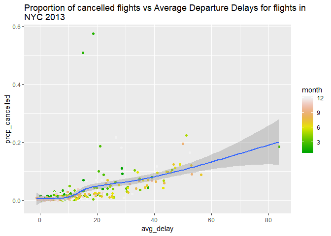

Exploring NYC Flight Data
================

Ways to charcterize typical delay characteristics of a group of flights
=======================================================================

A flight is 15 minutes early 50% of the time, and 15 minutes late 50% of the time.

A flight is always 10 minutes late.

A flight is 30 minutes early 50% of the time, and 30 minutes late 50% of the time.

99% of the time a flight is on time. 1% of the time it's 2 hours late.

``` r
library(nycflights13)
```

    ## Warning: package 'nycflights13' was built under R version 3.4.4

``` r
library(dplyr)
```

    ## Warning: package 'dplyr' was built under R version 3.4.4

    ## 
    ## Attaching package: 'dplyr'

    ## The following objects are masked from 'package:stats':
    ## 
    ##     filter, lag

    ## The following objects are masked from 'package:base':
    ## 
    ##     intersect, setdiff, setequal, union

``` r
flights <- flights

# Delays by carrier

flights %>%
  group_by(carrier) %>%
  filter(is.na(dep_delay)) %>%
  summarise(n())
```

    ## Warning: package 'bindrcpp' was built under R version 3.4.4

    ## # A tibble: 15 x 2
    ##    carrier `n()`
    ##    <chr>   <int>
    ##  1 9E       1044
    ##  2 AA        636
    ##  3 AS          2
    ##  4 B6        466
    ##  5 DL        349
    ##  6 EV       2817
    ##  7 F9          3
    ##  8 FL         73
    ##  9 MQ       1234
    ## 10 OO          3
    ## 11 UA        686
    ## 12 US        663
    ## 13 VX         31
    ## 14 WN        192
    ## 15 YV         56

``` r
# Delays by originating airport
flights %>%
  group_by(origin) %>%
  filter(is.na(dep_delay)) %>%
  summarise(n())
```

    ## # A tibble: 3 x 2
    ##   origin `n()`
    ##   <chr>  <int>
    ## 1 EWR     3239
    ## 2 JFK     1863
    ## 3 LGA     3153

``` r
# Number of flights by carrier to a destination
flights %>%
  group_by(carrier, dest) %>%
  summarise(n())
```

    ## # A tibble: 314 x 3
    ## # Groups:   carrier [?]
    ##    carrier dest  `n()`
    ##    <chr>   <chr> <int>
    ##  1 9E      ATL      59
    ##  2 9E      AUS       2
    ##  3 9E      AVL      10
    ##  4 9E      BGR       1
    ##  5 9E      BNA     474
    ##  6 9E      BOS     914
    ##  7 9E      BTV       2
    ##  8 9E      BUF     833
    ##  9 9E      BWI     856
    ## 10 9E      CAE       3
    ## # ... with 304 more rows

``` r
# Count of Uncancelled flights sorted by destination
flights %>%
  filter(!is.na(dep_delay)) %>%
  group_by(dest) %>%
  summarise(n())
```

    ## # A tibble: 104 x 2
    ##    dest  `n()`
    ##    <chr> <int>
    ##  1 ABQ     254
    ##  2 ACK     265
    ##  3 ALB     419
    ##  4 ANC       8
    ##  5 ATL   16898
    ##  6 AUS    2418
    ##  7 AVL     263
    ##  8 BDL     412
    ##  9 BGR     360
    ## 10 BHM     272
    ## # ... with 94 more rows

``` r
# Cancelled flights by tailnum weighted by distance travelled, without count()
flights %>%
  filter(!is.na(dep_delay)) %>%
  group_by(tailnum, distance) %>% 
  summarise(n()) %>% 
  summarise(n() * sum(distance))
```

    ## # A tibble: 4,037 x 2
    ##    tailnum `n() * sum(distance)`
    ##    <chr>                   <dbl>
    ##  1 D942DN                   7968
    ##  2 N0EGMQ                 131264
    ##  3 N10156                1012360
    ##  4 N102UW                   4842
    ##  5 N103US                   4842
    ##  6 N104UW                   4842
    ##  7 N10575                 842016
    ##  8 N105UW                   6840
    ##  9 N107US                   7312
    ## 10 N108UW                   4842
    ## # ... with 4,027 more rows

``` r
# Cancelled flights by tailnum weighted by distance travelled, using count()
flights %>%
  filter(!is.na(dep_delay)) %>%
  count(tailnum, wt = distance)
```

    ## # A tibble: 4,037 x 2
    ##    tailnum      n
    ##    <chr>    <dbl>
    ##  1 D942DN    3418
    ##  2 N0EGMQ  240626
    ##  3 N10156  110389
    ##  4 N102UW   25722
    ##  5 N103US   24619
    ##  6 N104UW   25157
    ##  7 N10575  141475
    ##  8 N105UW   23618
    ##  9 N107US   21677
    ## 10 N108UW   32070
    ## # ... with 4,027 more rows

Number of cancelled flights per day
===================================

``` r
library(nycflights13)
library(dplyr)

# Calculate proportion of cancelled flights and avergae delay
cancelled_vs_delay <-  flights %>% 
  group_by(year, month, day) %>% 
  summarise(avg_delay = mean(dep_delay, na.rm = TRUE), # Calcylate mean dep_delay
            prop_cancelled = sum(is.na(dep_delay)) / n()) # number of cancelled flights / number of total flights

# plot it
library(ggplot2)
```

    ## Warning: package 'ggplot2' was built under R version 3.4.4

``` r
scatter1 <- ggplot(data=cancelled_vs_delay, aes(x=avg_delay, y= prop_cancelled)) +
  geom_point(aes(color=month)) + geom_smooth(method = 'loess', se=TRUE) +
  scale_color_gradientn(colors = terrain.colors(12)) +
  ggtitle('Proportion of cancelled flights vs Average Departure Delays for flights in 
NYC 2013')

scatter1
```


